# Introduction à PHP - Mini-projet

L. Delafontaine, avec l'aide de
[GitHub Copilot](https://github.com/features/copilot).

Ce travail est sous licence [CC BY-SA 4.0][licence].

> [!TIP]
>
> Toutes les informations relatives à ce contenu sont décrites dans le
> [contenu principal](../README.md).

## Table des matières

- [Table des matières](#table-des-matières)
- [Introduction à votre première séance de mini-projet](#introduction-à-votre-première-séance-de-mini-projet)
- [Présentation du mini-projet](#présentation-du-mini-projet)
- [Objectifs de la séance](#objectifs-de-la-séance)
- [Prérequis](#prérequis)
- [Installer et configurer l'environnement de développement local](#installer-et-configurer-lenvironnement-de-développement-local)
  - [Installer un éditeur de code](#installer-un-éditeur-de-code)
  - [Configurer l'éditeur de code](#configurer-léditeur-de-code)
  - [Valider l'installation et la configuration de l'environnement de développement local](#valider-linstallation-et-la-configuration-de-lenvironnement-de-développement-local)
- [Initialiser le mini-projet](#initialiser-le-mini-projet)
  - [Rejoindre le GitHub Classroom](#rejoindre-le-github-classroom)
  - [Cloner le dépôt GitHub localement](#cloner-le-dépôt-github-localement)
  - [Ouvrir le dépôt GitHub dans Visual Studio Code](#ouvrir-le-dépôt-github-dans-visual-studio-code)
  - [Installer un interpréteur PHP](#installer-un-interpréteur-php)
  - [Activer les messages d'erreurs de PHP dans le navigateur](#activer-les-messages-derreurs-de-php-dans-le-navigateur)
  - [Création de la structure du projet](#création-de-la-structure-du-projet)
  - [Création des fichiers du projet](#création-des-fichiers-du-projet)
  - [Test de l'initialisation du projet](#test-de-linitialisation-du-projet)
  - [Intégration de HTML avec PHP](#intégration-de-html-avec-php)
  - [Ajout de styles CSS personnalisés](#ajout-de-styles-css-personnalisés)
  - [Ajout d'un logo pour l'application](#ajout-dun-logo-pour-lapplication)
  - [Création des pages supplémentaires](#création-des-pages-supplémentaires)
- [Configurer l'environnement de production en ligne](#configurer-lenvironnement-de-production-en-ligne)
  - [Accéder au programme étudiant d'Infomaniak](#accéder-au-programme-étudiant-dinfomaniak)
  - [Créer un hébergement web](#créer-un-hébergement-web)
  - [Désactiver le renouvellement automatique](#désactiver-le-renouvellement-automatique)
  - [Accéder aux hébergements web](#accéder-aux-hébergements-web)
  - [Accéder au tableau de bord de l'hébergement web spécifique](#accéder-au-tableau-de-bord-de-lhébergement-web-spécifique)
  - [Renommer l'hébergement web](#renommer-lhébergement-web)
  - [Ajouter un nouveau site (optionnel)](#ajouter-un-nouveau-site-optionnel)
  - [Configurer le site web](#configurer-le-site-web)
  - [Accéder au site web](#accéder-au-site-web)
  - [Sécuriser l'application avec HTTPS](#sécuriser-lapplication-avec-https)
  - [Effectuer la demande de remboursement auprès de la HEIG-VD](#effectuer-la-demande-de-remboursement-auprès-de-la-heig-vd)
  - [Renouveler/révoquer le programme étudiant d'Infomaniak](#renouvelerrévoquer-le-programme-étudiant-dinfomaniak)
  - [Valider la configuration de l'environnement de production en ligne](#valider-la-configuration-de-lenvironnement-de-production-en-ligne)
- [Déployer le mini-projet en ligne](#déployer-le-mini-projet-en-ligne)
  - [Exercice 4 - Accéder à l'hébergement web via FTP/SFTP](#exercice-4---accéder-à-lhébergement-web-via-ftpsftp)
- [Initialiser les exercices](#initialiser-les-exercices)
  - [Rejoindre le GitHub Classroom pour les exercices](#rejoindre-le-github-classroom-pour-les-exercices)
  - [Cloner le dépôt GitHub localement](#cloner-le-dépôt-github-localement-1)
  - [Ouvrir le dossier racine du projet](#ouvrir-le-dossier-racine-du-projet)
  - [Ouvrir un terminal intégré](#ouvrir-un-terminal-intégré-1)
- [Conclusion](#conclusion)
- [Solution](#solution)

## Introduction à votre première séance de mini-projet

Bienvenue dans la première séance du mini-projet qui va vous accompagner durant
toute la durée du cours _"Programmation serveur 1 (ProgServ1)"_ !

Cette séance de mini-projet est conçue pour vous permettre de mettre en pratique
les concepts théoriques vus dans le cours
_["Introduction à PHP"](../README.md)_. N'hésitez pas à vous y référer si vous
avez besoin de rafraîchir votre mémoire.

En lisant les contenus préparés pour les séances de mini-projet, vous trouverez
peut-être ce que l'on appelle des _"avertissements"_ ou des _"alertes"_.

Elles se présentent comme suit :

> [!NOTE]
>
> Hé ! Je suis une note ! Merci de m'avoir lue !

Elles sont là pour mettre en évidence des informations importantes dont vous
devez tenir compte.

Voici les différents types de remontrances que vous pourriez trouver et leur
signification :

> [!NOTE]
>
> Informations mises en évidence que vous devriez prendre en compte.

> [!TIP]
>
> Informations facultatives pour vous aider à mieux réussir avec des conseils,
> des astuces, ou encore des suggestions.

> [!IMPORTANT]
>
> Informations cruciales nécessaires à la réussite des actions que vous devriez
> effectuer.

> [!WARNING]
>
> Informations critiques exigeant votre attention immédiate en raison des
> risques potentiels.

> [!CAUTION]
>
> Conséquences négatives potentielles d'une action que vous devriez éviter.

Nous pourrions vous rediriger vers de la documentation officielle ou des
ressources externes à suivre pour configurer votre environnement ou en savoir
plus sur un sujet spécifique.

Ces ressources externes sont là pour vous aider. Nous vous redirigeons vers
elles pour éviter de répéter ce qui est déjà bien maintenu et expliqué ailleurs.

Ce que vous voyez et faites dans une séance actuelle peut être utilisé dans une
séance future.

C'est pourquoi il est important de suivre les étapes et de comprendre ce que
vous faites. Vous devez conserver le code que vous écrivez pour les séances
futures.

Cependant, si _quoi que ce soit_ n'est pas clair, ne fonctionne pas ou nécessite
une amélioration, n'hésitez pas à poser des questions ou nous le signaler.

L'équipe pédagogique considère qu'il n'y a pas de question bête : vous êtes ici
pour apprendre et nous sommes là pour vous aider ! Travaillons en équipe pour
que vous puissiez réussir !

C'est parti !

> [!TIP]
>
> Le [support de cours](../README.md) est disponible pour vous aider à
> comprendre les concepts théoriques abordés dans ce mini-projet si besoin !

## Présentation du mini-projet

Le mini-projet est une application web qui permettra aux utilisateurs d'ajouter,
consulter, modifier et supprimer des animaux de compagnie.

Chaque animal de compagnie aura les attributs suivants :

- Un identifiant unique (généré automatiquement par la base de données).
- Nom (un champ texte).
- Espèce (un champ de sélection contenant, par exemple : chien, chat, lézard,
  serpent, oiseau, lapin, autre).
- Surnom (un champ texte facultatif).
- Sexe (un champ boutons radio).
- Âge (un champ numérique).
- Couleur (un champ de saisie de couleur facultatif).
- Personnalité (un champ cases à cocher facultatif).
- Taille en cm (un champ numérique facultatif).
- Notes (un champ de texte libre facultatif).

L'application web comportera les pages suivantes :

- **Page d'accueil** : une page d'accueil avec une brève introduction à
  l'application et la liste des animaux de compagnie. Chaque animal doit être
  cliquable pour afficher plus de détails.
- **Visualisation d'un animal** : une page affichant les informations détaillées
  sur un animal spécifique, y compris tous ses attributs. L'utilisateur doit
  pouvoir modifier ou supprimer l'animal depuis cette page.
- **Création d'un animal** : une page permettant à l'utilisateur de créer un
  nouvel animal en remplissant un formulaire avec tous les attributs.
- **Modification d'un animal** : une page permettant à l'utilisateur de mettre à
  jour un animal existant en modifiant ses attributs dans un formulaire.
- **Suppression d'un animal** : une page permettant à l'utilisateur de supprimer
  un animal de la base de données.

Nous construirons cette application web ensemble durant la durée du cours en
plusieurs étapes. Dans cette séance, nous allons mettre en place l'environnement
de développement local, l'environnement de production en ligne et initialiser le
projet PHP pour le mini-projet.

## Objectifs de la séance

À l'issue de cette séance, les personnes qui étudient devraient avoir pu :

- Installer et configurer un environnement de développement local pour PHP.
- Initialiser un projet PHP pour le mini-projet.
- Installer et configurer un environnement de production en ligne pour PHP.
- Déployer le mini-projet en ligne.
- Initialiser un dépôt GitHub pour les exercices.

> [!NOTE]
>
> Il se peut que vous ne puissiez pas atteindre tous les objectifs de la séance
> pendant la durée de la séance. Je (Ludovic) suis conscient qu'il y a beaucoup
> de choses à faire et à comprendre, et que cela peut être difficile à suivre.
>
> Cet environnement sera utilisé pour le reste du cours, donc il est important
> de le configurer correctement. Prenez le temps nécessaire avant la prochaine
> séance d'en finaliser son contenu et sa configuration. N'hésitez pas à poser
> des questions ou à demander de l'aide si vous en avez besoin !

## Prérequis

- Un ordinateur avec un système d'exploitation compatible avec les outils que
  nous allons utiliser (Windows, macOS ou Linux).
- Un environnement Windows Subsystem for Linux (WSL) pour les utilisateur.trices
  de Windows.
- Git installé et configuré sur votre ordinateur (dans l'environnement WSL pour
  les utilisateur.trices de Windows).
- L'application Windows Terminal installée pour les utilisateur.trices de
  Windows configurée pour ouvrir WSL automatiquement.
- Docker et Docker Compose installés sur votre ordinateur (accessibles dans
  l'environnement WSL pour les utilisateur.trices de Windows).
- Un éditeur de code de votre choix (Visual Studio Code est recommandé, mais
  vous pouvez utiliser un autre éditeur si vous préférez).
- Une connexion Internet pour télécharger les outils nécessaires et accéder aux
  ressources en ligne.

Dans votre terminal, assurez-vous d'avoir accès aux différents outils
nécessaires en exécutant les commandes suivantes :

```bash
# Vérifier que Git est installé
git --version
```

Le résultat devrait être similaire à ceci, indiquant que l'outil est installé et
prêt à être utilisé :

```text
git version 2.52.0
```

```bash
# Vérifier que Docker est installé
docker --version
```

Le résultat devrait être similaire à ceci, indiquant que l'outil est installé et
prêt à être utilisé :

```text
Docker version 29.1.3, build f52814d
```

```bash
# Vérifier que Docker Compose est installé
docker compose version
```

Le résultat devrait être similaire à ceci, indiquant que l'outil est installé et
prêt à être utilisé :

```text
Docker Compose version v2.40.3
```

Si vous obtenez les mêmes résultats que ceux présentés ci-dessus, vous êtes
prêt.e à suivre les étapes de cette séance de mini-projet !

Sinon, utilisez les ressources suivantes pour installer les outils nécessaires :

- Le cours
  [Outils de développement](https://www.notion.so/wengerk/Outils-de-d-veloppement-22fe9dd7f406801b9347f8fb470b6e8e)
  que vous avez suivi en première année.
- [Set up a Windows development environment](https://github.com/heig-vd-dai-course/heig-vd-dai-course/blob/main/00.01-set-up-a-windows-development-environment/01-course-material/README.md),
  un contenu de cours pour configurer un environnement de développement sur
  Windows pour un cours enseigné dans le département TIC de la HEIG-VD.
- [Git, GitHub and Markdown](https://github.com/heig-vd-dai-course/heig-vd-dai-course/blob/main/01.03-git-github-and-markdown/01-course-material/README.md),
  un contenu de cours pour comprendre les bases de Git, GitHub et Markdown pour
  un cours enseigné dans le département TIC de la HEIG-VD.
- [Docker and Docker Compose](https://github.com/heig-vd-dai-course/heig-vd-dai-course/blob/main/04.01-docker-and-docker-compose/01-course-material/README.md),
  un contenu de cours pour comprendre les bases de Docker et Docker Compose pour
  un cours enseigné dans le département TIC de la HEIG-VD.

## Installer et configurer l'environnement de développement local

Un environnement de développement local est un ensemble d'outils et de logiciels
nécessaires pour écrire, tester et déboguer des applications logicielles sur
votre propre ordinateur. Il permet aux développeur.euses de créer et de tester
leur code dans un environnement contrôlé avant de le déployer sur un serveur de
production en ligne.

Pour ce mini-projet, nous aurons besoin d'un éditeur de code et d'un
interpréteur PHP.

De plus, nous allons utiliser GitHub Classroom pour gérer le code source du
mini-projet. Cela sera l'occasion de prendre l'habitude d'utiliser Git et GitHub
dans un contexte de développement professionnel.

### Installer un éditeur de code

Un éditeur de code est un logiciel qui vous permet d'écrire, de modifier et de
gérer du code source pour des applications logicielles. Il existe de nombreux
éditeurs de code disponibles, chacun avec ses propres fonctionnalités et
avantages.

Nous vous recommandons d'utiliser Visual Studio Code, un éditeur de code gratuit
et open-source développé par Microsoft[^visual-studio-code], mais vous pouvez
utiliser n'importe quel éditeur de code avec lequel vous êtes à l'aise pour le
reste de ce cours.

#### Installation sur Windows

Pour installer Visual Studio Code sur Windows, suivez les étapes suivantes :

1. Rendez-vous sur le site web de Visual Studio Code à l'adresse suivante :
   <https://code.visualstudio.com/>.

   <details>
   <summary>Afficher la capture d'écran illustrant l'étape</summary>

   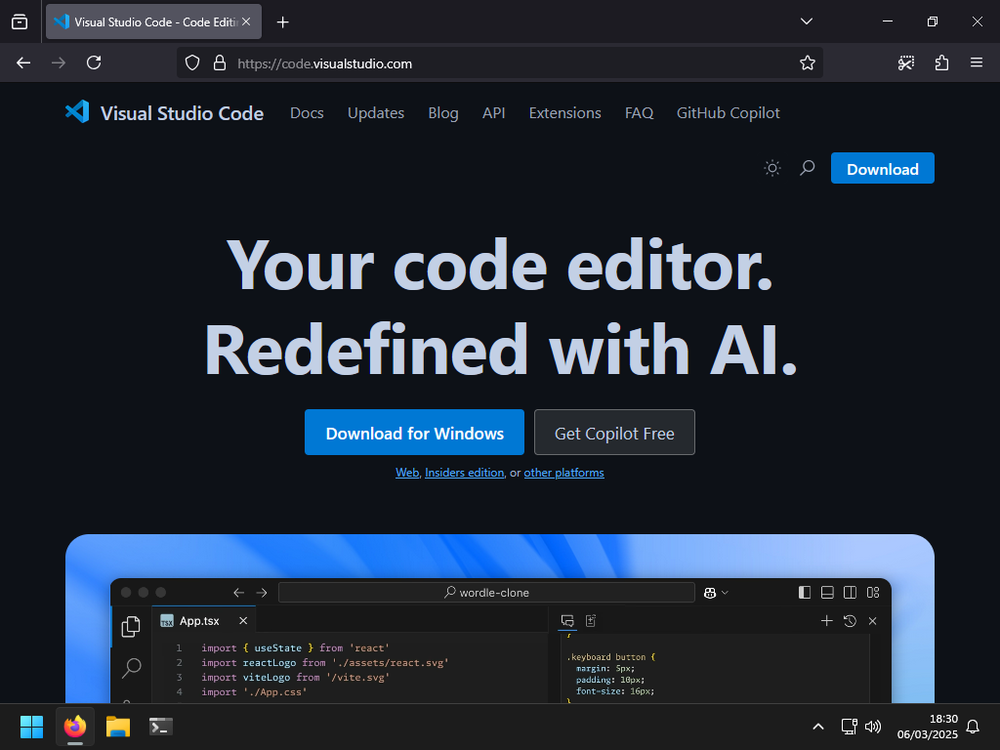

   </details>

2. Téléchargez la dernière version de Visual Studio Code pour Windows.
3. Exécutez le programme d'installation que vous venez de télécharger pour
   installer Visual Studio Code :
   1. Le programme d'installation de Visual Studio Code devrait s'ouvrir.
      Acceptez les termes du contrat de licence et cliquez sur le bouton
      **Next**.

      <details>
      <summary>Afficher la capture d'écran illustrant l'étape</summary>

      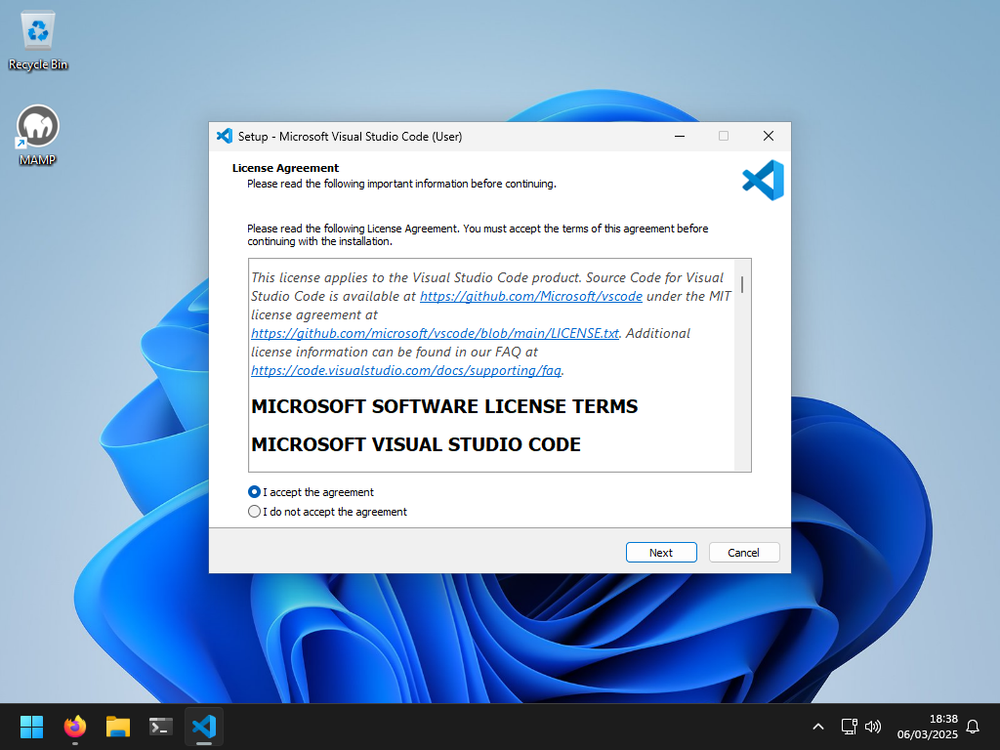

      </details>

   2. Laissez les paramètres par défaut pour installer Visual Studio Code sur
      votre ordinateur et cliquez sur le bouton **Next**.

      <details>
      <summary>Afficher la capture d'écran illustrant l'étape</summary>

      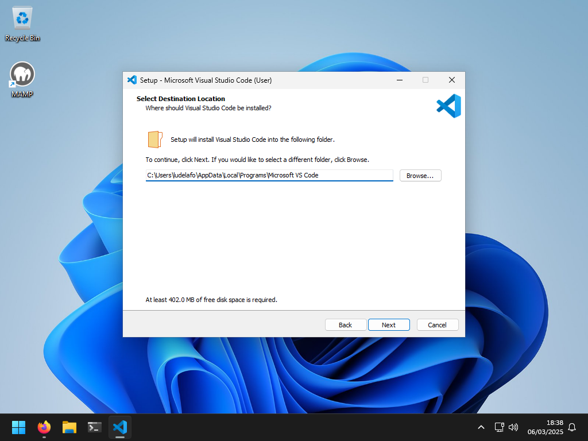

      </details>

   3. Laissez les paramètres par défaut pour créer un dossier
      `Visual Studio Code` dans le menu de démarrage et cliquez sur le bouton
      **Next**.

      <details>
      <summary>Afficher la capture d'écran illustrant l'étape</summary>

      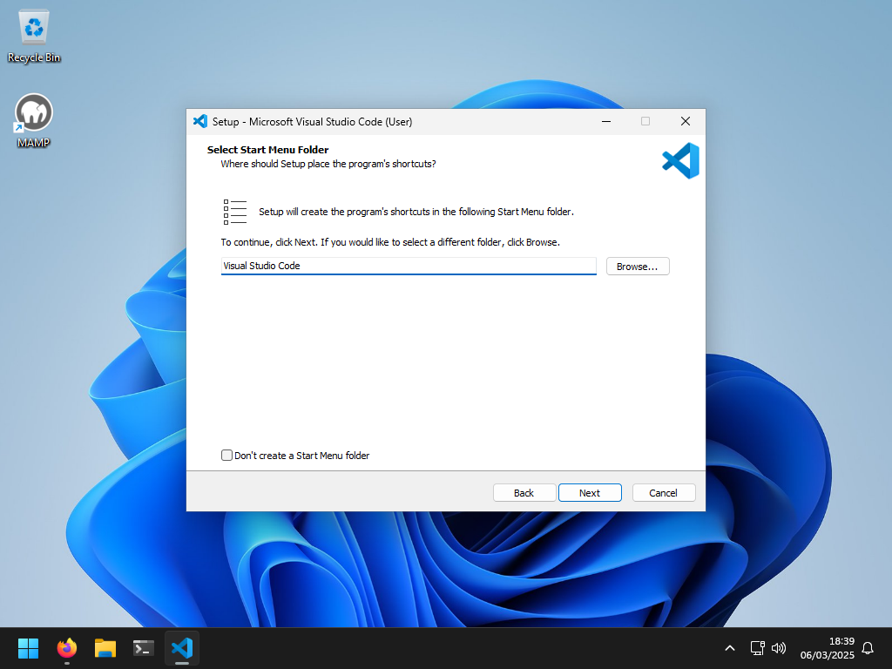

      </details>

   4. Choisissez si vous souhaitez avoir un raccourci sur le bureau et
      sélectionnez les options supplémentaires pour ajouter Visual Studio Code
      au menu contextuel de l'Explorateur Windows. Cela vous permettra de faire
      un clic droit sur n'importe quel dossier et d'ouvrir Visual Studio Code
      directement dans ce dossier. Cliquez ensuite sur le bouton **Next**.

   <details>
   <summary>Afficher la capture d'écran illustrant l'étape</summary>

   

      </details>
   5. Une fois que vous avez vérifié les paramètres d'installation, cliquez sur
      le bouton **Install** pour commencer l'installation.

      <details>
      <summary>Afficher la capture d'écran illustrant l'étape</summary>

   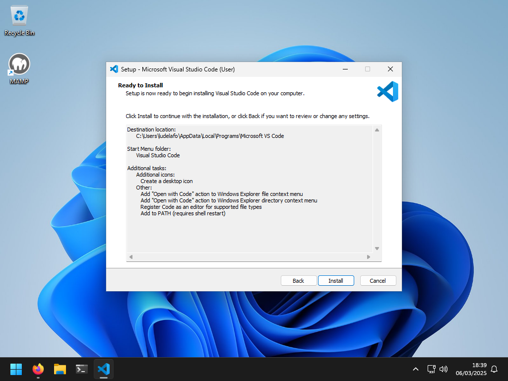

      </details>

4. Une fois l'installation terminée, lancez Visual Studio Code.

Vous pouvez maintenant passer à la section
[_Configurer l'éditeur de code_](#configurer-léditeur-de-code).

#### Installation sur macOS

Pour installer Visual Studio Code sur macOS, suivez les étapes suivantes :

> [!WARNING]
>
> Sélectionnez la bonne version de Visual Studio Code pour macOS en fonction de
> l'architecture de votre processeur (Intel ou Apple Silicon). Les personnes
> avec des appareils Apple M1, M2, M3 ou M4 doivent télécharger la version ARM
> de Visual Studio Code.

1. Rendez-vous sur le site web de Visual Studio Code à l'adresse suivante :
   <https://code.visualstudio.com/>.

   <details>
   <summary>Afficher la capture d'écran illustrant l'étape</summary>

   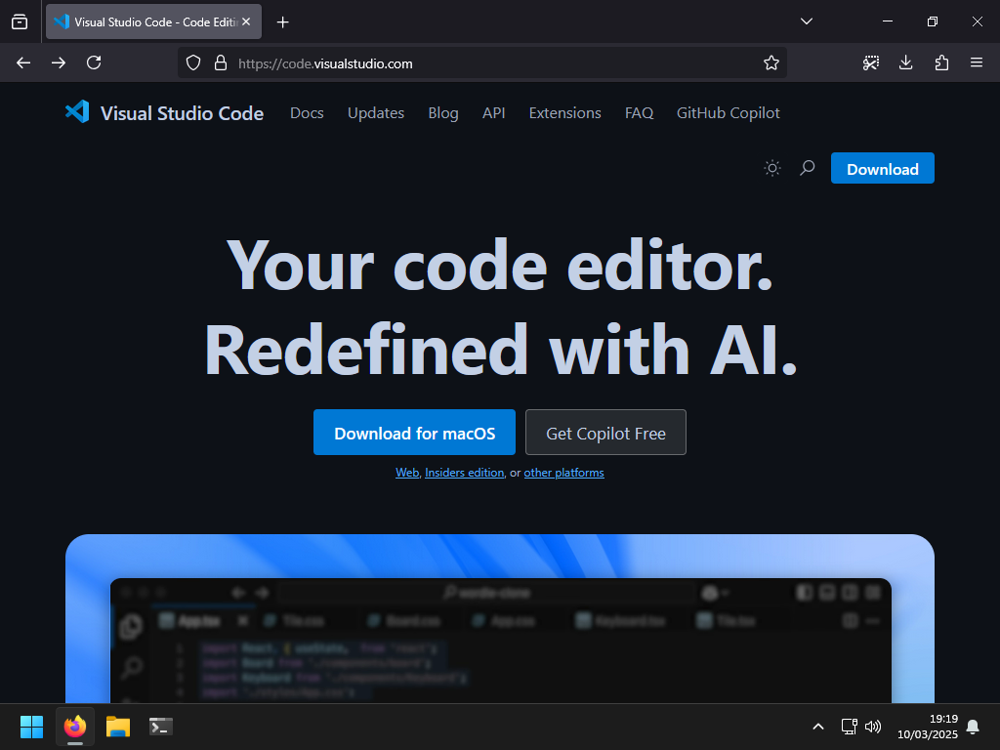

   </details>

2. Téléchargez la dernière version de Visual Studio Code pour macOS.
3. Ouvrez le fichier `.dmg` que vous venez de télécharger.
4. Faites glisser l'icône de Visual Studio Code dans le dossier `Applications`.
5. Ouvrez le dossier `Applications` et double-cliquez sur l'icône de Visual
   Studio Code pour le lancer.

Vous pouvez maintenant passer à la section
[_Configurer l'éditeur de code_](#configurer-léditeur-de-code).

#### Installation sur Linux

_Si vous utilisez Linux, veuillez nous consulter si vous avez besoin d'aide pour
installer un éditeur de code sur votre ordinateur._

### Configurer l'éditeur de code

Une fois que vous avez installé Visual Studio Code, vous devez le configurer
pour qu'il fonctionne correctement avec PHP.

#### Configurer les raccourcis clavier pour Visual Studio Code

Pas défaut, Visual Studio Code ne sauvegarde que le fichier courant lorsque vous
appuyez sur `Ctrl + S` (Windows/Linux) ou `Cmd + S` (macOS). Pour sauvegarder
tous les fichiers ouverts dans Visual Studio Code, vous devez configurer les
raccourcis clavier pour qu'ils sauvegardent tous les fichiers.

Pour ce faire, suivez les étapes suivantes :

> [!IMPORTANT]
>
> Nous vous recommandons **vivement** de configurer les raccourcis clavier pour
> sauvegarder tous les fichiers ouverts dans Visual Studio Code.
>
> Cela vous permettra de ne pas oublier de sauvegarder un fichier avant de
> tester votre code dans le navigateur, ce qui peut entraîner des erreurs
> difficiles à comprendre si vous oubliez de le faire.

1. Cliquez sur le menu **File > Preferences > Keyboard Shortcuts**.
2. Recherchez `File: Save All Files` dans la barre de recherche.
3. Assignez les touches de raccourci de votre choix pour sauvegarder tous les
   fichiers ouverts dans Visual Studio Code. Nous vous recommandons d'utiliser
   utiliser `Ctrl + S` (Windows/Linux) ou `Cmd + S` (macOS) à des fins de
   facilité.

   <details>
   <summary>Afficher la capture d'écran illustrant l'étape</summary>

   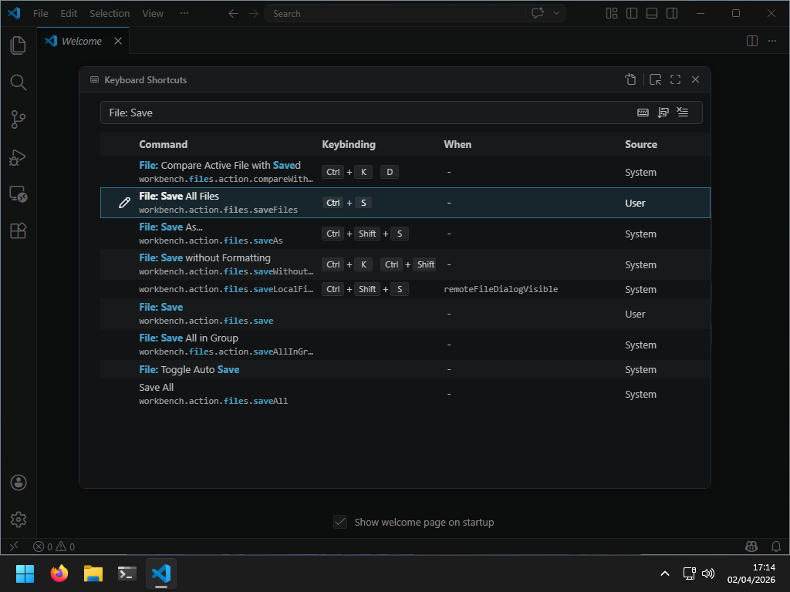

   </details>

#### Installer les extensions nécessaires pour Visual Studio Code

Visual Studio Code dispose d'un écosystème d'extensions qui vous permet
d'ajouter des fonctionnalités supplémentaires à l'éditeur de code.

Pour travailler avec PHP, nous vous recommandons d'installer l'extension
[PHP Intelephense](https://marketplace.visualstudio.com/items?itemName=bmewburn.vscode-intelephense-client).

Elle permettra d'ajouter des fonctionnalités d'auto-complétion et de validation
du code PHP dans Visual Studio Code, augmentant ainsi votre productivité.

Pour installer l'extension PHP Intelephense, suivez les étapes suivantes :

1. Cliquez sur l'icône des extensions dans la barre latérale de Visual Studio
   Code ou appuyez sur `Ctrl + Shift + X` (Windows/Linux) ou `Cmd + Shift + X`
   (macOS).
2. Recherchez `PHP Intelephense` dans la barre de recherche.
3. Sélectionnez l'extension `PHP Intelephense` dans les résultats de la
   recherche.
4. Cliquez sur le bouton **Install** pour installer l'extension. Un
   avertissement de sécurité vous demande si vous faites confiance aux auteurs
   de l'extension. Cliquez sur le bouton **Trust Publisher & Install** pour
   continuer.
5. Une fois l'extension installée, vous devriez voir une confirmation de
   l'installation.

Faites de même avec l'extension
[SQLite Viewer](https://marketplace.visualstudio.com/items?itemName=qwtel.sqlite-viewer)
dans Visual Studio Code.

Cette extension vous permettra de visualiser et de gérer les bases de données
SQLite directement depuis Visual Studio Code, la base de données que nous allons
utiliser pour le mini-projet dans une future séance.

#### Désactiver GitHub Copilot dans Visual Studio Code

Si vous avez accès à GitHub Copilot, nous vous recommandons de le désactiver
dans Visual Studio Code pour éviter d'avoir des suggestions de code qui
pourraient interférer avec votre apprentissage et votre compréhension du code
que vous écrivez.

Pour cela, suivez la documentation officielle de GitHub Copilot pour désactiver
les suggestions de code dans Visual Studio Code :
<https://docs.github.com/en/copilot/how-tos/configure-personal-settings/configure-in-ide?tool=vscode#enabling-or-disabling-github-copilot-inline-suggestions>.

#### Configurer le terminal intégré de Visual Studio Code

> [!NOTE]
>
> Cette section n'est nécessaire que pour les personnes sur Windows. Les
> utilisateur.trices de macOS et Linux peuvent utiliser le terminal intégré de
> Visual Studio Code tel quel.

Par défaut, le terminal intégré de Visual Studio Code utilise l'invite de
commande de Windows (cmd.exe) ou PowerShell comme shell par défaut. Cependant,
pour les utilisateur.trices de Windows, il est recommandé d'utiliser
l'environnement Windows Subsystem for Linux (WSL) pour exécuter les commandes
Linux dans le terminal intégré de Visual Studio Code.

Pour configurer le terminal intégré de Visual Studio Code pour utiliser WSL,
suivez les étapes suivantes :

1. Ouvrez Visual Studio Code.
2. Ouvrez le terminal intégré en allant dans le menu **Terminal > New
   Terminal**.
3. Le terminal devrait s'ouvrir en bas de la fenêtre de Visual Studio Code.
4. Ouvrez le menu déroulant du terminal intégré en cliquant sur l'icône de
   terminal avec une flèche vers le bas dans la barre d'outils du terminal
   intégré.

   <details>
   <summary>Afficher la capture d'écran illustrant l'étape</summary>

   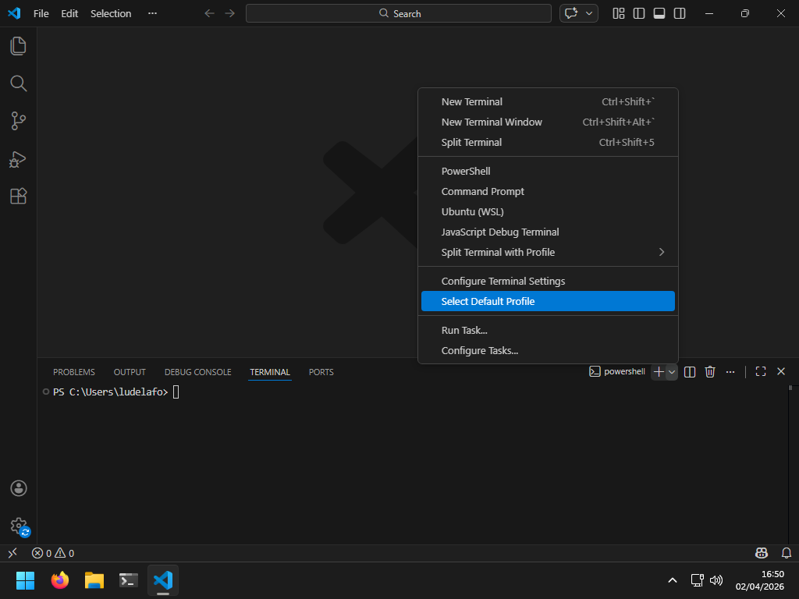

   </details>

5. Sélectionnez `Select Default Profile` dans le menu déroulant.

   <details>
   <summary>Afficher la capture d'écran illustrant l'étape</summary>

   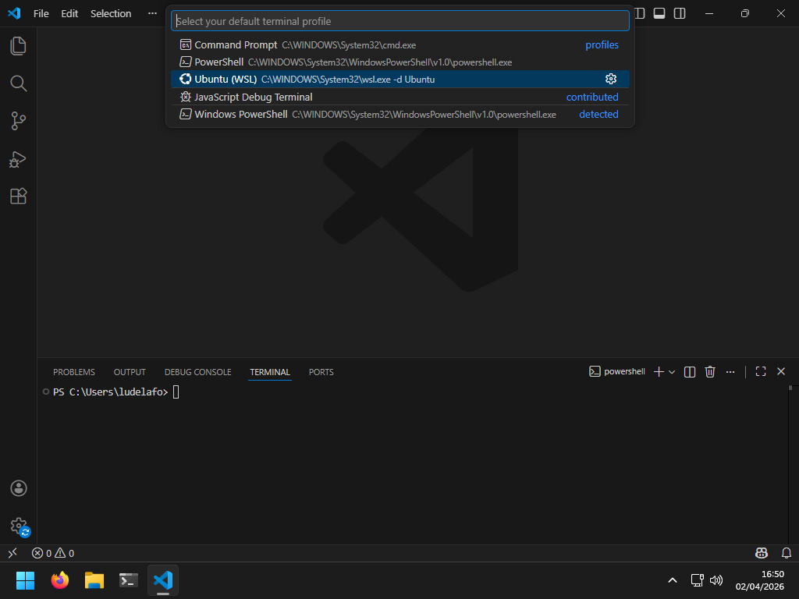

   </details>

6. Dans la liste des profils disponibles, sélectionnez `Ubuntu (WSL)` (le nom
   peut varier en fonction de votre configuration).

   <details>
   <summary>Afficher la capture d'écran illustrant l'étape</summary>

   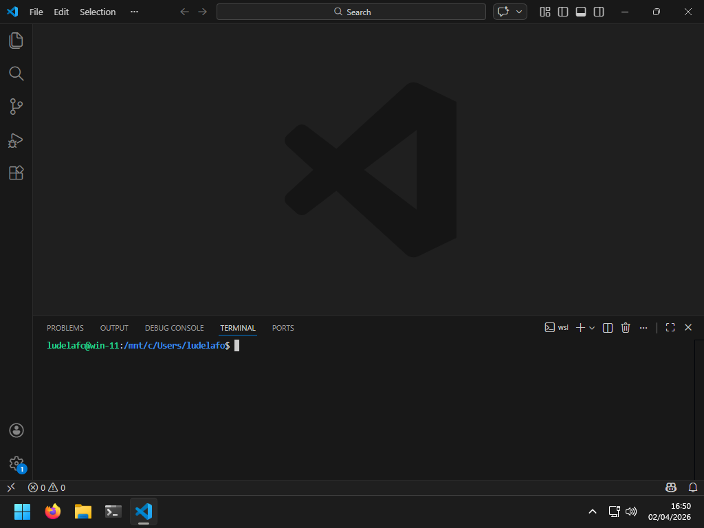

   </details>

7. Une fois que vous avez sélectionné `Ubuntu (WSL)` comme profil par défaut, le
   terminal intégré de Visual Studio Code utilisera désormais l'environnement
   WSL pour exécuter les commandes Linux.

Si par la suite vous souhaitez ouvrir un terminal intégré avec l'invite de
commande de Windows (cmd.exe) ou PowerShell, vous pouvez le faire en
sélectionnant le shell souhaité dans le menu déroulant du terminal intégré de
Visual Studio Code (l'icône de terminal avec une flèche vers le bas) et en
choisissant le shell que vous souhaitez utiliser.

### Valider l'installation et la configuration de l'environnement de développement local

- [x] Git est installé et fonctionnent correctement.
- [x] Docker et Docker Compose sont installés et fonctionnent correctement.
- [x] Visual Studio Code est installé et fonctionne correctement.
- [x] L'extension PHP Intelephense pour Visual Studio Code est installée.
- [x] L'extension SQLite Viewer pour Visual Studio Code est installée.
- [x] Les suggestions de code de GitHub Copilot sont désactivées dans Visual
      Studio Code.
- [x] Le terminal intégré de Visual Studio Code est configuré pour utiliser WSL
      (pour les utilisateur.trices de Windows).

## Initialiser le mini-projet

Dans cette section, nous allons initialiser le projet PHP pour le mini-projet en
créant la structure de base du projet et en configurant les fichiers nécessaires
pour faire fonctionner l'application web.

### Rejoindre le GitHub Classroom

[GitHub Classroom](https://classroom.github.com/) est un outil qui permet de
gérer des dépôts GitHub dans un contexte éducatif. Il facilite la distribution
de projets, la collecte de travaux et la gestion des évaluations.

Il sera utilisé pour permettre au corps enseignant de visualiser le travail
effectué dans le mini-projet et les exercices.

Il est nécessaire de rejoindre le GitHub Classroom pour accéder au dépôt utilisé
pour le mini-projet et les exercices.

1. Accédez au lien suivant pour rejoindre le GitHub Classroom du cours : <TODO>.
2. Si vous n'êtes pas encore connecté.e à GitHub, connectez-vous avec votre
   compte GitHub.
3. Choisissez votre personne dans la liste pour rejoindre le GitHub Classroom.
4. Il se peut qu'un message d'erreur s'affiche avant que vous n'acceptiez
   l'invitation. Ne vous inquiétez pas, c'est normal.
5. Vous devez maintenant accepter l'invitation qui a été envoyée sur votre
   adresse mail associée à votre compte GitHub pour rejoindre le GitHub
   Classroom.. Vous pouvez retrouvez le mail associé à votre compte dans les
   paramètres de votre compte GitHub (icône de profil en haut à droite ->
   _"Settings"_ -> _"Emails"_).
6. Une fois l'invitation acceptée, vous devriez voir un message de confirmation
   indiquant que vous avez rejoint le GitHub Classroom.
7. Un dépôt GitHub privé sera créé pour vous, nommé
   `progserv1-<github-username>`.

Vous devriez maintenant avoir accès à votre dépôt GitHub privé pour le
mini-projet sur une page similaire à celle-ci :


### Cloner le dépôt GitHub localement

TODO

### Ouvrir le dépôt GitHub dans Visual Studio Code

Afin de travailler sur votre projet PHP, vous devez ouvrir le dossier racine du
projet dans Visual Studio Code. Pour ce faire, suivez les étapes suivantes :

1. Lancez Visual Studio Code.

   

2. Cliquez sur le menu **File > Open Folder...**.
3. Une fenêtre de dialogue s'ouvrira pour vous permettre de sélectionner le
   dossier racine de votre projet PHP. Sélectionnez le dossier racine de votre
   projet PHP (par exemple, `C:\MAMP\htdocs` pour Windows ou
   `/Applications/MAMP/htdocs` pour macOS) et cliquez sur le bouton **Open**. Il
   s'agira de votre dossier de travail pour le reste du cours.

   

4. Visual Studio Code ouvrira le dossier racine du projet. Un avertissement de
   sécurité vous demande si vous faites confiance aux auteurs du dossier.
   Cliquez sur le bouton **Yes, I trust the authors** pour continuer.

   

5. Visual Studio Code affichera tous les fichiers et dossiers qu'il contient
   dans l'explorateur de fichiers.

   

6. Un message d'avertissement devrait s'afficher en bas à droit. Nous allons y
   revenir plus tard.

Votre projet est maintenant ouvert dans Visual Studio Code.

#### Ouvrir un terminal intégré

Afin de ne pas avoir à basculer entre notre éditeur de code et une fenêtre de
terminal, nous allons utiliser le terminal intégré de Visual Studio Code.

1. Ouvrez le terminal intégré en allant dans le menu **Terminal > New
   Terminal**.
2. Le terminal devrait s'ouvrir en bas de la fenêtre de Visual Studio Code.
3. Pour les personnes sur Windows, assurez-vous que le terminal intégré utilise
   l'environnement WSL pour exécuter les commandes Linux. Vous pouvez vérifier
   cela en regardant le nom de l'onglet du terminal. Il devrait indiquer `wsl`
   au lieu de `cmd` ou `PowerShell`.

Ce terminal devrait être ouvert dans le dossier racine de votre projet PHP
automatiquement.

### Installer un interpréteur PHP

> [!NOTE]
>
> Si vous avez déjà un interpréteur PHP installé sur votre ordinateur, vous
> pouvez passer directement à la section suivante.

Afin de pouvoir exécuter du code PHP sur votre ordinateur, vous devez installer
un interpréteur PHP. Il s'agit d'un logiciel qui lit le code PHP et le traduit
en instructions que votre ordinateur peut comprendre et l'exécuter.

Il existe plusieurs solutions pour installer cet interpréteur PHP sur votre
ordinateur (par exemple WampServer pour Windows[^wamp], MAMP pour macOS[^mamp],
LAMP pour Linux[^lamp], XAMPP pour Windows, macOS et Linux[^xampp], etc.).
Toutes ces solutions embarquent un serveur web, une base de données et un
interpréteur PHP.

Dans le contexte de ce cours, nous allons installer un interpréteur PHP en
utilisant Docker et Docker Compose[^docker], autant pour Windows que pour macOS,
car il s'agit aujourd'hui d'une des manière la manière la plus moderne et la
plus efficace à mettre en place.

Cela nous permettra également de s'assurer que tout le monde utilise la même
configuration. Les étapes suivantes vous guideront à travers le processus pour
avoir cet environnement de développement local.

### Activer les messages d'erreurs de PHP dans le navigateur

Il se peut que vous rencontriez des erreurs dans votre code PHP durant le
développement de l'application web. Pour vous aider à déboguer votre code, il
est important d'activer les messages d'erreur dans le navigateur. Cela vous
permettra de voir les erreurs et les avertissements générés par PHP lorsque
celles-ci se produisent.

Par défaut, PHP n'affiche pas les messages d'erreur dans le navigateur pour
éviter de divulguer des informations sensibles sur votre application. Cela peut
rendre le débogage de votre code plus difficile, car vous ne saurez pas
exactement où se trouvent les erreurs et seule une page blanche s'affichera dans
le navigateur.

Pour activer les messages d'erreur avec PHP, vous devez modifier le fichier
`php.ini` qui se trouve dans le dossier de configuration de PHP. Ce fichier est
utilisé par l'interpréteur PHP pour configurer son comportement et ses
paramètres. Il est important de le configurer correctement pour que PHP affiche
les messages d'erreur et de débogage.

Pour ce faire, suivez les étapes suivantes :

> [!NOTE]
>
> La configuration ci-dessous peut varier en fonction de la version de PHP/MAMP
> que vous utilisez. Il se peut que ces options soient déjà activées par défaut
> dans votre installation de MAMP. Si c'est le cas, vous n'avez pas besoin de
> les modifier.

1. En utilisant la version de PHP notée préalablement, ouvrez le fichier
   `php.ini` de l'interpréteur PHP qui est utilisé avec MAMP dans Visual Studio
   Code.

   Par exemple, si vous utilisez la version 8.3.1 de PHP, le fichier `php.ini`
   se trouve dans le dossier `C:\MAMP\conf\php8.3.1\php.ini` pour Windows ou
   `/Applications/MAMP/conf/php8.3.1/php.ini` pour macOS.

2. Cherchez la chaîne de caractères `display_errors` dans le fichier `php.ini`.
   Vous pouvez utiliser la fonction de recherche de Visual Studio Code en
   appuyant sur `Ctrl + F` (Windows/Linux) ou `Cmd + F` (macOS) et en entrant
   `display_errors` dans la barre de recherche. Vous devriez trouver une ligne
   qui ressemble à ceci :

   ```ini
   display_errors = off
   ```

   ou

   ```ini
   display_errors = on
   ```

   Il se peut que vous trouviez plusieurs occurrences de cette ligne dans le
   fichier `php.ini`. Assurez-vous de modifier la ligne qui n'est pas commentée
   (sans point-virgule (`;`) au début de la ligne).

3. Si besoin, modifiez cette ligne pour qu'elle ressemble à ceci :

   ```ini
   display_errors = on
   ```

   Cela indique à PHP d'afficher les messages d'erreur.

4. Sauvegardez le fichier `php.ini` et fermez-le.
5. Redémarrez MAMP pour appliquer les changements.
6. Ouvrez votre navigateur web et accédez à l'adresse
   <http://localhost/progserv1/phpinfo.php>. Vous devriez la section
   `display_errors` pour valider que les messages d'erreur sont affichés (avec
   une valeur `On`).
7. Si vous avez des erreurs dans votre code PHP, elles devraient maintenant
   s'afficher dans le navigateur lorsque vous accédez à vos fichiers PHP plutôt
   qu'une page blanche.

### Création de la structure du projet

Pour commencer, nous allons créer la structure de fichiers et de dossiers pour
le projet PHP. Cette structure nous permettra d'organiser les fichiers PHP tout
au long du mini-projet. Cette structure va évoluer au fur et à mesure que nous
ajouterons de nouvelles fonctionnalités à l'application web que nous allons
construire.

Commencez par créer les dossiers `exercices` et `mini-projet` dans le dossier
racine du projet :

```text
progserv1-<github-username>/
├── exercices/
└── mini-projet/
```

Le dossier `progserv1-<github-username>` est le dossier racine qui permettra de
contenir tous les exercices et le mini-projet du cours _"Programmation serveur 1
(ProgServ1)"_.

Le dossier `exercices` contiendra tous les exercices réalisés durant le cours
_"Programmation serveur 1 (ProgServ1)"_. Vous pourrez l'utiliser pour stocker
les exercices de chaque séance et faire des tests et expérimentations.

Le dossier `mini-projet` contiendra tous les fichiers et dossiers nécessaires
pour le mini-projet du cours _"Programmation serveur 1 (ProgServ1)"_. C'est dans
ce dossier que vous allez construire l'application web pour gérer les animaux de
compagnie.

### Création des fichiers du projet

Créez maintenant les fichiers suivants dans les différents dossiers du projet :

```text
progserv1-<github-username>/
├── exercices/
│   └── index.php
├── mini-projet/
│   └── index.php
├── index.php
└── phpinfo.php
```

Dans le fichier `progserv1-<github-username>/index.php`, ajoutez le code suivant
:

```php
<?php
echo "Bonjour à toutes les personnes du cours de Programmation serveur 1 !";
```

Dans le fichier `progserv1-<github-username>/phpinfo.php`, ajoutez le code
suivant :

```php
<?php
phpinfo();
```

La fonction `phpinfo()` affiche des informations sur la configuration de PHP
installée sur votre ordinateur. Cela vous permettra de vérifier que PHP est
correctement installé et configuré.

Dans le fichier `progserv1-<github-username>/exercices/index.php`, ajoutez le
code suivant :

```php
<?php
echo "Bienvenue dans le dossier <code>exercices</code> du cours <i>Programmation serveur 1</i> !";
```

Dans le fichier `progserv1-<github-username>/mini-projet/index.php`, ajoutez le
code suivant :

```php
<?php
echo "Bienvenue dans le dossier <code>mini-projet</code> du cours <i>Programmation serveur 1</i> !";
```

Sauvez tous les fichiers.

### Test de l'initialisation du projet

Ouvrez votre navigateur web et accédez à l'adresse suivante :
<http://localhost/progserv1/index.php>. Vous devriez voir le message suivant :

```text
Bonjour à toutes les personnes du cours de Programmation serveur 1 !
```

Si vous accédez à l'adresse <http://localhost/progserv1/phpinfo.php>, vous
devriez voir les informations de configuration de PHP avec sa version, les
extensions installées, les paramètres du serveur, etc. Ce fichier est utile pour
vérifier que PHP est correctement installé et configuré.

Cela signifie que l'initialisation du projet PHP pour le mini-projet a été
réussie !

Testez également les adresses suivantes pour vérifier que les fichiers des
exercices et du mini-projet fonctionnent correctement :

- Exercices : <http://localhost/progserv1/exercices/index.php>.
- Mini-projet : <http://localhost/progserv1/mini-projet/index.php>.

Vous remarquerez que les fichiers respectent la structure de dossiers que nous
avons créée précédemment.

### Intégration de HTML avec PHP

PHP a la force de pouvoir mélanger du code PHP avec du code HTML. Cela signifie
que vous pouvez écrire du code PHP pour générer du contenu HTML dynamique. Par
exemple, vous pouvez modifier le fichier `progserv1/index.php` comme suit :

```php
<?php
const PAGE_TITLE = "Page d'accueil du cours Programmation serveur 1";
const WELCOME_MESSAGE = "Bienvenue sur la page d'accueil du cours de Programmation serveur 1 !";
?>

<!DOCTYPE html>
<html lang="fr">

<head>
    <meta charset="UTF-8">
    <meta name="viewport" content="width=device-width, initial-scale=1.0">
    <title><?php echo PAGE_TITLE; ?></title>
</head>

<body>
    <h1><?php echo PAGE_TITLE; ?></h1>
    <p><?php echo WELCOME_MESSAGE; ?></p>
    <p>Accéder aux <a href="./exercices/index.php">exercices</a>.</p>
    <p>Accéder au <a href="./mini-projet/index.php">mini-projet</a>.</p>
</body>

</html>
```

Sauvegardez le fichier et rechargez la page dans votre navigateur. Vous devriez
voir une page HTML avec un titre et un message de bienvenue.

En effet, le code PHP est exécuté sur le serveur web en utilisant le code PHP et
les structures HTML. L'interpréteur PHP analyse ce code et génère du code HTML
qui est ensuite envoyé au navigateur web pour être affiché. Cela permet de créer
des pages web dynamiques qui peuvent s'adapter en fonction des données et des
interactions de l'utilisateur.

Vous remarquez l'utilisation de la syntaxe courte `<?= ... ?>` pour afficher des
valeurs PHP dans le code HTML. Cette syntaxe est équivalente à
`<?php echo ...; ?>` et est souvent utilisée pour rendre le code plus concis et
lisible.

### Ajout de styles CSS personnalisés

Comme vous l'avez étudié dans un précédent cours, vous pouvez ajouter des styles
CSS à vos pages HTML pour les rendre plus attrayantes visuellement. Vous pouvez
le faire en ajoutant des balises `<style>` dans la section `<head>` de votre
page HTML ou en liant un fichier CSS externe à l'aide de la balise `<link>`.

Tout ce que vous avez appris sur HTML et CSS s'applique également lorsque vous
utilisez PHP pour générer du contenu HTML. Vous pouvez utiliser les mêmes
balises HTML et les mêmes propriétés CSS pour styliser vos pages web.

Pour cela, nous allons ajouter un fichier `styles.css` dans le dossier
`progserv1/assets` (créez-le si nécessaire) avec le contenu suivant :

```css
body {
	font-family: Arial, sans-serif;
	margin: 20px;
	background-color: #f0f0f0;
}

h1 {
	color: #333333;
}

p {
	font-size: 16px;
	line-height: 1.5;
	color: #666666;
}

a {
	color: #007bff;
	text-decoration: none;
}
```

Incluez ensuite ce fichier CSS dans le fichier `progserv1/mini-projet/index.php`
en ajoutant la ligne suivante dans la section `<head>` :

```html
<link rel="stylesheet" href="assets/styles.css" />
```

Vous pourriez ainsi personnaliser l'apparence de votre page web en utilisant les
styles définis dans le fichier `styles.css`.

Comme les styles CSS ne sont pas le cœur de ce cours, nous n'allons pas réaliser
d'interfaces complètes avec du CSS personnalisé.

A la place, nous allons utiliser un framework CSS léger appelé
[PicoCSS](https://picocss.com/) pour ajouter des styles de base à nos pages web
sans avoir à écrire beaucoup de CSS personnalisé.

Pour utiliser PicoCSS dans votre projet PHP, nous allons mettre à jour le
fichier `progserv1/mini-projet/index.php` avec le contenu suivant :

```php
<!DOCTYPE html>
<html lang="fr">

<head>
    <meta charset="utf-8">
    <meta name="viewport" content="width=device-width, initial-scale=1">
    <meta name="color-scheme" content="light dark">
    <link rel="stylesheet" href="https://cdn.jsdelivr.net/npm/@picocss/pico@2/css/pico.min.css">

    <title>Page d'accueil | Gestionnaire d'animaux de compagnie</title>
</head>

<body>
    <main class="container">
        <h1>Page d'accueil du gestionnaire d'animaux de compagnie</h1>

        <p>Bienvenue sur la page d'accueil du gestionnaire d'animaux de compagnie !</p>

        <p>Cette application vous permet de gérer facilement vos animaux de compagnie.</p>

        <button><a href="create.php">Créer un nouvel animal</a></button>
    </main>
</body>

</html>
```

Sauvegardez le fichier et rechargez la page dans votre navigateur. Vous devriez
voir une page web avec des styles de base appliqués grâce à PicoCSS.

### Ajout d'un logo pour l'application

Pour finaliser la page d'accueil, vous pouvez également ajouter un logo pour
l'application. Vous pouvez utiliser n'importe quel logo de votre choix, mais
pour cet exemple, nous allons utiliser un logo fictif.

Pour ajouter un logo, vous pouvez créer un fichier image dans le dossier
`assets` de votre application. Par exemple, vous pouvez créer un fichier
`logo.svg` dans le dossier `assets/images`.

Nous allons utiliser un logo SVG pour cet exemple, mais vous pouvez utiliser
n'importe quel format d'image (PNG, JPEG, etc.) que vous préférez : [Logo
SVG][illustration-logo-svg].

Ensuite, vous pouvez ajouter le logo dans la page `index.php` en l'insérant
au-dessus du titre de la page. Voici comment vous pouvez le faire :

```php
        <div class="logo">
            
        </div>
```

Puis, vous pouvez ajouter un peu de style CSS pour centrer le logo et l'adapter
à la taille de l'écran. Vous pouvez ajouter le code CSS suivant dans le fichier
`assets/css/styles.css` de la même manière que celui que vous créé précédemment
:

```css
/* Classe personnalisée pour le logo */
.logo {
	margin-top: 50px;
	margin-bottom: 50px;
	margin-left: auto;
	margin-right: auto;
	width: 200px;
	padding: 40px;
	border-radius: 100%;
	background-color: #0172ad;
}
```

La structure du dossier `mini-projet` devrait ressembler à ceci :

```text
mini-projet/
├── assets/
│   ├── css/
│   │   └── styles.css
│   └── images/
│       └── logo.svg
└── index.php
```

Ensuite, mettez à jour le fichier `progserv1/mini-projet/index.php` pour inclure
le logo et le style CSS personnalisé, comme réalisé précédemment :

```html
<link rel="stylesheet" href="assets/css/styles.css" />
```

Voici le code complet du fichier `progserv1/mini-projet/index.php` avec le logo
ajouté et les styles CSS personnalisés :

```php
<!DOCTYPE html>
<html lang="fr">

<head>
    <meta charset="utf-8">
    <meta name="viewport" content="width=device-width, initial-scale=1">
    <meta name="color-scheme" content="light dark">
    <link rel="stylesheet" href="https://cdn.jsdelivr.net/npm/@picocss/pico@2/css/pico.min.css">
    <link rel="stylesheet" href="assets/css/styles.css">

    <title>Page d'accueil | Gestionnaire d'animaux de compagnie</title>
</head>

<body>
    <main class="container">
        <div class="logo">
            
        </div>

        <h1>Page d'accueil du gestionnaire d'animaux de compagnie</h1>

        <p>Bienvenue sur la page d'accueil du gestionnaire d'animaux de compagnie !</p>

        <p>Cette application vous permet de gérer facilement vos animaux de compagnie.</p>

        <a href="create.php"><button>Créer un nouvel animal</button></a>
    </main>
</body>

</html>
```

Sauvegardez les fichiers et rechargez la page dans votre navigateur. Vous
devriez voir le logo centré au-dessus du titre de la page.

Notez que le bouton ne mène actuellement nulle part, car nous n'avons pas encore
créé la page `create.php`.

### Création des pages supplémentaires

Dans cette section, nous allons créer des pages supplémentaires pour le
mini-projet. Ces pages permettront de naviguer entre les différentes sections de
l'application web.

Essayez de créer les fichiers suivants dans le dossier
`progserv1-<github-username>/mini-projet/` :

- `create.php` : Cette page permettra de créer un nouvel animal de compagnie.
- `edit.php` : Cette page permettra de modifier les informations d'un animal de
  compagnie existant.
- `view.php` : Cette page affichera les détails d'un animal de compagnie
  spécifique.

La structure finale du dossier `mini-projet` devrait ressembler à ceci :

```text
mini-projet/
├── assets/
│   ├── css/
│   │   └── styles.css
│   └── images/
│       └── logo.svg
├── create.php
├── edit.php
├── index.php
└── view.php
```

Pour chaque fichier, vous pouvez ajouter un code similaire à celui du fichier
`index.php`, en adaptant le titre et le contenu de la page en fonction de son
objectif. Par exemple, pour le fichier `create.php`, vous pouvez ajouter le code
suivant :

```php
<!DOCTYPE html>
<html lang="fr">

<head>
    <meta charset="utf-8">
    <meta name="viewport" content="width=device-width, initial-scale=1">
    <meta name="color-scheme" content="light dark">
    <link rel="stylesheet" href="https://cdn.jsdelivr.net/npm/@picocss/pico@2/css/pico.min.css">
    <link rel="stylesheet" href="assets/css/styles.css">

    <title>Page de création | Gestionnaire d'animaux de compagnie</title>
</head>

<body>
    <main class="container">
        <h1>Page de création du gestionnaire d'animaux de compagnie</h1>

        <p>Utilise cette page pour créer un nouvel animal de compagnie.</p>

        <p><a href="index.php">Retour à l'accueil</a></p>
    </main>
</body>

</html>
```

Sauvegardez le fichier et créez les autres fichiers de la même manière.

<details>
<summary>Afficher le contenu du fichier <code>edit.php</code></summary>

```php
<!DOCTYPE html>
<html lang="fr">

<head>
    <meta charset="utf-8">
    <meta name="viewport" content="width=device-width, initial-scale=1">
    <meta name="color-scheme" content="light dark">
    <link rel="stylesheet" href="https://cdn.jsdelivr.net/npm/@picocss/pico@2/css/pico.min.css">
    <link rel="stylesheet" href="assets/css/styles.css">

    <title>Page de mise à jour | Gestionnaire d'animaux de compagnie</title>
</head>

<body>
    <main class="container">
        <h1>Page de mise à jour du gestionnaire d'animaux de compagnie</h1>

        <p>Utilise cette page pour mettre à jour un animal de compagnie existant.</p>

        <p><a href="index.php">Retour à l'accueil</a></p>
    </main>
</body>

</html>
```

</details>

<details>
<summary>Afficher le contenu du fichier <code>view.php</code></summary>

```php
<!DOCTYPE html>
<html lang="fr">

<head>
    <meta charset="utf-8">
    <meta name="viewport" content="width=device-width, initial-scale=1">
    <meta name="color-scheme" content="light dark">
    <link rel="stylesheet" href="https://cdn.jsdelivr.net/npm/@picocss/pico@2/css/pico.min.css">
    <link rel="stylesheet" href="assets/css/styles.css">

    <title>Page de visualisation | Gestionnaire d'animaux de compagnie</title>
</head>

<body>
    <main class="container">
        <h1>Page de visualisation du gestionnaire d'animaux de compagnie</h1>

        <p>Utilise cette page pour visualiser les détails d'un animal de compagnie.</p>

        <p><a href="index.php">Retour à l'accueil</a></p>
    </main>
</body>

</html>
```

</details>

La dernière page, `delete.php`, sera une page particulière qui ne nécessitera
pas d'interface utilisateur. Créez le fichier `delete.php` avec le contenu
suivant :

```php
<?php

echo "Cette page sera utilisée pour supprimer un animal de compagnie.";
```

Elle sera complétée dans une prochaine séance du mini-projet.

Sauvegardez tous les fichiers et testez-les dans votre navigateur en accédant
aux adresses suivantes :

- <http://localhost/progserv1/mini-projet/create.php>
- <http://localhost/progserv1/mini-projet/edit.php>
- <http://localhost/progserv1/mini-projet/view.php>
- <http://localhost/progserv1/mini-projet/delete.php>

Vous avez maintenant toutes les pages nécessaires pour le mini-projet !

Ces pages serviront de point de départ pour le mini-projet. Vous pourrez
commencer à ajouter des fonctionnalités pour gérer les animaux de compagnie dans
l'application web dans les prochaines séances.

## Configurer l'environnement de production en ligne

Dans cette section, nous allons configurer l'environnement de production en
ligne. Cet environnement de production en ligne vous permettra de déployer votre
application web sur Internet et de la rendre accessible à tout le monde.

> [!NOTE]
>
> Les terminologies utilisées par Infomaniak pour désigner les différents
> services peuvent être déroutantes :
>
> - Un _"hébergement web"_ est un service qui vous permet de déployer votre
>   application web sur Internet.
> - Un _"site"_ est une application web déployée sur un hébergement web, qui
>   peut être associée à un nom de domaine ou à un sous-domaine.
> - Un _"nom de domaine"_ est l'adresse web (URL) que les utilisateur.trices
>   utiliseront pour accéder à votre application web.
>
> Un _"hébergement web"_ permet donc d'héberger plusieurs _"sites"_, chacun
> pouvant être associé à un _"nom de domaine"_ (ou sous-domaine) différent.
>
> Par exemple, vous pouvez avoir un hébergement web avec deux sites associés :
> `www.mondomaine1.ch` et `www.mondomaine2.ch`. Chaque site peut avoir son
> propre contenu et sa propre configuration, mais ils partagent les ressources
> de l'hébergement web (par exemple, l'espace de stockage, la bande passante,
> etc.).
>
> Cette section a pour objectif de vous guider à travers le processus de
> création d'un hébergement web avec Infomaniak. Un hébergement web est
> nécessaire pour déployer votre application web sur Internet et la rendre
> accessible à tout le monde.

### Accéder au programme étudiant d'Infomaniak

> [!NOTE]
>
> Il se peut que vous ayez déjà accès au programme étudiant d'Infomaniak au
> travers d'un précédent cours.
>
> Si c'est le cas, vous pouvez passer directement à la section
> [Créer un hébergement web](#créer-un-hébergement-web).

Afin d'accéder au programme étudiant d'Infomaniak, vous devez accéder à la page
dédiée au programme étudiant d'Infomaniak à l'adresse suivante :
<https://www.infomaniak.com/fr/education>.

<details>
<summary>Afficher la capture d'écran illustrant l'étape</summary>


</details>

À l'aide du bouton **Rejoindre le programme étudiant**, vous pouvez créer un
compte Infomaniak en utilisant votre adresse e-mail HEIG-VD. Si vous avez déjà
un compte Infomaniak, vous pouvez l'utiliser pour accéder au programme étudiant.

<details>
<summary>Afficher la capture d'écran illustrant l'étape</summary>


</details>

Si vous avez plusieurs organisations Infomaniak (par exemple, si vous avez créé
un compte Infomaniak pour un projet personnel), assurez-vous de choisir la bonne
organisation lors de votre inscription au programme étudiant.

<details>
<summary>Afficher la capture d'écran illustrant l'étape</summary>


</details>

Une fois la bonne organisation sélectionnée, vous devez fournir une preuve que
vous êtes étudiant.e à la HEIG-VD. Pour cela, vous pouvez utiliser votre carte
d'étudiant.e ou votre attestation d'étude. Vous devez également fournir une
adresse e-mail HEIG-VD pour vérifier que vous êtes bien étudiant.e à la HEIG-VD.

Saisissez le nom de votre école (_"HEIG-VD"_) et votre adresse e-mail HEIG-VD
dans le formulaire.

<details>
<summary>Afficher la capture d'écran illustrant l'étape</summary>


</details>

Après avoir soumis le formulaire, vous recevrez un e-mail de confirmation à
votre adresse e-mail HEIG-VD. Cliquez sur le lien dans l'e-mail pour confirmer
votre inscription au programme étudiant.

<details>
<summary>Afficher la capture d'écran illustrant l'étape</summary>


</details>

Une fois votre inscription confirmée, Infomaniak vérifiera votre statut
d'étudiant.e auprès de la HEIG-VD. Ce processus peut prendre quelques jours.
Vous pouvez vérifier le statut de votre demande dans votre compte Infomaniak.

> [!IMPORTANT]
>
> Infomaniak peut mettre plusieurs jours ouvrables pour vérifier votre statut
> d'étudiant.e. Vous recevrez un e-mail de confirmation une fois que votre
> statut sera approuvé.
>
> Si vous ne recevez pas d'e-mail de confirmation dans les 7 jours, annoncez-le
> à votre enseignant.e.
>
> Pendant que votre statut d'étudiant.e est en attente d'approbation, passez à
> la section [Initialiser les exercices](#initialiser-les-exercices).

<details>
<summary>Afficher les captures d'écran illustrant l'étape</summary>


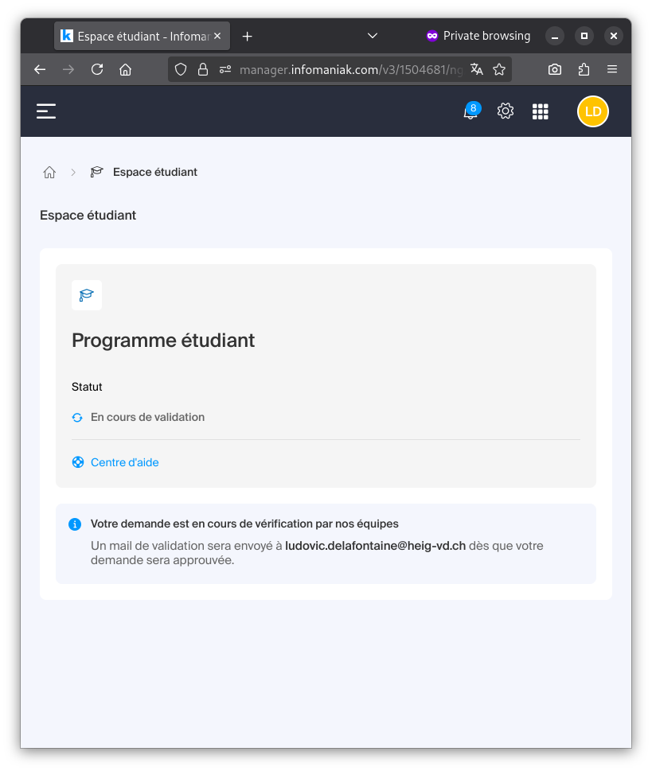

</details>

Une fois votre statut d'étudiant.e approuvé par Infomaniak, connectez-vous à
votre compte Infomaniak et accédez à la page du programme étudiant pour vérifier
que votre statut est bien approuvé.

<details>
<summary>Afficher la capture d'écran illustrant l'étape</summary>


</details>

### Créer un hébergement web

> [!NOTE]
>
> Il se peut que vous ayez déjà un hébergement web au travers d'un précédent
> cours.
>
> Si c'est le cas, vous pouvez passer directement à la section
> [Désactiver le renouvellement automatique](#désactiver-le-renouvellement-automatique).

Afin de commander un hébergement web, vous pouvez vous rendre la page page
suivante : <https://shop.infomaniak.com/order2/domain?hosting_order=true>.

La première étape consiste à choisir un nom de domaine pour votre hébergement
web.

Le nom de domaine que vous choisirez sera utilisé également dans d'autres cours
enseignés à la HEIG-VD. Vous êtes libre de choisir le nom de domaine que vous
souhaitez, mais nous vous recommandons de choisir un nom de domaine qui vous
représente et qui est facile à retenir. Par exemple, vous pouvez choisir un nom
de domaine qui contient votre prénom, votre nom de famille ou encore votre
pseudonyme habituel sur Internet.

Il s'agit peut-être d'une occasion pour vous créer une identité numérique en
ligne avec un nom de domaine qui vous représente et qui fera office de vitrine
pour vos projets personnels et professionnels.

Le nom de domaine vous appartient et vous permet d'accéder à votre application
web en utilisant une adresse web personnalisée (par exemple,
`www.mondomaine.ch`).

Nous vous recommandons d'activer l'option de confidentialité (_"Domain
Privacy"_) du nom de domaine pour protéger vos informations personnelles.
L'option pour accélérer l'accès au site web (_"DNS Fast Anycast"_) n'est pas
nécessaire pour ce cours.

<details>
<summary>Afficher la capture d'écran illustrant l'étape</summary>


</details>

Une fois le nom de domaine choisi, vous devez saisir vos coordonnées de
facturation. Même si vous ne serez pas facturé pour l'hébergement web dans le
cadre du programme étudiant, Infomaniak exige ces informations pour créer
l'hébergement web. C'est la raison pour laquelle l'option _"Domain Privacy"_ est
recommandée pour protéger vos informations personnelles.

<details>
<summary>Afficher la capture d'écran illustrant l'étape</summary>

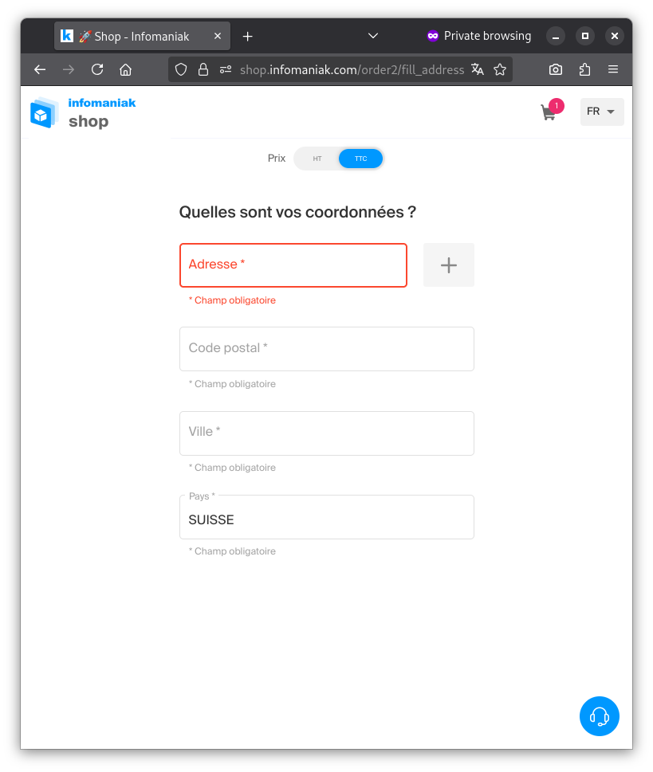

</details>

Sélectionnez maintenant un plan d'hébergement web. Choisissez le plan
_"Hébergement Web"_.

<details>
<summary>Afficher la capture d'écran illustrant l'étape</summary>


</details>

Sélectionnez l'option _"Je n'ai pas encore besoin d'adresse mail"_, comme nous
n'en aurons pas besoin pour le moment.

<details>
<summary>Afficher la capture d'écran illustrant l'étape</summary>


</details>

Confirmez que vous serez propriétaire du nom de domaine et de l'hébergement web.
Toutes autres options peuvent être ignorées (_"Continuer sans Renewal
Guarantee"_).

Validez votre commande.

> [!CAUTION]
>
> Assurez-vous de bénéficier du programme étudiant d'Infomaniak avant de valider
> votre commande. L'hébergement web doit être gratuit dans le cadre du programme
> étudiant d'Infomaniak. Si vous ne bénéficiez pas du programme étudiant, vous
> serez facturé pour l'hébergement web.

> [!WARNING]
>
> Vous avez droit jusqu'à 20 hébergements web gratuits dans le cadre du
> programme étudiant d'Infomaniak. Il est néanmoins obligatoire d'acquérir un
> nom de domaine pour votre projet que vous devrez payer vous-même (environ 10
> CHF pour une année). Ce montant peut être remboursé par la HEIG-VD si vous
> effectuez la demande de remboursement (voir ci-après).

<details>
<summary>Afficher la capture d'écran illustrant l'étape</summary>


</details>

> [!TIP]
>
> Le même nom de domaine peut être utilisé pour plusieurs hébergements web (par
> exemple, pour différents projets) à l'aide de sous-domaines (par exemple,
> `projet1.mondomaine.ch`, `projet2.mondomaine.ch`, etc.).
>
> Cela peut être utile pour organiser vos différents projets sous un même nom de
> domaine, par exemple `progserv1.mondomaine.ch` pour le projet du cours
> _"Programmation serveur 1"_, `progserv2.mondomaine.ch` pour le projet du cours
> _"Programmation serveur 2"_, etc.

Une fois la commande validée et payée, vous pouvez télécharger la facture au
format PDF. Vous en aurez besoin pour effectuer la demande de remboursement
auprès de la HEIG-VD (voir ci-après).

<details>
<summary>Afficher la capture d'écran illustrant l'étape</summary>

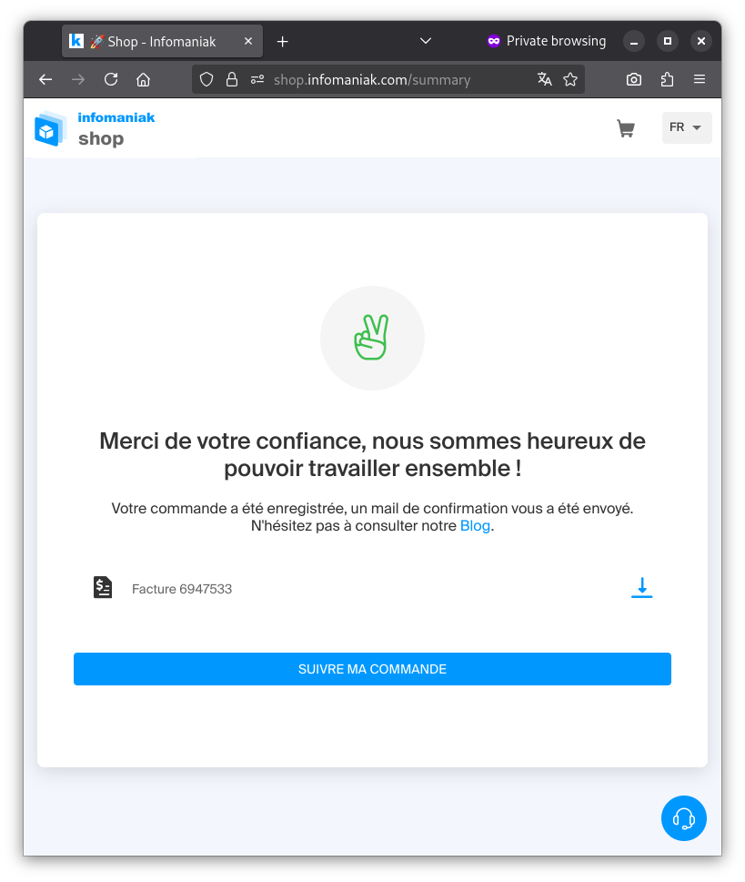

</details>

### Désactiver le renouvellement automatique

Afin d'éviter des frais supplémentaires à la fin de la première année, vous
devez désactiver le renouvellement automatique du nom de domaine et de
l'hébergement web. Pour cela, vous pouvez vous rendre dans **Comptabilité >
Renouvellement** dans le portail d'Infomaniak.

<details>
<summary>Afficher la capture d'écran illustrant l'étape</summary>


</details>

Sélectionnez tous les éléments de la liste puis cliquez sur le bouton
**Désactiver le renouvellement automatique**.

<details>
<summary>Afficher la capture d'écran illustrant l'étape</summary>


</details>

### Accéder aux hébergements web

Infomaniak permet de gérer plusieurs hébergements web. Pour accéder au menu de
gestion de tous les hébergements web, vous pouvez vous rendre dans **Web &
Domaines > Hébergement**.

<details>
<summary>Afficher la capture d'écran illustrant l'étape</summary>

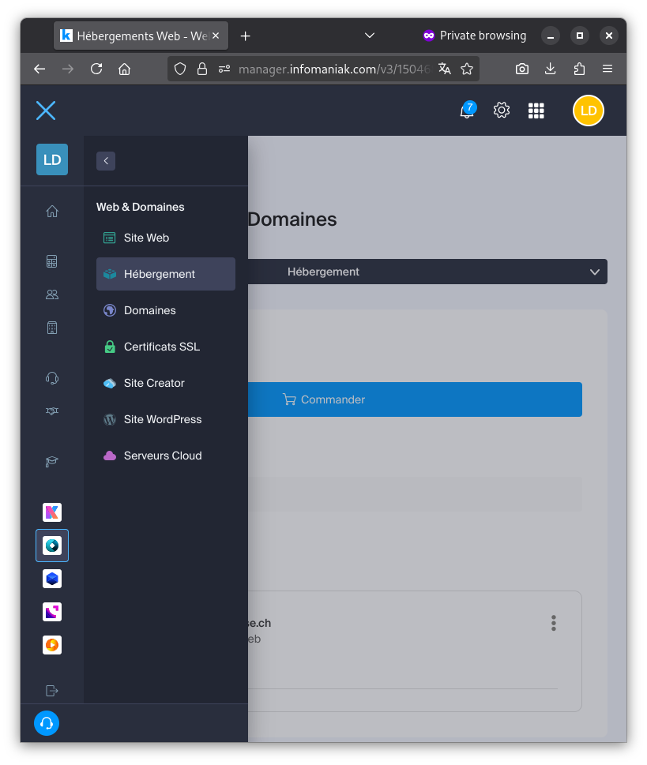

</details>

Ici, deux cas de figure peuvent se présenter à vous :

1. Vous avez commandé un nouvel hébergement web avec un nom de domaine pour la
   première fois.
2. Vous aviez déjà un hébergement web avec un nom de domaine associé acquis dans
   un précédent cours.

#### Cas 1 - Nouvel hébergement web

Rien de particulier à savoir/faire, suivez la marche à suivre décrite dans la
section
[Accéder au tableau de bord de l'hébergement web spécifique](#accéder-au-tableau-de-bord-de-lhébergement-web-spécifique)
pour configurer votre hébergement web.

#### Cas 2 - Hébergement web existant

Si c'est le cas, celui-ci pourrait porter le nom d'un précédent nom de domaine
que vous avez commandé.

À nouveau, les terminologies utilisées par Infomaniak peuvent être déroutantes.
Un hébergement web peut héberger plusieurs sites web, chacun pouvant être
associé à un nom de domaine différent ou à un ou plusieurs sous-domaines, même
si l'hébergement web porte déjà le nom d'un seul nom de domaine.

Suivez la marche à suivre décrite dans la section
[Accéder au tableau de bord de l'hébergement web spécifique](#accéder-au-tableau-de-bord-de-lhébergement-web-spécifique)
pour configurer votre hébergement web, même s'il porte le nom d'un précédent nom
de domaine que vous avez commandé.

### Accéder au tableau de bord de l'hébergement web spécifique

En cliquant sur le nom de domaine ou en accédant aux paramètres de l'hébergement
web grâce au bouton des trois points, vous pouvez accéder au tableau de bord de
l'hébergement web.

<details>
<summary>Afficher la capture d'écran illustrant l'étape</summary>

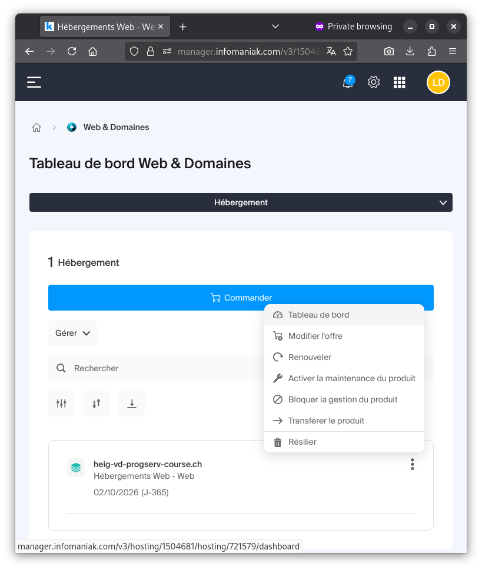

</details>

Ce tableau de bord vous permet de configurer plusieurs paramètres importants
pour votre hébergement web, notamment :

- Les paramètres généraux de l'hébergement web (par exemple, le nom de
  l'hébergement web, les ressources allouées, etc.).
- Le ou les sites web associés à l'hébergement web.
- Les accès FTP/SFTP pour transférer les fichiers de votre application PHP.
- Les accès à une ou des bases de données utilisées par votre application
  (MariaDB, PostgreSQL, etc.).
- Et d'autres paramètres avancés.

### Renommer l'hébergement web

Pour éviter toute confusion entre un hébergement web et un ou plusieurs noms de
domaine, nous allons renommer l'hébergement web existant pour lui donner un nom
plus spécifique.

Pour cela, accédez aux paramètres généraux de l'hébergement web en accédant au
menu **Gérer > Modifier le nom** sous le nom actuel de l'hébergement web.

<details>
<summary>Afficher la capture d'écran illustrant l'étape</summary>


</details>

Puis renommer l'hébergement web en lui donnant un nom plus spécifique, par
exemple `Hébergement web gratuit HEIG-VD`.

<details>
<summary>Afficher la capture d'écran illustrant l'étape</summary>

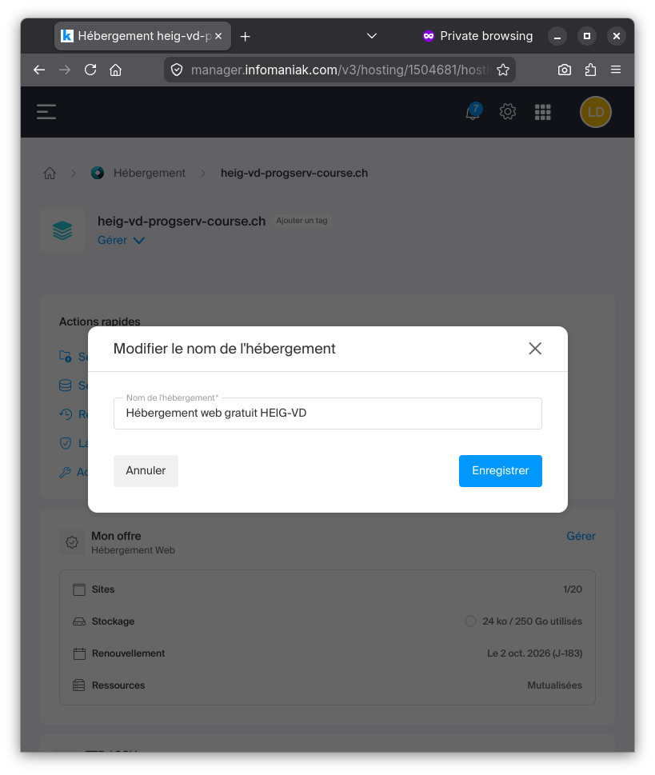

</details>

Sauvegardez les modifications.

<details>
<summary>Afficher la capture d'écran illustrant l'étape</summary>


</details>

Dorénavant, vous pourrez facilement différencier votre hébergement web des
autres hébergements web ou sites que vous pourriez avoir acquis dans le cadre
d'autres cours ou pour d'autres projets.

Vous pouvez le confirmer dans la section **Mon offre** de l'hébergement web, où
vous devriez voir le nombre de sites web associés à l'hébergement web ainsi que
ceux encore disponibles dans le cadre de votre offre d'hébergement web (20 sites
web disponibles dans le cadre du programme étudiant d'Infomaniak).

Juste en dessous, vous devriez voir le ou les sites web associés à l'hébergement
web. Si vous venez de commander un hébergement web avec un nom de domaine
associé, vous devriez voir un site web associé à ce nom de domaine.

<details>
<summary>Afficher la capture d'écran illustrant l'étape</summary>


</details>

Maintenant que l'hébergement web a son propre nom distinctif, il est temps de
configurer le site web associé à l'hébergement web.

### Ajouter un nouveau site (optionnel)

> [!NOTE]
>
> Ne suivez cette section que si vous souhaitez ajouter un nouveau site web à
> l'hébergement web. Si vous avez commandé un hébergement web avec un nom de
> domaine associé, vous devriez déjà avoir un site web associé à ce nom de
> domaine et vous pouvez passer directement à la section
> [Configurer le site web](#configurer-le-site-web).

Si vous souhaitez ajouter un nouveau site web à l'hébergement web, vous pouvez
le faire en cliquant sur le bouton **Ajouter un site** dans la section **Sites
web** du tableau de bord de l'hébergement web.

Selon le type de site web que vous souhaitez ajouter ou selon les contraintes du
cours que vous suivez, vous pouvez choisir entre les différentes options
proposées par Infomaniak.

> [!NOTE]
>
> Si vous avez un doute, validez votre choix avec votre enseignant.e.

#### Programmation serveur 1 (ProgServ1)

Pour le cours de _"Programmation serveur 1 (ProgServ1)"_, vous pouvez choisir
l'option **Créez un projet vierge**.

<details>
<summary>Afficher la capture d'écran illustrant l'étape</summary>


</details>

Puis configurez le site web en sélectionnant la technologie **Apache/PHP** et en
sélectionnant la dernière version de PHP disponible dans les options avancées.

> [!NOTE]
>
> Il se peut que la version de PHP utilisée par défaut pour le site web ne soit
> pas la dernière version disponible, ni même qu'elle corresponde à la capture
> d'écran ci-dessous.
>
> Nous vous recommandons d'utiliser la dernière version de PHP pour bénéficier
> des dernières fonctionnalités et améliorations de sécurité.

<details>
<summary>Afficher la capture d'écran illustrant l'étape</summary>


</details>

La dernière étape de la configuration du site web consiste à associer un nom de
domaine au site web.

Deux options s'offrent à vous pour cela :

1. Acheter un nouveau nom de domaine pour le site web. N'achetez un nouveau nom
   de domaine que si vous souhaitez avoir un nom de domaine différent de celui
   que vous avez déjà commandé pour votre hébergement web. Par exemple, si vous
   avez déjà commandé le nom de domaine `mondomaine.ch` pour votre hébergement
   web, vous pouvez acheter un nouveau nom de domaine `mondomaine2.ch` pour le
   nouveau site web. La HEIG-VD ne remboursera qu'un seul nom de domaine par
   étudiant.e, donc n'achetez un nouveau nom de domaine que si vous en avez
   besoin pour votre projet.
2. Associer le site web à un domaine/sous-domaine du domaine principal que vous
   avez déjà commandé pour votre hébergement web. Par exemple, si vous avez déjà
   commandé le nom de domaine `mondomaine.ch` pour votre hébergement web, vous
   pouvez associer le nouveau site web à un sous-domaine
   `projet1.mondomaine.ch`. Cette option est gratuite et vous permet d'avoir
   plusieurs sites web associés à un même nom de domaine en utilisant des
   sous-domaines différents.

> [!NOTE]
>
> Si vous n'êtes pas sûr.e de l'option à choisir, nous vous recommandons
> d'associer le site web à un sous-domaine du nom de domaine que vous avez déjà
> commandé pour votre hébergement web.
>
> C'est une option gratuite qui vous permet d'avoir plusieurs sites web associés
> à un même nom de domaine en utilisant des sous-domaines différents.
>
> En cas de doute, n'hésitez pas à valider votre choix avec votre enseignant.e.

Illustrons la configuration du site web en associant le site web à un
sous-domaine du nom de domaine que vous avez déjà commandé pour votre
hébergement web.

Sélectionnez l'option **Utiliser un nom de domaine ou sous-domaine existant**
puis saisissez le sous-domaine que vous souhaitez associer au site web.

Par exemple, si vous avez déjà commandé le nom de domaine `mondomaine.ch` pour
votre hébergement web, vous pouvez saisir `progserv1` pour associer le site web
au sous-domaine `progserv1.mondomaine.ch`.

Puis, dans les options avancées, assurez-vous que la version de PHP sélectionnée
est la dernière version disponible.

<details>
<summary>Afficher la capture d'écran illustrant l'étape</summary>


</details>

Puis, terminez la configuration du site web en sauvegardant les modifications.
La configuration du site web devrait prendre quelques minutes. Une fois la
configuration terminée, vous pourrez accéder au site web en utilisant l'adresse
du nom de domaine ou du sous-domaine que vous avez associé au site web.

<details>
<summary>Afficher les captures d'écran illustrant l'étape</summary>


</details>

Vous pouvez maintenant passer à la section
[Accéder au site web](#accéder-au-site-web) pour accéder au site web et vérifier
que tout fonctionne correctement.

### Configurer le site web

Accédez au tableau de bord du site que vous venez de commander en cliquant sur
celui-ci ou en utilisant le bouton des trois points.

<details>
<summary>Afficher la capture d'écran illustrant l'étape</summary>


</details>

Ce tableau de bord vous permet de configurer plusieurs paramètres importants
pour le site en cours de configuration, notamment :

- La version de PHP utilisée par le dit site web.
- La configuration de HTTPS pour sécuriser le dit site web.
- Et d'autres paramètres avancés.

<details>
<summary>Afficher la capture d'écran illustrant l'étape</summary>

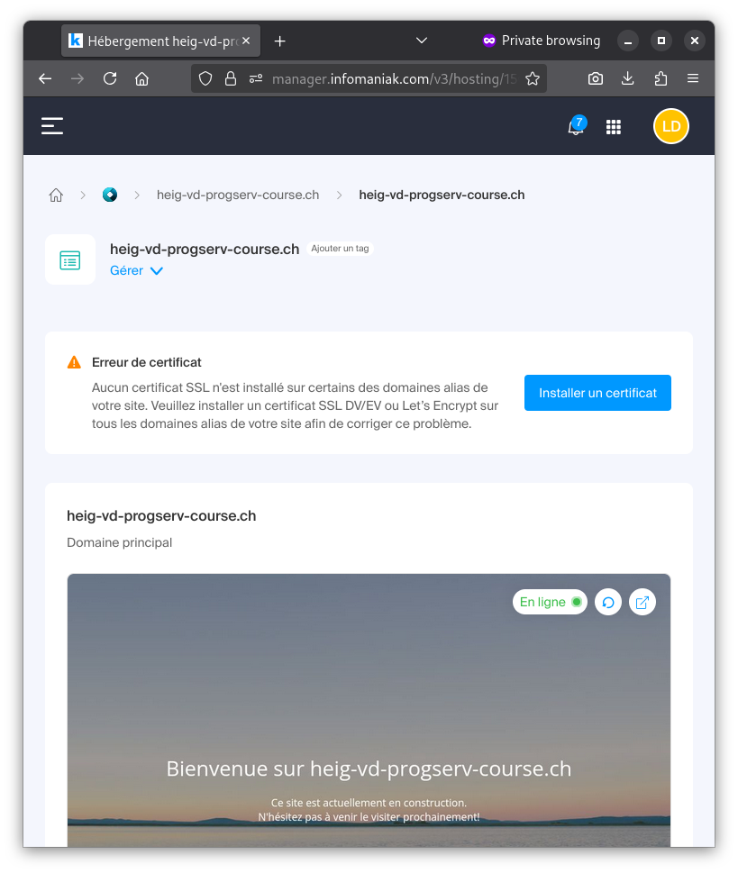

</details>

Commencez par accéder aux paramètres avancés du site web en cliquant sur le
bouton **Gérer** dans la section **Domaine principal**.

Vous accédez aux paramètres avancés du site web.

<details>
<summary>Afficher les captures d'écran illustrant l'étape</summary>

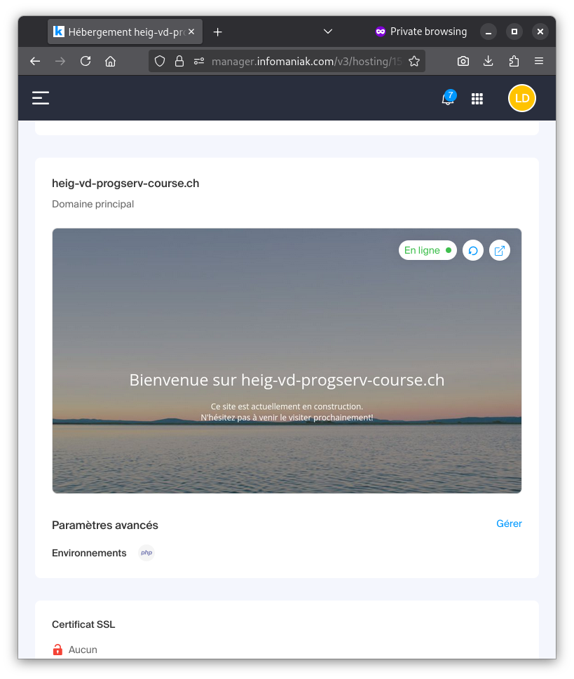

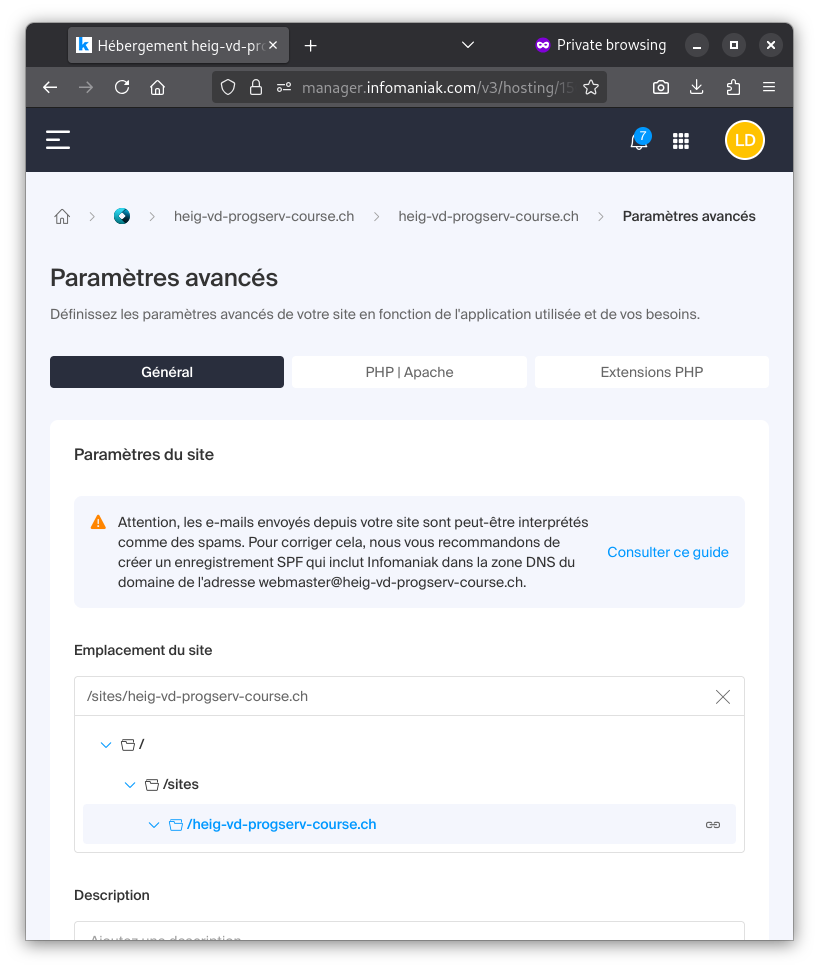

</details>

Puis, sélectionnez la version de PHP à utiliser pour le site web dans l'onglet
**PHP | Apache**.

Nous vous recommandons d'utiliser la dernière version disponible de PHP.

> [!NOTE]
>
> Il se peut que la version de PHP utilisée par défaut pour le site web ne soit
> pas la dernière version disponible, ni même qu'elle corresponde à la capture
> d'écran ci-dessous.
>
> Nous vous recommandons d'utiliser la dernière version de PHP pour bénéficier
> des dernières fonctionnalités et améliorations de sécurité.

<details>
<summary>Afficher la capture d'écran illustrant l'étape</summary>

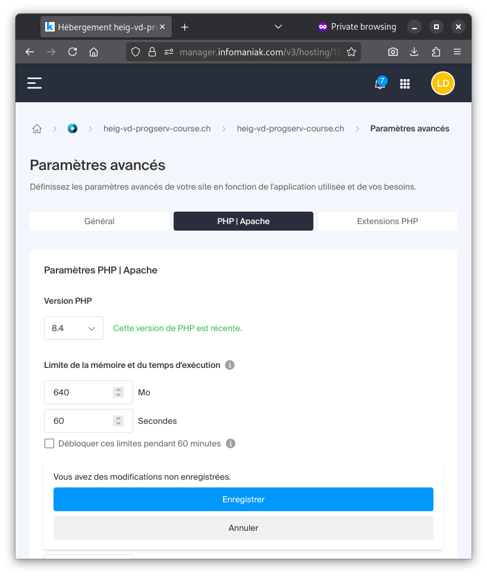

</details>

Terminez la configuration du site web en sauvegardant les modifications.

### Accéder au site web

Tentez d'accéder au site web en utilisant votre navigateur web en vous rendant à
l'adresse du nom de domaine que vous avez choisi lors de la commande de
l'hébergement web. Vous devriez voir une page par défaut d'Infomaniak.

> [!NOTE]
>
> Il se peut que l'accès au site web ne soit pas immédiatement disponible après
> la configuration. Cela est dû à la propagation des DNS, qui peut prendre
> jusqu'à 24 heures.
>
> De notre expérience, cela prend généralement moins de deux heures.
>
> Vous pouvez essayer depuis un autre réseau (par exemple, en utilisant le
> partage de connexion de votre téléphone) si l'accès au site web ne fonctionne
> pas depuis le réseau Wi-Fi habituel.

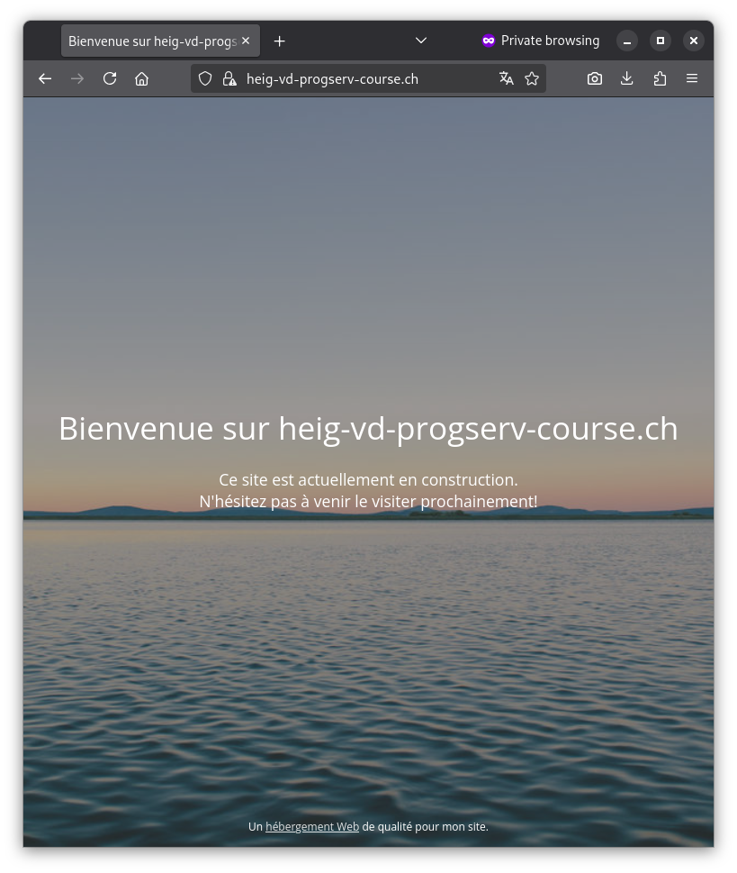

Votre site web est maintenant configuré et prêt à être utilisé !

### Sécuriser l'application avec HTTPS

Afin de sécuriser le site web et les données échangées entre le serveur et les
utilisateur.trices, il est important d'activer HTTPS pour le site web. HTTPS
(HyperText Transfer Protocol Secure) est une extension sécurisée du protocole
HTTP qui utilise le chiffrement SSL/TLS pour sécuriser les communications entre
le serveur et les utilisateur.trices.

Sans HTTPS, les données échangées entre le serveur et les utilisateur.trices
sont transmises en clair, ce qui signifie que des attaquants pourraient
potentiellement intercepter et lire ces données.

<details>
<summary>Afficher la capture d'écran illustrant l'étape</summary>

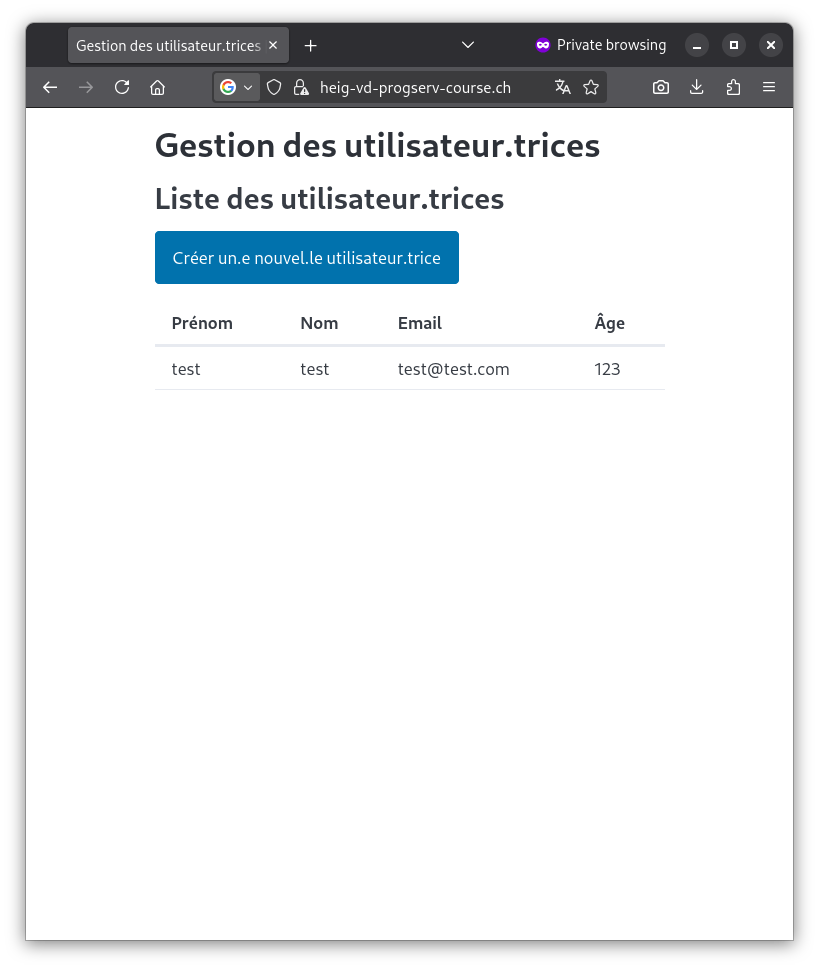

</details>

Pour activer HTTPS, vous devez configurer un certificat SSL pour votre nom de
domaine. Infomaniak fournit gratuitement des certificats SSL via Let's Encrypt,
un service de certification gratuit et automatisé.

Accédez au tableau de bord du site web dans le portail d'Infomaniak. Dans la
section **Certificat SSL**, cliquez sur le bouton **Configurer**.

<details>
<summary>Afficher la capture d'écran illustrant l'étape</summary>


</details>

Cliquez ensuite sur le bouton **Installer un certificat** pour commencer la
configuration du certificat SSL.

<details>
<summary>Afficher la capture d'écran illustrant l'étape</summary>


</details>

Sélectionnez l'option **Let's Encrypt** pour utiliser un certificat SSL gratuit
fourni par Let's Encrypt.

<details>
<summary>Afficher la capture d'écran illustrant l'étape</summary>

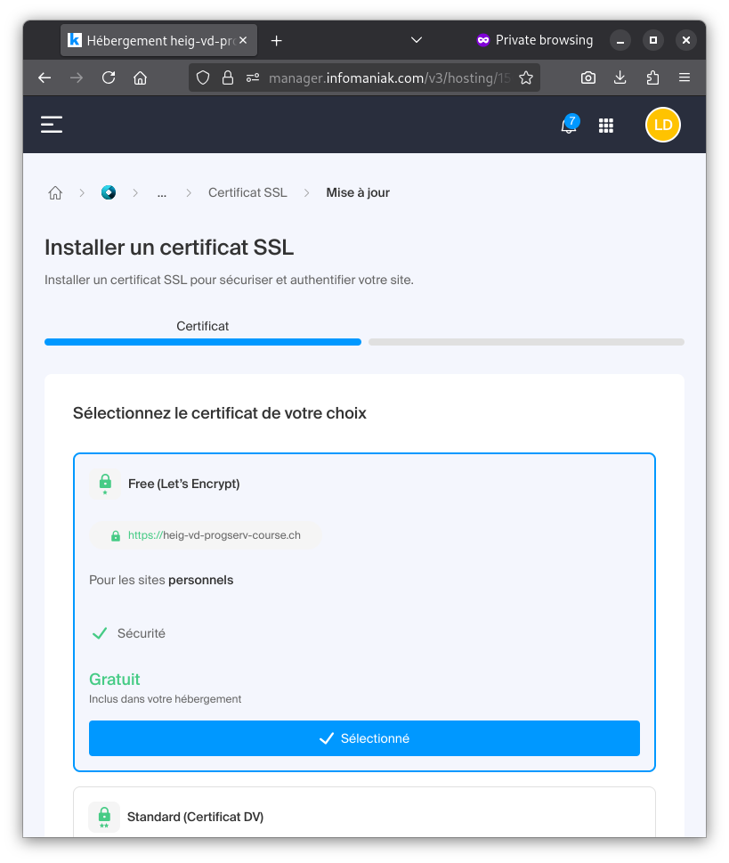

</details>

Sélectionnez les noms de domaine pour lesquels vous souhaitez activer le
certificat SSL. Assurez-vous de sélectionner le nom de domaine principal ainsi
que le sous-domaine `www`.

<details>
<summary>Afficher la capture d'écran illustrant l'étape</summary>

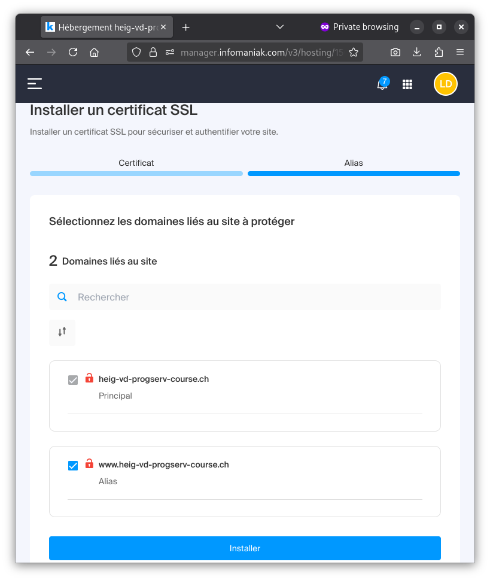

</details>

Validez la configuration du certificat SSL. Infomaniak va maintenant générer et
installer le certificat SSL pour votre nom de domaine. Ce processus peut prendre
quelques minutes.

> [!NOTE]
>
> Si vous avez récemment créé votre hébergement web, il se peut que le processus
> de validation du certificat SSL échoue. Attendez quelques heures avant de
> réessayer.

<details>
<summary>Afficher la capture d'écran illustrant l'étape</summary>

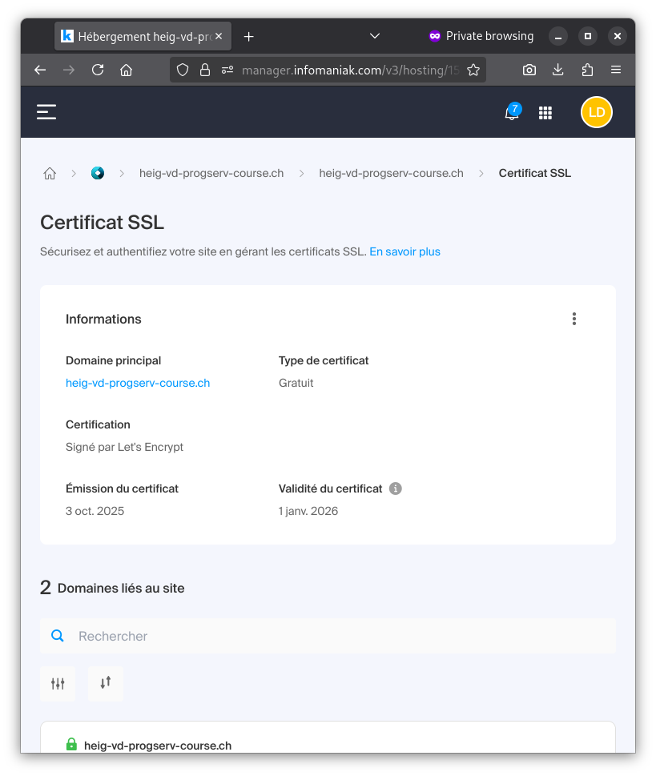

</details>

Rafraîchissez la page du site web dans votre navigateur web. Vous devriez
maintenant voir que l'URL commence par `https://` et que le cadenas vert indique
que la connexion est sécurisée.

<details>
<summary>Afficher la capture d'écran illustrant l'étape</summary>

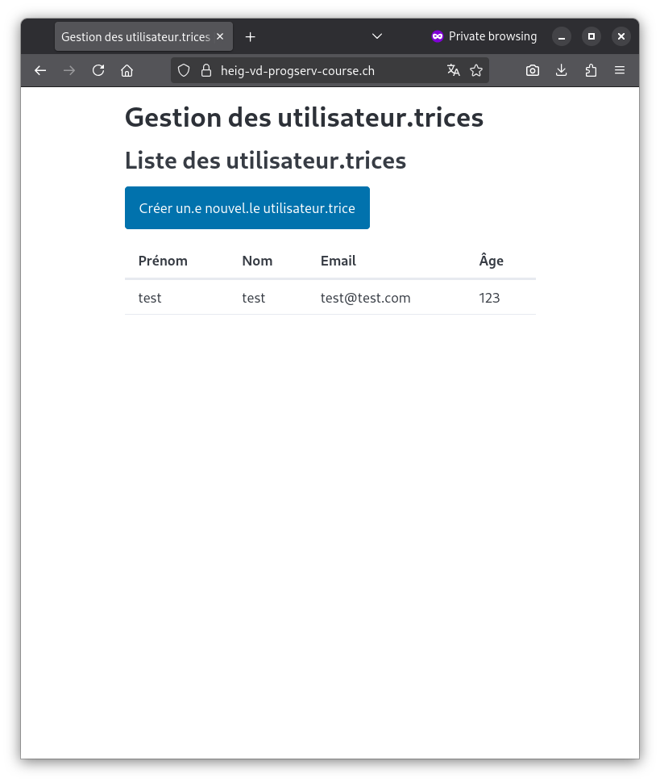

</details>

Bravo ! Vous avez sécurisé votre application PHP en protégeant les fichiers
sensibles et en activant HTTPS.

Vous avez maintenant toutes les compétences nécessaires pour déployer et
sécuriser une application PHP sur un hébergement web tel que celui d'Infomaniak.

### Effectuer la demande de remboursement auprès de la HEIG-VD

Afin d'obtenir le remboursement du nom de domaine que vous avez acheté pour
votre hébergement web, vous devez effectuer une demande de remboursement auprès
de la HEIG-VD. Pour cela, vous devez obtenir la facture au format PDF attestant
de l'achat du nom de domaine (voir ci-après).

Pour cela, vous pouvez vous rendre dans **Comptabilité > Commande** dans le
portail d'Infomaniak.

<details>
<summary>Afficher la capture d'écran illustrant l'étape</summary>


</details>

Puis cliquer sur le bouton **Facture** pour télécharger la facture au format
PDF.

<details>
<summary>Afficher la capture d'écran illustrant l'étape</summary>

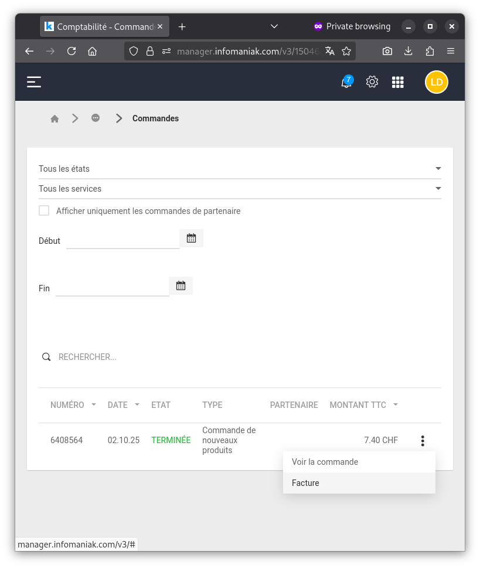

</details>

Une fois la facture téléchargée, vous pouvez effectuer la demande de
remboursement auprès de la HEIG-VD en suivant ces étapes :

1. Envoyez un e-mail au secrétariat COMEM avec la facture au format PDF en
   pièce-jointe. Indiquez que l'achat a été effectué dans le cadre du programme
   étudiant d'Infomaniak pour le cours de _"Programmation serveur 1
   (ProgServ1)"_.
2. Attendez la validation de la demande de remboursement par le secrétariat
   COMEM.
3. Passez au secrétariat COMEM pour récupérer le remboursement en espèces ou via
   TWINT et signer le formulaire de remboursement.

Le secrétariat COMEM traitera votre demande de remboursement et vous remboursera
le montant du nom de domaine en espèce ou via TWINT.

### Renouveler/révoquer le programme étudiant d'Infomaniak

> [!CAUTION]
>
> Suivez ces étapes uniquement une fois que l'année d'hébergement web est
> terminée !

Le programme étudiant d'Infomaniak est valable pour une année. Il est possible
de le renouveler pour une année supplémentaire si vous êtes toujours étudiant.e
à la HEIG-VD.

<details>
<summary>Afficher la capture d'écran illustrant l'étape</summary>


</details>

Si vous n'êtes plus étudiant.e, l'offre sera automatiquement révoquée mais il
est nécessaire de s'assurer que le renouvellement automatique du nom de domaine
et de l'hébergement web a bien été désactivé (voir section
[Désactiver le renouvellement automatique](#désactiver-le-renouvellement-automatique)).

Une fois le programme étudiant terminé, les frais supplémentaires seront à votre
charge.

> [!CAUTION]
>
> N'oubliez pas de renouveler/révoquer le nom de domaine et l'hébergement web à
> la fin de la première année pour éviter des frais dans le futur !

### Valider la configuration de l'environnement de production en ligne

- [x] Avoir obtenu un hébergement web gratuit dans le cadre du programme
      étudiant d'Infomaniak.
- [x] Avoir renommé l'hébergement web pour lui donner un nom plus spécifique.
- [x] Avoir configuré un site web associé à l'hébergement web.
- [x] Avoir sécurisé le site web en activant HTTPS.
- [x] Avoir accès au site web en utilisant l'adresse du nom de domaine ou du
      sous-domaine associé au site web.
- [x] Avoir effectué la demande de remboursement du nom de domaine auprès de la
      HEIG-VD.

## Déployer le mini-projet en ligne

### Exercice 4 - Accéder à l'hébergement web via FTP/SFTP

Afin de transférer les fichiers de votre application PHP vers l'hébergement web,
vous devez utiliser un client FTP/SFTP comme FileZilla (Windows/Linux) ou
Cyberduck (macOS).

Commencez par télécharger et installer un client FTP/SFTP si vous n'en avez pas
encore un :

- [FileZilla (client)](https://filezilla-project.org/download.php?show_all=1)
  (Windows/Linux)
- [Cyberduck](https://cyberduck.io/) (macOS)

Une fois le client FTP/SFTP installé, vous devez récupérer les informations de
connexion fournies par Infomaniak pour vous connecter à l'hébergement web via
FTP/SFTP.

Accédez à la page dédiée aux accès FTP/SFTP dans le tableau de bord de
l'hébergement web (**attention, nous parlons du tableau de bord de l'hébergement
web et non du tableau de bord du site spécifique au sein de l'hébergement web**)
en allant dans la section **FTP / SSH** :


Un utilisateur par défaut est créé pour accéder à l'hébergement web. Vous pouvez
utiliser l'utilisateur par défaut en lui attribuant un mot de passe en cliquant
sur le bouton trois points à droite de l'utilisateur > **Modifier** :


Définissez un mot de passe sécurisé pour l'utilisateur FTP/SFTP. Notez-le
quelque part, vous en aurez besoin pour vous connecter à l'hébergement web plus
tard :


Une fois le mot de passe défini, vous pouvez utiliser les informations de
connexion fournies par Infomaniak pour vous connecter à l'hébergement web via
FTP/SFTP. Récupérez l'adresse du serveur dans le menu **FTP / SSH** :


Ouvrez ensuite votre client FTP/SFTP et créez une nouvelle connexion en
utilisant les informations suivantes :

- Hôte / Serveur : l'adresse du serveur que vous avez récupérée dans le tableau
  de bord de l'hébergement web.
- Nom d'utilisateur : le nom d'utilisateur que vous avez défini ou l'utilisateur
  par défaut.
- Mot de passe : le mot de passe que vous avez défini pour l'utilisateur
  FTP/SFTP.
- Port : laissez vide pour utiliser le port par défaut (21 pour FTP, 22 pour
  SFTP - le port 22 est recommandé).

Tentez de vous connecter à l'hébergement web. Si la connexion est réussie, vous
devez voir la structure de fichiers de l'hébergement web dans votre client
FTP/SFTP :

> [!NOTE]
>
> Il se peut que l'accès FTP ne soit pas immédiatement disponible après la
> configuration. Cela est dû à la propagation des DNS, qui peut prendre jusqu'à
> 24 heures.
>
> De notre expérience, cela prend généralement moins de deux heures.
>
> Vous pouvez essayer depuis un autre réseau (par exemple, en utilisant le
> partage de connexion de votre téléphone) si l'accès FTP ne fonctionne pas
> depuis le réseau Wi-Fi habituel.

> [!NOTE]
>
> Il se peut que vous receviez un avertissement de sécurité lors de la première
> connexion via SFTP. Cela est normal, car le client FTP/SFTP ne reconnaît pas
> encore le certificat du serveur. Acceptez l'avertissement pour continuer.

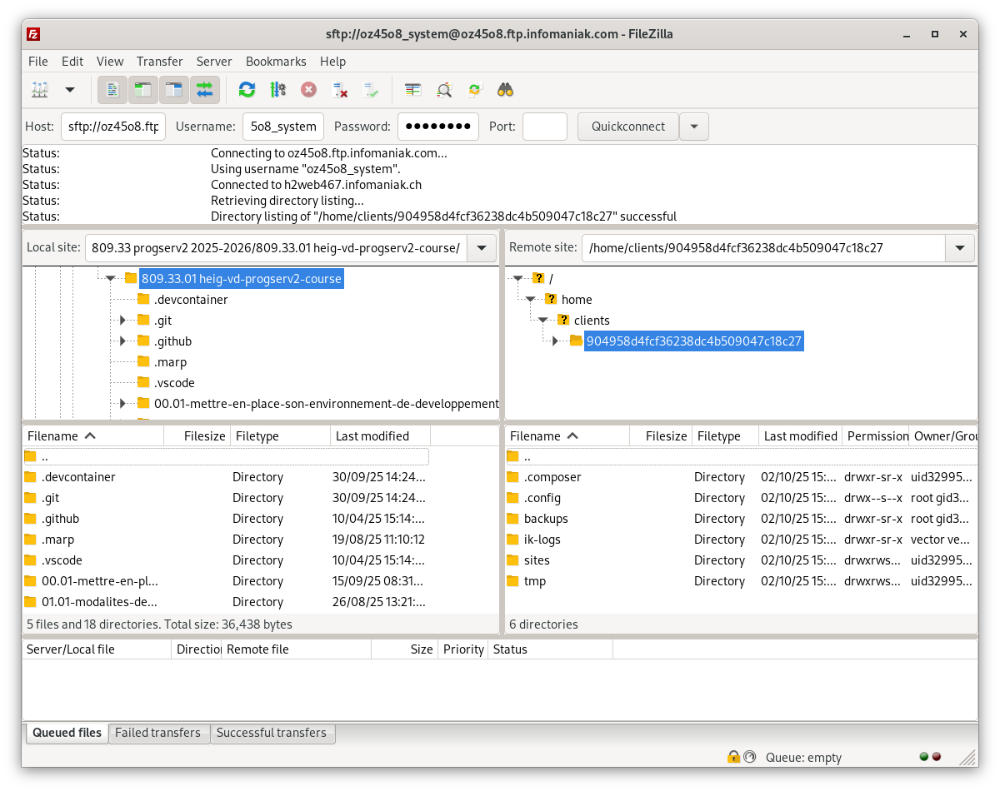

L'interface de votre client FTP/SFTP peut varier en fonction du logiciel que
vous utilisez. Néanmoins, ils partagent tous une structure similaire avec deux
panneaux principaux :

- Le panneau de gauche affiche les fichiers locaux (sur votre ordinateur)
- Le panneau de droite affiche les fichiers distants (sur l'hébergement web).

Les fichiers peuvent ainsi être transférés entre les deux panneaux en les
glissant-déposant ou en utilisant les boutons de transfert. Cela permet de
transférer les fichiers vers et depuis l'hébergement web.

Par défaut, vous arrivez dans le répertoire racine de l'utilisateur FTP/SFTP.
Pour accéder aux fichiers du site web, vous devez naviguer dans le répertoire
`sites/<nom de domaine>`, où `<nom de domaine>` est le nom de domaine que vous
avez choisi lors de la commande de l'hébergement web :


Ce dossier contient les fichiers du site web spécifique associé à l'hébergement
web. C'est ici que vous devez transférer les fichiers de votre application PHP
afin de mettre à jour votre site web.

> [!WARNING]
>
> Il se peut que les fichiers cachés (fichiers et dossiers commençant par un
> point, comme `.htaccess`) ne soient pas affichés par défaut dans votre client
> FTP/SFTP. Vous devrez peut-être activer l'option pour afficher les fichiers
> cachés dans les paramètres de votre client.
>
> Sur macOS, le raccourci clavier `Cmd + Shift + .` permet d'afficher ou de
> masquer les fichiers cachés. Il est peut-être nécessaire de rafraîchir la vue
> après avoir modifié cette option.

Créez un dossier `backup` dans le répertoire du site web (à l'aide du clic-droit
dans FileZilla ou Cyberduck, puis en sélectionnant l'option pour créer un
nouveau dossier). Ensuite, déplacez tous les fichiers et dossiers existants dans
ce dossier `backup`. Cela vous permettra de conserver une copie de sauvegarde
des fichiers par défaut d'Infomaniak au cas où vous en auriez besoin plus tard.

## Initialiser les exercices

### Rejoindre le GitHub Classroom pour les exercices

[GitHub Classroom](https://classroom.github.com/) est un outil qui permet de
gérer des dépôts GitHub dans un contexte éducatif. Il facilite la distribution
de projets, la collecte de travaux et la gestion des évaluations.

Il sera utilisé pour permettre au corps enseignant de visualiser le travail
effectué dans le mini-projet et les exercices.

Il est nécessaire de rejoindre le GitHub Classroom pour accéder au dépôt utilisé
pour le mini-projet et les exercices.

1. Accédez au lien suivant pour rejoindre le GitHub Classroom du cours : <TODO>.
2. Si vous n'êtes pas encore connecté.e à GitHub, connectez-vous avec votre
   compte GitHub.
3. Choisissez votre personne dans la liste pour rejoindre le GitHub Classroom.
4. Il se peut qu'un message d'erreur s'affiche avant que vous n'acceptiez
   l'invitation. Ne vous inquiétez pas, c'est normal.
5. Vous devez maintenant accepter l'invitation qui a été envoyée sur votre
   adresse mail associée à votre compte GitHub pour rejoindre le GitHub
   Classroom.. Vous pouvez retrouvez le mail associé à votre compte dans les
   paramètres de votre compte GitHub (icône de profil en haut à droite ->
   _"Settings"_ -> _"Emails"_).
6. Une fois l'invitation acceptée, vous devriez voir un message de confirmation
   indiquant que vous avez rejoint le GitHub Classroom.
7. Un dépôt GitHub privé sera créé pour vous, nommé
   `progserv1-<github-username>`.

Vous devriez maintenant avoir accès à votre dépôt GitHub privé pour le
mini-projet sur une page similaire à celle-ci :


### Cloner le dépôt GitHub localement

TODO

### Ouvrir le dossier racine du projet

Afin de travailler sur votre projet PHP, vous devez ouvrir le dossier racine du
projet dans Visual Studio Code. Pour ce faire, suivez les étapes suivantes :

1. Lancez Visual Studio Code.

   

2. Cliquez sur le menu **File > Open Folder...**.
3. Une fenêtre de dialogue s'ouvrira pour vous permettre de sélectionner le
   dossier racine de votre projet PHP. Sélectionnez le dossier racine de votre
   projet PHP (par exemple, `C:\MAMP\htdocs` pour Windows ou
   `/Applications/MAMP/htdocs` pour macOS) et cliquez sur le bouton **Open**. Il
   s'agira de votre dossier de travail pour le reste du cours.

   

4. Visual Studio Code ouvrira le dossier racine du projet. Un avertissement de
   sécurité vous demande si vous faites confiance aux auteurs du dossier.
   Cliquez sur le bouton **Yes, I trust the authors** pour continuer.

   

5. Visual Studio Code affichera tous les fichiers et dossiers qu'il contient
   dans l'explorateur de fichiers.

   

6. Un message d'avertissement devrait s'afficher en bas à droit. Nous allons y
   revenir plus tard.

Votre projet est maintenant ouvert dans Visual Studio Code.

### Ouvrir un terminal intégré

Afin de ne pas avoir à basculer entre plusieurs applications, nous allons
utiliser le terminal intégré de Visual Studio Code.

1. Ouvrez le terminal intégré en allant dans le menu **Terminal > New
   Terminal**.
2. Le terminal devrait s'ouvrir en bas de la fenêtre de Visual Studio Code.

Ce terminal devrait être ouvert dans le dossier racine de votre projet PHP
automatiquement.

## Conclusion

Dans cette première séance de mini-projet, vous avez installé et configuré un
environnement de développement pour PHP. Grâce à MAMP et Visual Studio Code,
vous avez mis en place un environnement de développement complet pour écrire,
tester et déboguer des applications PHP qui vous sera utile pour les séances et
les unités d'enseignement à venir.

Vous avez également initialisé un projet PHP pour le mini-projet et testé
l'initialisation du projet avec les différentes pages HTML qui seront utilisées
durant le reste du cours. Vous êtes maintenant prêt.e à commencer à construire
l'application web pour gérer les animaux de compagnie !

## Solution

La solution du mini-projet est accessible dans un dépôt GitHub dédié à l'adresse
suivante :
<https://github.com/heig-vd-devprodmed-course/heig-vd-devprodmed-mini-projet/tree/mini-projet-1>.

> [!NOTE]
>
> La solution est fournie à titre indicatif uniquement. Il est fortement
> recommandé de développer votre propre version du mini-projet avant de
> consulter la solution.
>
> De plus, cette solution référence un commit spécifique. Des modifications
> peuvent avoir été apportées au dépôt depuis ce commit.
>
> Pour accéder à la version exacte de la solution correspondant à ce commit/tag,
> vous pouvez cloner le dépôt et utiliser la commande Git suivante pour basculer
> sur le commit/tag spécifique :
>
> ```bash
> git checkout <commit-hash> # ou git checkout <tag>
> ```
>
> Remplacez `<commit-hash>` ou `<tag>` par l'identifiant du commit ou du tag
> correspondant à la solution.

<!-- Footnotes -->

[^docker]: Docker, [docker.com](https://www.docker.com/), 09 mars 2025

[^lamp]:
    LAMP,
    [en.wikipedia.org](<https://en.wikipedia.org/wiki/LAMP_(software_bundle)>),
    09 mars 2025

[^mamp]: MAMP, [mamp.info](https://www.mamp.info/), 09 mars 2025

[^visual-studio-code]:
    Visual Studio Code, [code.visualstudio.com](https://code.visualstudio.com/),
    10 mars 2025

[^wamp]: WampServer, [wampserver.com](https://www.wampserver.com/), 09 mars 2025

[^xampp]:
    XAMPP, [apachefriends.org](https://www.apachefriends.org/), 09 mars 2025

<!-- URLs -->

[licence]:
	https://github.com/heig-vd-devprodmed-course/heig-vd-devprodmed-course/blob/main/LICENSE.md
[illustration-logo-svg]:
	https://unsplash.com/photos/ygsmi5ushr0/download?ixid=M3wxMjA3fDB8MXxhbGx8fHx8fHx8fHwxNzQ5MDM5ODM3fA&force=true&fm=svg

---

TODO

#### Configuration de l'interpréteur PHP dans Visual Studio Code

Pour que Visual Studio Code puisse vous aidez lors de la rédaction de code PHP,
vous devez configurer l'interpréteur PHP dans les paramètres de l'éditeur de
code. Pour ce faire, suivez les étapes suivantes :

1. Identifiez où est installé l'interpréteur PHP sur votre ordinateur. Avec
   MAMP, il est installé par défaut dans le dossier `C:\MAMP\bin\php` pour
   Windows ou `/Applications/MAMP/bin/php` pour macOS.
2. Identifiez la version de PHP à utiliser. Selon votre configuration MAMP, il
   faut sélectionner la même version que celle configurée dans MAMP. Dans la
   capture suivante, la version 8.3.1 est utilisée. Vous pouvez vérifier la
   version de PHP dans MAMP en cliquant sur le bouton **Preferences** dans la
   fenêtre principale de MAMP. Vous en aurez besoin pour configurer Visual
   Studio Code par la suite.

   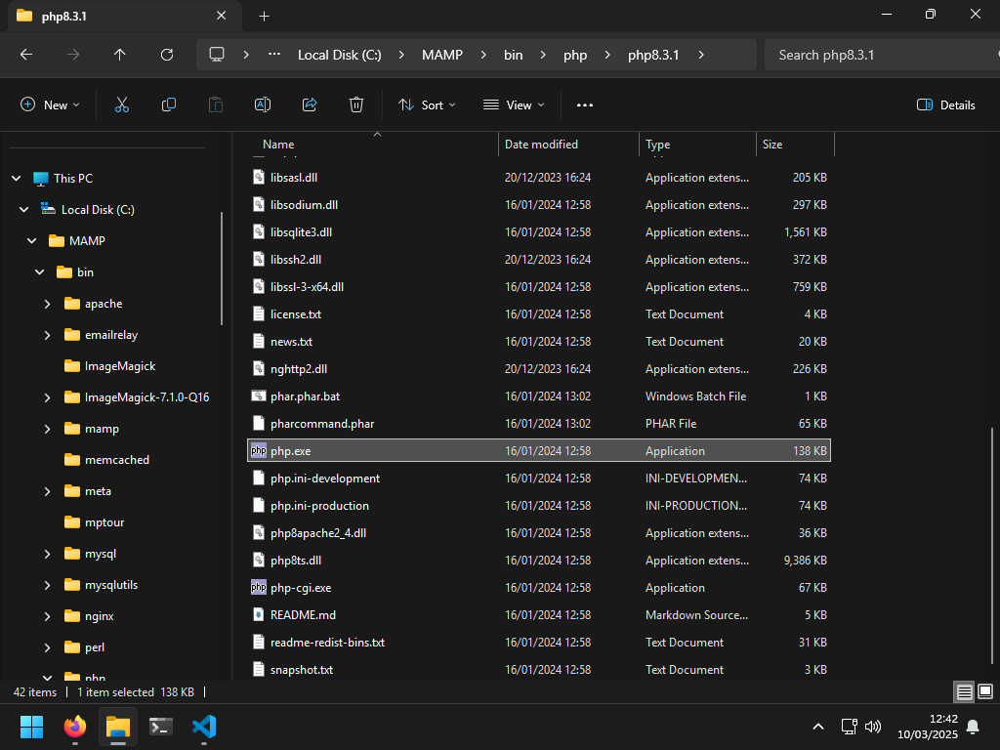

3. Dans Visual Studio Code, cliquez sur le menu **File > Preferences >
   Settings** et cherchez `php.validate.executablePath`.

   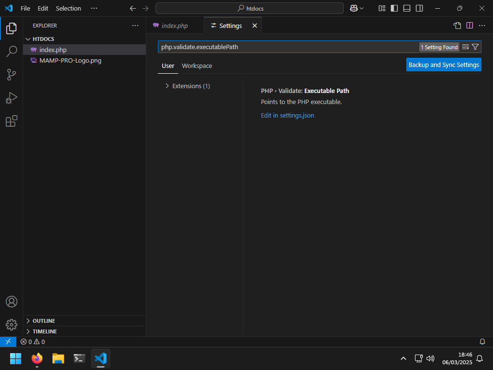

4. Cliquez sur le bouton **Edit in settings.json** pour ouvrir le fichier de
   configuration de Visual Studio Code.
5. Ajoutez la ligne suivante dans le fichier de configuration :

   ```json
   "php.validate.executablePath": "<PATH_TO_PHP_EXECUTABLE>"
   ```

   Remplacez `<PATH_TO_PHP_EXECUTABLE>` par le chemin d'accès à l'exécutable PHP
   sur votre ordinateur. Par exemple, `C:\\MAMP\\bin\\php\\php8.3.1\\php.exe`
   pour Windows ou `/Applications/MAMP/bin/php/php8.3.1/bin/php` pour macOS.

   **Attention**, assurez-vous de remplacer `<PATH_TO_PHP_EXECUTABLE>` par le
   chemin d'accès correct à l'exécutable PHP sur votre ordinateur trouvé à
   l'étape 2.

   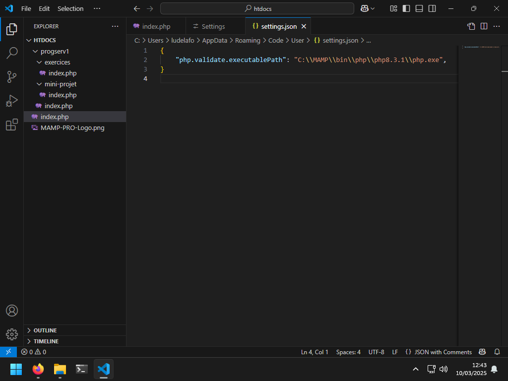

Cela permettra de configurer Visual Studio Code pour qu'il utilise
l'interpréteur PHP installé avec MAMP pour valider le code PHP que vous écrivez.

Votre environnement de développement est maintenant configuré pour travailler
avec PHP dans Visual Studio Code !
