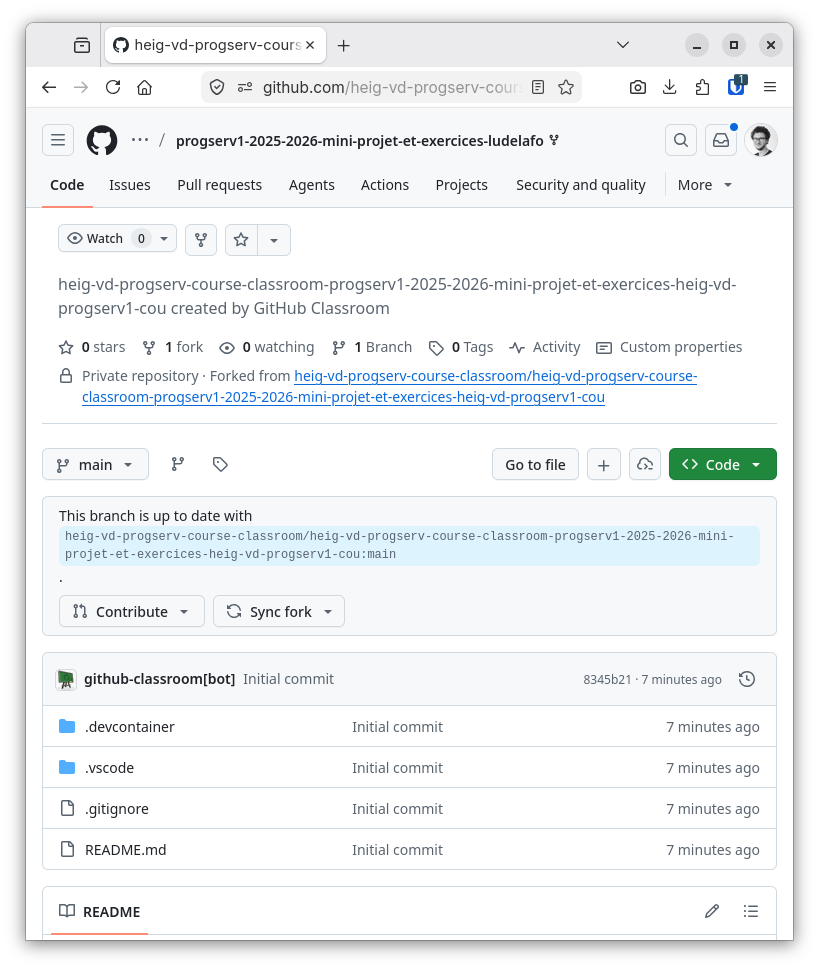
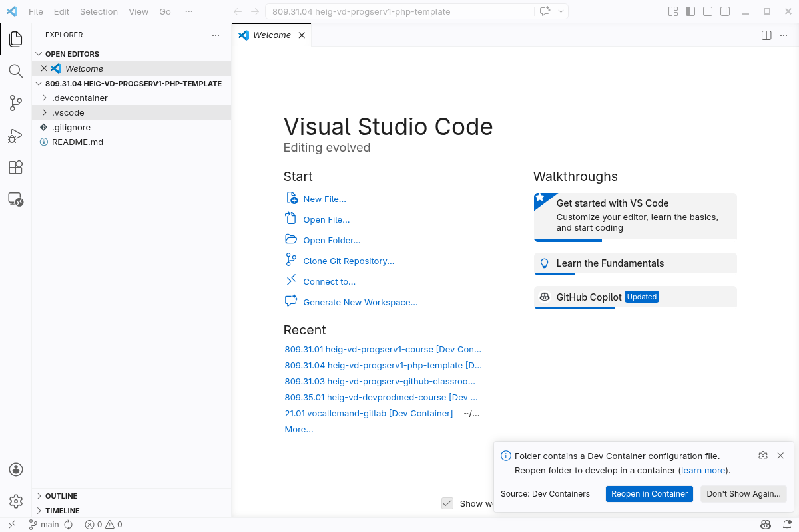

# Introduction à PHP - Mini-projet

L. Delafontaine, avec l'aide de
[GitHub Copilot](https://github.com/features/copilot).

Ce travail est sous licence [CC BY-SA 4.0][licence].

> [!TIP]
>
> Toutes les informations relatives à ce contenu sont décrites dans le
> [contenu principal](../README.md).

## Table des matières

- [Table des matières](#table-des-matières)
- [Introduction à votre première séance de mini-projet](#introduction-à-votre-première-séance-de-mini-projet)
- [Présentation du mini-projet](#présentation-du-mini-projet)
- [Objectifs de la séance](#objectifs-de-la-séance)
- [Installer et configurer l'environnement de développement local](#installer-et-configurer-lenvironnement-de-développement-local)
  - [Prérequis](#prérequis)
  - [Installer un éditeur de code](#installer-un-éditeur-de-code)
  - [Configurer l'éditeur de code](#configurer-léditeur-de-code)
  - [Valider l'installation et la configuration de l'environnement de développement local](#valider-linstallation-et-la-configuration-de-lenvironnement-de-développement-local)
- [Ouvrir le projet localement](#ouvrir-le-projet-localement)
  - [Accéder à votre dépôt GitHub sur GitHub Classroom](#accéder-à-votre-dépôt-github-sur-github-classroom)
  - [Cloner votre dépôt GitHub localement](#cloner-votre-dépôt-github-localement)
  - [Ouvrir votre dépôt GitHub dans Visual Studio Code](#ouvrir-votre-dépôt-github-dans-visual-studio-code)
  - [Ouvrir le projet dans un conteneur de développement](#ouvrir-le-projet-dans-un-conteneur-de-développement)
  - [Découvrir la structure du projet](#découvrir-la-structure-du-projet)
- [Démarrer le projet](#démarrer-le-projet)
  - [Ouvrir un terminal intégré](#ouvrir-un-terminal-intégré)
  - [Démarrer le serveur de développement PHP](#démarrer-le-serveur-de-développement-php)
  - [Créer la structure de base du projet](#créer-la-structure-de-base-du-projet)
  - [Créer et tester les fichiers de base du projet](#créer-et-tester-les-fichiers-de-base-du-projet)
  - [Arrêter le serveur de développement PHP](#arrêter-le-serveur-de-développement-php)
- [Ajouter les fichiers au contrôle de version avec Git](#ajouter-les-fichiers-au-contrôle-de-version-avec-git)
  - [Visualiser les changements avec Git](#visualiser-les-changements-avec-git)
  - [Ajouter les fichiers au suivi avec Git](#ajouter-les-fichiers-au-suivi-avec-git)
  - [Commiter les changements avec Git](#commiter-les-changements-avec-git)
  - [Pousser les changements vers GitHub](#pousser-les-changements-vers-github)
- [Cloner le dépôt GitHub du cours](#cloner-le-dépôt-github-du-cours)
- [Cloner le dépôt GitHub de la solution au mini-projet](#cloner-le-dépôt-github-de-la-solution-au-mini-projet)
- [Conclusion](#conclusion)
- [Solution](#solution)

## Introduction à votre première séance de mini-projet

Bienvenue dans la première séance du mini-projet qui va vous accompagner durant
toute la durée du cours _"Programmation serveur 1 (ProgServ1)"_ !

Cette séance de mini-projet est conçue pour vous permettre de mettre en pratique
les concepts théoriques vus dans le cours
_["Introduction à PHP"](../README.md)_. N'hésitez pas à vous y référer si vous
avez besoin de rafraîchir votre mémoire.

En lisant les contenus préparés pour les séances de mini-projet, vous trouverez
peut-être ce que l'on appelle des _"avertissements"_ ou des _"alertes"_.

Elles se présentent comme suit :

> [!NOTE]
>
> Hé ! Je suis une note ! Merci de m'avoir lue !

Elles sont là pour mettre en évidence des informations importantes dont vous
devez tenir compte.

Voici les différents types de remontrances que vous pourriez trouver et leur
signification :

> [!NOTE]
>
> Informations mises en évidence que vous devriez prendre en compte.

> [!TIP]
>
> Informations facultatives pour vous aider à mieux réussir avec des conseils,
> des astuces, ou encore des suggestions.

> [!IMPORTANT]
>
> Informations cruciales nécessaires à la réussite des actions que vous devriez
> effectuer.

> [!WARNING]
>
> Informations critiques exigeant votre attention immédiate en raison des
> risques potentiels.

> [!CAUTION]
>
> Conséquences négatives potentielles d'une action que vous devriez éviter.

Nous pourrions vous rediriger vers de la documentation officielle ou des
ressources externes à suivre pour configurer votre environnement ou en savoir
plus sur un sujet spécifique.

Ces ressources externes sont là pour vous aider. Nous vous redirigeons vers
elles pour éviter de répéter ce qui est déjà bien maintenu et expliqué ailleurs.

Ce que vous voyez et faites dans une séance actuelle peut être utilisé dans une
séance future.

C'est pourquoi il est important de suivre les étapes et de comprendre ce que
vous faites. Vous devez conserver le code que vous écrivez pour les séances
futures.

Cependant, si _quoi que ce soit_ n'est pas clair, ne fonctionne pas ou nécessite
une amélioration, n'hésitez pas à poser des questions ou nous le signaler.

L'équipe pédagogique considère qu'il n'y a pas de question bête : vous êtes ici
pour apprendre et nous sommes là pour vous aider ! Travaillons en équipe pour
que vous puissiez réussir !

C'est parti !

> [!TIP]
>
> Le [support de cours](../README.md) est disponible pour vous aider à
> comprendre les concepts théoriques abordés dans ce mini-projet si besoin !

## Présentation du mini-projet

Le mini-projet est une application web qui permettra aux utilisateurs d'ajouter,
consulter, modifier et supprimer des animaux de compagnie.

Chaque animal de compagnie aura les attributs suivants :

- Un identifiant unique (généré automatiquement par la base de données).
- Nom (un champ texte).
- Espèce (un champ de sélection contenant, par exemple : chien, chat, lézard,
  serpent, oiseau, lapin, autre).
- Surnom (un champ texte facultatif).
- Sexe (un champ boutons radio).
- Âge (un champ numérique).
- Couleur (un champ de saisie de couleur facultatif).
- Personnalité (un champ cases à cocher facultatif).
- Taille en cm (un champ numérique facultatif).
- Notes (un champ de texte libre facultatif).

L'application web comportera les pages suivantes :

- **Page d'accueil** : une page d'accueil avec une brève introduction à
  l'application et la liste des animaux de compagnie. Chaque animal doit être
  cliquable pour afficher plus de détails.
- **Visualisation d'un animal** : une page affichant les informations détaillées
  sur un animal spécifique, y compris tous ses attributs. L'utilisateur doit
  pouvoir modifier ou supprimer l'animal depuis cette page.
- **Création d'un animal** : une page permettant à l'utilisateur de créer un
  nouvel animal en remplissant un formulaire avec tous les attributs.
- **Modification d'un animal** : une page permettant à l'utilisateur de mettre à
  jour un animal existant en modifiant ses attributs dans un formulaire.
- **Suppression d'un animal** : une page permettant à l'utilisateur de supprimer
  un animal de la base de données.

Nous construirons cette application web ensemble durant la durée du cours en
plusieurs étapes. Dans cette séance, nous allons mettre en place l'environnement
de développement local, l'environnement de production en ligne et initialiser le
projet PHP pour le mini-projet.

## Objectifs de la séance

À l'issue de cette séance, les personnes qui étudient devraient avoir pu :

- Installer et configurer un environnement de développement local pour PHP.
- Initialiser un projet PHP pour le mini-projet.
- Installer et configurer un environnement de production en ligne pour PHP.
- Déployer le mini-projet en ligne.
- Initialiser un dépôt GitHub pour les exercices.

## Installer et configurer l'environnement de développement local

Un environnement de développement local est un ensemble d'outils et de logiciels
nécessaires pour écrire, tester et déboguer des applications logicielles sur
votre propre ordinateur. Il permet aux développeur.euses de créer et de tester
leur code dans un environnement contrôlé avant de le déployer sur un serveur de
production en ligne.

Dans cette section, nous allons installer et configurer un environnement de
développement local pour développer des applications web en PHP.

### Prérequis

Avant de commencer, assurez-vous d'avoir les éléments suivants installés et
configurés sur votre ordinateur :

- Un ordinateur avec un système d'exploitation compatible avec les outils que
  nous allons utiliser (Windows, macOS ou Linux).
- Un environnement Windows Subsystem for Linux (WSL) pour les utilisateur.trices
  de Windows.
- Git installé et configuré sur votre ordinateur (dans l'environnement WSL pour
  les utilisateur.trices de Windows).
- L'application Windows Terminal installée pour les utilisateur.trices de
  Windows configurée pour ouvrir WSL automatiquement.
- Docker et Docker Compose installés sur votre ordinateur (accessibles dans
  l'environnement WSL pour les utilisateur.trices de Windows).
- Un éditeur de code de votre choix (Visual Studio Code est recommandé, mais
  vous pouvez utiliser un autre éditeur si vous préférez).
- Une connexion Internet pour télécharger les outils nécessaires et accéder aux
  ressources en ligne.

Dans votre terminal, assurez-vous d'avoir accès aux différents outils
nécessaires en exécutant les commandes suivantes :

```bash
# Vérifier que Git est installé
git --version
```

Le résultat devrait être similaire à ceci, indiquant que l'outil est installé et
prêt à être utilisé :

```text
git version 2.52.0
```

```bash
# Vérifier que Docker est installé
docker --version
```

Le résultat devrait être similaire à ceci, indiquant que l'outil est installé et
prêt à être utilisé :

```text
Docker version 29.1.3, build f52814d
```

```bash
# Vérifier que Docker Compose est installé
docker compose version
```

Le résultat devrait être similaire à ceci, indiquant que l'outil est installé et
prêt à être utilisé :

```text
Docker Compose version v2.40.3
```

Si vous obtenez les mêmes résultats que ceux présentés ci-dessus, vous êtes
prêt.e à suivre les étapes de cette séance de mini-projet !

Sinon, utilisez les ressources suivantes pour installer les outils nécessaires :

- Le cours
  [Outils de développement](https://www.notion.so/wengerk/Outils-de-d-veloppement-22fe9dd7f406801b9347f8fb470b6e8e)
  que vous avez suivi en première année.
- [Set up a Windows development environment](https://github.com/heig-vd-dai-course/heig-vd-dai-course/blob/main/00.01-set-up-a-windows-development-environment/01-course-material/README.md),
  un contenu de cours pour configurer un environnement de développement sur
  Windows pour un cours enseigné dans le département TIC de la HEIG-VD.
- [Git, GitHub and Markdown](https://github.com/heig-vd-dai-course/heig-vd-dai-course/blob/main/01.03-git-github-and-markdown/01-course-material/README.md),
  un contenu de cours pour comprendre les bases de Git, GitHub et Markdown pour
  un cours enseigné dans le département TIC de la HEIG-VD.
- [Docker and Docker Compose](https://github.com/heig-vd-dai-course/heig-vd-dai-course/blob/main/04.01-docker-and-docker-compose/01-course-material/README.md),
  un contenu de cours pour comprendre les bases de Docker et Docker Compose pour
  un cours enseigné dans le département TIC de la HEIG-VD.

### Installer un éditeur de code

Un éditeur de code est un logiciel qui vous permet d'écrire, de modifier et de
gérer du code source pour des applications logicielles. Il existe de nombreux
éditeurs de code disponibles, chacun avec ses propres fonctionnalités et
avantages.

Nous vous recommandons d'utiliser Visual Studio Code, un éditeur de code gratuit
et open-source développé par Microsoft[^visual-studio-code], mais vous pouvez
utiliser n'importe quel éditeur de code avec lequel vous êtes à l'aise pour le
reste de ce cours.

#### Installation sur Windows

Pour installer Visual Studio Code sur Windows, suivez les étapes suivantes :

1. Rendez-vous sur le site web de Visual Studio Code à l'adresse suivante :
   <https://code.visualstudio.com/>.

   <details>
   <summary>Afficher la capture d'écran illustrant l'étape</summary>

   

   </details>

2. Téléchargez la dernière version de Visual Studio Code pour Windows.
3. Exécutez le programme d'installation que vous venez de télécharger pour
   installer Visual Studio Code :
   1. Le programme d'installation de Visual Studio Code devrait s'ouvrir.
      Acceptez les termes du contrat de licence et cliquez sur le bouton
      **Next**.

      <details>
      <summary>Afficher la capture d'écran illustrant l'étape</summary>

      

      </details>

   2. Laissez les paramètres par défaut pour installer Visual Studio Code sur
      votre ordinateur et cliquez sur le bouton **Next**.

      <details>
      <summary>Afficher la capture d'écran illustrant l'étape</summary>

      

      </details>

   3. Laissez les paramètres par défaut pour créer un dossier
      `Visual Studio Code` dans le menu de démarrage et cliquez sur le bouton
      **Next**.

      <details>
      <summary>Afficher la capture d'écran illustrant l'étape</summary>

      

      </details>

   4. Choisissez si vous souhaitez avoir un raccourci sur le bureau et
      sélectionnez les options supplémentaires pour ajouter Visual Studio Code
      au menu contextuel de l'Explorateur Windows. Cela vous permettra de faire
      un clic droit sur n'importe quel dossier et d'ouvrir Visual Studio Code
      directement dans ce dossier. Cliquez ensuite sur le bouton **Next**.

   <details>
   <summary>Afficher la capture d'écran illustrant l'étape</summary>

   

      </details>
   5. Une fois que vous avez vérifié les paramètres d'installation, cliquez sur
      le bouton **Install** pour commencer l'installation.

      <details>
      <summary>Afficher la capture d'écran illustrant l'étape</summary>

   

      </details>

4. Une fois l'installation terminée, lancez Visual Studio Code.

Vous pouvez maintenant passer à la section
[_Configurer l'éditeur de code_](#configurer-léditeur-de-code).

#### Installation sur macOS

Pour installer Visual Studio Code sur macOS, suivez les étapes suivantes :

> [!WARNING]
>
> Sélectionnez la bonne version de Visual Studio Code pour macOS en fonction de
> l'architecture de votre processeur (Intel ou Apple Silicon). Les personnes
> avec des appareils Apple M1, M2, M3 ou M4 doivent télécharger la version ARM
> de Visual Studio Code.

1. Rendez-vous sur le site web de Visual Studio Code à l'adresse suivante :
   <https://code.visualstudio.com/>.

   <details>
   <summary>Afficher la capture d'écran illustrant l'étape</summary>

   

   </details>

2. Téléchargez la dernière version de Visual Studio Code pour macOS.
3. Ouvrez le fichier `.dmg` que vous venez de télécharger.
4. Faites glisser l'icône de Visual Studio Code dans le dossier `Applications`.
5. Ouvrez le dossier `Applications` et double-cliquez sur l'icône de Visual
   Studio Code pour le lancer.

Vous pouvez maintenant passer à la section
[_Configurer l'éditeur de code_](#configurer-léditeur-de-code).

#### Installation sur Linux

_Si vous utilisez Linux, veuillez nous consulter si vous avez besoin d'aide pour
installer un éditeur de code sur votre ordinateur._

### Configurer l'éditeur de code

Une fois que vous avez installé Visual Studio Code, vous devez le configurer
pour qu'il fonctionne correctement avec PHP.

#### Configurer les raccourcis clavier pour Visual Studio Code

Pas défaut, Visual Studio Code ne sauvegarde que le fichier courant lorsque vous
appuyez sur `Ctrl + S` (Windows/Linux) ou `Cmd + S` (macOS). Pour sauvegarder
tous les fichiers ouverts dans Visual Studio Code, vous devez configurer les
raccourcis clavier pour qu'ils sauvegardent tous les fichiers.

Pour ce faire, suivez les étapes suivantes :

> [!IMPORTANT]
>
> Nous vous recommandons **vivement** de configurer les raccourcis clavier pour
> sauvegarder tous les fichiers ouverts dans Visual Studio Code.
>
> Cela vous permettra de ne pas oublier de sauvegarder un fichier avant de
> tester votre code dans le navigateur, ce qui peut entraîner des erreurs
> difficiles à comprendre si vous oubliez de le faire.

1. Cliquez sur le menu **File > Preferences > Keyboard Shortcuts**.
2. Recherchez `File: Save All Files` dans la barre de recherche.
3. Assignez les touches de raccourci de votre choix pour sauvegarder tous les
   fichiers ouverts dans Visual Studio Code. Nous vous recommandons d'utiliser
   utiliser `Ctrl + S` (Windows/Linux) ou `Cmd + S` (macOS) à des fins de
   facilité.

   <details>
   <summary>Afficher la capture d'écran illustrant l'étape</summary>

   

   </details>

#### Désactiver GitHub Copilot dans Visual Studio Code

Si vous avez accès à GitHub Copilot, nous vous recommandons de le désactiver
dans Visual Studio Code pour éviter d'avoir des suggestions de code qui
pourraient interférer avec votre apprentissage et votre compréhension du code
que vous écrivez.

Pour cela, suivez la documentation officielle de GitHub Copilot pour désactiver
les suggestions de code dans Visual Studio Code :
<https://docs.github.com/en/copilot/how-tos/configure-personal-settings/configure-in-ide?tool=vscode#enabling-or-disabling-github-copilot-inline-suggestions>.

### Valider l'installation et la configuration de l'environnement de développement local

- [x] Git est installé et fonctionnent correctement.
- [x] Docker et Docker Compose sont installés et fonctionnent correctement.
- [x] Visual Studio Code est installé et fonctionne correctement.
- [x] L'extension PHP Intelephense pour Visual Studio Code est installée.
- [x] L'extension SQLite Viewer pour Visual Studio Code est installée.
- [x] Les suggestions de code de GitHub Copilot sont désactivées dans Visual
      Studio Code.

## Ouvrir le projet localement

Dans cette section, nous allons initialiser le projet PHP pour le cours
_"Programmation serveur 1 (ProgServ1)"_.

De plus, nous allons utiliser GitHub Classroom pour gérer le code source du
mini-projet et des exercices. Cela sera l'occasion de prendre encore plus
l'habitude d'utiliser Git et GitHub dans un contexte de développement
professionnel.

### Accéder à votre dépôt GitHub sur GitHub Classroom

[GitHub Classroom](https://classroom.github.com/) est un outil qui permet de
gérer des dépôts GitHub dans un contexte éducatif. Il facilite la distribution
de projets, la collecte de travaux et la gestion des évaluations.

Il sera utilisé pour permettre au corps enseignant de visualiser le travail
effectué dans le mini-projet et les exercices.

Il est nécessaire de rejoindre le GitHub Classroom pour accéder au dépôt utilisé
pour le mini-projet et les exercices.

1. Accédez au lien suivant pour rejoindre le GitHub Classroom du cours :
   <https://classroom.github.com/a/60Zo6fVJ>.
2. Si vous n'êtes pas encore connecté.e à GitHub, connectez-vous avec votre
   compte GitHub.
3. Choisissez votre personne dans la liste pour rejoindre le GitHub Classroom.
4. Il se peut qu'un message d'erreur s'affiche avant que vous n'acceptiez
   l'invitation. Ne vous inquiétez pas, c'est normal.
5. Vous devez maintenant accepter l'invitation qui a été envoyée sur votre
   adresse mail associée à votre compte GitHub pour rejoindre le GitHub
   Classroom.. Vous pouvez retrouvez le mail associé à votre compte dans les
   paramètres de votre compte GitHub (icône de profil en haut à droite ->
   _"Settings"_ -> _"Emails"_).
6. Une fois l'invitation acceptée, vous devriez voir un message de confirmation
   indiquant que vous avez rejoint le GitHub Classroom.
7. Un dépôt GitHub privé sera créé pour vous, nommé
   `progserv1-<annee>-<annee>-mini-projet-et-exercices-<github-username>`.

Vous devriez maintenant avoir accès à votre dépôt GitHub privé pour le cours
_"Programmation serveur 1 (ProgServ1)"_ sur une page similaire à celle-ci :



Nous prendrons quelques instants pour explorer le dépôt GitHub et comprendre sa
structure dans les prochaines étapes.

### Cloner votre dépôt GitHub localement

Choisissez un emplacement sur votre ordinateur où vous souhaitez cloner le dépôt
GitHub pour le mini-projet et les exercices. Par exemple, vous pouvez choisir de
le cloner dans votre dossier `Documents` ou `Projects`.

> [!CAUTION]
>
> Ne clonez pas le dépôt GitHub dans un dossier qui est synchronisé avec un
> service de stockage en ligne (comme OneDrive, iCloud, Google Drive, Dropbox,
> etc.) !
>
> Créez un dossier spécifique pour vos projets de cours, par exemple
> `C:\Users\<votre-nom>\heig-vd/progserv1` sur Windows,
> `/Users/<votre-nom>/heig-vd/progserv1` sur macOS ou encore
> `/home/<votre-nom>/heig-vd/progserv1` sur Linux.
>
> Ceci vous permettra d'éviter des problèmes de synchronisation et de conflits
> de fichiers qui pourraient survenir si vous clonez le dépôt dans un dossier
> synchronisé avec un service de stockage en ligne.
>
> Comme vos projets seront stockés dans un dépôt GitHub privé, vous n'avez pas
> besoin de les sauvegarder dans un service de stockage en ligne pour les
> protéger contre la perte de données.
>
> De plus, cela vous permettra de mieux organiser vos projets de cours et de les
> gérer plus facilement.

Une fois que vous avez choisi l'emplacement où vous souhaitez cloner le dépôt
GitHub, suivez les étapes suivantes pour le cloner localement sur votre
ordinateur :

1. Ouvrez l'emplacement choisi dans un terminal.
   - Pour Windows : clique-droit dans le dossier → _"Open in Windows Terminal"_.
   - Pour macOS : Suivez la section
     [_"Open new Terminal windows or tabs from the Finder"_](https://support.apple.com/guide/terminal/open-new-terminal-windows-and-tabs-trmlb20c7888/mac)
     issu du site de support Apple ou ouvrez le terminal et utilisez la commande
     `cd` pour naviguer jusqu'à l'emplacement choisi.
   - Pour Linux : clique-droit dans le dossier → _"Open in Terminal"_. ou ouvrez
     le terminal et utilisez la commande `cd` pour naviguer jusqu'à
     l'emplacement choisi.
2. Clonez le dépôt GitHub en utilisant la commande suivante, en remplaçant le
   dépôt par l'URL de votre dépôt GitHub privé (que vous pouvez trouver sur la
   page de votre dépôt GitHub en cliquant sur le bouton vert _"Code"_ et en
   copiant l'URL SSH) :

   ```bash
   git clone <url-ssh-du-dépôt-github>
   ```

3. Le dépôt GitHub sera cloné localement sur votre ordinateur dans un dossier
   portant le même nom que votre dépôt GitHub (par exemple,
   `progserv1-2025-2026-mini-projet-et-exercices-<github-username>`).

### Ouvrir votre dépôt GitHub dans Visual Studio Code

Maintenant que le dépôt GitHub est cloné localement sur votre ordinateur, vous
devez l'ouvrir dans Visual Studio Code pour pouvoir travailler sur votre projet
PHP.

Pour ce faire, suivez les étapes suivantes :

1. Naviguez dans le dossier du projet cloné dans votre terminal (à l'aide de la
   commande `cd`, par exemple :
   `cd progserv1-2025-2026-mini-projet-et-exercices-<github-username>`).
2. Visual Studio Code ouvrira le dossier du projet. Un avertissement de sécurité
   pourrait vous demander si vous faites confiance aux auteurs du dossier.
   Cliquez sur le bouton **Yes, I trust the authors** pour continuer.
3. Visual Studio Code affichera tous les fichiers et dossiers du projet dans
   l'explorateur de fichiers situé à gauche de la fenêtre.

Votre projet est maintenant ouvert dans Visual Studio Code. Vous pouvez fermer
le terminal précédemment ouvert, car nous allons utiliser le terminal intégré de
Visual Studio pour exécuter les commandes nécessaires à la suite du cours.

### Ouvrir le projet dans un conteneur de développement

Le projet fourni pour le mini-projet et les exercices est configuré pour être
exécuté dans un conteneur de développement.

Un conteneur de développement (Dev Container) est un environnement isolé qui
contient tous les outils nécessaires pour développer une application. Il permet
aux développeur.euses de travailler dans un environnement cohérent, quel que
soit le système d'exploitation ou la configuration de leur ordinateur.

De plus, un conteneur de développement permet de s'assurer que tout le monde
utilise la même configuration et les mêmes extensions pour le projet, ce qui
facilite la collaboration et le partage de code entre les membres de l'équipe.

Il n'est pas nécessaire de comprendre en détail ce qu'est un conteneur de
développement pour suivre ce cours, mais nous allons parcourir les éléments de
base pour vous permettre de l'utiliser correctement.

Lorsque le projet est ouvert dans Visual Studio Code, vous devriez voir une
notification en bas à droite de la fenêtre vous proposant d'ouvrir le projet
dans un conteneur de développement. Cliquez sur le bouton **Reopen in
Container** pour ouvrir le projet dans le conteneur de développement.

<details>
<summary>Afficher la capture d'écran illustrant l'étape</summary>



</details>

Visual Studio Code va maintenant construire le conteneur de développement en
utilisant les fichiers de configuration fournis dans le projet. Cela peut
prendre quelques minutes, surtout lors de la première ouverture du projet.

Une fois que le conteneur de développement est construit et que Visual Studio
Code s'y est connecté, vous êtes maintenant dans un environnement de
développement isolé avec tous les outils nécessaires pour développer votre
application PHP.

Le conteneur de développement est configuré à l'aide des fichiers
`.devcontainer/devcontainer.json` et `.vscode/settings.json`.

Le fichier `.devcontainer/devcontainer.json` contient la configuration du
conteneur de développement, y compris les extensions Visual Studio Code à
installer, les paramètres de l'environnement de développement, les commandes à
exécuter lors de l'ouverture du conteneur, etc. Pour cela, il utilise une image
Docker de base qui contient PHP et les outils nécessaires pour le développement
PHP.

Dans le contexte de ce cours, le conteneur de développement est configuré pour
installer les extensions suivantes dans Visual Studio Code :

- [PHP Intelephense](https://marketplace.visualstudio.com/items?itemName=bmewburn.vscode-intelephense-client)
  : une extension pour le développement PHP qui fournit des fonctionnalités
  telles que l'autocomplétion, la navigation dans le code, la validation de
  syntaxe, etc.
- [SQLite Viewer](https://marketplace.visualstudio.com/items?itemName=alexcuvsenov.sqlite-viewer)
  : une extension pour Visual Studio Code qui permet de visualiser et
  d'interagir avec des bases de données SQLite directement depuis l'éditeur de
  de code.

Le fichier `.vscode/settings.json` contient les paramètres de Visual Studio Code
spécifiques au projet, tels que les paramètres de formatage du code, les
paramètres de l'éditeur, les paramètres de l'extension, etc.

Grâce à cette configuration, vous avez un environnement de développement prêt à
l'emploi avec les extensions nécessaires pour développer votre application PHP
sans avoir à les installer manuellement.

A l'avenir, lorsque vous voudrez travailler sur votre projet, ouvrez simplement
le projet dans Visual Studio Code et cliquez sur le bouton **Reopen in
Container** pour vous connecter au conteneur de développement et commencer à
travailler sur votre application PHP.

> [!NOTE]
>
> Il est important de noter que si plusieurs projets utilisant des conteneurs de
> développement sont ouverts en même temps dans Visual Studio, cela peut
> entraîner des conflits de ports ou de ressources. Si vous avez des erreurs
> lors de l'ouverture de plusieurs projets, assurez-vous que ceux-ci n'utilisent
> pas les mêmes ports.

> [!TIP]
>
> Vous pouvez également ouvrir le projet dans un conteneur de développement
> directement depuis le menu de Visual Studio Code en allant dans les projets
> récents (File > Open Recent) et en sélectionnant le projet qui porte le nom de
> votre dépôt GitHub privé pour le mini-projet et les exercices avec la notation
> _"[Dev Container]"_ (par exemple,
> `progserv1-2025-2026-mini-projet-et-exercices-<github-username> [Dev Container]`).

### Découvrir la structure du projet

Maintenant que le projet est ouvert dans Visual Studio Code, prenons un moment
pour explorer la structure du projet et comprendre les différents fichiers et
dossiers qui le composent.

- `.devcontainer/`: Contient la configuration pour le développement dans un
  conteneur Docker.
- `.vscode/`: Contient les paramètres recommandés pour Visual Studio Code.
- `.gitignore`: Fichier de configuration pour Git, spécifiant les fichiers et
  dossiers à ignorer.
- `README.md`: Un fichier de documentation contenant des informations sur le
  projet.

Prenez quelques minutes pour explorer ces fichiers et dossiers dans Visual
Studio Code et comprendre leur rôle dans le projet avant de passer à la suite du
cours puis répondez aux questions suivantes :

- Dans quel fichier se trouve la documentation du projet ?
- Pourquoi est-il si important ?

<details>
<summary>Afficher la réponse</summary>

La documentation du projet se trouve dans le fichier `README.md` à la racine du
projet.

Dans la quasi totalité des projets, le fichier `README.md` contient des
informations importantes sur le projet, telles que les instructions
d'installation, les fonctionnalités, les technologies utilisées, etc.

Il s'agit d'un fichier de documentation essentiel pour comprendre le projet et
savoir comment l'utiliser. Lorsque vous travaillez sur un projet, assurez-vous
de lire attentivement le fichier `README.md` pour comprendre les détails du
projet et les instructions spécifiques à suivre. C'est aussi le fichier par
défaut qui s'affiche sur la page d'accueil du dépôt GitHub, ce qui en fait un
élément clé pour présenter votre projet aux autres.

</details>

## Démarrer le projet

Maintenant que nous avons configuré notre environnement de développement local
et que nous avons ouvert le projet dans Visual Studio Code, nous allons
initialiser le projet PHP pour le mini-projet.

### Ouvrir un terminal intégré

Afin de ne pas avoir à basculer entre notre éditeur de code et une fenêtre de
terminal, nous allons utiliser le terminal intégré de Visual Studio Code.

1. Ouvrez le terminal intégré en allant dans le menu **Terminal > New
   Terminal**.
2. Le terminal devrait s'ouvrir en bas de la fenêtre de Visual Studio Code.

Ce terminal devrait être ouvert dans le dossier de votre projet PHP
automatiquement, directement dans le conteneur de développement.

Nous vous recommandons d'avoir ce terminal intégré ouvert en permanence pendant
que vous travaillez sur votre projet PHP, car cela vous permettra d'exécuter les
commandes nécessaires pour développer votre application sans avoir à basculer
entre différentes fenêtres.

### Démarrer le serveur de développement PHP

Pour démarrer le serveur de développement PHP, exécutez la commande suivante
dans le terminal intégré de Visual Studio Code :

```bash
php -S 0.0.0.0:8080
```

Cette commande démarre un serveur de développement PHP sur le port 8080,
accessible depuis n'importe quelle adresse IP (`0.0.0.0`), nécessaire pour que
le serveur soit accessible depuis votre navigateur web.

Une fois que le serveur de développement PHP est démarré, vous devriez voir un
message similaire à celui-ci dans le terminal :

```text
[Tue Apr  7 16:29:24 2026] PHP 8.5.3 Development Server (http://0.0.0.0:8080) started
```

Cela signifie que le serveur de développement PHP est maintenant en cours
d'exécution. Vous pouvez laisser ce terminal ouvert pendant que vous travaillez
sur votre projet PHP.

> [!NOTE]
>
> Vous remarquerez peut-être qu'il n'est plus possible d'exécuter d'autres
> commandes dans ce terminal tant que le serveur de développement PHP est en
> cours d'exécution. C'est normal, car le serveur de développement PHP tourne en
> arrière-plan afin de pouvoir répondre aux requêtes HTTP envoyées depuis votre
> navigateur web.

Essayez d'accéder à votre application PHP en ouvrant votre navigateur web à
l'adresse suivante : <http://localhost:8080>.

Par le simple fait d'avoir essayé d'accéder à cette adresse, le serveur de
développement PHP a effectué les tâches suivantes :

1. Une requête HTTP a été envoyée à l'adresse <http://localhost:8080> depuis
   votre navigateur web.
2. Le serveur de développement PHP a reçu la requête et a tenté de trouver un
   fichier correspondant à la requête dans le dossier racine de votre projet PHP
   :
   - Par défaut, le serveur de développement PHP recherche un fichier
     `index.php` ou `index.html` à la racine du projet pour répondre à la
     requête.
   - Si aucun fichier correspondant n'est trouvé, le serveur de développement
     PHP renvoie une erreur 404 (Not Found) au navigateur web.
3. Si un fichier correspondant est trouvé, le serveur de développement PHP
   exécute ce fichier et renvoie le résultat de son exécution au navigateur web
   pour être affiché. Sinon, il génère une page d'erreur 404 (Not Found) et la
   renvoie au navigateur web.
4. Le navigateur web reçoit la réponse du serveur de développement PHP et
   affiche le résultat à l'utilisateur.

Comme il n'existe pas (encore) de fichier `index.php` ou `index.html` à la
racine du projet dans la structure de fichiers de notre projet, le serveur de
développement PHP va générer une page d'erreur 404 (Not Found) et la renvoyer au
navigateur web.

Pour arrêter le serveur de développement PHP, vous pouvez simplement appuyer sur
<kbd>Ctrl</kbd> + <kbd>C</kbd> dans le terminal intégré de Visual Studio Code.
Cela arrêtera le serveur de développement PHP et vous pourrez redémarrer le
serveur plus tard en exécutant à nouveau la commande précédente.

Pour la suite de ce contenu, assurez-vous d'avoir le serveur de développement
PHP démarré et le terminal intégré ouvert dans Visual Studio Code.

### Créer la structure de base du projet

Nous allons maintenant créer la structure de fichiers et de dossiers qui nous
permettra d'organiser le mini-projet et les exercices tout au long du cours.
Cette structure va évoluer au fur et à mesure que nous ajouterons de nouvelles
fonctionnalités à l'application web que nous allons construire.

Commencez par créer les dossiers `exercices` et `mini-projet` dans le dossier
racine du projet.

> [!NOTE]
>
> Lorsque nous parlons du "dossier racine du projet", nous faisons référence au
> dossier qui contient tous les fichiers et dossiers de votre projet PHP. C'est
> le dossier que vous avez cloné depuis GitHub Classroom et qui porte le nom de
> votre dépôt GitHub privé pour le mini-projet et les exercices (par exemple,
> `progserv1-2025-2026-mini-projet-et-exercices-<github-username>`).
>
> A l'avenir, lorsque nous parlerons du "dossier racine du projet", nous ferons
> référence à ce dossier qui contient tous les fichiers et dossiers de votre
> projet PHP.

La structure de votre projet devrait maintenant ressembler à ceci :

```text
./
├── .devcontainer/
│   └── devcontainer.json
├── exercices/
├── mini-projet/
├── .vscode/
│   ├── extensions.json
│   └── settings.json
├── .gitignore
└── README.md
```

Le dossier `exercices` contiendra tous les exercices réalisés durant le cours
_"Programmation serveur 1 (ProgServ1)"_. Vous pourrez l'utiliser pour stocker
les exercices de chaque séance et faire des tests et expérimentations.

Le dossier `mini-projet` contiendra tous les fichiers et dossiers nécessaires
pour le mini-projet du cours _"Programmation serveur 1 (ProgServ1)"_. C'est dans
ce dossier que vous allez construire l'application web pour gérer les animaux de
compagnie.

Les autres fichiers et dossiers du projet (comme `.devcontainer`, `.vscode`,
`.gitignore`, `README.md`, etc.) sont les fichiers fournis de base pour le
projet.

A l'avenir, par souci de breveté, nous ne mentionnerons plus les fichiers de
base du projet mais ceux-ci ne doivent pas être modifiés ou supprimés. Ils sont
nécessaires pour la configuration du conteneur de développement, les paramètres
de Visual Studio Code, la gestion des fichiers avec Git, et la documentation du
projet.

### Créer et tester les fichiers de base du projet

Créez maintenant les fichiers suivants dans les différents dossiers du projet :

```text
./
├── exercices/
│   └── index.php
├── exception.php
├── index.php
└── phpinfo.php
```

#### Fichier `phpinfo.php`

Dans le fichier `phpinfo.php`, ajoutez le code suivant :

```php
<?php
phpinfo();
```

La fonction `phpinfo()` affiche des informations sur la configuration de PHP
installée sur votre ordinateur. Cela vous permettra de vérifier que PHP est
correctement installé et configuré.

Sauvegardez le fichier et accédez à l'adresse
<http://localhost:8080/phpinfo.php> dans votre navigateur web pour voir les
informations de configuration de PHP.

Plusieurs tableaux d'informations devraient s'afficher, contenant des détails
sur la version de PHP, les extensions installées, les paramètres du serveur,
etc.

Nous n'aurons pas besoin de ce fichier pour le mini-projet, mais il est utile
pour vérifier que PHP est correctement installé et configuré sur votre
ordinateur.

Visualisez également le comportement du terminal intégré de Visual Studio Code
lorsque vous accédez à l'adresse <http://localhost:8080/phpinfo.php> dans votre
navigateur web. Vous devriez voir un résultat similaire à celui-ci dans le
terminal :

```text
[Tue Apr  7 16:34:15 2026] 127.0.0.1:53612 [200]: GET /phpinfo.php
[Tue Apr  7 16:34:15 2026] 127.0.0.1:53612 Closing
[Tue Apr  7 16:35:59 2026] 127.0.0.1:46082 Accepted
```

Cela signifie que le serveur de développement PHP a reçu une requête pour le
fichier `phpinfo.php`, a traité la requête et a renvoyé une réponse réussie
(code de statut HTTP 200) au navigateur web.

Regarder ce qu'il se passe dans le serveur de développement PHP est une
compétence essentielle pour comprendre comment votre application PHP fonctionne
et pour diagnostiquer les problèmes qui pourraient survenir lors du
développement de votre application. Prêtez-y attention à l'avenir lorsque vous
testerez votre code dans le navigateur web.

#### Fichier `exception.php`

Dans le fichier `exception.php`, ajoutez le code suivant :

```php
<?php

throw new Exception("This is an exception message.");
```

Ce fichier est utilisé pour tester la gestion des exceptions en PHP.

Cela permet de valider que la gestion des exceptions fonctionne correctement
dans votre environnement de développement et que ceux-ci sont bien affichés dans
le navigateur web.

Nous étudierons en détail la gestion des exceptions en PHP dans un prochaine
cours, mais pour le moment, nous allons simplement vérifier que les exceptions
sont correctement gérées et affichées dans le navigateur web.

Sauvegardez le fichier et accédez à l'adresse
<http://localhost:8080/exception.php> dans votre navigateur web pour voir le
message d'exception.

Un message d'erreur avec un résultat similaire au suivant :

```text
Fatal error: Uncaught Exception: This is an exception message. in /workspaces/progserv1-2025-2026-mini-projet-et-exercices-ludelafo/exception.php:3 Stack trace: #0 {main} thrown in /workspaces/progserv1-2025-2026-mini-projet-et-exercices-ludelafo/exception.php on line 3
```

Prenez quelques instants pour comprendre ce message d'erreur et ce qu'il
signifie et répondez aux questions suivantes :

- Dans quel fichier l'erreur a-t-elle été levée ?
- A quelle ligne du fichier l'erreur a-t-elle été levée ?
- Quel est le message d'erreur de l'exception levée ?

<details>
<summary>Afficher la réponse</summary>

- L'erreur a été levée dans le fichier `exception.php` à la ligne 3.
- Le message d'erreur de l'exception levée est "This is an exception message.".

</details>

Durant le cours, il se peut que vous rencontriez des erreurs similaires à
celle-ci lorsque vous testez votre code dans le navigateur web. Il est important
de comprendre les messages d'erreur et de savoir comment les interpréter pour
pouvoir corriger les erreurs dans votre code. Ces informations sont précieuses
pour localiser rapidement l'erreur dans votre code et la corriger efficacement.

Visualisez également le comportement du terminal intégré de Visual Studio Code
lorsque vous accédez à l'adresse <http://localhost:8080/exception.php> dans
votre navigateur web. Vous devriez voir un résultat similaire à celui-ci dans le
terminal :

```text
[Tue Apr  7 16:35:59 2026] 127.0.0.1:46082 [200]: GET /exception.php - Uncaught Exception: This is an exception message. in /workspaces/progserv1-2025-2026-mini-projet-et-exercices-ludelafo/exception.php:3
Stack trace:
#0 {main}
  thrown in /workspaces/progserv1-2025-2026-mini-projet-et-exercices-ludelafo/exception.php on line 3
[Tue Apr  7 16:35:59 2026] 127.0.0.1:46082 Closing
[Tue Apr  7 16:44:22 2026] 127.0.0.1:36400 Accepted
```

Ici, le serveur de développement PHP a reçu une requête pour le fichier
`exception.php`, a traité la requête et a renvoyé une réponse réussie (code de
statut HTTP 200) au navigateur web. Néanmoins, le serveur de développement PHP a
également enregistré les détails de l'exception levée dans le terminal, ce qui
peut être utile pour diagnostiquer les problèmes liés à la gestion des
exceptions dans votre application PHP.

#### Fichier `exercices/index.php`

Dans le fichier `exercices/index.php`, ajoutez le code suivant :

```php
<?php
echo "Bienvenue dans le dossier <code>exercices</code> du cours <i>Programmation serveur 1 (ProgServ1)</i> !";
```

Sauvegardez le fichier et accédez à l'adresse
<http://localhost:8080/exercices/index.php> dans votre navigateur web pour voir
le message de bienvenue.

Vous remarquerez que le message s'affiche correctement dans le navigateur web,
ce qui signifie que le fichier `exercices/index.php` est correctement configuré
et que le serveur de développement PHP fonctionne correctement pour ce fichier.

Grâce à PHP, nous pouvons mélanger du code PHP avec du code HTML pour générer du
contenu dynamique dans nos pages web. Dans ce cas, nous utilisons la fonction
`echo` pour afficher un message de bienvenue dans le navigateur web.

C'est dans ce dossier que vous allez pouvoir stocker les exercices de chaque
séance et faire des tests et expérimentations avec le code PHP que vous écrirez
durant le cours.

Visualisez également le comportement du terminal intégré de Visual Studio Code
lorsque vous accédez à l'adresse <http://localhost:8080/exercices/index.php>
dans votre navigateur web. Vous devriez voir un résultat similaire à celui-ci
dans le terminal :

```text
[Tue Apr  7 16:44:22 2026] 127.0.0.1:36400 [200]: GET /exercices/index.php
[Tue Apr  7 16:44:22 2026] 127.0.0.1:36400 Closing
[Tue Apr  7 16:45:02 2026] 127.0.0.1:39536 Accepted
```

La requête pour le fichier `exercices/index.php` a été traitée avec succès par
le serveur de développement PHP, qui a renvoyé une réponse réussie (code de
statut HTTP 200) au navigateur web.

#### Fichier `index.php`

Afin de facilement avoir accès aux différentes parties du projet, nous allons
créer un fichier `index.php` à la racine du projet.

Ce fichier aura pour rôle de servir de page d'accueil pour le projet et de
fournir des liens vers les différentes parties du projet, comme les exercices et
le mini-projet.

De plus, nous allons profiter des fonctionnalités de PHP pour générer du contenu
mélangeant du code PHP et du code HTML pour créer une page d'accueil dynamique.

Pour cela, ajoutez le code suivant dans le fichier `index.php` :

```php
<?php
const PAGE_TITLE = "Page d'accueil du cours Programmation serveur 1 (ProgServ1)";
const WELCOME_MESSAGE = "Bienvenue sur la page d'accueil du cours de Programmation serveur 1 (ProgServ1) !";
?>

<!DOCTYPE html>
<html lang="fr">

<head>
    <meta charset="UTF-8">
    <meta name="viewport" content="width=device-width, initial-scale=1.0">
    <title><?php echo PAGE_TITLE; ?></title>
</head>

<body>
    <h1><?php echo PAGE_TITLE; ?></h1>
    <p><?php echo WELCOME_MESSAGE; ?></p>

    <ul>
        <li>Accéder aux <a href="./exercices/index.php">exercices</a>.</li>
        <li>Accéder à la page de <a href="./phpinfo.php">configuration de PHP</a>.</li>
        <li>Tester la gestion des exceptions avec le fichier <a href="./exception.php">exception.php</a>.</li>
    </ul>
</body>

</html>
```

Sauvegardez le fichier et accédez à l'adresse <http://localhost:8080/index.php>
dans votre navigateur web pour voir la page d'accueil du projet avec les liens
vers les différentes parties du projet.

Grâce à PHP, il est tout à fait possible de mélanger du code PHP avec du code
HTML pour générer du contenu dynamique dans nos pages web. Dans ce cas, nous
utilisons la fonction `echo` pour afficher des constantes PHP dans le code HTML
pour créer une page d'accueil dynamique.

Vous pouvez maintenant naviguer entre les différentes pages du projet en
cliquant sur les liens présents sur la page d'accueil pour accéder aux
exercices, au mini-projet, à la page de configuration de PHP, et au test de
gestion des exceptions.

Visualisez également le comportement du terminal intégré de Visual Studio Code
lorsque vous accédez à l'adresse <http://localhost:8080/index.php> dans votre
navigateur web. Que pouvez-vous observer dans le terminal ?

### Arrêter le serveur de développement PHP

Pour le moment, nous nous arrêterons là pour la création de la structure de base
du projet et des fichiers nécessaires pour le mini-projet et les exercices. Nous
allons continuer à construire cette structure au fur et à mesure du cours dans
de futures séances.

Vous pouvez maintenant arrêter le serveur de développement PHP en appuyant sur
<kbd>Ctrl</kbd> + <kbd>C</kbd> dans le terminal intégré de Visual Studio Code.

Le résultat devrait être similaire à celui-ci dans le terminal :

```text
[Tue Apr  7 17:31:16 2026] 127.0.0.1:45964 Closing
```

Le serveur de développement PHP a été arrêté avec succès, ce qui signifie que
vous reprenez le contrôle de votre terminal intégré dans Visual Studio Code et
que vous pouvez exécuter d'autres commandes ou redémarrer le serveur de
développement PHP plus tard en exécutant à nouveau la commande nécessaire.

## Ajouter les fichiers au contrôle de version avec Git

Maintenant que nous avons créé la structure de base du projet et les fichiers
nécessaires pour le mini-projet et les exercices, nous allons ajouter ces
fichiers au contrôle de version avec Git pour pouvoir les suivre et les gérer
dans notre dépôt GitHub.

### Visualiser les changements avec Git

Dans le terminal intégré de Visual Studio Code, exécutez la commande suivante
pour visualiser les changements dans votre projet avec Git :

```bash
git status
```

Le résultat devrait être similaire à celui-ci :

```text
On branch main
Your branch is up to date with 'origin/main'.

Untracked files:
  (use "git add <file>..." to include in what will be committed)
        exception.php
        exercices/
        index.php
        phpinfo.php

nothing added to commit but untracked files present (use "git add" to track)
```

Les fichiers sous la section "Untracked files" sont les fichiers que nous avons
créés pour le mini-projet et les exercices, mais qui ne sont pas encore suivis
par Git. Cela signifie que Git ne les inclura pas dans les prochains commits
tant que nous ne les aurons pas ajoutés au suivi.

### Ajouter les fichiers au suivi avec Git

Pour ajouter les fichiers au suivi avec Git, exécutez la commande suivante dans
le terminal intégré de Visual Studio Code :

```bash
git add .
```

Cette commande ajoute tous les fichiers du projet au suivi avec Git, ce qui
signifie que Git commencera à suivre les changements dans ces fichiers et les
inclura dans les prochains commits.

Après avoir exécuté la commande `git add .`, vous pouvez exécuter à nouveau la
commande `git status` pour vérifier que les fichiers ont été ajoutés au suivi
avec Git. Le résultat devrait être similaire à celui-ci :

```text
On branch main
Your branch is up to date with 'origin/main'.

Changes to be committed:
  (use "git restore --staged <file>..." to unstage)
        new file:   exception.php
        new file:   exercices/index.php
        new file:   index.php
        new file:   phpinfo.php
```

Les fichiers sous la section "Changes to be committed" sont les fichiers qui ont
été ajoutés au suivi avec Git et qui seront inclus dans le prochain commit.

### Commiter les changements avec Git

Maintenant que les fichiers ont été ajoutés au suivi avec Git, nous allons
commiter ces changements pour les enregistrer dans l'historique de Git.

Pour commiter les changements, exécutez la commande suivante dans le terminal
intégré de Visual Studio Code :

```bash
git commit -m "Ajout des fichiers de base pour le cours de Programmation serveur 1 (ProgServ1)"
```

Cette commande crée un nouveau commit avec les changements que nous avons
ajoutés au suivi avec Git, et le message de commit _"Ajout des fichiers de base
pour le cours de Programmation serveur 1 (ProgServ1)"_ décrit les changements
que nous avons effectués dans ce commit.

Après avoir exécuté la commande `git commit`, vous devriez voir un message
similaire à celui-ci :

```text
[main d3c39b8] Ajout des fichiers de base pour le cours de Programmation serveur 1 (ProgServ1)
 4 files changed, 34 insertions(+)
 create mode 100644 exception.php
 create mode 100644 exercices/index.php
 create mode 100644 index.php
 create mode 100644 phpinfo.php
```

Cela signifie que le commit a été créé avec succès, et les fichiers que nous
avons ajoutés au suivi avec Git sont maintenant enregistrés dans l'historique de
Git.

### Pousser les changements vers GitHub

Maintenant que nous avons commité les changements dans notre dépôt Git local,
nous allons pousser ces changements vers notre dépôt GitHub privé pour le
mini-projet et les exercices.

Pour pousser les changements vers GitHub, exécutez la commande suivante dans le
terminal intégré de Visual Studio Code :

```bash
git push
```

Cette commande pousse les commits que nous avons créés dans notre dépôt Git
local vers le dépôt GitHub distant, ce qui permet de synchroniser les
changements entre notre dépôt local et le dépôt GitHub. Une autre forme de faire
la même chose est d'exécuter la commande `git push origin main`, qui spécifie
explicitement que nous voulons pousser les changements vers la branche `main` du
dépôt GitHub distant, mais ce n'est pas nécessaire ici.

Après avoir exécuté la commande `git push`, vous devriez voir un message
similaire à celui-ci :

```text
Enumerating objects: 8, done.
Counting objects: 100% (8/8), done.
Delta compression using up to 16 threads
Compressing objects: 100% (5/5), done.
Writing objects: 100% (7/7), 1.40 KiB | 1.40 MiB/s, done.
Total 7 (delta 0), reused 0 (delta 0), pack-reused 0 (from 0)
To github.com:heig-vd-progserv-course-classroom/progserv1-2025-2026-mini-projet-et-exercices-ludelafo.git
   145a17e..d3c39b8  main -> main
```

Cela signifie que les changements ont été poussés avec succès vers le dépôt
GitHub distant, et que votre dépôt GitHub privé pour le mini-projet et les
exercices est maintenant à jour avec les changements que vous avez effectués
localement. Vous pouvez aller sur GitHub pour vérifier que les fichiers que vous
avez ajoutés et commité sont bien présents dans votre dépôt GitHub privé pour le
mini-projet et les exercices.

Nous avons maintenant une base solide pour commencer à développer notre
application web pour le mini-projet, et nous avons également appris à utiliser
Git pour suivre les changements dans notre projet et à pousser ces changements
vers GitHub pour les partager avec les autres.

## Cloner le dépôt GitHub du cours

En utilisant tout ce que vous avez acquis dans cette première séance de
mini-projet, clonez le dépôt GitHub du cours pour accéder aux exemples de code.

Le dépôt GitHub du cours est accessible à l'adresse suivante :
<https://github.com/heig-vd-progserv-course/heig-vd-progserv1-course>.

Assurez-vous de cloner le dépôt GitHub du cours dans un emplacement différent de
celui où vous avez cloné votre dépôt GitHub privé pour le mini-projet et les
exercices, afin d'éviter tout conflit entre les deux dépôts.

Ouvrez-le ensuite dans Visual Studio Code pour explorer les exemples de code et
les ressources fournies dans le dépôt du cours, qui pourront vous être utiles
pour le développement de votre application PHP pour le mini-projet.

## Cloner le dépôt GitHub de la solution au mini-projet

En utilisant tout ce que vous avez acquis dans cette première séance de
mini-projet, clonez le dépôt GitHub du cours pour accéder aux exemples de code.

Le dépôt GitHub du cours est accessible à l'adresse suivante :
<https://github.com/heig-vd-progserv-course/heig-vd-progserv1-mini-project-solution>.

Assurez-vous de cloner le dépôt GitHub du cours dans un emplacement différent de
celui où vous avez cloné votre dépôt GitHub privé pour le mini-projet et les
exercices, afin d'éviter tout conflit entre les deux dépôts.

Vous trouverez plus d'informations sur la solution du mini-projet dans la
section [Solution](#solution) ci-dessous.

## Conclusion

Dans cette première séance de mini-projet, vous avez installé et configuré un
environnement de développement pour PHP. Grâce à Visual Studio Code et au
conteneur de développement, vous avez mis en place un environnement de
développement complet pour écrire, tester et déboguer des applications PHP qui
vous sera utile pour les séances et les cours à venir.

Vous avez également initialisé un projet PHP pour les exercices et testé
l'initialisation du projet avec les différentes pages HTML qui seront utilisées
durant le reste du cours.

De plus, vous avez appris à utiliser Git pour suivre les changements dans votre
projet et à cloner les dépôts GitHub du cours pour accéder aux exemples de code
et à la solution du mini-projet.

Vous avez maintenant le nécessaire pour construire l'application web pour gérer
les animaux de compagnie dans les prochaines séances du mini-projet !

Nous vous invitons maintenant à passer aux exemples de code et aux exercices de
la séance comme indiqué dans le [contenu principal](../README.md).

## Solution

> [!NOTE]
>
> La solution est fournie à titre indicatif uniquement. Il est fortement
> recommandé de développer votre propre version du mini-projet avant de
> consulter la solution.

La solution du mini-projet est accessible dans un dépôt GitHub dédié à l'adresse
suivante :
<https://github.com/heig-vd-progserv-course/heig-vd-progserv1-mini-project-solution/tree/session-1>.

Afin d'utiliser cette solution de manière efficace pour votre apprentissage,
nous vous recommandons de suivre les étapes suivantes :

1. Essayez de développer votre propre version du mini-projet en suivant les
   instructions et les étapes décrites dans ce contenu avant de consulter la
   solution. Cela vous permettra de mettre en pratique les concepts et les
   compétences que vous avez appris et de mieux comprendre les différentes
   étapes du développement d'une application PHP.
2. Clonez le dépôt GitHub de la solution localement sur votre ordinateur en
   utilisant la commande `git clone` avec l'URL du dépôt de la solution.
3. Accédez à la version spécifique de la solution correspondant à la séance en
   utilisant la commande `git checkout` avec le commit ou le tag correspondant à
   la séance 1 (par exemple, `git checkout session-1`).
4. Explorez le code de la solution pour comprendre comment les différentes
   fonctionnalités ont été implémentées et comment les concepts appris ont été
   appliqués dans la solution.
5. Comparez votre propre version du mini-projet avec la solution pour identifier
   les différences et les similitudes, et pour comprendre les différentes
   approches possibles pour résoudre les problèmes rencontrés lors du
   développement de votre application PHP.

<!-- URLs -->

[licence]:
	https://github.com/heig-vd-devprodmed-course/heig-vd-devprodmed-course/blob/main/LICENSE.md
