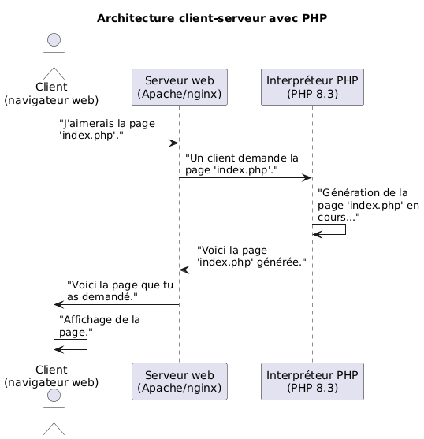

# Introduction à PHP

L. Delafontaine, avec l'aide de GitHub Copilot.

Ce travail est sous licence [CC BY-SA 4.0][license].

> [!TIP]
>
> Voici quelques informations relatives à ce contenu.
>
> **Ressources annexes**
>
> - Autres formats : [Présentation (web)]() · [Présentation (PDF)]()
>
> **Objectifs**
>
> À l'issue de ce contenu, les personnes devraient être capables de :
>
> - Expliquer le concept d'architecture client-serveur.
> - Lister les outils nécessaires pour écrire et exécuter du code PHP.
> - Expliquer comment PHP fonctionne dans un environnement web.
> - Expliquer la syntaxe de base de PHP.
> - Expliquer les variables en PHP.
> - Expliquer les constantes en PHP.
> - Expliquer la nature dynamique des variables et constantes en PHP.
> - Expliquer les opérateurs en PHP.
> - Expliquer les structures de contrôle conditionnelles en PHP.
> - Rédiger du code PHP simple.
>
> - **Méthodes d'enseignement et d'apprentissage**
>
> Les méthodes d'enseignement et d'apprentissage utilisées pour animer le
> contenu sont les suivantes :
>
> - Présentation.
> - Discussions collectives.
> - Travail en autonomie.
>
> **Méthodes d'évaluation**
>
> L'évaluation du contenu prend la forme d'un mini-projet et d'exercices à
> réaliser en autonomie en classe ou à la maison.
>
> L'évaluation se fait en utilisant les critères suivants :
>
> - Capacité à répondre avec justesse.
> - Capacité à argumenter.
>
> Les retours se font de la manière suivante :
>
> - Corrigé du mini-projet.
> - Corrigé des exercices.
>
> L'évaluation ne donne pas lieu à une note.

## Ressources

- Théorie : [Support de cours](./01-theorie/README.md) ·
  [Présentation (web)](https://heig-vd-progserv-course.github.io/heig-vd-progserv1-course/01-modalites-de-lunite-denseignement-et-introduction-a-php/01-theorie/index.html)
  ·
  [Présentation (PDF)](https://heig-vd-progserv-course.github.io/heig-vd-progserv1-course/01-modalites-de-lunite-denseignement-et-introduction-a-php/01-theorie/01-modalites-de-lunite-denseignement-et-introduction-a-php-presentation.pdf)
- Mini-projet : [Consignes](./01-mini-projet/README.md) ·
  [Solution](./01-mini-projet/solution/)
- Exercices : [Énoncés et solutions](./02-exercices/README.md)

## Objectifs

Ce premier contenu théorique a pour but de vous donner une introduction à PHP.
Vous apprendrez les bases de PHP, y compris la syntaxe, les variables, les
constantes, les opérateurs et les structures de contrôle afin de vous préparer à
la suite du cours.

De façon plus concise, les personnes qui étudient devraient être capables de :

- Expliquer le concept d'architecture client-serveur.
- Lister les outils nécessaires pour écrire et exécuter du code PHP.
- Expliquer comment PHP fonctionne dans un environnement web.
- Expliquer la syntaxe de base de PHP.
- Expliquer les variables en PHP.
- Expliquer les constantes en PHP.
- Expliquer la nature dynamique des variables et constantes en PHP.
- Expliquer les opérateurs en PHP.
- Expliquer les structures de contrôle conditionnelles en PHP.
- Rédiger du code PHP simple.

## Qu'est-ce que PHP

Jusqu'à présent, vous avez appris les bases de la programmation avec Java pour
réaliser des applications/programmes qui s'exécutent sur votre machine.

Avec PHP, vous allez apprendre à réaliser des applications web qui s'exécutent
sur un serveur et sont accessibles depuis un navigateur web.

PHP (Hypertext Preprocessor) est un langage de programmation conçu pour le
développement web qui a connu sa première version en 1994. De cette manière, PHP
permet de créer des applications qui peuvent être accessibles via un navigateur
web et par plusieurs personnes en même temps.

Actuellement à la version 8.5, le language a évolué pour devenir un des langages
les plus utilisés pour le développement web, notamment pour sa simplicité, sa
flexibilité et sa compatibilité avec de nombreux serveurs web.

## Applications web et architecture client-serveur

PHP repose sur le principe de l'architecture client-serveur, qui est le modèle
de base des applications web modernes.

Le client (votre navigateur) envoie des requêtes au serveur. Ces requêtes, selon
leur nature, peuvent être traitées par le serveur pour effectuer des actions
(lecture de fichiers, accès à une base de données, etc.) et renvoyer une réponse
au client.

La plupart des applications réseau modernes utilisent cette architecture pour
fournir des services à un grand nombre d'utilisateurs (sites web, applications
mobiles, jeux vidéos, etc.).

## Comment fonctionne PHP

De façon plus concise, pour écrire et exécuter du code PHP, vous avez besoin de
:

- Un serveur web (Apache, Nginx, etc.) pour recevoir les requêtes du client et
  envoyer les réponses.
- PHP installé sur le serveur web.
- Un navigateur web (Chrome, Firefox, etc.). pour effectuer les requêtes et
  afficher les pages web.
- Un éditeur de code.

Le serveur web reçoit les requêtes du client, les envoie à l'interpréteur PHP
(le moteur PHP qui est capable de lire et d'exécuter du code PHP),
l'interpréteur PHP exécute le code PHP qui va générer du HTML, l'interpréteur le
renvoie au serveur web qui enverra ensuite le résultat au navigateur du client.
Le client réceptionnera le HTML et pourra directement l'afficher.

PHP est exécuté sur le serveur, et le code PHP est interprété par le serveur web
pour générer du HTML, qui est ensuite envoyé au navigateur du client.



Le client (votre navigateur) envoie une requête pour demander une page web au
serveur. Ces pages web, tels que `index.php`, sont des fichiers PHP qui
contiennent du code PHP et du HTML.

Le serveur web reçoit la requête, exécute le code PHP dans le fichier
`index.php` pour générer du HTML, et renvoie ce HTML au navigateur du client,
qui l'affiche sur la page web.

## Comment écrire du code PHP

Le code PHP est écrit entre les balises `<?php` et `?>`. Tout fichier avec
l'extension `.php` est traité comme un fichier PHP et le code PHP qu'il contient
est exécuté par l'interpréteur PHP.

Voici un exemple de code PHP simple :

```php
// Ici, il n'y a pas de balise de fermeture PHP
<?php
echo "Hello, World!";
```

Vous remarquez qu'il n'y a pas de balise de fermeture `?>` à la fin du fichier
car le fichier ne contient que du code PHP.

<details>
<summary>Afficher l'équivalent en Java</summary>

```java
public class Main {
    public static void main(String[] args) {
        System.out.println("Hello, World!");
    }
}
```

</details>

Ici, la fonction `echo` est utilisée pour afficher du texte sur la page web.

De façon plus concise, le code PHP est exécuté sur le serveur web, qui génère du
HTML à partir du code PHP. Ce HTML est ensuite envoyé au navigateur du client,
qui l'affiche sur la page web.

PHP peut se mélanger avec du HTML pour générer des pages web dynamiques. Voici
un exemple :

```php
<!DOCTYPE html>
<html>

<head>
    <title>PHP Test</title>
</head>

<body>
    <h1><?php echo "Hello, World!"; ?></h1>
</body>

</html>
```

Dans cet exemple, le texte _"Hello, World!"_ est affiché dans un titre de niveau
1 (`<h1>`) sur la page web.

Lorsqu'il y a un mélange de PHP et de HTML, il faut spécifier le code PHP entre
les balises `<?php` et `?>` pour que l'interpréteur PHP puisse reconnaître la
fin du bloc de code PHP et n'exécuter que le code PHP.

## Comment exécuter du code PHP

Lorsque nous écrivons du code PHP, nous devons l'exécuter sur un serveur web
avec PHP installé. Pour ce faire, nous avons besoin d'un environnement de
développement qui comprend un serveur web (Apache, Nginx, etc.) et PHP.

Heureusement pour nous, il existe des solutions clés en main qui nous permettent
de démarrer rapidement avec PHP, comme par exemple WampServer pour
Windows[^wamp], MAMP pour macOS[^mamp], XAMPP pour Windows, macOS et
Linux[^xampp], etc.

Ces solutions regroupent les logiciels nécessaires pour exécuter du code PHP,
notamment un serveur web, PHP et une base de données et fonctionnent selon le
même principe d'architecture client-serveur vu précédemment.

## Syntaxe de base de PHP

PHP a une syntaxe similaire à celle de Java, JavaScript et d'autres langages de
programmation.

Comme n'importe quelle langue ou language de programmation, PHP a des règles
pour écrire du code.

Il s'agit de les apprendre et les comprendre pour lire et écrire du code PHP de
manière efficace.

Voici quelques bases pour commencer.

### Les commentaires

Les commentaires sont des parties du code qui ne sont pas exécutées par
l'interpréteur PHP. Ils sont utilisés pour expliquer le code et rendre le code
plus lisible.

Comme en Java, les commentaires en PHP peuvent être sur une seule ligne avec
`//` ou sur plusieurs lignes avec `/*` et `*/`.

Voici un exemple :

```php
<?php
// Ceci est un commentaire sur une seule ligne

/*
Ceci est un commentaire
sur plusieurs lignes
*/
```

### Les variables

Les variables en PHP sont déclarées avec le symbole `$`. Voici un exemple :

```php
<?php
// Déclaration d'une variable
$variable = "Hello, World!";

// Affichage de la variable
echo $variable;

// Modification de la variable
$variable = "Goodbye, World!";

// Affichage de la variable modifiée
echo $variable;
```

<details>
<summary>Afficher l'équivalent en Java</summary>

```java
public class Main {
    public static void main(String[] args) {
        // Déclaration d'une variable
        String variable = "Hello, World!";

        // Affichage de la variable
        System.out.print(variable);

        // Modification de la variable
        variable = "Goodbye, World!";

        // Affichage de la variable modifiée
        System.out.print(variable);
    }
}
```

</details>

#### Type de données et typage dynamique

PHP est un langage à typage dynamique, ce qui signifie que vous n'avez pas
besoin de déclarer le type de données d'une variable. PHP le détermine
automatiquement en fonction de la valeur affectée à la variable.

Les types de données courants incluent les chaînes de caractères, les nombres,
les booléens et les tableaux.

Cela signifie que vous pouvez affecter une chaîne de caractères à une variable
et ensuite lui affecter un nombre sans problème, comme suit :

```php
<?php
// Variable de type chaîne de caractères
$variable = "Hello, World!";

// Variable de type nombre
$variable = 42;

// Variable de type nombre flottant
$variable = 3.14;

// Variable de type booléen
$variable = true;
```

<details>
<summary>Afficher l'équivalent en Java</summary>

```java
public class Main {
    public static void main(String[] args) {
        // Variable de type chaîne de caractères
        String variable1 = "Hello, World!";

        // Variable de type nombre
        int variable2 = 42;

        // Variable de type nombre flottant
        double variable3 = 3.14;

        // Variable de type booléen
        boolean variable4 = true;
    }
}
```

</details>

Cela peut être pratique, mais cela peut aussi entraîner des erreurs si vous ne
faites pas attention à ce que vous affectez à une variable.

#### Les chaînes de caractères

Les chaînes de caractères sont des séquences de caractères qui peuvent former
des mots ou des phrases et sont déclarées entre des guillemets simples (`'`) ou
doubles (`"`). Voici un exemple :

```php
<?php
$string = "Hello, World!";

echo $string;
```

<details>
<summary>Afficher l'équivalent en Java</summary>

```java
public class Main {
    public static void main(String[] args) {
        String string = "Hello, World!";

        System.out.print(string);
    }
}
```

</details>

Il est possible de concaténer des chaînes de caractères en utilisant le point
(`.`) :

```php
<?php
$first = "Hello, ";
$second = "World!";

echo $first . $second;
```

<details>
<summary>Afficher l'équivalent en Java</summary>

```java
public class Main {
    public static void main(String[] args) {
        String first = "Hello, ";
        String second = "World!";

        System.out.print(first + second);
    }
}
```

</details>

Il est aussi possible de concaténer des variables avec les guillemets doubles
(`"`) :

```php
<?php
$greetings = "Hello";
$name = "World";

echo "$greetings, $name!";
```

Il est aussi possible d'utiliser des guillemets simples (`'`) pour déclarer des
chaînes de caractères :

```php
<?php
$string = 'Hello, World!';

echo $string;
```

La différence entre les guillemets simples (`'`) et les guillemets doubles (`"`)
est que les guillemets simples ne permettent pas d'interpréter les variables.

```php
<?php
$greetings = 'Hello';
$name = 'World';

// La ligne suivante affichera littéralement "$greetings, $name!"
echo '$greetings, $name!';

// Retour à la ligne HTML
echo "<br>";

// La ligne suivante affichera "Hello, World!"
echo "$greetings, $name!";
```

Il est possible d'échapper des caractères spéciaux avec le caractère
d'échappement (`\`) :

```php
<?php
$string = "Hello, \"World\"!";

echo "\$string contains $string";
```

#### Les nombres

Les nombres peuvent être des entiers ou des flottants (= nombre à virgule).
Voici un exemple :

```php
<?php
// Entier
$integer = 42;

// Flottant
$float = 3.14;

// Affichage des nombres
echo "\$integer contains $integer<br>";
echo "\$float contains $float";
```

<details>
<summary>Afficher l'équivalent en Java</summary>

```java
public class Main {
    public static void main(String[] args) {
        // Entier
        int myInteger = 42;

        // Flottant
        double myFloat = 3.14;

        // Affichage des nombres
        System.out.println("myInteger contains " + myInteger);
        System.out.print("myFloat contains " + myFloat);
    }
}
```

</details>

#### Les booléens

Les booléens représentent des valeurs vraies ou fausses. PHP utilise les
mots-clés `true` et `false` pour représenter ces valeurs respectivement.

Les booléens sont souvent utilisés pour des conditions dans les structures de
contrôle conditionnelles.

Voici un exemple :

```php
<?php
// Vrai
$doILikeDogs = true;

// Faux
$doILikeHomework = false;

// Affichage des booléens - `false` est affiché comme une chaîne vide
echo "\$doILikeDogs contains $doILikeDogs<br>";
echo "\$doILikeHomework contains $doILikeHomework";
```

<details>
<summary>Afficher l'équivalent en Java</summary>

```java
public class Main {
    public static void main(String[] args) {
        // Vrai
        boolean doILikeDogs = true;

        // Faux
        boolean doILikeHomework = false;

        // Affichage des booléens
        System.out.println("doILikeDogs contains " + doILikeDogs);
        System.out.print("doILikeHomework contains " + doILikeHomework);
    }
}
```

</details>

#### Les tableaux

Les tableaux sont des collections de valeurs. Ils sont déclarés entre des
crochets (`[]`) ou avec la fonction `array()`. Les valeurs d'un tableau sont
indexées à partir de 0.

Nous les étudierons plus en détails dans un prochain cours mais voici un exemple
:

```php
<?php
// Déclaration d'un tableau
$array = ["apple", "banana", "cherry"];

// Affichage de la première valeur du tableau
// Les tableaux sont indexés à partir de 0
echo "$array[0]<br>";

// Déclaration d'un tableau (alternative)
$array = array("apple", "banana", "cherry");

// Affichage de la troisième valeur du tableau
echo "$array[2]";
```

<details>
<summary>Afficher l'équivalent en Java</summary>

```java
public class Main {
    public static void main(String[] args) {
        // Déclaration d'un tableau
        String[] array = {"apple", "banana", "cherry"};

        // Affichage de la première valeur du tableau
        System.out.println(array[0]);

        // Affichage de la troisième valeur du tableau
        System.out.println(array[2]);
    }
}
```

</details>

### Les constantes

Les constantes sont des valeurs qui ne peuvent pas être modifiées après leur
définition. Le mot-clé `const` ou la fonction `define()` sont utilisés pour
définir des constantes. La convention veut que les noms des constantes soient en
majuscules.

Voici un exemple :

```php
<?php
// Définition d'une constante
const CONSTANT = "Hello, World!";

// Affichage de la constante
echo CONSTANT;

// Tentative de modification de la constante (erreur)
CONSTANT = "Goodbye, World!";

// Définition d'une constante (alternative)
define("CONSTANT", "Hello, World!");
```

<details>
<summary>Afficher l'équivalent en Java</summary>

```java
public class Main {
    public static void main(String[] args) {
        // Définition d'une constante
        final String CONSTANT = "Hello, World!";

        // Affichage de la constante
        System.out.println(CONSTANT);

        // Tentative de modification de la constante (erreur)
        CONSTANT = "Goodbye, World!";
    }
}
```

</details>

Si vous essayez d'exécuter cet exemple, une erreur sera générée. Elle
ressemblera à ceci :

```text
Parse error: syntax error, unexpected token "=" in 01-modalites-de-lunite-denseignement-et-introduction-a-php/01-theorie/exemples/15-constants.php on line 9
```

### Les opérateurs

Les opérateurs sont utilisés pour effectuer des opérations sur des variables et
des valeurs. Voici quelques exemples :

- Opérateurs arithmétiques : `+` (addition), `-` (soustraction), `*`
  (multiplication), `/` (division), `%` (modulo)
- Opérateurs de comparaison : `==` (égal), `!=` (différent), `>` (supérieur),
  `<` (inférieur)
- Opérateurs logiques : `&&` (et), `||` (ou), `!` (non/inversion)

Voici quelques exemples :

```php
<?php
$sum = 1 + 1; // `$sum` contiendra 2
$difference = $sum - 1; // `$difference` contiendra 1
$product = 2 * 2; // `$product` contiendra 4
$quotient = $product / 2; // `$quotient` contiendra 2

echo "Sum: $sum<br>";
echo "Difference: $difference<br>";
echo "Product: $product<br>";
echo "Quotient: $quotient<br>";
```

<details>
<summary>Afficher l'équivalent en Java</summary>

```java
public class Main {
    public static void main(String[] args) {
        int sum = 1 + 1; // `sum` contiendra 2

        int difference = 2 - 1; // `difference` contiendra 1

        int product = 2 * 2; // `product` contiendra 4

        int quotient = 4 / 2; // `quotient` contiendra 2

        System.out.println("Sum: " + sum);
        System.out.println("Difference: " + difference);
        System.out.println("Product: " + product);
        System.out.print("Quotient: " + quotient);
    }
}
```

</details>

L'opération modulo (`%`) retourne le reste de la division de deux nombres. Il
permet notamment de déterminer si un nombre est pair ou impair :

```php
<?php
// `$modulo` contiendra 1
// Il reste 1 après la division de 5 par 2, 5 n'est donc pas pair.
$modulo = 5 % 2;

echo "Modulo: $modulo<br>";

// `$modulo` contiendra 0
// Il ne reste rien après la division de 6 par 2, 6 est donc pair.
$modulo = 6 % 2;

echo "Modulo: $modulo";
```

<details>
<summary>Afficher l'équivalent en Java</summary>

```java
public class Main {
    public static void main(String[] args) {
        // `modulo` contiendra 1
        // Il reste 1 après la division de 5 par 2, 5 n'est donc pas pair.
        int modulo = 5 % 2;

        System.out.println("Modulo: " + modulo);

        // `modulo` contiendra 0
        // Il ne reste rien après la division de 6 par 2, 6 est donc pair.
        modulo = 6 % 2;

        System.out.print("Modulo: " + modulo);
    }
}
```

</details>

### Les structures de contrôle conditionnelles

Les structures de contrôle conditionnelles permettent d'exécuter du code en
fonction de certaines conditions, en utilisant les opérateurs de comparaison
énoncés précédemment et des conditions booléennes (vrai ou faux).

Ces structures opèrent sur des blocs de code qui sont exécutés selon les
conditions qui leur sont associées.

Voici un exemple d'une structure de contrôle conditionnelle `if` :

```php
<?php
// Déclaration de deux variables numériques
$a = 1;
$b = 2;

// Vérification si `$a` est inférieur à `$b`
if ($a < $b) {
    echo "a is less than b";
}
```

<details>
<summary>Afficher l'équivalent en Java</summary>

```java
public class Main {
    public static void main(String[] args) {
        // Déclaration de deux variables numériques
        int a = 1;
        int b = 2;

        // Vérification si `$a` est inférieur à `$b`
        if (a < b) {
            System.out.println("a is less than b");
        }
    }
}
```

</details>

Dans une première partie, nous déclarons deux variables numériques `$a` et `$b`.
Ensuite, nous utilisons une structure de contrôle conditionnelle `if` pour
vérifier si `$a` est inférieur à `$b`.

Si c'est le cas, nous affichons un message.

A l'inverse, si `$a` n'est pas inférieur à `$b`, le contenu du bloc `if` n'est
pas exécuté.

Pour gérer le cas où la condition n'est pas remplie, nous pouvons utiliser une
structure de contrôle conditionnelle `else` :

```php
<?php
// Déclaration de deux variables numériques
$a = 1;
$b = 2;

// Vérification si `$a` est inférieur à `$b`
if ($a < $b) {
    echo "a is less than b";
// Sinon
} else {
    echo "a is greater than b";
}
```

<details>
<summary>Afficher l'équivalent en Java</summary>

```java
public class Main {
    public static void main(String[] args) {
        // Déclaration de deux variables numériques
        int a = 1;
        int b = 2;

        // Vérification si `$a` est supérieur à `$b`
        if (a < b) {
            System.out.println("a is less than b");
        // Sinon
        } else {
            System.out.println("a is greater than b");
        }
    }
}
```

</details>

Dans cet exemple, si `$a` n'est pas supérieur à `$b`, le message _"a is less
than b"_ est affiché.

Finalement, il nous manque le cas où `$a` est égal à `$b`. Pour gérer ce cas,
nous pouvons utiliser une structure de contrôle conditionnelle `elseif` :

```php
<?php
// Déclaration de deux variables numériques
$a = 1;
$b = 2;

// Vérification si `$a` est inférieur à `$b`
if ($a < $b) {
    echo "a is less than b";
// Sinon si `$a` est égal à `$b`
} elseif ($a == $b) {
    echo "a is equal to b";
// Sinon
} else {
    echo "a is greater than b";
}
```

<details>
<summary>Afficher l'équivalent en Java</summary>

```java
public class Main {
    public static void main(String[] args) {
        // Déclaration de deux variables numériques
        int a = 1;
        int b = 2;

        // Vérification si `$a` est inférieur à `$b`
        if (a < b) {
            System.out.println("a is less than b");
        // Sinon si `$a` est égal à `$b`
        } else if (a == b) {
            System.out.println("a is equal to b");
        // Sinon
        } else {
            System.out.println("a is greater than b");
        }
    }
}
```

</details>

Dans cet exemple, si `$a` est égal à `$b`, le message _"a is equal to b"_ est
affiché.

Lorsque l'on a plusieurs conditions à vérifier au sein d'un même bloc, il est
possible d'utiliser les opérateurs logiques `&&` (et) et `||` (ou) pour les
combiner.

```php
<?php
// Déclaration de deux variables
$age = 18;
$country = "Switzerland";

// Vérification si `$age` est supérieur ou égal à 18
// et si `$country` est égal à "Switzerland"
if ($age >= 18 && $country == "Switzerland") {
    echo "You are allowed to vote in Switzerland.";
}
```

<details>
<summary>Afficher l'équivalent en Java</summary>

```java
public class Main {
    public static void main(String[] args) {
        // Déclaration de deux variables
        int age = 18;
        String country = "Switzerland";

        // Vérification si `$age` est supérieur ou égal à 18
        // et si `$country` est égal à "Switzerland"
        if (age >= 18 && country.equals("Switzerland")) {
            System.out.print("You are allowed to vote in Switzerland.");
        }
    }
}
```

</details>

Les structures de contrôle conditionnelles `switch` permettent de vérifier une
variable pour plusieurs valeurs possibles. Il s'agit en quelque sorte d'une
alternative à une série de `if` et `elseif`. Voici un exemple :

```php
<?php
// Déclaration d'une variable
$color = "red";

// Vérification de la variable `$color`
switch ($color) {
    // Si la variable `$color` est égale à "red"
    case "red":
        echo "The color is red.";
        break;
    // Si la variable `$color` est égale à "blue"
    case "blue":
        echo "The color is blue.";
        break;
    // Par défaut
    default:
        echo "The color is neither red nor blue.";
}
```

<details>
<summary>Afficher l'équivalent en Java</summary>

```java
public class Main {
    public static void main(String[] args) {
        // Déclaration d'une variable
        String color = "red";

        // Vérification de la variable `$color`
        switch (color) {
            // Si la variable `$color` est égale à "red"
            case "red":
                System.out.println("The color is red.");
                break;
            // Si la variable `$color` est égale à "blue"
            case "blue":
                System.out.println("The color is blue.");
                break;
            // Par défaut
            default:
                System.out.println("The color is neither red nor blue.");
        }
    }
}
```

</details>

Le branchement `switch` vérifie la valeur de la variable `$color` et exécute le
bloc de code correspondant à la valeur de la variable.

La valeur par défaut `default` est exécutée si aucune des valeurs ne correspond.

Le mot-clé `break` est utilisé pour arrêter l'exécution du bloc de code et
sortir du `switch`, sans quoi le code suivant serait exécuté.

## Conclusion

PHP est un langage de programmation puissant et polyvalent qui permet de créer
des applications web dynamiques.

Dans cette première session, nous avons vu les bases de PHP avec son
architecture client-serveur ainsi que sa syntaxe de base.

Nous avons également vu comment écrire et exécuter du code PHP, grâce au simple
fait de sauvegarder un fichier avec l'extension `.php` et de l'ouvrir dans un
navigateur web.

Dans les prochaines sessions, nous approfondirons ces concepts et verrons
comment les utiliser pour créer des applications web plus complexes.

## Mini-projet

Nous vous invitons maintenant à réaliser le mini-projet de cette session pour
mettre en pratique les concepts vus en classe.

Vous trouverez les détails du mini-projet ici :
[Consignes](../01-mini-projet/README.md).

## Exercices

Nous vous invitons également à réaliser les exercices de cette session pour
renforcer votre compréhension des concepts vus en classe.

Vous trouverez les détails des exercices ici :
[Énoncés et solutions](../02-exercices/README.md).

## À faire pour la prochaine séance

Chaque personne est libre de gérer son temps comme elle le souhaite. Cependant,
il est recommandé pour la prochaine séance de :

- Relire le support de cours si nécessaire.
- Finaliser la partie du mini-projet qui n'a pas été terminée en classe.
- Finaliser les exercices qui n'ont pas été terminés en classe.

<!-- URLs -->

[license]:
	https://github.com/heig-vd-mvp-course/heig-vd-mvp-course/blob/main/LICENSE.md

<!-- Footnotes -->

[^mamp]: MAMP, [mamp.info](https://www.mamp.info/), 09 mars 2025
[^wamp]: WampServer, [wampserver.com](https://www.wampserver.com/), 09 mars 2025
[^xampp]:
    XAMPP, [apachefriends.org](https://www.apachefriends.org/), 09 mars 2025
