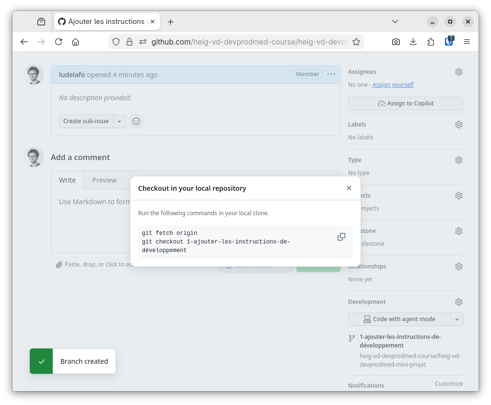
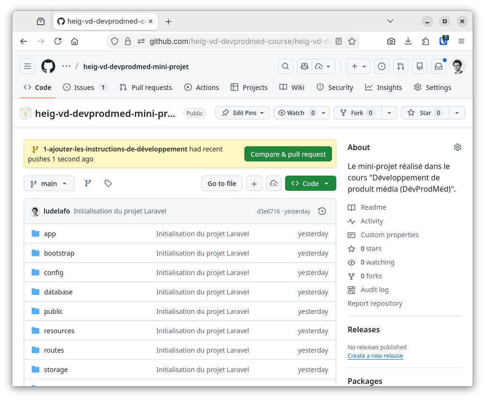
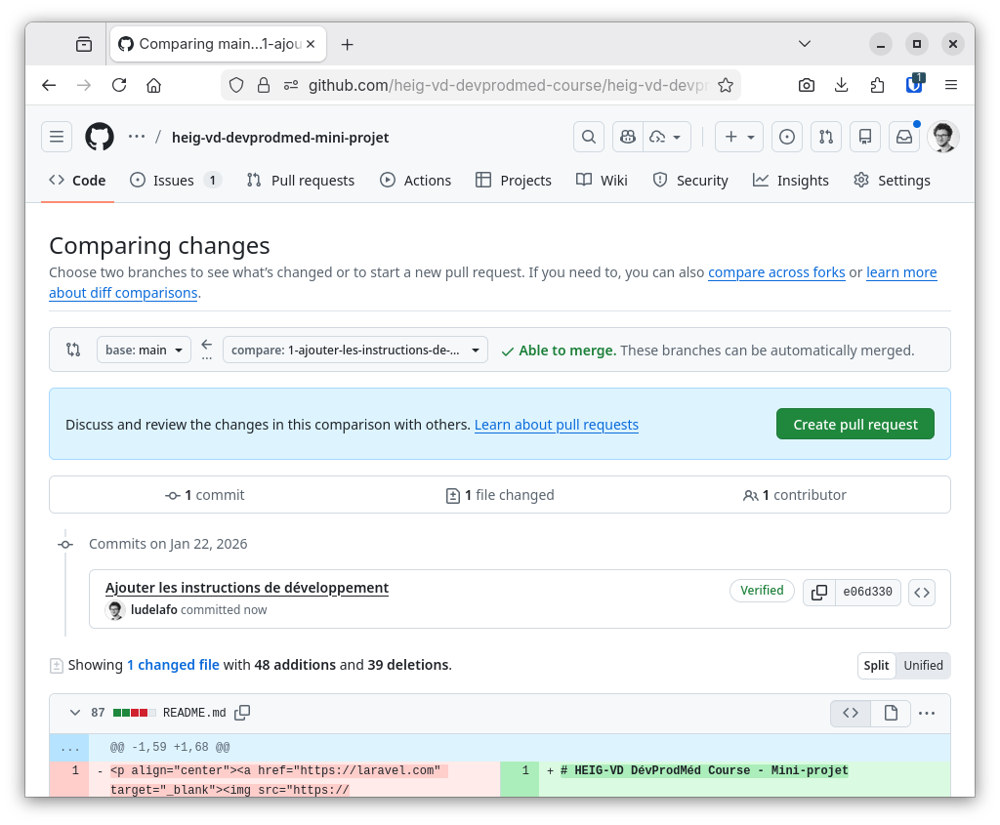
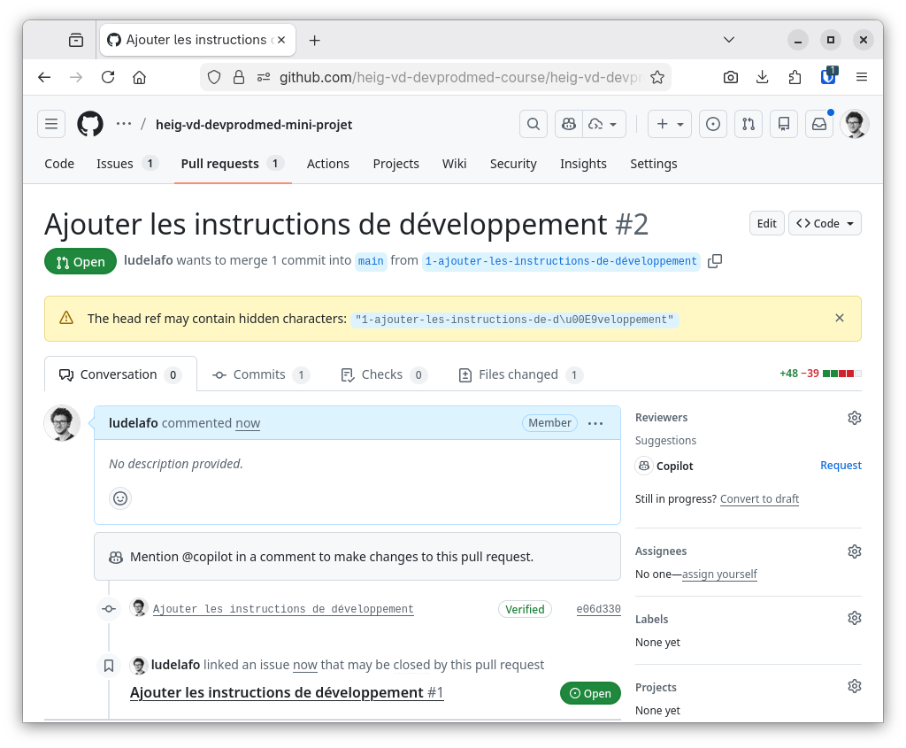
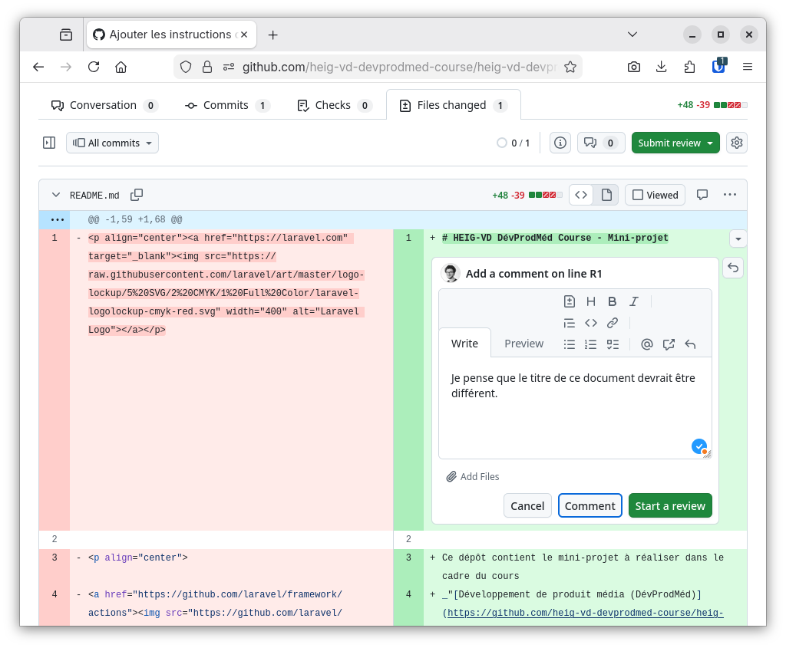
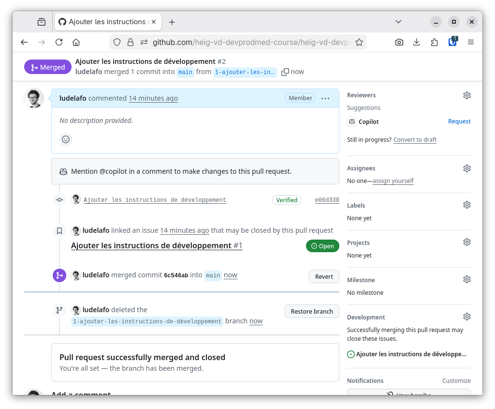

# Formulaires HTML et validation - Mini-projet

L. Delafontaine, avec l'aide de
[GitHub Copilot](https://github.com/features/copilot).

Ce travail est sous licence [CC BY-SA 4.0][licence].

> [!TIP]
>
> Toutes les informations relatives à ce contenu sont décrites dans le
> [contenu principal](../README.md).

## Table des matières

- [Table des matières](#table-des-matières)
- [Objectifs](#objectifs)
- [Utiliser un workflow de développement avec Git et GitHub](#utiliser-un-workflow-de-développement-avec-git-et-github)
- [Créer la page de création d'un nouvel animal de compagnie](#créer-la-page-de-création-dun-nouvel-animal-de-compagnie)
  - [Créer une issue GitHub](#créer-une-issue-github)
  - [Créer une branche dédiée à cette issue](#créer-une-branche-dédiée-à-cette-issue)
  - [Récupérer la branche localement et basculer dessus](#récupérer-la-branche-localement-et-basculer-dessus)
  - [Effectuer les modifications nécessaires](#effectuer-les-modifications-nécessaires)
  - [Commit et push des modifications](#commit-et-push-des-modifications)
  - [Créer une pull request](#créer-une-pull-request)
  - [Valider la pull request](#valider-la-pull-request)
  - [Recommencer la boucle de développement](#recommencer-la-boucle-de-développement)
- [Mettre à jour la barre de navigation](#mettre-à-jour-la-barre-de-navigation)
  - [Créer l'issue GitHub et basculer sur une branche dédiée localement](#créer-lissue-github-et-basculer-sur-une-branche-dédiée-localement)
  - [Effectuer les modifications nécessaires](#effectuer-les-modifications-nécessaires-1)
  - [Commit, push et créer une pull request](#commit-push-et-créer-une-pull-request)
  - [Valider la pull request, fusionner les modifications et supprimer la branche associée](#valider-la-pull-request-fusionner-les-modifications-et-supprimer-la-branche-associée)
  - [Récupérer les modifications fusionnées localement](#récupérer-les-modifications-fusionnées-localement-1)
- [Mettre en place le formulaire de base](#mettre-en-place-le-formulaire-de-base)
  - [Créer l'issue GitHub et basculer sur une branche dédiée localement](#créer-lissue-github-et-basculer-sur-une-branche-dédiée-localement-1)
  - [Créer la base du formulaire](#créer-la-base-du-formulaire)
  - [Ajouter le champ nom](#ajouter-le-champ-nom)
  - [Réceptionner les données côté serveur](#réceptionner-les-données-côté-serveur)
  - [Utiliser les données du formulaire](#utiliser-les-données-du-formulaire)
  - [Valider les données du formulaire côté serveur](#valider-les-données-du-formulaire-côté-serveur)
  - [Retourner une erreur de validation si le champ nom est vide](#retourner-une-erreur-de-validation-si-le-champ-nom-est-vide)
  - [Retourner une erreur de validation si le champ nom est trop court ou trop long](#retourner-une-erreur-de-validation-si-le-champ-nom-est-trop-court-ou-trop-long)
  - [Conserver les données saisies en cas d'erreur de validation](#conserver-les-données-saisies-en-cas-derreur-de-validation)
  - [Valider les données du formulaire côté client](#valider-les-données-du-formulaire-côté-client)
  - [Contourner la validation côté client](#contourner-la-validation-côté-client)
  - [Déplacer la validation côté serveur dans une fonction dédiée](#déplacer-la-validation-côté-serveur-dans-une-fonction-dédiée)
  - [Valider la pull request, fusionner les modifications et supprimer la branche associée](#valider-la-pull-request-fusionner-les-modifications-et-supprimer-la-branche-associée-1)
  - [Récupérer les modifications fusionnées localement](#récupérer-les-modifications-fusionnées-localement-2)
- [Mettre en place les autres champs du formulaire](#mettre-en-place-les-autres-champs-du-formulaire)
  - [Ajouter le champ espèce](#ajouter-le-champ-espèce)
  - [Ajouter le champ surnom](#ajouter-le-champ-surnom)
  - [Ajouter le champ sexe](#ajouter-le-champ-sexe)
  - [Ajouter le champ date de naissance](#ajouter-le-champ-date-de-naissance)
  - [Ajouter le champ couleur](#ajouter-le-champ-couleur)
  - [Ajouter le champ personnalité](#ajouter-le-champ-personnalité)
  - [Ajouter le champ taille](#ajouter-le-champ-taille)
  - [Ajouter le champ poids](#ajouter-le-champ-poids)
  - [Ajouter le champ notes](#ajouter-le-champ-notes)
- [Conclusion](#conclusion)
- [Solution](#solution)
- [Aller plus loin](#aller-plus-loin)

## Objectifs

Dans cette séance, vous allez créer le formulaire permettant de créer un nouvel
animal de compagnie.

Pour rappel, le formulaire sera composé de plusieurs champs :

- Nom (un champ texte).
- Espèce (un champ de sélection contenant, par exemple : chien, chat, lézard,
  serpent, oiseau, lapin, autre).
- Surnom (un champ texte facultatif).
- Sexe (un champ boutons radio).
- Année de naissance (un champ date au format `YYYY-MM-DD` (par exemple :
  `2020-12-31` pour le 31 décembre 2020)).
- Couleur (un champ de saisie de couleur facultatif).
- Personnalité (un champ cases à cocher facultatif).
- Taille en cm (un champ numérique facultatif).
- Poids en kg (un champ numérique facultatif).
- Notes (un champ de texte multi-lines libre facultatif).

Il s'agira de vos premiers pas dans des concepts propres à la programmation web,
tels que les formulaires HTML et la validation des données côté serveur et côté
client avec des concepts propres à ce milieu.

Ne vous inquiétez pas si vous ne comprenez pas tout du premier coup, c'est
normal. L'important est de suivre les étapes et de comprendre les concepts au
fur et à mesure.

Afin de vous aider à séquencer votre travail, nous allons diviser ce projet en
plusieurs étapes à l'aide d'un workflow (flux de travail) de développement avec
Git et GitHub. Vous pouvez suivre ce workflow pour vous guider dans la
réalisation de ce projet.

À l'issue de cette séance, les personnes qui étudient devraient avoir pu :

- Créer un formulaire HTML permettant de créer un nouvel animal de compagnie.
- Valider les données du formulaire côté serveur.
- Afficher les erreurs de validation.
- Conserver les données saisies en cas d'erreur de validation.
- Valider les données du formulaire côté client.

## Utiliser un workflow de développement avec Git et GitHub

Afin de vous aider à séquencer votre travail, nous allons utiliser un workflow
de développement avec Git et GitHub.

Ce workflow vous permettra de suivre les étapes de développement de manière
structurée et de vous assurer que vous avez bien compris chaque étape avant de
passer à la suivante.

Il existe de multiples manières de travailler avec Git et GitHub, et il n'y a
pas de méthode unique qui soit meilleure que les autres. L'important est de
trouver une méthode qui vous convient et qui vous permet de travailler
efficacement.

Dans le contexte de ce cours, je (Ludovic) vous propose d'utiliser un workflow
de développement basé sur des branches Git à l'aide d'issues et de pull requests
sur GitHub. Ce workflow est largement utilisé dans l'industrie et vous permettra
de vous familiariser avec des pratiques courantes de développement collaboratif,
qui seront très utiles pour vos projets futurs, que ce soit en équipe ou en
solo.

Le workflow proposé est le suivant :

1. Création d'une issue GitHub pour chaque étape du projet.
2. Création d'une branche Git depuis la branche principale (`main`) pour chaque
   issue, directement depuis l'interface de GitHub.
3. Basculement sur la branche créée pour l'issue localement dans votre
   environnement de développement.
4. Réalisation des modifications nécessaires pour résoudre l'issue sur la
   branche locale.
5. Commit des modifications sur la branche locale.
6. Push des modifications sur la branche distante sur GitHub.
7. Création d'une pull request pour fusionner la branche de l'issue dans la
   branche principale (`main`) depuis l'interface de GitHub.
8. Revue de code de la pull request, éventuellement avec des commentaires et des
   demandes de modifications.
9. Fusion de la pull request dans la branche principale (`main`) une fois
   qu'elle est approuvée.
10. Suppression de la branche de l'issue une fois qu'elle est fusionnée.
11. Répétition de ce processus pour chaque issue du projet.

Nous allons appliquer ce workflow pour les prochaines étapes du projet.

## Créer la page de création d'un nouvel animal de compagnie

Dans cette section, nous allons créer la base de la page de création d'un nouvel
animal de compagnie.

Cette page contiendra un formulaire permettant de saisir les informations d'un
nouvel animal de compagnie, ainsi que la logique de validation des données
saisies.

### Créer une issue GitHub

Afin de nous aider à séquencer notre travail, nous allons créer une issue GitHub
pour cette étape du projet.

Une issue GitHub est un ticket de travail qui décrit une tâche à réaliser, un
bug à corriger ou une fonctionnalité à ajouter.

Bien que le nom "issue" puisse laisser penser qu'il s'agit uniquement de
problèmes ou de bugs, les issues sont en réalité utilisées pour organiser et
suivre tout type de travail sur un projet, y compris les nouvelles
fonctionnalités, les améliorations, les tâches de maintenance, etc.

Une issue permet de décrire clairement ce qui doit être fait, de discuter de la
solution à apporter, de suivre l'avancement du travail et de garder une trace de
ce qui a été réalisé. Elle permet de mettre au clair les objectifs de la tâche,
les étapes à suivre, les critères de réussite avant même de commencer à
travailler dessus.

> [!TIP]
>
> Vous pouvez considérer les issues comme un espace de planification et de suivi
> du travail, où vous pouvez vous vider le cerveau de toutes les
> tâches/idées/besoins à implémenter dans votre projet.

Pour créer une issue GitHub, rendez-vous sur la page de votre dépôt GitHub,
cliquez sur l'onglet **Issues**, puis cliquez sur le bouton **New issue**.

Donnez un titre à votre issue (par exemple : _"Créer la page de création d'un
nouvel animal de compagnie"_) et décrivez brièvement ce qui doit être fait dans
le champ de description.

> [!TIP]
>
> Il n'existe pas de convention claire pour la rédaction des titres et des
> descriptions d'issues.
>
> Un moyen simple de rédiger une issue est de commencer l'issue par un verbe
> d'action (Par exemple : "Créer", "Ajouter", "Corriger", "Améliorer", etc.)
> suivi d'une description concise de la tâche à réaliser.
>
> Cette convention permet de rendre les titres d'issues plus clairs et plus
> faciles à comprendre, en indiquant clairement l'action à réaliser et
> l'objectif de la tâche. De plus, cela facilite la lecture et la compréhension
> des issues, en particulier lorsqu'il y en a beaucoup dans un projet.

Une fois la description de l'issue rédigée, cliquez sur le bouton **Create**
pour créer l'issue.

Une nouvelle page devrait s'afficher avec les détails de l'issue que vous venez
de créer.

### Créer une branche dédiée à cette issue

Dans la page de l'issue que vous venez de créer, l'interface propose un panneau
latéral droit avec des actions/fonctionnalités liées à l'issue en cours. Dans la
section **Development** de ce panneau, cliquez sur le lien **Create a branch**.

<details>
<summary>Afficher la capture d'écran illustrant l'étape</summary>


</details>

Une nouvelle section s'affiche avec un champ de saisie pour le nom de la
branche. Par défaut, GitHub propose un nom de branche basé sur le titre de
l'issue (par exemple :
`1-créer-la-page-de-création-dun-nouvel-animal-de-compagnie`), mais vous pouvez
le modifier si vous le souhaitez.

<details>
<summary>Afficher la capture d'écran illustrant l'étape</summary>


</details>

Si besoin, vous pouvez sélectionner la branche à partir de laquelle vous
souhaitez créer votre branche (par défaut, c'est la branche principale `main`).

Sélectionnez l'option **Checkout locally** pour récupérer la branche localement
après sa création et cliquez sur le bouton **Create branch** pour créer la
branche Git dédiée à cette issue.

Une nouvelle modal s'ouvre pour vous proposer les commandes Git à exécuter pour
basculer sur la nouvelle branche. Copiez les commandes proposées pour les
utiliser dans le terminal intégré de Visual Studio Code.

<details>
<summary>Cliquer ici pour voir une capture d'écran illustrant l'étape</summary>



</details>

### Récupérer la branche localement et basculer dessus

Retournez dans le terminal intégré de Visual Studio Code dans votre
environnement de développement.

Exécutez les commandes copiées précédemment pour basculer sur la nouvelle
branche :

> [!NOTE]
>
> Utilisez les commandes proposées par GitHub, qui sont adaptées à votre
> situation. Les commandes suivantes sont données à titre d'exemple et peuvent
> être différentes dans votre cas.

```bash
git fetch origin
git checkout 1-créer-la-page-de-création-dun-nouvel-animal-de-compagnie
```

La première commande récupère les dernières modifications du dépôt distant. La
seconde commande crée une nouvelle branche locale nommée
`1-créer-la-page-de-création-dun-nouvel-animal-de-compagnie` et bascule dessus.
La branche locale est liée à la branche distante du même nom.

Vérifiez que vous êtes bien sur la nouvelle branche en exécutant la commande
suivante :

```bash
git branch
```

Le résultat devrait ressembler à ceci :

```text
* 1-créer-la-page-de-création-dun-nouvel-animal-de-compagnie
    main
```

L'étoile (`*`) indique la branche courante. Vous êtes maintenant prêt.e à
travailler sur cette branche.

### Effectuer les modifications nécessaires

Maintenant que vous êtes sur la branche dédiée à cette issue, vous pouvez
effectuer les modifications nécessaires pour créer la page de création d'un
nouvel animal de compagnie.

Pour cela, nous allons reprendre la structure de base d'une page HTML que nous
avons vue dans les séances précédentes, et nous allons l'adapter pour créer la
page de création d'un nouvel animal de compagnie.

Cette page sera nommée `create.php` et sera placée dans le dossier `public` de
votre mini-projet.

La structure de votre mini-projet devrait ressembler à ceci :

```text
mini-projet/
├── public/
│   ├── css/
│   │   └── styles.css
│   ├── images/
│   │   └── logo.svg
│   ├── create.php
│   └── index.php
└── src/
```

Vous pouvez utiliser le code de base suivant pour votre page `create.php` :

```php
<!DOCTYPE html>
<html lang="fr">

<head>
    <meta charset="utf-8">
    <meta name="viewport" content="width=device-width, initial-scale=1">
    <meta name="color-scheme" content="light dark">
    <link rel="stylesheet" href="https://cdn.jsdelivr.net/npm/@picocss/pico@2/css/pico.min.css">
    <link rel="stylesheet" href="./css/styles.css">

    <title>Page de création | ninetendogs</title>
    <meta name="description" content="ninetendogs - Gestionnaire d'animaux de compagnie - Création d'un animal de compagnie">
</head>

<body class="container">
    <header>
        <nav>
            <ul>
                <li><strong>ninetendogs</strong></li>
            </ul>
            <ul>
                <li><a href="./index.php">Accueil</a></li>
                <li><a href="./create.php">Nouvel animal</a></li>
            </ul>
        </nav>

        <nav aria-label="breadcrumb">
            <ul>
                <li><a href="./index.php">Accueil</a></li>
                <li>Nouvel animal</li>
            </ul>
        </nav>
    </header>
    <main>
        <h1>Créer un nouvel animal de compagnie</h1>

        <!-- Le formulaire de création d'un nouvel animal de compagnie sera ajouté ici dans les prochaines étapes -->
    </main>
    <footer>
        <center>
            <small>
                Un projet réalisé dans le cadre du cours <a href="https://github.com/heig-vd-progserv-course/heig-vd-progserv1-course">ProgServ1</a> enseigné à la <a href="https://heig-vd.ch">HEIG-VD</a>.
            </small>
        </center>
    </footer>
</body>

</html>
```

Prenez quelques minutes pour comprendre la structure de base de cette page.

Vous remarquerez que nous avons ajouté un lien vers la page `create.php` dans le
menu de navigation et que nous avons également ajouté une section de navigation
secondaire (breadcrumb) pour indiquer à la personne qui utilise le site où elle
se trouve.

### Commit et push des modifications

Une fois que vous avez effectué les modifications nécessaires pour créer la page
de création d'un nouvel animal de compagnie, vous pouvez les enregistrer et les
commiter sur votre branche locale.

Une fois les modifications commitées localement, vous pouvez les pousser sur la
branche distante sur GitHub pour les rendre disponibles en ligne.

Dans le terminal intégré de Visual Studio Code, exécutez les commandes suivantes
pour ajouter le fichier modifié au suivi de Git, créer un commit, et pousser les
modifications vers le dépôt distant :

```bash
git add mini-projet/public/create.php

git commit -m "Créer la page de création d'un nouvel animal de compagnie"

git push
```

Vous pouvez toujours vérifier le détail de votre dépôt Git avec la commande
suivante :

```bash
git status
```

### Créer une pull request

Une fois que vous avez poussé vos modifications sur la branche distante, vous
pouvez créer une pull request pour fusionner votre branche dans la branche
principale (`main`).

Dans la terminologie GitHub, une pull request (PR) est une demande de fusion de
modifications d'une branche vers une autre branche. Dans notre cas, nous allons
créer une PR pour fusionner la branche
`1-créer-la-page-de-création-dun-nouvel-animal-de-compagnie` dans la branche
`main`.

GitHub propose une interface conviviale pour visualiser et gérer les pull
requests.

Lorsque vous avez poussé vos modifications, GitHub affiche généralement une
notification proposant de créer une pull request illustrée par la capture
d'écran suivante.

<details>
<summary>Cliquer ici pour voir une capture d'écran illustrant l'étape</summary>



</details>

Vous pouvez également créer une pull request manuellement en suivant ces étapes
:

1. Accédez à votre dépôt GitHub privé pour le mini-projet.
2. Cliquez sur l'onglet **Pull requests**.
3. Cliquez sur le bouton **New pull request**.
4. Sélectionnez la branche source (_compare_)
   `1-créer-la-page-de-création-dun-nouvel-animal-de-compagnie` et la branche de
   destination `main` (_base_).

   <details>
   <summary>Cliquer ici pour voir une capture d'écran illustrant l'étape</summary>

   

   </details>

5. Cliquez sur le bouton **"Create pull request"**.
6. Donnez un titre à la pull request. Par défaut, elle prend le message du
   dernier commit, qui peut ne pas représenter la totalité des modifications
   apportées. Je (Ludovic) recommande d'utiliser le titre de l'issue associée
   créée précédemment : _"Créer la page de création d'un nouvel animal de
   compagnie"_.
7. Ajoutez une description si nécessaire. Ici, comme le titre de la pull request
   est explicite, ce n'est pas obligatoire.
8. Cliquez sur le bouton **Create pull request** pour créer la pull request.

La pull request est maintenant créée et visible dans l'onglet **Pull requests**
du dépôt GitHub.

<details>
<summary>Cliquer ici pour voir une capture d'écran illustrant l'étape</summary>



</details>

> [!NOTE]
>
> Vous pouvez ignorer le message d'avertissement concernant les caractères
> cachés (_The head ref may contain hidden characters:
> `"1-cr\u00E9er-la-page-de-cr\u00E9ation-dun-nouvel-animal-de-compagnie"`_) si
> vous le voyez. Cela est dû aux caractères accentués dans le nom de la branche
> et n'affecte pas le fonctionnement de la pull request.

### Valider la pull request

La très grande force des pull requests réside dans le fait qu'elles permettent
de revoir les modifications avant de les fusionner dans la branche principale du
projet.

Pour cela, rendez-vous dans l'onglet **"Files changed"** de la pull request.

<details>
<summary>Cliquer ici pour voir une capture d'écran illustrant l'étape</summary>



</details>

Vous pouvez y voir toutes les modifications apportées dans la branche source par
rapport à la branche de destination, y ajouter des commentaires, et même laisser
des suggestions de modifications si nécessaire.

Cela vous permettra de valider que les modifications sont correctes avant de les
fusionner.

Si des erreurs se sont glissées dans les modifications, vous pouvez toujours
retourner dans votre environnement de développement, corriger les erreurs, et
pousser les modifications vers la branche source. La pull request sera
automatiquement mise à jour avec les nouvelles modifications.

Itérez sur ce processus jusqu'à ce que vous soyez satisfait.e des modifications.

#### Faire valider la pull request

Une fois que vous êtes satisfait.e des modifications, il est temps de faire
valider la pull request envers quelqu'un d'autre.

Dans un projet professionnel, il est courant de demander à un.e collègue de
revoir et valider les modifications avant de les fusionner dans la branche
principale.

Cela permet de s'assurer que le code est de qualité et respecte les standards du
projet. De plus, cela permet de partager la connaissance du code entre les
membres de l'équipe.

Pour faire valider la pull request, vous pouvez retourner dans l'onglet
**Conversation** et ajouter un.e relecteur.trice en cliquant sur le bouton
**Reviewers** dans le menu à droite de la pull request.

Comme votre projet fait partie de l'organisation GitHub Classroom du cours, vous
pouvez m'ajouter (Ludovic - `ludelafo`) comme relecteur.

La personne mise en relecteur.trice pourra ainsi revoir les modifications,
laisser des commentaires si nécessaire, et approuver la pull request si tout est
correct.

Comme il s'agit de votre propre dépôt, vous pouvez également fusionner la pull
request vous-même une fois que vous êtes satisfait.e des modifications.

#### Fusionner la pull request et supprimer la branche associée

Une fois la pull request validée par vos soins (et optionnellement par Ludovic
dans le contexte de ce cours), il est temps de fusionner les modifications dans
la branche principale `main`.

Pour cela, cliquez sur le bouton vert **Merge pull request** dans l'onglet
**Conversation** de la pull request.

La fusion des modifications est maintenant effectuée et les modifications sont
intégrées dans la branche `main`.

Vous pouvez maintenant supprimer la branche source de la pull request en
cliquant sur le bouton **Delete branch**, car elle n'est plus nécessaire.

Félicitations ! Vous avez réussi à fusionner un changement dans la branche
principale du projet en utilisant une pull request.

<details>
<summary>Cliquer ici pour voir une capture d'écran illustrant l'étape</summary>



</details>

#### Valider que l'issue a bien été fermée

Une fois la pull request fusionnée, l'issue associée est automatiquement fermée
par GitHub.

Vous pouvez vérifier cela en retournant dans l'onglet **"Issues"** du dépôt
GitHub.

Vous devriez voir que l'issue _"Ajouter les instructions de développement"_ est
marquée comme fermée. Si ce n'est pas le cas, vous pouvez fermer manuellement
l'issue en cliquant sur le bouton **Close issue** dans la page de l'issue.

#### Récupérer les modifications fusionnées localement

Après avoir fusionné la pull request sur GitHub, il est important de récupérer
les modifications fusionnées dans votre dépôt Git local.

Pour cela, retournez dans le terminal intégré de Visual Studio Code et exécutez
la commande suivante pour basculer sur la branche `main` :

```bash
git checkout main
```

Ensuite, exécutez la commande suivante pour récupérer les dernières
modifications de la branche `main` depuis le dépôt distant :

```bash
git pull
```

Cette commande met à jour votre branche `main` locale avec les modifications
fusionnées depuis GitHub.

Normalement, il ne devrait pas y avoir de conflits, car vous êtes seul.e à
travailler sur ce projet. Cependant, dans un contexte professionnel avec
plusieurs développeur.se.s, des conflits peuvent survenir si plusieurs personnes
modifient le même fichier en même temps.

Résolvez les conflits si nécessaire, puis vous serez prêt.e à continuer le
développement.

### Recommencer la boucle de développement

Pour chacune des prochaines tâches de développement, il est recommandé de suivre
le même workflow Git et GitHub en créant une issue, une branche, une pull
request, et en faisant valider les modifications avant de les fusionner.

Cela permet de garder un historique clair des modifications apportées au projet
et de s'assurer que le code est de qualité.

Il existe de nombreuses manières de gérer un workflow Git et GitHub. Celui-ci
est simple et efficace pour un projet de cette taille et vous prépare à des
environnements de développement professionnels.

## Mettre à jour la barre de navigation

Dans cette section, nous allons ajouter un lien dans la barre de navigation pour
permettre d'accéder à la page de création d'un nouvel animal de compagnie depuis
n'importe quelle page du site.

### Créer l'issue GitHub et basculer sur une branche dédiée localement

En suivant le workflow Git et GitHub décrit précédemment, créez une issue pour
cette tâche, créez une branche dédiée à cette issue, et basculez dessus
localement dans votre environnement de développement.

Vous pouvez nommer l'issue _"Ajouter le lien pour accéder à la page de
création"_.

### Effectuer les modifications nécessaires

Dans la page `mini-projet/public/index.php`, ajoutez un lien vers la page
`create.php` dans la barre de navigation :

> [!TIP]
>
> Cet affichage est ce qu'on appelle un "diff" (différence) entre la version
> précédente du fichier et la nouvelle version du fichier après les
> modifications.
>
> Le diff met en évidence les lignes qui ont été ajoutées, modifiées ou
> supprimées dans le fichier.
>
> Les premières lignes sont un entête indiquant les fichiers concernés par le
> diff, ainsi que les numéros de version des fichiers avant et après les
> modifications. Vous pouvez les ignorer pour le moment.
>
> Ensuite vient le corps du diff. Les lignes précédées d'un signe `+` sont les
> lignes ajoutées, les lignes précédées d'un signe `-` sont les lignes
> supprimées, et les lignes sans signe sont les lignes qui n'ont pas été
> modifiées. Cela permet de visualiser rapidement les changements apportés au
> fichier.
>
> Il s'agit d'une des multiples fonctionnalités de Git pour suivre les
> modifications dans les fichiers à l'aide de la commande `git diff`.
>
> La documentation officielle de Git sur la commande `git diff` est disponible à
> l'adresse suivante : <https://git-scm.com/docs/git-diff>.

```diff
diff --git a/mini-projet/public/index.php b/mini-projet/public/index.php
index ab5024d..fd35d81 100644
--- a/mini-projet/public/index.php
+++ b/mini-projet/public/index.php
@@ -1,85 +1,86 @@
 <?php
 require_once __DIR__ . '/../src/functions.php';

 $pets = getPets();
 ?>

 <!DOCTYPE html>
 <html lang="fr">

 <head>
     <meta charset="utf-8">
     <meta name="viewport" content="width=device-width, initial-scale=1">
     <meta name="color-scheme" content="light dark">
     <link rel="stylesheet" href="https://cdn.jsdelivr.net/npm/@picocss/pico@2/css/pico.min.css">
     <link rel="stylesheet" href="./css/styles.css">

     <title>Page d'accueil | ninetendogs</title>
     <meta name="description" content="ninetendogs - Gestionnaire d'animaux de compagnie">
 </head>

 <body class="container">
     <header>
         <nav>
             <ul>
                 <li><strong>ninetendogs</strong></li>
             </ul>
             <ul>
                 <li><a href="./index.php">Accueil</a></li>
+                <li><a href="./create.php">Nouvel animal</a></li>
             </ul>
         </nav>
     </header>
     <main>
         <center>
             <div class="logo">
                 
             </div>

             <h1>ninetendogs</h1>
         </center>

         <p>Bienvenue sur ninetendogs, le gestionnaire d'animaux de compagnie !</p>

         <p>Cette application te permet de gérer facilement tes animaux de compagnie.</p>

         <h2>Liste des animaux de compagnie</h2>

         <div class="overflow-auto">
             <table class="striped">
                 <thead>
                     <tr>
                         <th>Nom</th>
                         <th>Espèce</th>
                         <th>Sexe</th>
                         <th>Date de naissance</th>
                         <th>Actions</th>
                     </tr>
                 </thead>
                 <tbody>
                     <?php foreach ($pets as $pet) { ?>
                         <tr>
                             <td><?= $pet['name'] ?></td>
                             <td><?= $pet['species'] ?></td>
                             <td><?= $pet['gender'] ?></td>
                             <td><?= $pet['birthday'] ?></td>
                             <td>
                                 <a href="./view.php?id=<?= $pet['id'] ?>">
                                     <button>Voir</button>
                                 </a>
                             </td>
                         </tr>
                     <?php } ?>
                 </tbody>
             </table>
         </div>
     </main>
     <footer>
         <center>
             <small>
                 Un projet réalisé dans le cadre du cours <a href="https://github.com/heig-vd-progserv-course/heig-vd-progserv1-course">ProgServ1</a> enseigné à la <a href="https://heig-vd.ch">HEIG-VD</a>.
             </small>
         </center>
     </footer>
 </body>

 </html>
```

Ici, nous avons ajouté un nouvel élément de liste (`<li>`) dans la barre de
navigation avec un lien (`<a>`) vers la page `create.php`. Le texte du lien est
"Nouvel animal".

Faisons de même dans la page `mini-projet/public/view.php` pour ajouter un lien
vers la page d'accueil dans la barre de navigation :

```diff
diff --git a/mini-projet/public/view.php b/mini-projet/public/view.php
index 28fffd8..d4fcb03 100644
--- a/mini-projet/public/view.php
+++ b/mini-projet/public/view.php
@@ -1,69 +1,70 @@
 <?php
 require_once __DIR__ . '/../src/functions.php';

 $petId = $_GET['id'] ?? null;

 if ($petId === null) {
     header('Location: ./index.php');
     exit;
 }

 $pet = getPetById($petId);

 if ($pet === null) {
     header('Location: ./index.php');
     exit;
 }
 ?>

 <!DOCTYPE html>
 <html lang="fr">

 <head>
     <meta charset="utf-8">
     <meta name="viewport" content="width=device-width, initial-scale=1">
     <meta name="color-scheme" content="light dark">
     <link rel="stylesheet" href="https://cdn.jsdelivr.net/npm/@picocss/pico@2/css/pico.min.css">
     <link rel="stylesheet" href="./css/styles.css">

     <title>Page de visualisation | ninetendogs</title>
     <meta name="description" content="ninetendogs - Gestionnaire d'animaux de compagnie - Visualisation d'un animal de compagnie">
 </head>

 <body class="container">
     <header>
         <nav>
             <ul>
                 <li><strong>ninetendogs</strong></li>
             </ul>
             <ul>
                 <li><a href="./index.php">Accueil</a></li>
+                <li><a href="./create.php">Nouvel animal</a></li>
             </ul>
         </nav>

         <nav aria-label="breadcrumb">
             <ul>
                 <li><a href="./index.php">Accueil</a></li>
                 <li><?= $pet['name'] ?></li>
             </ul>
         </nav>
     </header>
     <main>
         <h1><?= $pet['name'] ?></h1>

         <ul>
             <li><strong>Espèce</strong> : <?= $pet['species'] ?></li>
             <li><strong>Sexe</strong> : <?= $pet['gender'] ?></li>
             <li><strong>Date de naissance</strong> : <?= $pet['birthday'] ?></li>
         </ul>
     </main>
     <footer>
         <center>
             <small>
                 Un projet réalisé dans le cadre du cours <a href="https://github.com/heig-vd-progserv-course/heig-vd-progserv1-course">ProgServ1</a> enseigné à la <a href="https://heig-vd.ch">HEIG-VD</a>.
             </small>
         </center>
     </footer>
 </body>

 </html>
```

### Commit, push et créer une pull request

En suivant le workflow Git et GitHub décrit précédemment, enregistrez les
changements effectués et commitez les. Poussez les sur GitHub et créez une pull
request dans la branche principale `main`.

### Valider la pull request, fusionner les modifications et supprimer la branche associée

UEn suivant le workflow Git et GitHub décrit précédemment, validez la pull
request en vérifiant les modifications apportées, en laissant des commentaires
si nécessaire, et en approuvant la pull request si tout est correct.

Une fois la pull request validée, vous pouvez la fusionner dans la branche
principale `main` et supprimer la branche source de la pull request.

### Récupérer les modifications fusionnées localement

En suivant le workflow Git et GitHub décrit précédemment, n'oubliez pas de
récupérer les modifications fusionnées dans votre dépôt Git local en basculant
sur la branche `main` et en exécutant la commande `git pull`.

## Mettre en place le formulaire de base

Dans cette section, nous allons créer le formulaire permettant de créer un
nouvel animal de compagnie.

Cette page

### Créer l'issue GitHub et basculer sur une branche dédiée localement

En suivant le workflow Git et GitHub décrit précédemment, créez une issue pour
cette tâche, créez une branche dédiée à cette issue, et basculez dessus
localement dans votre environnement de développement.

Vous pouvez nommer l'issue _"Ajouter le formulaire de base pour créer un nouvel
animal"_.

### Créer la base du formulaire

Dans la section `<main>` de votre page `create.php`, ajoutez le code suivant
pour créer un formulaire de base :

```php
<form action="./create.php" method="POST">

    <!-- Les champs du formulaire seront ajoutés ici dans les prochaines étapes -->

    <button type="submit">Créer le nouvel animal</button>
</form>
```

Ce formulaire est composé d'un élément `<form>` avec les attributs `action` et
`method` :

- L'attribut `action` indique l'URL vers laquelle les données du formulaire
  seront envoyées lors de la soumission du formulaire.

  Dans ce cas, les données seront envoyées à la même page `create.php`, ce qui
  signifie que nous allons gérer la soumission du formulaire dans le même
  fichier.

  Dans d'autres cas, il serait possible d'envoyer les données à une autre page
  (par exemple : `submit.php`) ou même à une API externe. Ici, nous allons gérer
  la soumission du formulaire dans la même page pour simplifier les choses.

- L'attribut `method` indique la méthode HTTP utilisée pour envoyer les données
  du formulaire.

  Ici, nous utilisons la méthode `POST`, qui est généralement utilisée pour
  envoyer des données sensibles.

  Bien que les formulaires puisssent également être envoyés avec la méthode
  `GET`, il est recommandé d'utiliser `POST` dans tous les cas.

Finalement, un bouton de soumission est ajouté à l'intérieur du formulaire avec
l'élément `<button>` et l'attribut `type` défini avec la valeur `submit`.

En suivant le workflow Git et GitHub décrit précédemment, enregistrez les
changements effectués et commitez les avec le message _"Ajouter le formulaire de
base"_.

Poussez les sur GitHub et créez une pull request dans la branche principale
`main` **mais ne la fusionnez pas tout de suite**. Nous allons ajouter les
champs du formulaire dans les prochaines étapes, et il est préférable de faire
valider les modifications étape par étape pour faciliter la relecture et la
validation des changements.

### Ajouter le champ nom

Ajoutez le champ "Nom" au formulaire :

```php
<form action="./create.php" method="POST">

    <label for="name">Nom</label>
    <input
        type="text"
        id="name"
        name="name"
        required />

    <button type="submit">Créer le nouvel animal</button>
</form>
```

Le champ "Nom" est représenté par un élément `<input>` avec l'attribut `type`
défini avec la valeur `text`.

Associé à ce champ de saisie, un élément `<label>` est utilisé pour fournir une
étiquette descriptive pour le champ de saisie. L'attribut `for` de l'élément
`<label>` est défini avec la valeur `name`, ce qui permet de l'associer à un
champ correspondant qui a un attribut `id` avec la même valeur.

Ainsi, nous lions donc le champ de saisie du nom à l'élément `<label>` en
utilisant l'attribut `for` de l'élément `<label>` et l'attribut `id` de
l'élément `<input>`. Cela aide à l'accessibilité du formulaire, car les lecteurs
d'écran peuvent associer l'étiquette au champ de saisie correspondant.

L'attribut `name` de l'élément `<input>` est défini avec la valeur `name`, ce
qui permet d'identifier le champ lors de l'envoi des données au serveur avec la
valeur saisie par l'utilisateur.trice.

Une fois le champ "Nom" ajouté, enregistrez les changements effectués et
commitez les avec le message _"Ajouter le champ nom"_. Poussez les sur GitHub.
Cela mettra automatiquement à jour la pull request créée précédemment pour
inclure ces nouvelles modifications.

### Réceptionner les données côté serveur

Maintenant que nous avons ajouté le champ "Nom" au formulaire, nous allons
ajouter le code nécessaire pour recevoir les données du formulaire côté serveur.

Afin de recevoir les données du formulaire côté serveur, vous devez ajouter le
code suivant au début de votre fichier `create.php`, juste avant la déclaration
de la structure de base de la page HTML :

```php
// Gestion de la soumission du formulaire
if ($_SERVER["REQUEST_METHOD"] === "POST") {
    // Information de debug : affichage du contenu de la variable $_POST
    // À supprimer une fois que le formulaire fonctionne correctement
    echo "Le contenu de la variable \$_POST est : ";

    print_r($_POST);
}
?>
```

Le code `$_SERVER["REQUEST_METHOD"]` permet de vérifier la méthode de la requête
HTTP utilisée pour accéder à la page. Si la méthode est `POST`, cela signifie
que le formulaire a été soumis. Dans ce cas, le code affiche le contenu de la
variable `$_POST`, qui contient les données envoyées par le formulaire.

Enregistrez les changements effectués et effectuez un test de soumission du
formulaire en saisissant une valeur dans le champ "Nom" et en cliquant sur le
bouton de soumission.

Vous devriez voir le contenu de la variable `$_POST` affiché sur la page, ce qui
indique que les données du formulaire sont bien reçues côté serveur avec un
résultat similaire à celui-ci :

```text
Le contenu de la variable $_POST est : Array ( [name] => test d'un nom d'animal )
```

Pour le moment, ce code ne fait que vérifier que les données du formulaire sont
bien reçues côté serveur en affichant le contenu de la variable `$_POST`. Nous
allons ajouter la validation des données et l'affichage des erreurs de
validation dans les sections suivantes.

Enregistrez les changements effectués et commitez les avec le message
_"Récupérer les données du formulaire"_. Poussez les sur GitHub. Cela mettra
automatiquement à jour la pull request créée précédemment pour inclure ces
nouvelles modifications.

### Utiliser les données du formulaire

Maintenant que nous avons vérifié que les données du formulaire sont bien reçues
côté serveur, nous allons ajouter le code nécessaire pour utiliser les données
du formulaire et les stocker dans des variables.

Pour récupérer les données du formulaire, vous pouvez ajouter le code suivant à
l'intérieur du bloc `if` qui vérifie la méthode de la requête HTTP :

```php
// Récupération des données du formulaire
$name = null;

if (isset($_POST["name"])) {
    $name = $_POST["name"];
}
```

Ici, nous initialisons la variable `$name` avec la valeur `null` pour indiquer
que le nom n'est pas encore défini. Ensuite, nous vérifions si la clé "name"
existe dans la superglobale `$_POST` en utilisant la fonction `isset()`. Si la
clé existe, cela signifie que le champ "Nom" a été soumis dans le formulaire, et
nous assignons la valeur du champ à la variable `$name`.

En utilisant la fonction `isset()`, nous nous assurons que nous ne tentons pas
d'accéder à une clé qui n'existe pas dans le tableau `$_POST`, ce qui éviterait
une erreur de type "Undefined index". Cela peut arriver si le formulaire est
soumis sans que le champ "Nom" soit rempli, ou si le champ "Nom" n'est pas
présent dans le formulaire pour une raison quelconque (modification du
formulaire, erreur de saisie, etc.).

En effet, la superglobale `$_POST` est un tableau associatif qui contient les
données envoyées par le formulaire. Chaque champ du formulaire est représenté
par une clé dans ce tableau, et la valeur associée à cette clé correspond à la
valeur saisie par l'utilisateur.trice dans le champ de formulaire.

Enregistrez les changements effectués et commitez les avec le message _"Utiliser
les données du formulaire"_. Poussez les sur GitHub. Cela mettra automatiquement
à jour la pull request créée précédemment pour inclure ces nouvelles
modifications.

### Valider les données du formulaire côté serveur

Un élément important à retenir est que les données récupérées à partir de
`$_POST` sont **toujours** de type chaîne de caractères (`string`), même si le
champ de formulaire est de type numérique ou autre. Si aucune donnée n'est
saisie dans un champ de formulaire, la valeur correspondante dans `$_POST` sera
une chaîne vide (`""`).

Il est donc important de faire attention au type des données lors de leur
utilisation dans le code.

Pour cela, nous pouvons améliorer la récupération des données du formulaire en
ajoutant une validation de base pour vérifier que le champ "Nom" n'est pas vide
avant de l'assigner à la variable `$name` :

```php
// Récupération des données du formulaire
$name = null;

if (!empty($_POST["name"])) {
    $name = $_POST["name"];
}
```

Ici, nous initialisons la variable `$name` avec la valeur `null` pour indiquer
que le nom n'est pas encore défini. Ensuite, nous vérifions si le champ "Nom"
n'est pas vide en utilisant la fonction `empty()` (source :
<https://www.php.net/manual/fr/function.empty.php>). Si le champ n'est pas vide,
nous assignons la valeur du champ à la variable `$name`.

Enregistrez les changements effectués et commitez les avec le message _"Valider
les données du formulaire côté serveur"_. Poussez les sur GitHub. Cela mettra
automatiquement à jour la pull request créée précédemment pour inclure ces
nouvelles modifications.

### Retourner une erreur de validation si le champ nom est vide

Maintenant que nous avons ajouté une validation de base pour vérifier que le
champ "Nom" n'est pas vide, nous allons ajouter le code nécessaire pour
retourner une erreur de validation si le champ est vide.

Pour cela, nous pouvons ajouter une variable `$errors` pour stocker les erreurs
de validation, et ajouter une condition pour vérifier si le champ "Nom" est vide
et ajouter un message d'erreur à la variable `$errors` :

```php
// Récupération des données du formulaire
$name = null;
$errors = [];

if (!isset($_POST["name"]) || empty($_POST["name"])) {
    array_push($errors, "Le champ 'Nom' est obligatoire.");
} else {
    $name = $_POST["name"];
}
```

Ici, nous initialisons la variable `$errors` avec un tableau vide pour stocker
les messages d'erreur de validation. Ensuite, nous vérifions si le champ "Nom"
est vide en utilisant les fonctions `isset()` et `empty()`. Si le champ est
inexistant ou vide, nous ajoutons un message d'erreur à la variable `$errors` en
utilisant la fonction `array_push()`.

Une fois que nous avons ajouté le message d'erreur à la variable `$errors`, nous
pouvons afficher les erreurs de validation dans la page HTML pour informer
l'utilisateur.trice des problèmes avec les données saisies.

Pour cela, nous pouvons ajouter le code suivant dans la section `<main>` de la
page HTML, juste avant le formulaire :

```php
<?php if ($_SERVER["REQUEST_METHOD"] === "POST") { ?>
    <?php if (!empty($errors)) { ?>
        <p style="color: red;">Le formulaire contient des erreurs :</p>

        <ul>
            <?php foreach ($errors as $error) { ?>
                <li><?= $error ?></li>
            <?php } ?>
        </ul>
    <?php } ?>
<?php } ?>
```

Même principe qu'avant : nous vérifions si la méthode de la requête HTTP est
`POST` pour afficher les erreurs de validation uniquement après la soumission du
formulaire. Ensuite, nous vérifions si la variable `$errors` n'est pas vide pour
afficher les messages d'erreur. Si des erreurs sont présentes, nous affichons un
message d'erreur en rouge et une liste des erreurs de validation.

Sauvegardez les changements effectués et effectuez un test de soumission du
formulaire en laissant le champ "Nom" vide. Vous devriez voir le message
d'erreur s'afficher sur la page, indiquant que le champ "Nom" est obligatoire.

Enregistrez les changements effectués et commitez les avec le message _"Afficher
les erreurs de validation côté serveur"_. Poussez les sur GitHub. Cela mettra
automatiquement à jour la pull request créée précédemment pour inclure ces
nouvelles modifications.

### Retourner une erreur de validation si le champ nom est trop court ou trop long

Maintenant que nous avons ajouté une validation pour vérifier que le champ "Nom"
n'est pas vide, nous allons ajouter une validation supplémentaire pour vérifier
que le champ "Nom" n'est pas trop court ou trop long.

De façon arbitraire, nous allons définir que le champ "Nom" doit contenir au
moins 2 caractères et au maximum 50 caractères.

Pour cela, nous pouvons ajouter les conditions suivantes dans le bloc de
validation du champ "Nom" :

```php
$name = null;
$errors = [];

if (!isset($_POST["name"]) || empty($_POST["name"])) {
    array_push($errors, "Le champ 'Nom' est obligatoire.");
} else {
    $name = $_POST["name"];

    if (strlen($name) < 2) {
        array_push($errors, "Le champ 'Nom' doit contenir au moins 2 caractères.");
    } else if (strlen($name) > 50) {
        array_push($errors, "Le champ 'Nom' doit contenir au maximum 50 caractères.");
    }
}
```

Ici, nous utilisons la fonction `strlen()` (source :
<https://www.php.net/manual/fr/function.strlen.php>) pour vérifier la longueur
de la chaîne de caractères du champ "Nom". Si la longueur est inférieure à 2
caractères, nous ajoutons un message d'erreur indiquant que le champ doit
contenir au moins 2 caractères. Si la longueur est supérieure à 50 caractères,
nous ajoutons un message d'erreur indiquant que le champ doit contenir au
maximum 50 caractères.

Sauvegardez les changements effectués et effectuez des tests de soumission du
formulaire en saisissant des valeurs pour le champ "Nom" qui sont trop courtes
ou trop longues. Vous devriez voir les messages d'erreur correspondants
s'afficher sur la page, indiquant les problèmes de validation.

Enregistrez les changements effectués et commitez les avec le message _"Valider
le nom côté serveur"_. Poussez les sur GitHub. Cela mettra automatiquement à
jour la pull request créée précédemment pour inclure ces nouvelles
modifications.

### Conserver les données saisies en cas d'erreur de validation

Vous avez peut-être remarqué que lorsque vous soumettez le formulaire avec des
données invalides, les données saisies sont perdues et le formulaire est
réinitialisé.

Cela peut être frustrant pour l'utilisateur.trice, car la personne doit
ressaisir toutes les données du formulaire même s'il n'y a qu'une seule erreur
de validation.

Pour cela, nous pouvons utiliser l'attribut `value` de l'élément `<input>` pour
conserver les données saisies dans le champ "Nom" en cas d'erreur de validation.

L'attribut `value` permet de définir la valeur par défaut d'un champ de
formulaire. En utilisant une syntaxe PHP, nous pouvons définir la valeur de
l'attribut `value` avec la variable `$name`, qui contient la valeur saisie par
l'utilisateur.trice dans le champ "Nom" lorsqu'une erreur de validation est
présente.

Voici comment vous pouvez modifier le champ "Nom" pour conserver les données
saisies en cas d'erreur de validation :

```php
<input
    type="text"
    id="name"
    name="name"
    value="<?= $name ?>" />
```

Ici, nous utilisons la syntaxe `<?= $name ?>` pour insérer la valeur de la
variable `$name` dans l'attribut `value` de l'élément `<input>`.

Ainsi, si une erreur de validation est présente et que la variable `$name`
contient la valeur saisie par l'utilisateur.trice, cette valeur sera affichée
dans le champ "Nom" du formulaire, permettant à la personne de corriger les
erreurs sans perdre les données déjà saisies.

Sauvegardez les changements effectués et rafraîchissez la page.

Vous devriez remarquer une erreur similaire à la suivante :

```text
<br /><b>Warning</b>:  Undefined variable $name in <b>/workspaces/[...]
```

Nous reviendrons sur cette erreur tout de suite, mais pour le moment, vous
pouvez effacer le contenu du champ "Nom" et effectuer une soumission du
formulaire avec un nom trop court (par exemple : "A") ou trop long (par exemple
: une chaîne de caractères de plus de 50 caractères) pour voir les messages
d'erreur de validation s'afficher et les données saisies être conservées dans le
champ "Nom" du formulaire.

Pourquoi cette erreur apparaît-elle ? L'erreur "Undefined variable \$name"
signifie que la variable `$name` n'est pas définie dans le contexte où elle est
utilisée. Cela se produit parce que la variable `$name` est initialisée à `null`
uniquement lorsque la méthode de la requête HTTP est `POST`, c'est-à-dire
lorsque le formulaire est soumis. Si vous accédez à la page sans soumettre le
formulaire, la variable `$name` n'est pas définie, ce qui entraîne l'erreur.

Pour cela, nous allons déplacer l'initialisation de la variable `$name` en
dehors du bloc `if` qui vérifie la méthode de la requête HTTP, afin qu'elle soit
définie même lorsque le formulaire n'est pas soumis :

```php
$name = null;

if ($_SERVER["REQUEST_METHOD"] === "POST") {
    // Récupération des données du formulaire
    $errors = [];

    if (!isset($_POST["name"]) || empty($_POST["name"])) {
        array_push($errors, "Le champ 'Nom' est obligatoire.");
    } else {
        $name = $_POST["name"];

        if (strlen($name) < 2) {
            array_push($errors, "Le champ 'Nom' doit contenir au moins 2 caractères.");
        } else if (strlen($name) > 50) {
            array_push($errors, "Le champ 'Nom' doit contenir au maximum 50 caractères.");
        }
    }
}
```

Ainsi, la variable `$name` est initialisée à `null` dès le début du script, ce
qui évite l'erreur "Undefined variable $name" lorsque la page est chargée sans
soumission du formulaire.

Sauvegardez les changements effectués et rafraîchissez la page. Vous devriez
voir que l'erreur "Undefined variable $name" a disparu, et vous pouvez à nouveau
effectuer un test de soumission du formulaire avec des données invalides.

Vous devriez voir que les données saisies sont conservées dans le champ "Nom" du
formulaire, ce qui facilite la correction des erreurs de validation et offre une
meilleure expérience pour vos utilisateur.trices.

Enregistrez les changements effectués et commitez les avec le message
_"Conserver les données du formulaire en cas d'erreurs"_. Poussez les sur
GitHub. Cela mettra automatiquement à jour la pull request créée précédemment
pour inclure ces nouvelles modifications.

### Valider les données du formulaire côté client

En plus de la validation côté serveur que nous avons déjà mise en place, il est
également possible d'ajouter une validation côté client pour améliorer
l'expérience utilisateur.trice en fournissant un retour immédiat sur les erreurs
de validation avant même que le formulaire ne soit soumis.

Pour cela, nous pouvons utiliser les attributs de validation HTML5 pour le champ
"Nom". Par exemple, nous pouvons ajouter les attributs `required`, `minlength`
et `maxlength` pour définir les règles de validation directement dans le code
HTML du formulaire :

```php
<input
    type="text"
    id="name"
    name="name"
    value="<?= $name ?>"
    required
    minlength="2"
    maxlength="50" />
```

Ainsi, votre navigateur effectuera une validation côté client avant de soumettre
le formulaire. Si le champ "Nom" est laissé vide, ou si la valeur saisie est
trop courte ou trop longue, le navigateur affichera un message d'erreur et
empêchera la soumission du formulaire jusqu'à ce que les données soient
corrigées.

Sauvegardez les changements effectués et effectuez un test de soumission du
formulaire en laissant le champ "Nom" vide, ou en saisissant une valeur trop
courte ou trop longue. Vous devriez voir les messages d'erreur de validation
s'afficher directement dans le navigateur, offrant un retour immédiat à
l'utilisateur.trice.

Enregistrez les changements effectués et commitez les avec le message _"Valider
les données du formulaire côté client"_. Poussez les sur GitHub. Cela mettra
automatiquement à jour la pull request créée précédemment pour inclure ces
nouvelles modifications.

### Contourner la validation côté client

Il est important de retenir que la validation client **ne remplace pas** la
validation côté serveur.

La validation côté client est une amélioration de l'expérience
utilisateur.trice, mais elle ne doit jamais être utilisée comme la seule méthode
de validation, car elle peut être contournée par des utilisateurs malveillants
ou des bots. La validation côté serveur est essentielle pour garantir la
sécurité et l'intégrité des données.

Afin de prouver que la validation côté client ne remplace pas la validation côté
serveur, vous pouvez contourner la validation côté client grâce aux outils de
développement de votre navigateur.

1. Ouvrez les outils de développement de votre navigateur (clic droit >
   "Inspecter").
2. Utilisez l'outil de sélection d'élément pour sélectionner le champ "Nom".
3. Dans l'onglet "Éléments", supprimez les attributs `required`, `minlength` et
   `maxlength` du champ "Nom".
4. Saisissez un nom vide ou un nom de moins de 2 ou de plus de 50 caractères
   dans le champ "Nom" et cliquez sur le bouton "Créer". Vous devriez voir les
   messages d'erreur affichés à l'écran.

Le formulaire devrait être soumis malgré les données invalides, et les erreurs
de validation devraient être affichées, prouvant que la validation côté client
ne remplace pas la validation côté serveur.

### Déplacer la validation côté serveur dans une fonction dédiée

Afin de garder un code propre et organisé, il est recommandé de déplacer la
validation côté serveur dans une fonction dédiée. Cela permet de séparer la
logique de validation du reste du code et de rendre le code plus lisible et
maintenable.

Pour cela, créez une fonction `validatePet()` dans le fichier
`mini-projet/src/functions.php` qui contiendra la logique de validation des
données du formulaire. Cette fonction prendra en paramètre les données du
formulaire et retournera un tableau d'erreurs de validation :

```php
function validatePet(
    ?string $name,
): array {
    // Par défaut, il n'y a pas d'erreurs
    $errors = [];

    // Validation des données
    if (empty($name)) {
        array_push($errors, "Le nom est obligatoire.");
    } else if (strlen($name) < 2) {
        array_push($errors, "Le nom doit contenir au minimum 2 caractères.");
    } else if (strlen($name) > 50) {
        array_push($errors, "Le nom doit contenir au maximum 50 caractères.");
    }

    return $errors;
}
```

Vous remarquerez peut-être que le paramètre `$name` de la fonction
`validatePet()` est défini avec le type `?string`. Le point d'interrogation
(`?`) avant le type `string` indique que ce paramètre peut être de type `string`
ou `null`. Cela signifie que la fonction peut accepter une valeur de type
`string` ou une valeur de type `null` pour le paramètre `$name`. Cela permet de
gérer le cas où le champ "Nom" n'est pas défini ou est laissé vide dans le
formulaire, tout en conservant une signature de fonction claire et précise.

Pour le moment, seul le champ nom est validé dans cette fonction, mais nous
ajouterons la validation des autres champs du formulaire dans les prochaines
étapes.

La fonction reprend les mêmes règles de validation que celles que nous avons
déjà mises en place dans le fichier `create.php`, mais elles sont maintenant
centralisées dans une fonction dédiée.

Dans le fichier `mini-projet/public/create.php`, vous pouvez maintenant utiliser
cette fonction pour valider les données du formulaire :

```php
<?php
require_once __DIR__ . '/../src/functions.php';

// Définition des valeurs par défaut de l'animal de compagnie
$name = $_POST["name"] ?? null;

// Gestion de la soumission du formulaire
if ($_SERVER["REQUEST_METHOD"] === "POST") {
    // Validation de l'animal de compagnie
    $errors = validatePet(
        $name,
    );

    // S'il n'y a pas d'erreurs, affiche les données de l'animal de compagnie qui va être ajouté
    if (empty($errors)) {
        // Information de debug : affichage du contenu de la variable $_POST
        // À supprimer une fois que le formulaire fonctionne correctement
        echo "Succès ! L'animal de compagnie va être ajouté avec les données suivantes : ";

        print_r($_POST);
    }
}
?>

<!DOCTYPE html>
<html lang="fr">

<head>
    <meta charset="utf-8">
    <meta name="viewport" content="width=device-width, initial-scale=1">
    <meta name="color-scheme" content="light dark">
    <link rel="stylesheet" href="https://cdn.jsdelivr.net/npm/@picocss/pico@2/css/pico.min.css">
    <link rel="stylesheet" href="./css/styles.css">

    <title>Page de création | ninetendogs</title>
    <meta name="description" content="ninetendogs - Gestionnaire d'animaux de compagnie - Création d'un animal de compagnie">
</head>

<body class="container">
    <header>
        <nav>
            <ul>
                <li><strong>ninetendogs</strong></li>
            </ul>
            <ul>
                <li><a href="./index.php">Accueil</a></li>
                <li><a href="./create.php">Nouvel animal</a></li>
            </ul>
        </nav>

        <nav aria-label="breadcrumb">
            <ul>
                <li><a href="./index.php">Accueil</a></li>
                <li>Nouvel animal</li>
            </ul>
        </nav>
    </header>
    <main>
        <h1>Créer un nouvel animal de compagnie</h1>

        <?php if ($_SERVER["REQUEST_METHOD"] === "POST") { ?>
            <?php if (!empty($errors)) { ?>
                <p style="color: red;">Le formulaire contient des erreurs :</p>
                <ul>
                    <?php foreach ($errors as $error) { ?>
                        <li><?= $error ?></li>
                    <?php } ?>
                </ul>
            <?php } ?>
        <?php } ?>

        <form action="./create.php" method="POST">
            <label for="name">Nom</label>
            <input
                type="text"
                id="name"
                name="name"
                value="<?= $name ?>"
                minlength="2"
                maxlength="50"
                required />

            <button type="submit">Créer le nouvel animal</button>
        </form>
    </main>
    <footer>
        <center>
            <small>
                Un projet réalisé dans le cadre du cours <a href="https://github.com/heig-vd-progserv-course/heig-vd-progserv1-course">ProgServ1</a> enseigné à la <a href="https://heig-vd.ch">HEIG-VD</a>.
            </small>
        </center>
    </footer>
</body>

</html>
```

La syntaxe `$name = $_POST["name"] ?? null;` permet d'initialiser la variable
`$name` avec la valeur du champ "Nom" du formulaire si elle est présente dans
`$_POST`, ou avec `null` si le champ n'est pas présent ou si aucune valeur n'est
saisie.

Il s'agit de l'opérateur `??` (null coalescing operator - source :
<https://www.php.net/manual/fr/language.operators.comparison.php#language.operators.comparison.coalesce>)
de PHP, qui est une syntaxe plus concise pour vérifier si une variable est
définie et n'est pas `null` avant de l'utiliser. Cela permet d'éviter les
erreurs "Undefined index" lorsque le champ "Nom" n'est pas présent dans le
formulaire ou lorsque le formulaire n'est pas soumis.

Grâce à cette organisation du code, la validation des données du formulaire est
maintenant centralisée dans la fonction `validatePet()`, ce qui rend le code
plus propre et plus facile à maintenir. Vous pouvez facilement ajouter la
validation des autres champs du formulaire dans cette fonction à mesure que vous
les ajoutez au formulaire.

Sauvegardez les changements effectués et effectuez un test de soumission du
formulaire avec des données invalides pour vérifier que les erreurs de
validation sont toujours affichées correctement.

Enregistrez les changements effectués et commitez les avec le message _"Déplacer
la validation côté serveur dans une fonction dédiée"_. Poussez les sur GitHub.
Cela mettra automatiquement à jour la pull request créée précédemment pour
inclure ces nouvelles modifications.

Bravo, vous avez mis en place le premier champ "Nom" du formulaire ! Vous avez
mis en place la validation des données du formulaire côté serveur et côté client
pour le champ "Nom". Vous avez également appris à contourner la validation côté
client pour prouver que la validation côté serveur est essentielle.

### Valider la pull request, fusionner les modifications et supprimer la branche associée

Maintenant que cette première tâche liée au formulaire est réalisée,retournez
dans la pull request que vous avez créé pour celle-ci.

Vous devriez remarquer que plusieurs commits ont été effectués, tous associés à
une même pull request.

Il s'agit d'une des forces des pull requests, car cela permet de réaliser
plusieurs changements, toutes définies au même endroit, permettant ainsi de
pouvoir mieux suivre et évaluer le travail fait.

En suivant le workflow Git et GitHub décrit précédemment, validez la pull
request en vérifiant les modifications apportées, en laissant des commentaires
si nécessaire, et en approuvant la pull request si tout est correct.

Une fois la pull request validée, vous pouvez la fusionner dans la branche
principale `main` et supprimer la branche source de la pull request.

### Récupérer les modifications fusionnées localement

En suivant le workflow Git et GitHub décrit précédemment, n'oubliez pas de
récupérer les modifications fusionnées dans votre dépôt Git local en basculant
sur la branche `main` et en exécutant la commande `git pull`.

## Mettre en place les autres champs du formulaire

Dans cette section, nous allons créer les autres champs du formulaire. Le
processus est similaire à celui du champ "Nom", décomposé en plusieurs étapes :

1. Ajout du champ.
2. Réception des données côté serveur.
3. Validation des données côté serveur.
4. Affichage des erreurs de validation.
5. Validation des données côté client.

Bien que cela ne sera pas décrit dans la suite du document, il est attendu à ce
que vous continuiez à suivre le workflow Git/GitHub présenté pour chaque nouveau
champ avec :

1. Création de l'issue.
2. Création de la branche depuis l'issue.
3. Récupération de la branche localement.
4. Réalisation des modifications.
5. Commit et push régulièrement.
6. Création de la pull request.
7. Validation et fusion.
8. Suppression de la branche.

### Ajouter le champ espèce

Dans cette section, nous allons créer le champ "Espèce" du formulaire.

N'oubliez de suivre le workflow Git/GitHub pour cette tâche.

#### Ajouter le champ

Le champ "Espèce" est un champ de sélection qui permet à l'utilisateur.trice de
sélectionner l'espèce de l'animal de compagnie.

Pour le moment, celui-ci contiendra les espèces suivantes :

- Chien (valeur : `dog`).
- Chat (valeur : `cat`).
- Lézard (valeur : `lizard`).
- Serpent (valeur : `snake`).
- Oiseau (valeur : `bird`).
- Lapin (valeur : `rabbit`).
- Autre (valeur : `other`).

Essayez de rajouter ce champ à l'aide des ressources disponibles sur MDN :
<https://developer.mozilla.org/fr/docs/Web/HTML/Element/select>.

<details>
<summary>Afficher la réponse</summary>

```diff
diff --git a/mini-projet/public/create.php b/mini-projet/public/create.php
index 76623c0..11246fb 100644
--- a/mini-projet/public/create.php
+++ b/mini-projet/public/create.php
@@ -78,10 +78,42 @@ if ($_SERVER["REQUEST_METHOD"] === "POST") {
                 value="<?= $name ?>"
                 minlength="2"
                 maxlength="50"
                 required />

+            <label for="species">Espèce</label>
+            <select id="species" name="species">
+                <option
+                    value="dog" />
+                Chien
+                </option>
+                <option
+                    value="cat" />
+                Chat
+                </option>
+                <option
+                    value="lizard" />
+                Lézard
+                </option>
+                <option
+                    value="snake" />
+                Serpent
+                </option>
+                <option
+                    value="bird" />
+                Oiseau
+                </option>
+                <option
+                    value="rabbit" />
+                Lapin
+                </option>
+                <option
+                    value="other" />
+                Autre
+                </option>
+            </select>
+
             <button type="submit">Créer le nouvel animal</button>
         </form>
     </main>
     <footer>
         <center>
```

#### Réceptionner les données côté serveur

Essayez de rajouter la réception des données côté serveur pour le champ
"Espèce".

**Astuce** : le processus de réception des données côté serveur est similaire à
celui du champ "Nom". Vous pouvez vous en inspirer pour implémenter la réception
des données du champ "Espèce".

<details>
<summary>Afficher la réponse</summary>

```diff
diff --git a/mini-projet/public/create.php b/mini-projet/public/create.php
index 11246fb..49b4020 100644
--- a/mini-projet/public/create.php
+++ b/mini-projet/public/create.php
@@ -1,10 +1,11 @@
 <?php
 require_once __DIR__ . '/../src/functions.php';

 // Définition des valeurs par défaut de l'animal de compagnie
 $name = $_POST["name"] ?? null;
+$species = $_POST["species"] ?? null;

 // Gestion de la soumission du formulaire
 if ($_SERVER["REQUEST_METHOD"] === "POST") {
     // Validation de l'animal de compagnie
     $errors = validatePet(
```

</details>

#### Valider les données côté serveur

Le champ "Espèce" est un champ obligatoire. Vous devez donc vérifier que la
valeur saisie n'est pas vide. Si la valeur est vide, vous devez afficher un
message d'erreur.

Essayez de rajouter la validation des données côté serveur pour le champ
"Espèce".

**Astuce** : afin de valider si le champ "Espèce" contient les différentes
valeurs possibles, vous pouvez utiliser la fonction `in_array()` de PHP (source
: <https://www.php.net/manual/fr/function.in-array.php>) pour vérifier si la
valeur saisie est présente dans un tableau contenant les différentes valeurs
possibles (`dog`, `cat`, etc.).

<details>
<summary>Afficher la réponse</summary>

```diff
diff --git a/mini-projet/public/create.php b/mini-projet/public/create.php
index 49b4020..54b0648 100644
--- a/mini-projet/public/create.php
+++ b/mini-projet/public/create.php
@@ -8,10 +8,11 @@ $species = $_POST["species"] ?? null;
 // Gestion de la soumission du formulaire
 if ($_SERVER["REQUEST_METHOD"] === "POST") {
     // Validation de l'animal de compagnie
     $errors = validatePet(
         $name,
+        $species,
     );

     // S'il n'y a pas d'erreurs, affiche les données de l'animal de compagnie qui va être ajouté
     if (empty($errors)) {
         // Information de debug : affichage du contenu de la variable $_POST
```

```diff
diff --git a/mini-projet/src/functions.php b/mini-projet/src/functions.php
index 2853c4f..e0f722d 100644
--- a/mini-projet/src/functions.php
+++ b/mini-projet/src/functions.php
@@ -19,10 +19,11 @@ function getPetById(int $id): ?array {
     return null;
 }

 function validatePet(
     ?string $name,
+    ?string $species,
 ): array {
     // Par défaut, il n'y a pas d'erreurs
     $errors = [];

     // Validation des données
@@ -36,7 +37,15 @@ function validatePet(

     } else if (strlen($name) > 50) {
         array_push($errors, "Le nom doit contenir au maximum 50 caractères.");
     }

+    if (empty($species)) {
+        array_push($errors, "L'espèce est obligatoire.");
+    } else if (!in_array($species, ["dog", "cat", "lizard", "snake", "bird", "rabbit", "other"])) {
+        array_push($errors, "L'espèce n'est pas valide.");
+    }
+
     return $errors;
 }
```

</details>

#### Afficher les erreurs de validation

Il n'est pas nécessaire de changer le code d'affichage des erreurs de
validation. Le code est déjà en place pour afficher les erreurs de validation.
Il suffit de rajouter les messages d'erreur au tableau `$errors` et les messages
seront affichés à l'écran.

#### Conserver les données saisies

Essayez de conserver la valeur saisie dans le champ "Espèce" lorsque le
formulaire est soumis et qu'il y a des erreurs de validation.

**Astuce** : il faut utiliser l'attribut `selected` sur l'option sélectionnée
dans le champ "Espèce". Regardez la documentation de l'élément `<option>` sur
MDN pour comprendre comment utiliser l'attribut `selected` :
<https://developer.mozilla.org/fr/docs/Web/HTML/Reference/Elements/option#selected>.

Pour ce faire, vous devez vérifier si la valeur de l'option est égale à la
valeur saisie dans le champ "Espèce". Si c'est le cas, vous devez ajouter
l'attribut `selected` à l'option.

<details>
<summary>Afficher la réponse</summary>

```diff
diff --git a/mini-projet/public/create.php b/mini-projet/public/create.php
index 2e117e9..f92fede 100644
--- a/mini-projet/public/create.php
+++ b/mini-projet/public/create.php
@@ -83,35 +83,42 @@ if ($_SERVER["REQUEST_METHOD"] === "POST") {
                 required />

             <label for="species">Espèce</label>
             <select id="species" name="species">
                 <option
-                    value="dog" />
+                    value="dog"
+                    <?= $species === "dog" ? "selected" : "" ?> />
                 Chien
                 </option>
                 <option
-                    value="cat" />
+                    value="cat"
+                    <?= $species === "cat" ? "selected" : "" ?> />
                 Chat
                 </option>
                 <option
-                    value="lizard" />
+                    value="lizard"
+                    <?= $species === "lizard" ? "selected" : "" ?> />
                 Lézard
                 </option>
                 <option
-                    value="snake" />
+                    value="snake"
+                    <?= $species === "snake" ? "selected" : "" ?> />
                 Serpent
                 </option>
                 <option
-                    value="bird" />
+                    value="bird"
+                    <?= $species === "bird" ? "selected" : "" ?> />
                 Oiseau
                 </option>
                 <option
-                    value="rabbit" />
+                    value="rabbit"
+                    <?= $species === "rabbit" ? "selected" : "" ?> />
                 Lapin
                 </option>
                 <option
-                    value="other" />
+                    value="other"
+                    <?= $species === "other" ? "selected" : "" ?> />
                 Autre
                 </option>
             </select>

             <button type="submit">Créer le nouvel animal</button>
```

</details>

#### Valider les données côté client

Maintenant que la validation des données côté serveur est en place, nous allons
ajouter la validation des données côté client.

Essayez de rajouter la validation des données côté client pour le champ
"Espèce".

Pour cela, il faut ajouter l'attribut `required` au champ "Espèce".

<details>
<summary>Afficher la réponse</summary>

```diff
diff --git a/mini-projet/public/create.php b/mini-projet/public/create.php
index f92fede..cefbde9 100644
--- a/mini-projet/public/create.php
+++ b/mini-projet/public/create.php
@@ -81,11 +81,11 @@ if ($_SERVER["REQUEST_METHOD"] === "POST") {
                 minlength="2"
                 maxlength="50"
                 required />

             <label for="species">Espèce</label>
-            <select id="species" name="species">
+            <select id="species" name="species" required>
                 <option
                     value="dog"
                     <?= $species === "dog" ? "selected" : "" ?> />
                 Chien
                 </option>
```

Ici, l'attribut `required` permet de rendre le champ "Espèce" obligatoire. Même
s'il n'est techniquement pas possible de sélectionner une valeur vide dans le
champ "Espèce", il est intéressant de le rendre obligatoire pour éviter que
l'utilisateur.trice ne soumette le formulaire sans avoir sélectionné d'espèce en
utilisant les outils de développement de son navigateur.

</details>

#### Tester le formulaire

Vous pouvez maintenant tester votre formulaire. Essayez de changer les valeurs
saisies dans les champs et de soumettre le formulaire pour voir les messages
d'erreur de validation s'afficher à l'écran.

N'hésitez pas à utiliser les outils de développement de votre navigateur pour
contourner la validation côté client et vérifier que la validation côté serveur
fonctionne correctement.

N'oubliez de suivre le workflow Git/GitHub pour cette tâche.

### Ajouter le champ surnom

Dans cette section, nous allons créer le champ "Surnom" du formulaire.

N'oubliez de suivre le workflow Git/GitHub pour cette tâche.

#### Ajouter le champ

Le champ "Surnom" est un champ de saisie qui permet à l'utilisateur.trice de
saisir le surnom de l'animal de compagnie.

Essayez de rajouter ce champ à l'aide des ressources disponibles sur MDN :
<https://developer.mozilla.org/fr/docs/Web/HTML/Element/input/text>.

**Astuce** : le champ "Surnom" est très similaire au champ "Nom". Vous pouvez
vous en inspirer pour implémenter le champ "Surnom".

<details>
<summary>Afficher la réponse</summary>

```diff
diff --git a/mini-projet/public/create.php b/mini-projet/public/create.php
index cefbde9..7161d79 100644
--- a/mini-projet/public/create.php
+++ b/mini-projet/public/create.php
@@ -119,10 +119,16 @@ if ($_SERVER["REQUEST_METHOD"] === "POST") {
                     <?= $species === "other" ? "selected" : "" ?> />
                 Autre
                 </option>
             </select>

+            <label for="nickname">Surnom (optionnel)</label>
+            <input
+                type="text"
+                id="nickname"
+                name="nickname" />
+
             <button type="submit">Créer le nouvel animal</button>
         </form>
     </main>
     <footer>
         <center>
```

</details>

#### Réceptionner les données côté serveur

Essayez de rajouter la réception des données côté serveur pour le champ
"Surnom".

**Astuce** : le processus de réception des données côté serveur est similaire à
celui du champ "Nom". Vous pouvez vous en inspirer pour implémenter la réception
des données du champ "Espèce".

<details>
<summary>Afficher la réponse</summary>

```diff
diff --git a/mini-projet/public/create.php b/mini-projet/public/create.php
index 7161d79..dfe556b 100644
--- a/mini-projet/public/create.php
+++ b/mini-projet/public/create.php
@@ -2,10 +2,11 @@
 require_once __DIR__ . '/../src/functions.php';

 // Définition des valeurs par défaut de l'animal de compagnie
 $name = $_POST["name"] ?? null;
 $species = $_POST["species"] ?? null;
+$nickname = $_POST["nickname"] ?? null;

 // Gestion de la soumission du formulaire
 if ($_SERVER["REQUEST_METHOD"] === "POST") {
     // Validation de l'animal de compagnie
     $errors = validatePet(
```

</details>

#### Valider les données côté serveur

Le champ "Surnom" est un champ facultatif. Il est donc nécessaire de vérifier la
valeur que si elle est saisie.

Si elle est saisie, vous devez vérifier que la valeur saisie n'est pas trop
courte (moins de 2 caractères) ou trop longue (plus de 50 caractères). Si la
valeur saisie ne respecte pas ces règles, vous devez afficher un message
d'erreur.

Essayez de rajouter la validation des données côté serveur pour le champ
"Surnom".

**Astuce** : vous pouvez vous inspirer de la validation du champ "Nom" pour
implémenter la validation du champ "Surnom" en vérifiant d'abord si le champ
"Surnom" est rempli avant de vérifier la longueur de la valeur saisie.

<details>
<summary>Afficher la réponse</summary>

```diff
diff --git a/mini-projet/src/functions.php b/mini-projet/src/functions.php
index d11ac19..16c0ac3 100644
--- a/mini-projet/src/functions.php
+++ b/mini-projet/src/functions.php
@@ -20,10 +20,11 @@ function getPetById(int $id): ?array {
 }

 function validatePet(
     ?string $name,
     ?string $species,
+    ?string $nickname,
 ): array {
     // Par défaut, il n'y a pas d'erreurs
     $errors = [];

     // Validation des données
@@ -39,7 +40,15 @@ function validatePet(
         array_push($errors, "L'espèce est obligatoire.");
     } else if (!in_array($species, ["dog", "cat", "lizard", "snake", "bird", "rabbit", "other"])) {
         array_push($errors, "L'espèce n'est pas valide.");
     }

+    if (!empty($nickname)) {
+        if (strlen($nickname) < 2) {
+            array_push($errors, "Le surnom doit contenir au minimum 2 caractères.");
+        } else if (strlen($nickname) > 50) {
+            array_push($errors, "Le surnom doit contenir au maximum 30 caractères.");
+        }
+    }
+
     return $errors;
 }
```

#### Afficher les erreurs de validation

Il n'est pas nécessaire de changer le code d'affichage des erreurs de
validation. Le code est déjà en place pour afficher les erreurs de validation.
Il suffit de rajouter les messages d'erreur au tableau `$errors` et les messages
seront affichés à l'écran.

#### Conserver les données saisies

Essayez de conserver la valeur saisie dans le champ "Surnom" lorsque le
formulaire est soumis et qu'il y a des erreurs de validation.

Pour cela, il faut utiliser l'attribut `value` sur le champ "Surnom".

<details>
<summary>Afficher la réponse</summary>

```diff
diff --git a/mini-projet/public/create.php b/mini-projet/public/create.php
index 06e19c2..9d07699 100644
--- a/mini-projet/public/create.php
+++ b/mini-projet/public/create.php
@@ -125,11 +125,12 @@ if ($_SERVER["REQUEST_METHOD"] === "POST") {

             <label for="nickname">Surnom (optionnel)</label>
             <input
                 type="text"
                 id="nickname"
-                name="nickname" />
+                name="nickname"
+                value="<?= $nickname ?>" />

             <button type="submit">Créer le nouvel animal</button>
         </form>
     </main>
     <footer>
```

</details>

#### Valider les données côté client

Maintenant que la validation des données côté serveur est en place, nous allons
ajouter la validation des données côté client.

Essayez de rajouter la validation des données côté client pour le champ
"Surnom".

Pour cela, il faut ajouter les attributs `minlength` et `maxlength` au champ
"Surnom".

<details>
<summary>Afficher la réponse</summary>

```diff
diff --git a/mini-projet/public/create.php b/mini-projet/public/create.php
index 9d07699..d517e9e 100644
--- a/mini-projet/public/create.php
+++ b/mini-projet/public/create.php
@@ -126,11 +126,13 @@ if ($_SERVER["REQUEST_METHOD"] === "POST") {
             <label for="nickname">Surnom (optionnel)</label>
             <input
                 type="text"
                 id="nickname"
                 name="nickname"
-                value="<?= $nickname ?>" />
+                value="<?= $nickname ?>"
+                minlength="2"
+                maxlength="50" />

             <button type="submit">Créer le nouvel animal</button>
         </form>
     </main>
     <footer>
```

#### Tester le formulaire

Vous pouvez maintenant tester votre formulaire. Essayez de changer les valeurs
saisies dans les champs et de soumettre le formulaire pour voir les messages
d'erreur de validation s'afficher à l'écran.

N'hésitez pas à utiliser les outils de développement de votre navigateur pour
contourner la validation côté client et vérifier que la validation côté serveur
fonctionne correctement.

N'oubliez de suivre le workflow Git/GitHub pour cette tâche.

### Ajouter le champ sexe

Dans cette section, nous allons créer le champ "Sexe" du formulaire.

N'oubliez de suivre le workflow Git/GitHub pour cette tâche.

#### Ajouter le champ

Le champ "Sexe" est un champ boutons radio qui permet à l'utilisateur.trice de
sélectionner le sexe de l'animal de compagnie.

Essayez de rajouter ce champ à l'aide des ressources disponibles sur MDN :
<https://developer.mozilla.org/fr/docs/Web/HTML/Element/input/radio> et Pico CSS
: <https://picocss.com/docs/forms/radios>.

<details>
<summary>Afficher la réponse</summary>

```diff
diff --git a/mini-projet/public/create.php b/mini-projet/public/create.php
index d517e9e..9a00d27 100644
--- a/mini-projet/public/create.php
+++ b/mini-projet/public/create.php
@@ -130,10 +130,29 @@ if ($_SERVER["REQUEST_METHOD"] === "POST") {
                 name="nickname"
                 value="<?= $nickname ?>"
                 minlength="2"
                 maxlength="50" />

+            <fieldset>
+                <legend>Sexe</legend>
+
+                <input
+                    type="radio"
+                    id="male"
+                    name="sex"
+                    value="male" />
+                <label for="male">Mâle</label>
+
+                <input
+                    type="radio"
+                    id="female"
+                    name="sex"
+                    value="female" />
+                <label for="female">Femelle</label>
+            </fieldset>
+
             <button type="submit">Créer le nouvel animal</button>
         </form>
     </main>
     <footer>
         <center>
```

</details>

#### Réceptionner les données côté serveur

Essayez de rajouter la réception des données côté serveur pour le champ "Sexe".

**Astuce** : le processus de réception des données côté serveur est similaire à
celui du champ "Nom". Vous pouvez vous en inspirer pour implémenter la réception
des données du champ "Sexe".

<details>
<summary>Afficher la réponse</summary>

```diff
diff --git a/mini-projet/public/create.php b/mini-projet/public/create.php
index 9a00d27..64f14ff 100644
--- a/mini-projet/public/create.php
+++ b/mini-projet/public/create.php
@@ -3,10 +3,11 @@ require_once __DIR__ . '/../src/functions.php';

 // Définition des valeurs par défaut de l'animal de compagnie
 $name = $_POST["name"] ?? null;
 $species = $_POST["species"] ?? null;
 $nickname = $_POST["nickname"] ?? null;
+$sex = $_POST["sex"] ?? null;

 // Gestion de la soumission du formulaire
 if ($_SERVER["REQUEST_METHOD"] === "POST") {
     // Validation de l'animal de compagnie
     $errors = validatePet(
```

</details>

#### Valider les données côté serveur

Le champ "Sexe" est un champ obligatoire. Vous devez donc vérifier que la valeur
saisie n'est pas vide. Si la valeur est vide, vous devez afficher un message
d'erreur.

Essayez de rajouter la validation des données côté serveur pour le champ "Sexe".

**Astuce** : afin de valider si le champ "Sexe" contient les différentes valeurs
possibles, vous pouvez utiliser la fonction `in_array()` de PHP (source :
<https://www.php.net/manual/fr/function.in-array.php>) pour vérifier si la
valeur saisie est présente dans un tableau contenant les différentes valeurs
possibles (`male` ou `female`).

<details>
<summary>Afficher la réponse</summary>

```diff
diff --git a/mini-projet/public/create.php b/mini-projet/public/create.php
index 8e4e6fd..aa24283 100644
--- a/mini-projet/public/create.php
+++ b/mini-projet/public/create.php
@@ -13,10 +13,11 @@ if ($_SERVER["REQUEST_METHOD"] === "POST") {
     // Validation de l'animal de compagnie
     $errors = validatePet(
         $name,
         $species,
         $nickname,
+        $sex,
     );

     // S'il n'y a pas d'erreurs, affiche les données de l'animal de compagnie qui va être ajouté
     if (empty($errors)) {
         // Information de debug : affichage du contenu de la variable $_POST
```

```diff
diff --git a/mini-projet/src/functions.php b/mini-projet/src/functions.php
index 16c0ac3..f33e8f7 100644
--- a/mini-projet/src/functions.php
+++ b/mini-projet/src/functions.php
@@ -21,10 +21,11 @@ function getPetById(int $id): ?array {

 function validatePet(
     ?string $name,
     ?string $species,
     ?string $nickname,
+    ?string $sex,
 ): array {
     // Par défaut, il n'y a pas d'erreurs
     $errors = [];

     // Validation des données
@@ -48,7 +49,13 @@ function validatePet(
         } else if (strlen($nickname) > 50) {
             array_push($errors, "Le surnom doit contenir au maximum 30 caractères.");
         }
     }

+    if (empty($sex)) {
+        array_push($errors, "Le sexe est obligatoire.");
+    } else if (!in_array($sex, ["male", "female"])) {
+        array_push($errors, "Le sexe n'est pas valide.");
+    }
+
     return $errors;
 }
```

</details>

#### Afficher les erreurs de validation

Il n'est pas nécessaire de changer le code d'affichage des erreurs de
validation. Le code est déjà en place pour afficher les erreurs de validation.
Il suffit de rajouter les messages d'erreur au tableau `$errors` et les messages
seront affichés à l'écran.

#### Conserver les données saisies

Essayez de conserver la valeur saisie dans le champ "Sexe" lorsque le formulaire
est soumis et qu'il y a des erreurs de validation.

**Astuce** : il faut utiliser l'attribut `checked` sur l'option sélectionnée
dans le champ "Sexe". Regardez la documentation de l'élément
`<input type="radio">` sur MDN pour comprendre comment utiliser l'attribut
`checked` :
<https://developer.mozilla.org/fr/docs/Web/HTML/Reference/Elements/input/radio#checked>.

Pour ce faire, vous devez vérifier si la valeur du champ bouton radio est égal à
la valeur saisie dans le champ "Sexe". Si c'est le cas, vous devez ajouter
l'attribut `checked` à l'option.

<details>
<summary>Afficher la réponse</summary>

```diff
diff --git a/mini-projet/public/create.php b/mini-projet/public/create.php
index 6cb948a..5b38b23 100644
--- a/mini-projet/public/create.php
+++ b/mini-projet/public/create.php
@@ -140,18 +140,20 @@ if ($_SERVER["REQUEST_METHOD"] === "POST") {

                 <input
                     type="radio"
                     id="male"
                     name="sex"
-                    value="male" />
+                    value="male"
+                    <?= $sex === "male" ? "checked" : "" ?> />
                 <label for="male">Mâle</label>

                 <input
                     type="radio"
                     id="female"
                     name="sex"
-                    value="female" />
+                    value="female"
+                    <?= $sex === "female" ? "checked" : "" ?> />
                 <label for="female">Femelle</label>
             </fieldset>

             <button type="submit">Créer le nouvel animal</button>
         </form>
```

</details>

#### Valider les données côté client

Maintenant que la validation des données côté serveur est en place, nous allons
ajouter la validation des données côté client.

Essayez de rajouter la validation des données côté client pour le champ "Sexe".

Pour cela, vous devez ajouter l'attribut `required` sur le champ "Sexe".

<details>
<summary>Afficher la réponse</summary>

```diff
diff --git a/mini-projet/public/create.php b/mini-projet/public/create.php
index d352992..ae354d0 100644
--- a/mini-projet/public/create.php
+++ b/mini-projet/public/create.php
@@ -140,18 +140,20 @@ if ($_SERVER["REQUEST_METHOD"] === "POST") {
                 <input
                     type="radio"
                     id="male"
                     name="sex"
                     value="male"
+                    required
                     <?= $sex === "male" ? "checked" : "" ?> />
                 <label for="male">Mâle</label>

                 <input
                     type="radio"
                     id="female"
                     name="sex"
                     value="female"
+                    required
                     <?= $sex === "female" ? "checked" : "" ?> />
                 <label for="female">Femelle</label>
             </fieldset>

             <button type="submit">Créer le nouvel animal</button>
```

</details>

#### Tester le formulaire

Vous pouvez maintenant tester votre formulaire. Essayez de changer les valeurs
saisies dans les champs et de soumettre le formulaire pour voir les messages
d'erreur de validation s'afficher à l'écran.

N'hésitez pas à utiliser les outils de développement de votre navigateur pour
contourner la validation côté client et vérifier que la validation côté serveur
fonctionne correctement.

N'oubliez de suivre le workflow Git/GitHub pour cette tâche.

### Ajouter le champ date de naissance

Dans cette section, nous allons créer le champ "Date de naissance" du
formulaire.

N'oubliez de suivre le workflow Git/GitHub pour cette tâche.

#### Ajouter le champ

Le champ "Date de naissance" est un champ de type date qui permet à
l'utilisateur.trice de saisir la date de naissance de l'animal de compagnie.

Essayez de rajouter ce champ à l'aide des ressources disponibles sur MDN :
<https://developer.mozilla.org/fr/docs/Web/HTML/Reference/Elements/input/date>.

<details>
<summary>Afficher la réponse</summary>

```diff
diff --git a/mini-projet/public/create.php b/mini-projet/public/create.php
index ae354d0..9e5d8ae 100644
--- a/mini-projet/public/create.php
+++ b/mini-projet/public/create.php
@@ -154,10 +154,16 @@ if ($_SERVER["REQUEST_METHOD"] === "POST") {
                     required
                     <?= $sex === "female" ? "checked" : "" ?> />
                 <label for="female">Femelle</label>
             </fieldset>

+            <label for="birthday">Date de naissance</label>
+            <input
+                type="date"
+                id="birthday"
+                name="birthday" />
+
             <button type="submit">Créer le nouvel animal</button>
         </form>
     </main>
     <footer>
         <center>
```

</details>

#### Réceptionner les données côté serveur

Essayez de rajouter la réception des données côté serveur pour le champ "Date de
naissance".

**Astuce** : le processus de réception des données côté serveur est similaire à
celui du champ "Nom". Vous pouvez vous en inspirer pour implémenter la réception
des données du champ "Date de naissance".

<details>
<summary>Afficher la réponse</summary>

```diff
diff --git a/mini-projet/public/create.php b/mini-projet/public/create.php
index 9e5d8ae..aa24283 100644
--- a/mini-projet/public/create.php
+++ b/mini-projet/public/create.php
@@ -4,10 +4,11 @@ require_once __DIR__ . '/../src/functions.php';
 // Définition des valeurs par défaut de l'animal de compagnie
 $name = $_POST["name"] ?? null;
 $species = $_POST["species"] ?? null;
 $nickname = $_POST["nickname"] ?? null;
 $sex = $_POST["sex"] ?? null;
+$birthday = $_POST["birthday"] ?? null;

 // Gestion de la soumission du formulaire
 if ($_SERVER["REQUEST_METHOD"] === "POST") {
     // Validation de l'animal de compagnie
     $errors = validatePet(
```

</details>

#### Valider les données côté serveur

Le champ "Date de naissance" est un champ obligatoire. Vous devez donc vérifier
que la valeur saisie n'est pas vide. Si la valeur est vide, vous devez afficher
un message d'erreur.

De plus, vous devez vérifier que la valeur saisie est une bien une date (et non
pas une chaîne de caractères aléatoire) et que cette date n'est pas dans le
futur.

\*_Astuce_ : afin de valider que le champ "Date de naissance" contient une date
valide, vous pouvez utiliser la fonction `strtotime()` (source :
<https://www.php.net/manual/fr/function.strtotime.php>) pour vérifier si la
valeur saisie est une date. Vous pouvez également utiliser l'opérateur de
comparaison `<` et la fonction `time()` (source :
<https://www.php.net/manual/fr/function.time.php>) pour vérifier que la valeur
saisie est inférieure à l'heure actuelle.

Les fonctions `strtotime()` et `time()` utilisent le timestamp Unix pour
représenter les dates. Le timestamp Unix est un nombre entier qui représente le
nombre de secondes écoulées depuis le 1er janvier 1970 à 00:00:00 UTC. Ainsi,
pour comparer deux dates, il suffit de comparer leurs timestamps Unix.

Essayez de rajouter la validation des données côté serveur pour le champ "Date
de naissance".

<details>
<summary>Afficher la réponse</summary>

```diff
diff --git a/mini-projet/public/create.php b/mini-projet/public/create.php
index aa24283..628407c 100644
--- a/mini-projet/public/create.php
+++ b/mini-projet/public/create.php
@@ -14,10 +14,11 @@ if ($_SERVER["REQUEST_METHOD"] === "POST") {
     $errors = validatePet(
         $name,
         $species,
         $nickname,
         $sex,
+        $birthday,
     );

     // S'il n'y a pas d'erreurs, affiche les données de l'animal de compagnie qui va être ajouté
     if (empty($errors)) {
         // Information de debug : affichage du contenu de la variable $_POST
```

```diff
diff --git a/mini-projet/src/functions.php b/mini-projet/src/functions.php
index f33e8f7..3314687 100644
--- a/mini-projet/src/functions.php
+++ b/mini-projet/src/functions.php
@@ -22,10 +22,11 @@ function getPetById(int $id): ?array {
 function validatePet(
     ?string $name,
     ?string $species,
     ?string $nickname,
     ?string $sex,
+    ?string $birthday,
 ): array {
     // Par défaut, il n'y a pas d'erreurs
     $errors = [];

     // Validation des données
@@ -55,7 +56,15 @@ function validatePet(
         array_push($errors, "Le sexe est obligatoire.");
     } else if (!in_array($species, ["male", "female"])) {
         array_push($errors, "Le sexe n'est pas valide.");
     }

+    if (!empty($birthday)) {
+        if (strtotime($birthday) === false) {
+            array_push($errors, "La date de naissance n'est pas valide.");
+        } else if (strtotime($birthday) > time()) {
+            array_push($errors, "La date de naissance ne peut pas être dans le futur.");
+        }
+    }
+
     return $errors;
 }
```

</details>

#### Afficher les erreurs de validation

Il n'est pas nécessaire de changer le code d'affichage des erreurs de
validation. Le code est déjà en place pour afficher les erreurs de validation.
Il suffit de rajouter les messages d'erreur au tableau `$errors` et les messages
seront affichés à l'écran.

#### Conserver les données saisies

Essayez de conserver la valeur saisie dans le champ "Date de naissance" lorsque
le formulaire est soumis et qu'il y a des erreurs de validation.

Pour cela, il faut utiliser l'attribut `value` sur le champ "Date de naissance".

<details>
<summary>Afficher la réponse</summary>

```diff
diff --git a/mini-projet/public/create.php b/mini-projet/public/create.php
index 628407c..0fefec1 100644
--- a/mini-projet/public/create.php
+++ b/mini-projet/public/create.php
@@ -160,11 +160,12 @@ if ($_SERVER["REQUEST_METHOD"] === "POST") {

             <label for="birthday">Date de naissance</label>
             <input
                 type="date"
                 id="birthday"
-                name="birthday" />
+                name="birthday"
+                value="<?= $birthday ?>" />

             <button type="submit">Créer le nouvel animal</button>
         </form>
     </main>
     <footer>
```

</details>

#### Valider les données côté client

Maintenant que la validation des données côté serveur est en place, nous allons
ajouter la validation des données côté client.

Essayez de rajouter la validation des données côté client pour le champ "Date de
naissance".

Pour cela, il faut utiliser les attributs `required` et `max` sur le champ "Date
de naissance".

**Astuce** : l'attribut `max` permet de définir la date maximale que
l'utilisateur.trice peut saisir. En utilisant la fonction `date("Y-m-d")`
(source : <https://www.php.net/manual/fr/function.date.php>) de PHP, vous pouvez
définir la date maximale au jour actuel.

<details>
<summary>Afficher la réponse</summary>

```diff
diff --git a/mini-projet/public/create.php b/mini-projet/public/create.php
index 0fefec1..d3e3d81 100644
--- a/mini-projet/public/create.php
+++ b/mini-projet/public/create.php
@@ -161,11 +161,13 @@ if ($_SERVER["REQUEST_METHOD"] === "POST") {
             <label for="birthday">Date de naissance</label>
             <input
                 type="date"
                 id="birthday"
                 name="birthday"
-                value="<?= $birthday ?>" />
+                value="<?= $birthday ?>"
+                required
+                max="<?= date("Y-m-d") ?>" />

             <button type="submit">Créer le nouvel animal</button>
         </form>
     </main>
     <footer>
```

</details>

#### Tester le formulaire

Vous pouvez maintenant tester votre formulaire. Essayez de changer les valeurs
saisies dans les champs et de soumettre le formulaire pour voir les messages
d'erreur de validation s'afficher à l'écran.

N'hésitez pas à utiliser les outils de développement de votre navigateur pour
contourner la validation côté client et vérifier que la validation côté serveur
fonctionne correctement.

N'oubliez de suivre le workflow Git/GitHub pour cette tâche.

### Ajouter le champ couleur

Dans cette section, nous allons créer le champ "Couleur" du formulaire.

N'oubliez de suivre le workflow Git/GitHub pour cette tâche.

#### Ajouter le champ

Le champ "Couleur" est un champ de type couleur qui permet à l'utilisateur.trice
de saisir la couleur de l'animal de compagnie.

Essayez de rajouter ce champ à l'aide des ressources disponibles sur MDN :
<https://developer.mozilla.org/fr/docs/Web/HTML/Element/input/color>.

<details>
<summary>Afficher la réponse</summary>

```diff
diff --git a/mini-projet/public/create.php b/mini-projet/public/create.php
index d3e3d81..2d2f927 100644
--- a/mini-projet/public/create.php
+++ b/mini-projet/public/create.php
@@ -165,10 +165,16 @@ if ($_SERVER["REQUEST_METHOD"] === "POST") {
                 name="birthday"
                 value="<?= $birthday ?>"
                 required
                 max="<?= date("Y-m-d") ?>" />

+            <label for="color">Couleur (optionnel)</label>
+            <input
+                type="color"
+                id="color"
+                name="color" />
+
             <button type="submit">Créer le nouvel animal</button>
         </form>
     </main>
     <footer>
         <center>
```

</details>

#### Réceptionner les données côté serveur

Essayez de rajouter la réception des données côté serveur pour le champ
"Couleur".

**Astuce** : le processus de réception des données côté serveur est similaire à
celui du champ "Nom". Vous pouvez vous en inspirer pour implémenter la réception
des données du champ "Couleur".

<details>
<summary>Afficher la réponse</summary>

```diff
diff --git a/mini-projet/public/create.php b/mini-projet/public/create.php
index 2d2f927..6a8dbad 100644
--- a/mini-projet/public/create.php
+++ b/mini-projet/public/create.php
@@ -5,10 +5,11 @@ require_once __DIR__ . '/../src/functions.php';
 $name = $_POST["name"] ?? null;
 $species = $_POST["species"] ?? null;
 $nickname = $_POST["nickname"] ?? null;
 $sex = $_POST["sex"] ?? null;
 $birthday = $_POST["birthday"] ?? null;
+$color = $_POST["color"] ?? null;

 // Gestion de la soumission du formulaire
 if ($_SERVER["REQUEST_METHOD"] === "POST") {
     // Validation de l'animal de compagnie
     $errors = validatePet(
```

</details>

#### Valider les données côté serveur

Le champ "Couleur" est un champ facultatif. Il est donc nécessaire de vérifier
la valeur que si elle est saisie.

Si elle est saisie, vous devez vérifier que la valeur saisie est bien une
couleur au format hexadécimal. Si la valeur saisie ne respecte pas ces règles,
vous devez afficher un message d'erreur.

Essayez de rajouter la validation des données côté serveur pour le champ
"Couleur".

**Astuce** : afin de valider si le champ "Couleur" est bien une couleur valide,
vous pouvez utiliser la fonction `preg_match()` de PHP (source :
<https://www.php.net/manual/fr/function.preg-match.php>) pour vérifier si la
valeur saisie correspond à une expression régulière qui représente une couleur
au format hexadécimal. L'expression régulière pour une couleur au format
hexadécimal est la suivante : `/^#[a-f0-9]{6}$/i`, construite de la manière
suivante :

- `^#` : la chaîne doit commencer par le caractère `#`.
- `[a-f0-9]{6}` : la chaîne doit être suivie de 6 caractères qui peuvent être
  des chiffres de 0 à 9 ou des lettres de a à f.
- `$` : la chaîne doit se terminer après les 6 caractères.
- `i` : le modificateur `i` rend la validation insensible à la casse, ce qui
  signifie que les lettres de a à f peuvent être en majuscules ou en minuscules.

<details>
<summary>Afficher la réponse</summary>

```diff
diff --git a/mini-projet/public/create.php b/mini-projet/public/create.php
index 6a8dbad..af617a3 100644
--- a/mini-projet/public/create.php
+++ b/mini-projet/public/create.php
@@ -16,10 +16,11 @@ if ($_SERVER["REQUEST_METHOD"] === "POST") {
         $name,
         $species,
         $nickname,
         $sex,
         $birthday,
+        $color,
     );

     // S'il n'y a pas d'erreurs, affiche les données de l'animal de compagnie qui va être ajouté
     if (empty($errors)) {
         // Information de debug : affichage du contenu de la variable $_POST
```

```diff
diff --git a/mini-projet/src/functions.php b/mini-projet/src/functions.php
index 3314687..7461d77 100644
--- a/mini-projet/src/functions.php
+++ b/mini-projet/src/functions.php
@@ -23,10 +23,11 @@ function validatePet(
     ?string $name,
     ?string $species,
     ?string $nickname,
     ?string $sex,
     ?string $birthday,
+    ?string $color,
 ): array {
     // Par défaut, il n'y a pas d'erreurs
     $errors = [];

     // Validation des données
@@ -64,7 +65,13 @@ function validatePet(
         } else if (strtotime($birthday) > time()) {
             array_push($errors, "La date de naissance ne peut pas être dans le futur.");
         }
     }

+    if (!empty($color)) {
+        if (!preg_match("/^#[a-f0-9]{6}$/i", $color)) {
+            array_push($errors, "La couleur n'est pas valide.");
+        }
+    }
+
     return $errors;
 }
```

#### Afficher les erreurs de validation

Il n'est pas nécessaire de changer le code d'affichage des erreurs de
validation. Le code est déjà en place pour afficher les erreurs de validation.
Il suffit de rajouter les messages d'erreur au tableau `$errors` et les messages
seront affichés à l'écran.

#### Conserver les données saisies

Essayez de conserver la valeur saisie dans le champ "Couleur" lorsque le
formulaire est soumis et qu'il y a des erreurs de validation.

Pour cela, il faut utiliser l'attribut `value` sur le champ "Couleur".

<details>
<summary>Afficher la réponse</summary>

```diff
diff --git a/mini-projet/public/create.php b/mini-projet/public/create.php
index af617a3..cef21e6 100644
--- a/mini-projet/public/create.php
+++ b/mini-projet/public/create.php
@@ -171,11 +171,12 @@ if ($_SERVER["REQUEST_METHOD"] === "POST") {

             <label for="color">Couleur (optionnel)</label>
             <input
                 type="color"
                 id="color"
-                name="color" />
+                name="color"
+                value="<?= $color ?>" />

             <button type="submit">Créer le nouvel animal</button>
         </form>
     </main>
     <footer>
```

</details>

#### Valider les données côté client

Il n'est pas nécessaire de rajouter la validation des données côté client pour
le champ "Couleur". Le champ "Couleur" est un champ facultatif. Vous pouvez
laisser le code tel quel.

#### Tester le formulaire

Vous pouvez maintenant tester votre formulaire. Essayez de changer les valeurs
saisies dans les champs et de soumettre le formulaire pour voir les messages
d'erreur de validation s'afficher à l'écran.

N'hésitez pas à utiliser les outils de développement de votre navigateur pour
contourner la validation côté client et vérifier que la validation côté serveur
fonctionne correctement.

N'oubliez de suivre le workflow Git/GitHub pour cette tâche.

### Ajouter le champ personnalité

Dans cette section, nous allons créer le champ "Personnalité" du formulaire.

N'oubliez de suivre le workflow Git/GitHub pour cette tâche.

#### Ajouter le champ

Le champ "Personnalité" est un champ cases à cocher qui permet à l'utilisateur
de saisir la personnalité de l'animal de compagnie.

Pour le moment, celui-ci contiendra les personnalités suivantes :

- Gentil (valeur : `friendly`).
- Joueur (valeur : `playful`).
- Paresseux (valeur : `lazy`).
- Timide (valeur : `shy`).
- Curieux (valeur : `curious`).
- Agressif (valeur : `aggressive`).

Essayez de rajouter ce champ à l'aide des ressources disponibles sur MDN :
<https://developer.mozilla.org/fr/docs/Web/HTML/Element/input/checkbox>.

**Astuce** : pour regrouper toutes les cases à cocher sous le même nom, vous
pouvez nommer le champ `personalities[]`. Cela permettra de récupérer les
valeurs des cases à cocher dans un tableau.

<details>
<summary>Afficher la réponse</summary>

```diff --git a/mini-projet/public/create.php b/mini-projet/public/create.php
index cef21e6..9025f6e 100644
--- a/mini-projet/public/create.php
+++ b/mini-projet/public/create.php
@@ -174,10 +174,58 @@ if ($_SERVER["REQUEST_METHOD"] === "POST") {
                 type="color"
                 id="color"
                 name="color"
                 value="<?= $color ?>" />

+            <fieldset>
+                <legend>Personnalité (optionnel)</legend>
+
+                <input
+                    type="checkbox"
+                    id="friendly"
+                    name="personalities[]"
+                    value="friendly" />
+                <label for="friendly">Gentil</label>
+
+                <input
+                    type="checkbox"
+                    id="playful"
+                    name="personalities[]"
+                    value="playful" />
+                <label for="playful">Joueur</label>
+
+                <input
+                    type="checkbox"
+                    id="lazy"
+                    name="personalities[]"
+                    value="lazy" />
+                <label for="lazy">Paresseux</label>
+
+                <input
+                    type="checkbox"
+                    id="shy"
+                    name="personalities[]"
+                    value="shy" />
+                <label for="shy">Timide</label>
+
+                <input
+                    type="checkbox"
+                    id="curious"
+                    name="personalities[]"
+                    value="curious" />
+                <label for="curious">Curieux</label>
+
+                <input
+                    type="checkbox"
+                    id="aggressive"
+                    name="personalities[]"
+                    value="aggressive" />
+                <label for="aggressive">Agressif</label>
+            </fieldset>
+
             <button type="submit">Créer le nouvel animal</button>
         </form>
     </main>
     <footer>
         <center>
```

</details>

#### Réceptionner les données côté serveur

Essayez de rajouter la réception des données côté serveur pour le champ
"Personnalité".

**Astuce** : Le champ "Personnalité" est un champ cases à cocher. De ce fait, si
des cases sont cochées, la variable `$_POST["personalities"]` contiendra un
tableau avec les différentes valeurs des cases cochées. Si aucune case n'est
cochée, la variable `$_POST["personalities"]` n'existera pas.

Dans le cas où aucune case n'est cochée, il est important de vérifier si la
variable `$_POST["personalities"]` existe avant de l'utiliser. En effet, si
l'utilisateur.trice ne coche aucune case, la variable `$_POST["personalities"]`
n'existera pas et nous aurons une erreur PHP sinon. Si aucune case n'est cochée,
nous pouvons initialiser la variable `$personalities` à un tableau vide.

Cela est possible grâce au nom `personalities[]`. Cela permet de récupérer les
valeurs des cases à cocher dans un tableau.

<details>
<summary>Afficher la réponse</summary>

```diff
diff --git a/mini-projet/public/create.php b/mini-projet/public/create.php
index 9025f6e..872abf5 100644
--- a/mini-projet/public/create.php
+++ b/mini-projet/public/create.php
@@ -6,10 +6,11 @@ $name = $_POST["name"] ?? null;
 $species = $_POST["species"] ?? null;
 $nickname = $_POST["nickname"] ?? null;
 $sex = $_POST["sex"] ?? null;
 $birthday = $_POST["birthday"] ?? null;
 $color = $_POST["color"] ?? null;
+$personalities = $_POST["personalities"] ?? [];

 // Gestion de la soumission du formulaire
 if ($_SERVER["REQUEST_METHOD"] === "POST") {
     // Validation de l'animal de compagnie
     $errors = validatePet(
```

</details>

#### Valider les données côté serveur

Le champ "Personnalité" est un champ facultatif. Il est donc nécessaire de
vérifier la ou les valeurs du tableau que si elles sont saisies.

Essayez de rajouter la validation des données côté serveur pour le champ
"Personnalité".

**Astuce** : vous pouvez vous inspirer de la validation du champ "Sexe" pour
implémenter la validation du champ "Personnalité" en vérifiant d'abord si le
champ "Personnalité" est rempli avant de vérifier les valeurs du tableau à
l'aide de la fonction `in_array()` de PHP (source :
<https://www.php.net/manual/fr/function.in-array.php>).

Pour cela, vous devez vérifier que chaque valeur du tableau `$personalities` est
présente dans un tableau contenant les différentes valeurs possibles
(`friendly`, `playful`, `lazy`, `shy`, `curious`, `aggressive`) à l'aide d'une
boucle `foreach` et de la fonction `in_array()`. Si une valeur du tableau
`$personalities` n'est pas présente dans le tableau des valeurs possibles, vous
devez afficher un message d'erreur.

<details>
<summary>Afficher la réponse</summary>

```diff
diff --git a/mini-projet/public/create.php b/mini-projet/public/create.php
index 872abf5..7b1a388 100644
--- a/mini-projet/public/create.php
+++ b/mini-projet/public/create.php
@@ -18,10 +18,11 @@ if ($_SERVER["REQUEST_METHOD"] === "POST") {
         $species,
         $nickname,
         $sex,
         $birthday,
         $color,
+        $personalities,
     );

     // S'il n'y a pas d'erreurs, affiche les données de l'animal de compagnie qui va être ajouté
     if (empty($errors)) {
         // Information de debug : affichage du contenu de la variable $_POST
```

```diff
diff --git a/mini-projet/src/functions.php b/mini-projet/src/functions.php
index 7461d77..f5592cc 100644
--- a/mini-projet/src/functions.php
+++ b/mini-projet/src/functions.php
@@ -24,10 +24,11 @@ function validatePet(
     ?string $species,
     ?string $nickname,
     ?string $sex,
     ?string $birthday,
     ?string $color,
+    ?array $personalities,
 ): array {
     // Par défaut, il n'y a pas d'erreurs
     $errors = [];

     // Validation des données
@@ -71,7 +72,15 @@ function validatePet(
         if (!preg_match("/^#[a-f0-9]{6}$/i", $color)) {
             array_push($errors, "La couleur n'est pas valide.");
         }
     }

+    if (!empty($personalities)) {
+        foreach ($personalities as $personality) {
+            if (!in_array($personality, ["friendly", "playful", "lazy", "shy", "curious", "aggressive"])) {
+                array_push($errors, "La personnalité '$personality' n'est pas valide.");
+            }
+        }
+    }
+
     return $errors;
 }
```

</details>

#### Afficher les erreurs de validation

Il n'est pas nécessaire de changer le code d'affichage des erreurs de
validation. Le code est déjà en place pour afficher les erreurs de validation.
Il suffit de rajouter les messages d'erreur au tableau `$errors` et les messages
seront affichés à l'écran.

#### Conserver les données saisies

Essayez de conserver la valeur saisie dans le champ "Personnalité" lorsque le
formulaire est soumis et qu'il y a des erreurs de validation.

Pour cela, il faut utiliser l'attribut `checked` sur le champ "Personnalité".

**Astuce** : le processus de conservation des données saisies pour le champ
"Personnalité" est similaire à celui du champ "Sexe". Vous pouvez vous en
inspirer pour implémenter la conservation des données saisies du champ
"Personnalité" en vérifiant si chaque valeur du tableau `$personalities` est
présente dans le tableau des valeurs possibles (`friendly`, `playful`, `lazy`,
`shy`, `curious`, `aggressive`) à l'aide de la fonction `in_array()`. Si une
valeur du tableau `$personalities` est présente dans le tableau des valeurs
possibles, vous devez ajouter l'attribut `checked` à l'option correspondante.

<details>
<summary>Afficher la réponse</summary>

```diff
diff --git a/mini-projet/public/create.php b/mini-projet/public/create.php
index f6cac63..c1b6c87 100644
--- a/mini-projet/public/create.php
+++ b/mini-projet/public/create.php
@@ -183,46 +183,48 @@ if ($_SERVER["REQUEST_METHOD"] === "POST") {

                 <input
                     type="checkbox"
                     id="friendly"
                     name="personalities[]"
-                    value="friendly" />
+                    value="friendly"
+                    <?= in_array("friendly", $personalities) ? "checked" : "" ?> />
                 <label for="friendly">Gentil</label>

                 <input
                     type="checkbox"
                     id="playful"
                     name="personalities[]"
-                    value="playful" />
+                    value="playful"
+                    <?= in_array("playful", $personalities) ? "checked" : "" ?> />
                 <label for="playful">Joueur</label>

                 <input
                     type="checkbox"
                     id="lazy"
                     name="personalities[]"
-                    value="lazy" />
+                    value="lazy" <?= in_array("lazy", $personalities) ? "checked" : "" ?> />
                 <label for="lazy">Paresseux</label>

                 <input
                     type="checkbox"
                     id="shy"
                     name="personalities[]"
-                    value="shy" />
+                    value="shy" <?= in_array("shy", $personalities) ? "checked" : "" ?> />
                 <label for="shy">Timide</label>

                 <input
                     type="checkbox"
                     id="curious"
                     name="personalities[]"
-                    value="curious" />
+                    value="curious" <?= in_array("curious", $personalities) ? "checked" : "" ?> />
                 <label for="curious">Curieux</label>

                 <input
                     type="checkbox"
                     id="aggressive"
                     name="personalities[]"
-                    value="aggressive" />
+                    value="aggressive" <?= in_array("aggressive", $personalities) ? "checked" : "" ?> />
                 <label for="aggressive">Agressif</label>
             </fieldset>

             <button type="submit">Créer le nouvel animal</button>
         </form>
```

</details>

#### Valider les données côté client

Il n'est pas nécessaire de rajouter la validation des données côté client pour
le champ "Personnalité". Le champ "Personnalité" est un champ facultatif. Vous
pouvez laisser le code tel quel.

#### Tester le formulaire

Vous pouvez maintenant tester votre formulaire. Essayez de changer les valeurs
saisies dans les champs et de soumettre le formulaire pour voir les messages
d'erreur de validation s'afficher à l'écran.

N'hésitez pas à utiliser les outils de développement de votre navigateur pour
contourner la validation côté client et vérifier que la validation côté serveur
fonctionne correctement.

N'oubliez de suivre le workflow Git/GitHub pour cette tâche.

### Ajouter le champ taille

Dans cette section, nous allons créer le champ "Taille" du formulaire.

N'oubliez de suivre le workflow Git/GitHub pour cette tâche.

#### Ajouter le champ

Le champ "Taille" est un champ de type nombre qui permet à l'utilisateur.trice
de saisir la taille de l'animal de compagnie en centimètres.

Essayez de rajouter ce champ à l'aide des ressources disponibles sur MDN :
<https://developer.mozilla.org/fr/docs/Web/HTML/Element/input/number>.

<details>
<summary>Afficher la réponse</summary>

```diff
diff --git a/mini-projet/public/create.php b/mini-projet/public/create.php
index c1b6c87..87928e7 100644
--- a/mini-projet/public/create.php
+++ b/mini-projet/public/create.php
@@ -224,10 +224,16 @@ if ($_SERVER["REQUEST_METHOD"] === "POST") {
                     name="personalities[]"
                     value="aggressive" <?= in_array("aggressive", $personalities) ? "checked" : "" ?> />
                 <label for="aggressive">Agressif</label>
             </fieldset>

+            <label for="size">Taille en cm (optionnel)</label>
+            <input
+                type="number"
+                id="size"
+                name="size" />
+
             <button type="submit">Créer le nouvel animal</button>
         </form>
     </main>
     <footer>
         <center>
```

</details>

#### Réceptionner les données côté serveur

Essayez de rajouter la réception des données côté serveur pour le champ
"Taille".

**Astuce** : le processus de réception des données côté serveur est similaire à
celui du champ "Nom". Vous pouvez vous en inspirer pour implémenter la réception
des données du champ "Taille".

<details>
<summary>Afficher la réponse</summary>

```diff
diff --git a/mini-projet/public/create.php b/mini-projet/public/create.php
index 87928e7..d4e9a4a 100644
--- a/mini-projet/public/create.php
+++ b/mini-projet/public/create.php
@@ -7,10 +7,11 @@ $species = $_POST["species"] ?? null;
 $nickname = $_POST["nickname"] ?? null;
 $sex = $_POST["sex"] ?? null;
 $birthday = $_POST["birthday"] ?? null;
 $color = $_POST["color"] ?? null;
 $personalities = $_POST["personalities"] ?? [];
+$size = $_POST["size"] ?? null;

 // Gestion de la soumission du formulaire
 if ($_SERVER["REQUEST_METHOD"] === "POST") {
     // Validation de l'animal de compagnie
     $errors = validatePet(
```

</details>

#### Valider les données côté serveur

Le champ "Taille" est un champ facultatif. Il est donc nécessaire de vérifier la
valeur que si elle est saisie.

Si elle est saisie, vous devez vérifier que la valeur saisie est bien un nombre
numérique positif plus grand que 1. Si la valeur saisie ne respecte pas ces
règles, vous devez afficher un message d'erreur.

Essayez de rajouter la validation des données côté serveur pour le champ
"Taille".

**Astuce** : comme toutes les données saisies dans un formulaire sont des
chaînes de caractères, il est nécessaire Vous pouvez utiliser la fonction
[`is_numeric`](https://www.php.net/manual/fr/function.is-numeric.php) pour
vérifier si la valeur saisie est un nombre. Vous pouvez également utiliser
l'opérateur de comparaison `<` pour vérifier que la valeur saisie est inférieure
à 1.

<details>
<summary>Afficher la réponse</summary>

```diff
diff --git a/mini-projet/public/create.php b/mini-projet/public/create.php
index d4e9a4a..0fe0952 100644
--- a/mini-projet/public/create.php
+++ b/mini-projet/public/create.php
@@ -20,10 +20,11 @@ if ($_SERVER["REQUEST_METHOD"] === "POST") {
         $nickname,
         $sex,
         $birthday,
         $color,
         $personalities,
+        $size,
     );

     // S'il n'y a pas d'erreurs, affiche les données de l'animal de compagnie qui va être ajouté
     if (empty($errors)) {
         // Information de debug : affichage du contenu de la variable $_POST
```

```diff
diff --git a/mini-projet/src/functions.php b/mini-projet/src/functions.php
index 38774e1..cc1b50e 100644
--- a/mini-projet/src/functions.php
+++ b/mini-projet/src/functions.php
@@ -25,10 +25,11 @@ function validatePet(
     ?string $nickname,
     ?string $sex,
     ?string $birthday,
     ?string $color,
     ?array $personalities,
+    ?string $size,
 ): array {
     // Par défaut, il n'y a pas d'erreurs
     $errors = [];

     // Validation des données
@@ -80,7 +81,13 @@ function validatePet(
                 array_push($errors, "La personnalité '$personality' n'est pas valide.");
             }
         }
     }

+    if (!empty($size)) {
+        if (!is_numeric($size) || $size < 1) {
+            array_push($errors, "La taille doit être un nombre positif plus grand que 1.");
+        }
+    }
+
     return $errors;
 }
```

</details>

#### Afficher les erreurs de validation

Il n'est pas nécessaire de changer le code d'affichage des erreurs de
validation. Le code est déjà en place pour afficher les erreurs de validation.
Il suffit de rajouter les messages d'erreur au tableau `$errors` et les messages
seront affichés à l'écran.

#### Conserver les données saisies

Essayez de conserver la valeur saisie dans le champ "Taille" lorsque le
formulaire est soumis et qu'il y a des erreurs de validation.

Pour cela, il faut utiliser l'attribut `value` sur le champ "Taille".

<details>
<summary>Afficher la réponse</summary>

```diff
diff --git a/mini-projet/public/create.php b/mini-projet/public/create.php
index 0fe0952..ea023cd 100644
--- a/mini-projet/public/create.php
+++ b/mini-projet/public/create.php
@@ -230,11 +230,12 @@ if ($_SERVER["REQUEST_METHOD"] === "POST") {

             <label for="size">Taille en cm (optionnel)</label>
             <input
                 type="number"
                 id="size"
-                name="size" />
+                name="size"
+                value="<?= $size ?>" />

             <button type="submit">Créer le nouvel animal</button>
         </form>
     </main>
     <footer>
```

</details>

#### Valider les données côté client

Nous pouvons améliorer l'expérience utilisateur en ajoutant une validation côté
client pour le champ "Taille".

Pour cela, nous allons ajouter l'attribut `min` sur le champ "Taille" pour
vérifier que la valeur saisie est supérieure ou égale à 1.

Essayez de rajouter la validation des données côté client pour le champ
"Taille".

<details>
<summary>Afficher la réponse</summary>

```diff
diff --git a/mini-projet/public/create.php b/mini-projet/public/create.php
index ea023cd..dc51c72 100644
--- a/mini-projet/public/create.php
+++ b/mini-projet/public/create.php
@@ -231,11 +231,12 @@ if ($_SERVER["REQUEST_METHOD"] === "POST") {
             <label for="size">Taille en cm (optionnel)</label>
             <input
                 type="number"
                 id="size"
                 name="size"
-                value="<?= $size ?>" />
+                value="<?= $size ?>"
+                min="0" />

             <button type="submit">Créer le nouvel animal</button>
         </form>
     </main>
     <footer>
```

</details>

#### Tester le formulaire

Vous pouvez maintenant tester votre formulaire. Essayez de changer les valeurs
saisies dans les champs et de soumettre le formulaire pour voir les messages
d'erreur de validation s'afficher à l'écran.

N'hésitez pas à utiliser les outils de développement de votre navigateur pour
contourner la validation côté client et vérifier que la validation côté serveur
fonctionne correctement.

N'oubliez de suivre le workflow Git/GitHub pour cette tâche.

### Ajouter le champ poids

Dans cette section, nous allons créer le champ "Poids" du formulaire.

N'oubliez de suivre le workflow Git/GitHub pour cette tâche.

#### Ajouter le champ

Le champ "Poids" est un champ de type nombre qui permet à l'utilisateur.trice de
saisir le poids de l'animal de compagnie en kilogrammes.

Essayez de rajouter ce champ à l'aide des ressources disponibles sur MDN :
<https://developer.mozilla.org/fr/docs/Web/HTML/Element/input/number>.

<details>
<summary>Afficher la réponse</summary>

```diff
diff --git a/mini-projet/public/create.php b/mini-projet/public/create.php
index 959c586..a64ba4d 100644
--- a/mini-projet/public/create.php
+++ b/mini-projet/public/create.php
@@ -234,10 +234,16 @@ if ($_SERVER["REQUEST_METHOD"] === "POST") {
                 id="size"
                 name="size"
                 value="<?= $size ?>"
                 min="1" />

+            <label for="size">Poids en kg (optionnel)</label>
+            <input
+                type="number"
+                id="weight"
+                name="weight" />
+
             <button type="submit">Créer le nouvel animal</button>
         </form>
     </main>
     <footer>
         <center>
```

</details>

#### Réceptionner les données côté serveur

Essayez de rajouter la réception des données côté serveur pour le champ "Poids".

**Astuce** : le processus de réception des données côté serveur est similaire à
celui du champ "Nom". Vous pouvez vous en inspirer pour implémenter la réception
des données du champ "Poids".

<details>
<summary>Afficher la réponse</summary>

```diff
diff --git a/mini-projet/public/create.php b/mini-projet/public/create.php
index a64ba4d..e59a88e 100644
--- a/mini-projet/public/create.php
+++ b/mini-projet/public/create.php
@@ -8,10 +8,11 @@ $nickname = $_POST["nickname"] ?? null;
 $sex = $_POST["sex"] ?? null;
 $birthday = $_POST["birthday"] ?? null;
 $color = $_POST["color"] ?? null;
 $personalities = $_POST["personalities"] ?? [];
 $size = $_POST["size"] ?? null;
+$weight = $_POST["weight"] ?? null;

 // Gestion de la soumission du formulaire
 if ($_SERVER["REQUEST_METHOD"] === "POST") {
     // Validation de l'animal de compagnie
     $errors = validatePet(
```

</details>

#### Valider les données côté serveur

Le champ "Poids" est un champ facultatif. Il est donc nécessaire de vérifier la
valeur que si elle est saisie.

Si elle est saisie, vous devez vérifier que la valeur saisie est bien un nombre
numérique positif plus grand que 0. Si la valeur saisie ne respecte pas ces
règles, vous devez afficher un message d'erreur.

Essayez de rajouter la validation des données côté serveur pour le champ
"Poids".

**Astuce** : comme toutes les données saisies dans un formulaire sont des
chaînes de caractères, il est nécessaire Vous pouvez utiliser la fonction
[`is_numeric`](https://www.php.net/manual/fr/function.is-numeric.php) pour
vérifier si la valeur saisie est un nombre. Vous pouvez également utiliser
l'opérateur de comparaison `<` pour vérifier que la valeur saisie est inférieure
à 0.

<details>
<summary>Afficher la réponse</summary>

```diff
diff --git a/mini-projet/public/create.php b/mini-projet/public/create.php
index d4e9a4a..0fe0952 100644
--- a/mini-projet/public/create.php
+++ b/mini-projet/public/create.php
@@ -20,10 +20,11 @@ if ($_SERVER["REQUEST_METHOD"] === "POST") {
         $nickname,
         $sex,
         $birthday,
         $color,
         $personalities,
         $size,
+        $weight,
     );

     // S'il n'y a pas d'erreurs, affiche les données de l'animal de compagnie qui va être ajouté
     if (empty($errors)) {
         // Information de debug : affichage du contenu de la variable $_POST
```

```diff
diff --git a/mini-projet/src/functions.php b/mini-projet/src/functions.php
index 4bc8dfd..1c8773e 100644
--- a/mini-projet/src/functions.php
+++ b/mini-projet/src/functions.php
@@ -26,10 +26,11 @@ function validatePet(
     ?string $sex,
     ?string $birthday,
     ?string $color,
     ?array $personalities,
     ?string $size,
+    ?string $weight,
 ): array {
     // Par défaut, il n'y a pas d'erreurs
     $errors = [];

     // Validation des données
@@ -87,7 +88,13 @@ function validatePet(
         if (!is_numeric($size) || $size < 1) {
             array_push($errors, "La taille doit être un nombre positif plus grand que 1.");
         }
     }

+    if (!empty($weight)) {
+        if (!is_numeric($weight) || $weight < 0) {
+            array_push($errors, "Le poids doit être un nombre positif plus grand que 0.");
+        }
+    }
+
     return $errors;
 }
```

</details>

#### Afficher les erreurs de validation

Il n'est pas nécessaire de changer le code d'affichage des erreurs de
validation. Le code est déjà en place pour afficher les erreurs de validation.
Il suffit de rajouter les messages d'erreur au tableau `$errors` et les messages
seront affichés à l'écran.

#### Conserver les données saisies

Essayez de conserver la valeur saisie dans le champ "Poids" lorsque le
formulaire est soumis et qu'il y a des erreurs de validation.

Pour cela, il faut utiliser l'attribut `value` sur le champ "Poids".

<details>
<summary>Afficher la réponse</summary>

```diff
diff --git a/mini-projet/public/create.php b/mini-projet/public/create.php
index 839b3ce..484fb96 100644
--- a/mini-projet/public/create.php
+++ b/mini-projet/public/create.php
@@ -240,13 +240,14 @@ if ($_SERVER["REQUEST_METHOD"] === "POST") {

             <label for="size">Poids en kg (optionnel)</label>
             <input
                 type="number"
                 id="weight"
-                name="weight" />
+                name="weight"
+                value="<?= $weight ?>" />

-            <button type="submit">Créer le nouvel animal</button>
+            <button type=" submit">Créer le nouvel animal</button>
         </form>
     </main>
     <footer>
         <center>
             <small>
```

</details>

#### Valider les données côté client

Nous pouvons améliorer l'expérience utilisateur en ajoutant une validation côté
client pour le champ "Poids".

Pour cela, nous allons ajouter l'attribut `min` sur le champ "Poids" pour
vérifier que la valeur saisie est supérieure ou égale à 0.1. En plus de
l'attribut `min`, nous allons également ajouter l'attribut `step` pour permettre
à l'utilisateur.trice de saisir des nombres décimaux.

Essayez de rajouter la validation des données côté client pour le champ "Poids".

<details>
<summary>Afficher la réponse</summary>

```diff
diff --git a/mini-projet/public/create.php b/mini-projet/public/create.php
index ca80233..b7d83ac 100644
--- a/mini-projet/public/create.php
+++ b/mini-projet/public/create.php
@@ -241,11 +241,13 @@ if ($_SERVER["REQUEST_METHOD"] === "POST") {
             <label for="size">Poids en kg (optionnel)</label>
             <input
                 type="number"
                 id="weight"
                 name="weight"
-                value="<?= $weight ?>" />
+                value="<?= $weight ?>"
+                min="0.1"
+                step="0.1" />

             <button type="submit">Créer le nouvel animal</button>
         </form>
     </main>
     <footer>
```

</details>

#### Tester le formulaire

Vous pouvez maintenant tester votre formulaire. Essayez de changer les valeurs
saisies dans les champs et de soumettre le formulaire pour voir les messages
d'erreur de validation s'afficher à l'écran.

N'hésitez pas à utiliser les outils de développement de votre navigateur pour
contourner la validation côté client et vérifier que la validation côté serveur
fonctionne correctement.

N'oubliez de suivre le workflow Git/GitHub pour cette tâche.

### Ajouter le champ notes

Dans cette section, nous allons ajouter un champ "Notes" au formulaire.

N'oubliez de suivre le workflow Git/GitHub pour cette tâche.

#### Ajouter le champ

Le champ "Notes" est un champ de texte libre multi-lignes qui permet à
l'utilisateur.trice de saisir des notes sur l'animal de compagnie.

Essayez de rajouter ce champ à l'aide des ressources disponibles sur MDN :
<https://developer.mozilla.org/fr/docs/Web/HTML/Element/textarea>.

<details>
<summary>Afficher la réponse</summary>

```diffdiff --git a/mini-projet/public/create.php b/mini-projet/public/create.php
index b7d83ac..49f5a4b 100644
--- a/mini-projet/public/create.php
+++ b/mini-projet/public/create.php
@@ -245,10 +245,17 @@ if ($_SERVER["REQUEST_METHOD"] === "POST") {
                 name="weight"
                 value="<?= $weight ?>"
                 min="0.1"
                 step="0.1" />

+            <label for="notes">Notes (optionnel)</label>
+            <textarea
+                id="notes"
+                name="notes"
+                rows="4"
+                cols="50"></textarea>
+
             <button type="submit">Créer le nouvel animal</button>
         </form>
     </main>
     <footer>
         <center>
```

</details>

#### Réceptionner les données côté serveur

Essayez de rajouter la réception des données côté serveur pour le champ "Notes".

**Astuce** : le processus de réception des données côté serveur est similaire à
celui du champ "Nom". Vous pouvez vous en inspirer pour implémenter la réception
des données du champ "Notes".

<details>
<summary>Afficher la réponse</summary>

```diff
diff --git a/mini-projet/public/create.php b/mini-projet/public/create.php
index 49f5a4b..6f9e707 100644
--- a/mini-projet/public/create.php
+++ b/mini-projet/public/create.php
@@ -9,10 +9,11 @@ $sex = $_POST["sex"] ?? null;
 $birthday = $_POST["birthday"] ?? null;
 $color = $_POST["color"] ?? null;
 $personalities = $_POST["personalities"] ?? [];
 $size = $_POST["size"] ?? null;
 $weight = $_POST["weight"] ?? null;
+$notes = $_POST["notes"] ?? null;

 // Gestion de la soumission du formulaire
 if ($_SERVER["REQUEST_METHOD"] === "POST") {
     // Validation de l'animal de compagnie
     $errors = validatePet(
```

</details>

#### Valider les données côté serveur

Le champ "Notes" est un champ facultatif. Il est donc nécessaire de vérifier la
valeur que si elle est saisie.

Si elle est saisie, vous devez vérifier que la valeur saisie n'est pas trop
courte (moins de 10 caractères) ou trop longue (plus de 500 caractères). Si la
valeur saisie ne respecte pas ces règles, vous devez afficher un message
d'erreur.

Essayez de rajouter la validation des données côté serveur pour le champ
"Notes".

**Astuce** : vous pouvez vous inspirer de la validation du champ "Nom" pour
implémenter la validation du champ "Notes" en vérifiant d'abord si le champ
"Notes" est rempli avant de vérifier la longueur de la valeur saisie.

<details>
<summary>Afficher la réponse</summary>

```diff
diff --git a/mini-projet/public/create.php b/mini-projet/public/create.php
index 6f9e707..c8f7173 100644
--- a/mini-projet/public/create.php
+++ b/mini-projet/public/create.php
@@ -24,10 +24,11 @@ if ($_SERVER["REQUEST_METHOD"] === "POST") {
         $birthday,
         $color,
         $personalities,
         $size,
         $weight,
+        $notes,
     );

     // S'il n'y a pas d'erreurs, affiche les données de l'animal de compagnie qui va être ajouté
     if (empty($errors)) {
         // Information de debug : affichage du contenu de la variable $_POST
```

```diff
diff --git a/mini-projet/src/functions.php b/mini-projet/src/functions.php
index 1c8773e..0fa0b2d 100644
--- a/mini-projet/src/functions.php
+++ b/mini-projet/src/functions.php
@@ -27,10 +27,11 @@ function validatePet(
     ?string $birthday,
     ?string $color,
     ?array $personalities,
     ?string $size,
     ?string $weight,
+    ?string $notes,
 ): array {
     // Par défaut, il n'y a pas d'erreurs
     $errors = [];

     // Validation des données
@@ -94,7 +95,15 @@ function validatePet(
         if (!is_numeric($weight) || $weight < 1) {
             array_push($errors, "Le poids doit être un nombre positif plus grand que 0.");
         }
     }

+    if (!empty($notes)) {
+        if (strlen($notes) < 10) {
+            array_push($errors, "Les notes doivent contenir au minimum 10 caractères.");
+        } else if (strlen($notes) > 500) {
+            array_push($errors, "Les notes doivent contenir au maximum 500 caractères.");
+        }
+    }
+
     return $errors;
 }
```

</details>

#### Afficher les erreurs de validation

Il n'est pas nécessaire de changer le code d'affichage des erreurs de
validation. Le code est déjà en place pour afficher les erreurs de validation.
Il suffit de rajouter les messages d'erreur au tableau `$errors` et les messages
seront affichés à l'écran.

#### Conserver les données saisies

Essayez de conserver la valeur saisie dans le champ "Notes" lorsque le
formulaire est soumis et qu'il y a des erreurs de validation.

Pour cela, il faut mettre la valeur du champ "Notes" dans la balise
`<textarea>`.

<details>
<summary>Afficher la réponse</summary>

```diff
diff --git a/mini-projet/public/create.php b/mini-projet/public/create.php
index c8f7173..77b36e8 100644
--- a/mini-projet/public/create.php
+++ b/mini-projet/public/create.php
@@ -252,11 +252,11 @@ if ($_SERVER["REQUEST_METHOD"] === "POST") {
             <label for="notes">Notes (optionnel)</label>
             <textarea
                 id="notes"
                 name="notes"
                 rows="4"
-                cols="50"></textarea>
+                cols="50"><?= $notes ?></textarea>

             <button type="submit">Créer le nouvel animal</button>
         </form>
     </main>
     <footer>
```

</details>

#### Valider les données côté client

Maintenant que la validation des données côté serveur est en place, nous allons
ajouter la validation des données côté client.

Essayez de rajouter la validation des données côté client pour le champ "Notes".

Pour cela, il faut ajouter les attributs `minlength` et `maxlength` au champ
"Notes".

<details>
<summary>Afficher la réponse</summary>

```diff
diff --git a/mini-projet/public/create.php b/mini-projet/public/create.php
index 77b36e8..030d7e0 100644
--- a/mini-projet/public/create.php
+++ b/mini-projet/public/create.php
@@ -252,11 +252,13 @@ if ($_SERVER["REQUEST_METHOD"] === "POST") {
             <label for="notes">Notes (optionnel)</label>
             <textarea
                 id="notes"
                 name="notes"
                 rows="4"
-                cols="50"><?= $notes ?></textarea>
+                cols="50"
+                minlength="10"
+                maxlength="500"><?= $notes ?></textarea>

             <button type="submit">Créer le nouvel animal</button>
         </form>
     </main>
     <footer>
```

</details>

#### Tester le formulaire

Vous pouvez maintenant tester votre formulaire. Essayez de changer les valeurs
saisies dans les champs et de soumettre le formulaire pour voir les messages
d'erreur de validation s'afficher à l'écran.

N'hésitez pas à utiliser les outils de développement de votre navigateur pour
contourner la validation côté client et vérifier que la validation côté serveur
fonctionne correctement.

N'oubliez de suivre le workflow Git/GitHub pour cette tâche.

## Conclusion

Bravo ! Dans cette séance, vous avez créé un formulaire HTML permettant de créer
un nouvel animal de compagnie.

Vous avez également validé les données du formulaire côté serveur et côté client
en affichant des messages explicites en cas d'erreurs de validation.

Pour le moment, nous ne faisons que valider les données du formulaire. Nous ne
les enregistrons pas dans une base de données. Nous allons le faire dans la
prochaine séance.

Vous avez passer un cap important dans la création d'une application web en PHP
: vous avez maintenant les bases pour créer des formulaires HTML et valider les
données saisies par les utilisateur.trices, un élément essentiel de toute
application web.

## Solution

> [!NOTE]
>
> La solution est fournie à titre indicatif uniquement. Il est fortement
> recommandé de développer votre propre version du mini-projet avant de
> consulter la solution.

La solution du mini-projet est accessible dans un dépôt GitHub dédié à l'adresse
suivante :
<https://github.com/heig-vd-progserv-course/heig-vd-progserv1-course-mini-project-solution/tree/session-3>.

Afin d'utiliser cette solution de manière efficace pour votre apprentissage,
nous vous recommandons de suivre les étapes suivantes :

1. Essayez de développer votre propre version du mini-projet en suivant les
   instructions et les étapes décrites dans ce contenu avant de consulter la
   solution. Cela vous permettra de mettre en pratique les concepts et les
   compétences que vous avez appris et de mieux comprendre les différentes
   étapes du développement d'une application PHP.
2. Clonez le dépôt GitHub de la solution localement sur votre ordinateur en
   utilisant la commande `git clone` avec l'URL du dépôt de la solution.
3. Récupérez la dernière version du dépôt de la solution en utilisant les
   commandes `git checkout main` et `git pull` pour vous assurer d'avoir la
   version la plus récente de la solution.
4. Accédez à la version spécifique de la solution correspondant à la séance en
   utilisant la commande `git checkout` avec le commit ou le tag correspondant à
   la séance (par exemple, `git checkout session-1`).
5. Explorez le code de la solution pour comprendre comment les différentes
   fonctionnalités ont été implémentées et comment les concepts appris ont été
   appliqués dans la solution.
6. Comparez votre propre version du mini-projet avec la solution pour identifier
   les différences et les similitudes, et pour comprendre les différentes
   approches possibles pour résoudre les problèmes rencontrés lors du
   développement de votre application PHP.

## Aller plus loin

_Ceci est une section optionnelle pour les personnes qui souhaitent aller plus
loin. Vous pouvez la sauter si vous n'avez pas de temps._

- Êtes-vous capable d'utiliser une boucle pour afficher les champs des espèces,
  pour les personnalités et pour les sexes des animaux de compagnie ?
- Êtes-vous capable d'utiliser des énumérations pour les espèces, les
  personnalités et les sexes des animaux de compagnie ? Pour cela, vous pouvez
  utiliser la documentation officielle de PHP sur les énumérations :
  <https://www.php.net/manual/fr/language.enumerations.backed.php>.

<!-- URLs -->

[licence]:
	https://github.com/heig-vd-progserv-course/heig-vd-progserv1-course/blob/main/LICENSE.md
