# Déployer un site ou une application web sur Internet

L. Delafontaine, avec l'aide de
[GitHub Copilot](https://github.com/features/copilot).

Ce travail est sous licence [CC BY-SA 4.0][licence].

## Table des matières

- [Table des matières](#table-des-matières)
- [Objectifs](#objectifs)
- [Acquérir et configurer un hébergement web](#acquérir-et-configurer-un-hébergement-web)
  - [Accéder au programme étudiant d'Infomaniak](#accéder-au-programme-étudiant-dinfomaniak)
  - [Créer un hébergement web](#créer-un-hébergement-web)
  - [Désactiver le renouvellement automatique](#désactiver-le-renouvellement-automatique)
  - [Accéder aux hébergements web](#accéder-aux-hébergements-web)
  - [Accéder au tableau de bord de l'hébergement web spécifique](#accéder-au-tableau-de-bord-de-lhébergement-web-spécifique)
  - [Renommer l'hébergement web](#renommer-lhébergement-web)
- [Ajouter un nouveau site à l'hébergement web](#ajouter-un-nouveau-site-à-lhébergement-web)
  - [Ajouter un site web statique (HTML/CSS/JS)](#ajouter-un-site-web-statique-htmlcssjs)
  - [Ajouter une application web avec un CMS (WordPress, Joomla, etc.)](#ajouter-une-application-web-avec-un-cms-wordpress-joomla-etc)
  - [Ajouter une application web PHP](#ajouter-une-application-web-php)
  - [Ajouter une application web Node.js](#ajouter-une-application-web-nodejs)
- [Accéder au site web](#accéder-au-site-web)
- [Configurer le site web](#configurer-le-site-web)
  - [Configurer une application web PHP](#configurer-une-application-web-php)
- [Accéder à l'hébergement web](#accéder-à-lhébergement-web)
  - [Accéder à l'hébergement web via FTP/SFTP](#accéder-à-lhébergement-web-via-ftpsftp)
  - [Accéder à l'hébergement web via SSH](#accéder-à-lhébergement-web-via-ssh)
- [Déployer un site ou une application web sur Internet sur l'hébergement web](#déployer-un-site-ou-une-application-web-sur-internet-sur-lhébergement-web)
  - [Déployer un site web statique (HTML/CSS/JS)](#déployer-un-site-web-statique-htmlcssjs)
  - [Déployer une application web avec un CMS (WordPress, Joomla, etc.)](#déployer-une-application-web-avec-un-cms-wordpress-joomla-etc)
  - [Déployer une application web PHP](#déployer-une-application-web-php)
  - [Déployer une application web Node.js](#déployer-une-application-web-nodejs)
- [Valider le déploiement](#valider-le-déploiement)
- [Effectuer les démarches administratives pour le remboursement et/ou le renouvellement de l'hébergement web](#effectuer-les-démarches-administratives-pour-le-remboursement-etou-le-renouvellement-de-lhébergement-web)
  - [Effectuer la demande de remboursement auprès de la HEIG-VD](#effectuer-la-demande-de-remboursement-auprès-de-la-heig-vd)
  - [Renouveler/révoquer le programme étudiant d'Infomaniak](#renouvelerrévoquer-le-programme-étudiant-dinfomaniak)

## Objectifs

L'objectif de ce document est de vous guider à travers le processus
d'acquisition d'un environnement de production en ligne afin de déployer une
application PHP.

Pour cela, nous allons utiliser Infomaniak, un fournisseur de services
d'hébergement web suisse.

Les instructions suivantes ont été validées pour les cours suivants, mais
d'autres cours pourraient également être inclus dans la liste à l'avenir :

> [!NOTE]
>
> Ce document essaie d'être le plus exhaustif possible mais peut-être que
> certaines sections ne sont pas assez travaillées/claires en date du
> 09.05.2026.
>
> Si des éléments ne sont pas clairs, n'hésitez pas à ouvrir une Issue/PR pour
> me (Ludovic) le notifier.

- _"Programmation serveur 1 (ProgServ1)"_.
- _"Programmation serveur 2 (ProgServ2)"_.
- _"Programmation serveur 3 (ProgServ3)"_ / _"Développement de produit média
  (DévProdMéd)"_.

## Acquérir et configurer un hébergement web

Dans cette section, nous allons acquérir et configurer un hébergement web. Cet
environnement de production en ligne vous permettra de déployer votre site ou
votre application application web sur Internet et de la rendre accessible à tout
le monde.

Ces instructions sont spécifiques à Infomaniak mais les étapes générales sont
similaires pour d'autres fournisseurs de services d'hébergement web.

> [!NOTE]
>
> Les terminologies utilisées par Infomaniak pour désigner les différents
> services peuvent être déroutantes :
>
> - Un _"hébergement web"_ est un service qui vous permet de déployer votre
>   application web sur Internet.
> - Un _"site"_ est une application web déployée sur un hébergement web, qui
>   peut être associée à un nom de domaine ou à un sous-domaine.
> - Un _"nom de domaine"_ est l'adresse web (URL) que les utilisateur.trices
>   utiliseront pour accéder à votre application web.
>
> Un _"hébergement web"_ permet donc d'héberger plusieurs _"sites"_, chacun
> pouvant être associé à un _"nom de domaine"_ (ou sous-domaine) différent.
>
> Par exemple, vous pouvez avoir un hébergement web avec deux sites associés :
> `www.mondomaine1.ch` et `www.mondomaine2.ch`. Chaque site peut avoir son
> propre contenu et sa propre configuration, mais ils partagent les ressources
> de l'hébergement web (par exemple, l'espace de stockage, la bande passante,
> etc.).
>
> Cette section a pour objectif de vous guider à travers le processus de
> création d'un hébergement web avec Infomaniak. Un hébergement web est
> nécessaire pour déployer votre application web sur Internet et la rendre
> accessible à tout le monde.

### Accéder au programme étudiant d'Infomaniak

> [!NOTE]
>
> Il se peut que vous ayez déjà accès au programme étudiant d'Infomaniak au
> travers d'un précédent cours.
>
> Si c'est le cas, vous pouvez passer directement à la section
> [Créer un hébergement web](#créer-un-hébergement-web).

Afin d'accéder au programme étudiant d'Infomaniak, vous devez accéder à la page
dédiée au programme étudiant d'Infomaniak à l'adresse suivante :
<https://www.infomaniak.com/fr/education>.

<details>
<summary>Afficher la capture d'écran illustrant l'étape</summary>


</details>

À l'aide du bouton **Rejoindre le programme étudiant**, vous pouvez créer un
compte Infomaniak en utilisant votre adresse e-mail HEIG-VD. Si vous avez déjà
un compte Infomaniak, vous pouvez l'utiliser pour accéder au programme étudiant.

<details>
<summary>Afficher la capture d'écran illustrant l'étape</summary>


</details>

Si vous avez plusieurs organisations Infomaniak (par exemple, si vous avez créé
un compte Infomaniak pour un projet personnel), assurez-vous de choisir la bonne
organisation lors de votre inscription au programme étudiant.

<details>
<summary>Afficher la capture d'écran illustrant l'étape</summary>


</details>

Une fois la bonne organisation sélectionnée, vous devez fournir une preuve que
vous êtes étudiant.e à la HEIG-VD. Pour cela, vous pouvez utiliser votre carte
d'étudiant.e ou votre attestation d'étude. Vous devez également fournir une
adresse e-mail HEIG-VD pour vérifier que vous êtes bien étudiant.e à la HEIG-VD.

Saisissez le nom de votre école (_"HEIG-VD"_) et votre adresse e-mail HEIG-VD
dans le formulaire.

<details>
<summary>Afficher la capture d'écran illustrant l'étape</summary>


</details>

Après avoir soumis le formulaire, vous recevrez un e-mail de confirmation à
votre adresse e-mail HEIG-VD. Cliquez sur le lien dans l'e-mail pour confirmer
votre inscription au programme étudiant.

<details>
<summary>Afficher la capture d'écran illustrant l'étape</summary>

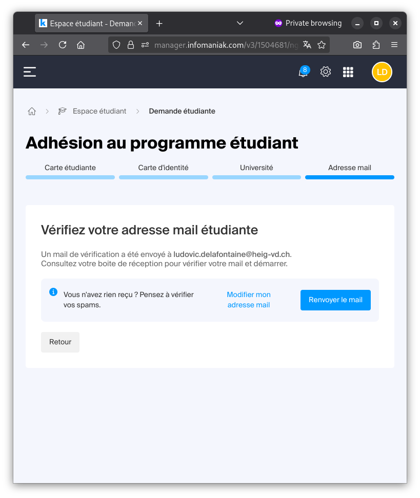

</details>

Une fois votre inscription confirmée, Infomaniak vérifiera votre statut
d'étudiant.e auprès de la HEIG-VD. Ce processus peut prendre quelques jours.
Vous pouvez vérifier le statut de votre demande dans votre compte Infomaniak.

> [!IMPORTANT]
>
> Infomaniak peut mettre plusieurs jours ouvrables pour vérifier votre statut
> d'étudiant.e. Vous recevrez un e-mail de confirmation une fois que votre
> statut sera approuvé.
>
> Si vous ne recevez pas d'e-mail de confirmation dans les 7 jours, annoncez-le
> à votre enseignant.e.

<details>
<summary>Afficher les captures d'écran illustrant l'étape</summary>

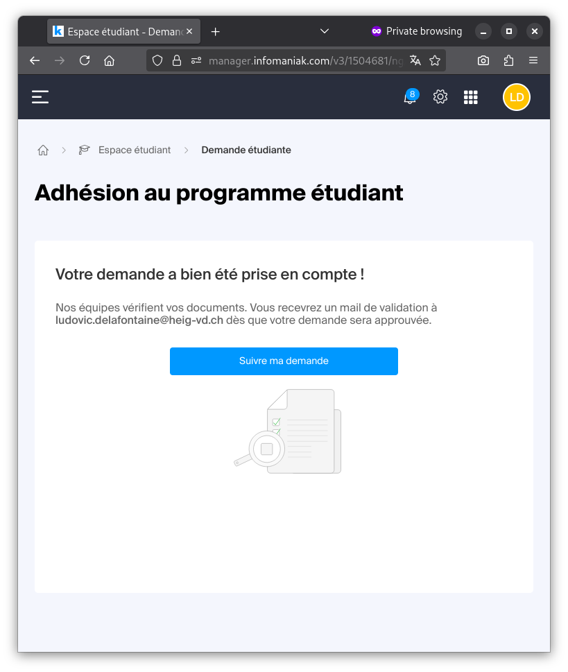


</details>

Une fois votre statut d'étudiant.e approuvé par Infomaniak, connectez-vous à
votre compte Infomaniak et accédez à la page du programme étudiant pour vérifier
que votre statut est bien approuvé.

<details>
<summary>Afficher la capture d'écran illustrant l'étape</summary>

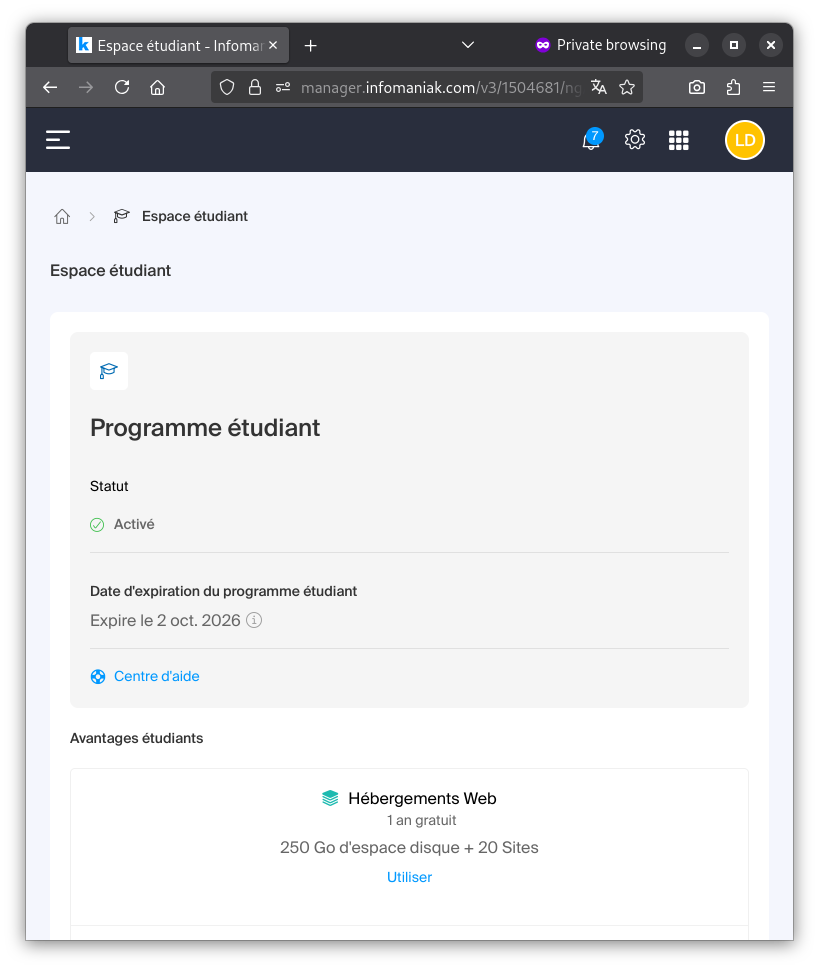

</details>

### Créer un hébergement web

> [!NOTE]
>
> Il se peut que vous ayez déjà un hébergement web au travers d'un précédent
> cours.
>
> Si c'est le cas, vous pouvez passer directement à la section
> [Désactiver le renouvellement automatique](#désactiver-le-renouvellement-automatique).

Afin de commander un hébergement web, vous pouvez vous rendre la page page
suivante : <https://shop.infomaniak.com/order2/domain?hosting_order=true>.

La première étape consiste à choisir un nom de domaine pour votre hébergement
web.

Le nom de domaine que vous choisirez sera utilisé également dans d'autres cours
enseignés à la HEIG-VD. Vous êtes libre de choisir le nom de domaine que vous
souhaitez, mais nous vous recommandons de choisir un nom de domaine qui vous
représente et qui est facile à retenir. Par exemple, vous pouvez choisir un nom
de domaine qui contient votre prénom, votre nom de famille ou encore votre
pseudonyme habituel sur Internet.

Il s'agit peut-être d'une occasion pour vous créer une identité numérique en
ligne avec un nom de domaine qui vous représente et qui fera office de vitrine
pour vos projets personnels et professionnels.

Le nom de domaine vous appartient et vous permet d'accéder à votre application
web en utilisant une adresse web personnalisée (par exemple,
`www.mondomaine.ch`).

Nous vous recommandons d'activer l'option de confidentialité (_"Domain
Privacy"_) du nom de domaine pour protéger vos informations personnelles.
L'option pour accélérer l'accès au site web (_"DNS Fast Anycast"_) n'est pas
nécessaire pour ce cours.

<details>
<summary>Afficher la capture d'écran illustrant l'étape</summary>

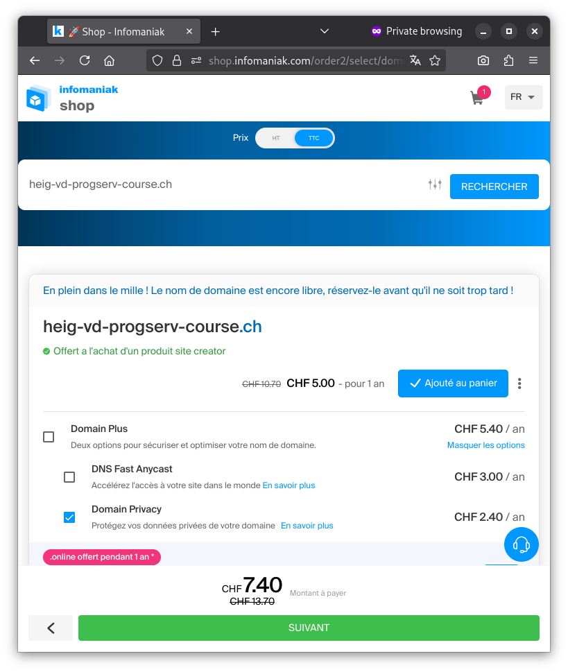

</details>

Une fois le nom de domaine choisi, vous devez saisir vos coordonnées de
facturation. Même si vous ne serez pas facturé pour l'hébergement web dans le
cadre du programme étudiant, Infomaniak exige ces informations pour créer
l'hébergement web. C'est la raison pour laquelle l'option _"Domain Privacy"_ est
recommandée pour protéger vos informations personnelles.

<details>
<summary>Afficher la capture d'écran illustrant l'étape</summary>


</details>

Sélectionnez maintenant un plan d'hébergement web. Choisissez le plan
_"Hébergement Web"_.

<details>
<summary>Afficher la capture d'écran illustrant l'étape</summary>

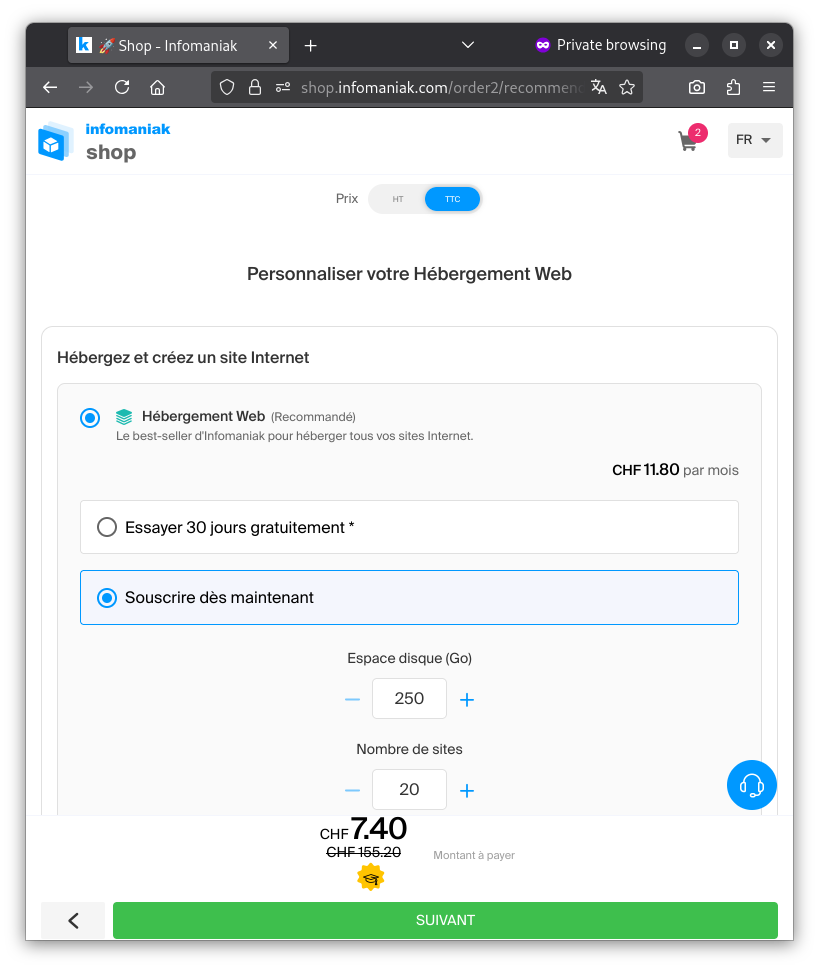

</details>

Sélectionnez l'option _"Je n'ai pas encore besoin d'adresse mail"_, comme nous
n'en aurons pas besoin pour le moment.

<details>
<summary>Afficher la capture d'écran illustrant l'étape</summary>


</details>

Confirmez que vous serez propriétaire du nom de domaine et de l'hébergement web.
Toutes autres options peuvent être ignorées (_"Continuer sans Renewal
Guarantee"_).

Validez votre commande.

> [!CAUTION]
>
> Assurez-vous de bénéficier du programme étudiant d'Infomaniak avant de valider
> votre commande. L'hébergement web doit être gratuit dans le cadre du programme
> étudiant d'Infomaniak. Si vous ne bénéficiez pas du programme étudiant, vous
> serez facturé pour l'hébergement web.

> [!WARNING]
>
> Vous avez droit jusqu'à 20 hébergements web gratuits dans le cadre du
> programme étudiant d'Infomaniak. Il est néanmoins obligatoire d'acquérir un
> nom de domaine pour votre projet que vous devrez payer vous-même (environ 10
> CHF pour une année). Ce montant peut être remboursé par la HEIG-VD si vous
> effectuez la demande de remboursement (voir ci-après).

<details>
<summary>Afficher la capture d'écran illustrant l'étape</summary>


</details>

> [!TIP]
>
> Le même nom de domaine peut être utilisé pour plusieurs hébergements web (par
> exemple, pour différents projets) à l'aide de sous-domaines (par exemple,
> `projet1.mondomaine.ch`, `projet2.mondomaine.ch`, etc.).
>
> Cela peut être utile pour organiser vos différents projets sous un même nom de
> domaine, par exemple `progserv1.mondomaine.ch` pour le projet du cours
> _"Programmation serveur 1"_, `progserv2.mondomaine.ch` pour le projet du cours
> _"Programmation serveur 2"_, etc.

Une fois la commande validée et payée, vous pouvez télécharger la facture au
format PDF. Vous en aurez besoin pour effectuer la demande de remboursement
auprès de la HEIG-VD (voir ci-après).

<details>
<summary>Afficher la capture d'écran illustrant l'étape</summary>


</details>

### Désactiver le renouvellement automatique

Afin d'éviter des frais supplémentaires à la fin de la première année, vous
devez désactiver le renouvellement automatique du nom de domaine et de
l'hébergement web. Pour cela, vous pouvez vous rendre dans **Comptabilité >
Renouvellement** dans le portail d'Infomaniak.

<details>
<summary>Afficher la capture d'écran illustrant l'étape</summary>

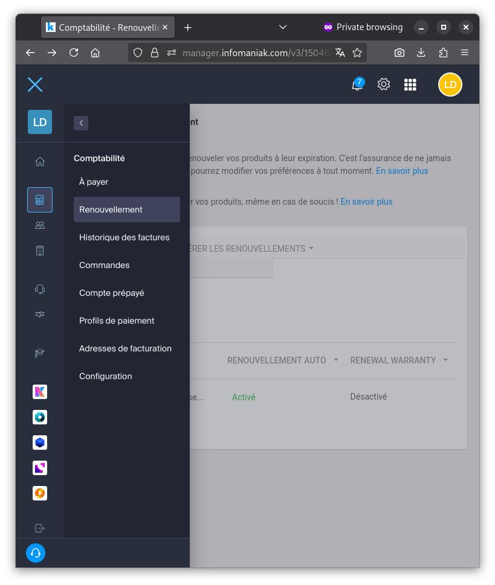

</details>

Sélectionnez tous les éléments de la liste puis cliquez sur le bouton
**Désactiver le renouvellement automatique**.

<details>
<summary>Afficher la capture d'écran illustrant l'étape</summary>


</details>

### Accéder aux hébergements web

Infomaniak permet de gérer plusieurs hébergements web. Pour accéder au menu de
gestion de tous les hébergements web, vous pouvez vous rendre dans **Web &
Domaines > Hébergement**.

<details>
<summary>Afficher la capture d'écran illustrant l'étape</summary>


</details>

Ici, deux cas de figure peuvent se présenter à vous :

1. Vous avez commandé un nouvel hébergement web avec un nom de domaine pour la
   première fois.
2. Vous aviez déjà un hébergement web avec un nom de domaine associé acquis dans
   un précédent cours.

#### Cas 1 - Nouvel hébergement web

Rien de particulier à savoir/faire, suivez la marche à suivre décrite dans la
section
[Accéder au tableau de bord de l'hébergement web spécifique](#accéder-au-tableau-de-bord-de-lhébergement-web-spécifique)
pour configurer votre hébergement web.

#### Cas 2 - Hébergement web existant

Si c'est le cas, celui-ci pourrait porter le nom d'un précédent nom de domaine
que vous avez commandé.

À nouveau, les terminologies utilisées par Infomaniak peuvent être déroutantes.
Un hébergement web peut héberger plusieurs sites web, chacun pouvant être
associé à un nom de domaine différent ou à un ou plusieurs sous-domaines, même
si l'hébergement web porte déjà le nom d'un seul nom de domaine.

Suivez la marche à suivre décrite dans la section
[Accéder au tableau de bord de l'hébergement web spécifique](#accéder-au-tableau-de-bord-de-lhébergement-web-spécifique)
pour configurer votre hébergement web, même s'il porte le nom d'un précédent nom
de domaine que vous avez commandé.

### Accéder au tableau de bord de l'hébergement web spécifique

En cliquant sur le nom de domaine ou en accédant aux paramètres de l'hébergement
web grâce au bouton des trois points, vous pouvez accéder au tableau de bord de
l'hébergement web.

<details>
<summary>Afficher la capture d'écran illustrant l'étape</summary>


</details>

Ce tableau de bord vous permet de configurer plusieurs paramètres importants
pour votre hébergement web, notamment :

- Les paramètres généraux de l'hébergement web (par exemple, le nom de
  l'hébergement web, les ressources allouées, etc.).
- Le ou les sites web associés à l'hébergement web.
- Les accès FTP/SFTP pour transférer les fichiers de votre application PHP.
- Les accès à une ou des bases de données utilisées par votre application
  (MariaDB, PostgreSQL, etc.).
- Et d'autres paramètres avancés.

### Renommer l'hébergement web

Pour éviter toute confusion entre un hébergement web et un ou plusieurs noms de
domaine, nous allons renommer l'hébergement web existant pour lui donner un nom
plus spécifique.

Pour cela, accédez aux paramètres généraux de l'hébergement web en accédant au
menu **Gérer > Modifier le nom** sous le nom actuel de l'hébergement web.

<details>
<summary>Afficher la capture d'écran illustrant l'étape</summary>


</details>

Puis renommer l'hébergement web en lui donnant un nom plus spécifique, par
exemple `Hébergement web gratuit HEIG-VD`.

<details>
<summary>Afficher la capture d'écran illustrant l'étape</summary>


</details>

Sauvegardez les modifications.

<details>
<summary>Afficher la capture d'écran illustrant l'étape</summary>


</details>

Dorénavant, vous pourrez facilement différencier votre hébergement web des
autres hébergements web ou sites que vous pourriez avoir acquis dans le cadre
d'autres cours ou pour d'autres projets.

Vous pouvez le confirmer dans la section **Mon offre** de l'hébergement web, où
vous devriez voir le nombre de sites web associés à l'hébergement web ainsi que
ceux encore disponibles dans le cadre de votre offre d'hébergement web (20 sites
web disponibles dans le cadre du programme étudiant d'Infomaniak).

Juste en dessous, vous devriez voir le ou les sites web associés à l'hébergement
web. Si vous venez de commander un hébergement web avec un nom de domaine
associé, vous devriez voir un site web associé à ce nom de domaine.

<details>
<summary>Afficher la capture d'écran illustrant l'étape</summary>


</details>

Maintenant que l'hébergement web a son propre nom distinctif, il est temps
d'ajouter ou d'accéder à un site web associé à l'hébergement web pour pouvoir
déployer votre application web sur Internet.

## Ajouter un nouveau site à l'hébergement web

Dans cette section, nous allons ajouter un nouveau site web associé à
l'hébergement web que nous avons acquis et configuré dans la section précédente.

Un site web est une application web déployée sur un hébergement web, qui peut
être associée à un nom de domaine ou à un sous-domaine.

> [!NOTE]
>
> Si vous venez de commander un nouvel hébergement web avec un nom de domaine
> associé, vous devriez déjà avoir un site web associé à ce nom de domaine.
>
> Il n'est donc pas nécessaire d'ajouter un nouveau site web. Vous pouvez
> simplement accéder au site web déjà associé à votre hébergement web et le
> paramétrer dans la section [Configurer le site web](#configurer-le-site-web).
>
> Si c'est la première fois que vous suivez ce document, nous vous recommandons
> de parcourir les étapes mais il n'est pas nécessaire de les suivre si vous
> avez déjà un site web configuré.

Si vous souhaitez ajouter un nouveau site web à l'hébergement web, vous pouvez
le faire en cliquant sur le bouton **Ajouter un site** dans la section **Sites
web** du tableau de bord de l'hébergement web.

Selon le type de site web que vous souhaitez ajouter ou selon les contraintes du
cours que vous suivez, vous pouvez choisir entre les différentes options
proposées par Infomaniak.

### Ajouter un site web statique (HTML/CSS/JS)

_À venir prochainement peut-être ?_

### Ajouter une application web avec un CMS (WordPress, Joomla, etc.)

_À venir prochainement peut-être ?_

### Ajouter une application web PHP

Pour les cours de _"Programmation serveur 1 (ProgServ1)"_, _"Programmation
serveur 2 (ProgServ2)"_ ou _"Programmation serveur 3 (ProgServ3)"_ /
_"Développement de produit média (DévProdMéd)"_, vous pouvez choisir l'option
**Créez un projet vierge**.

<details>
<summary>Afficher la capture d'écran illustrant l'étape</summary>


</details>

Puis configurez le site web en sélectionnant la technologie **Apache/PHP** et en
sélectionnant la dernière version de PHP disponible dans les options avancées.

> [!NOTE]
>
> Il se peut que la version de PHP utilisée par défaut pour le site web ne soit
> pas la dernière version disponible, ni même qu'elle corresponde à la capture
> d'écran ci-dessous.
>
> Nous vous recommandons d'utiliser la dernière version de PHP pour bénéficier
> des dernières fonctionnalités et améliorations de sécurité.

<details>
<summary>Afficher la capture d'écran illustrant l'étape</summary>

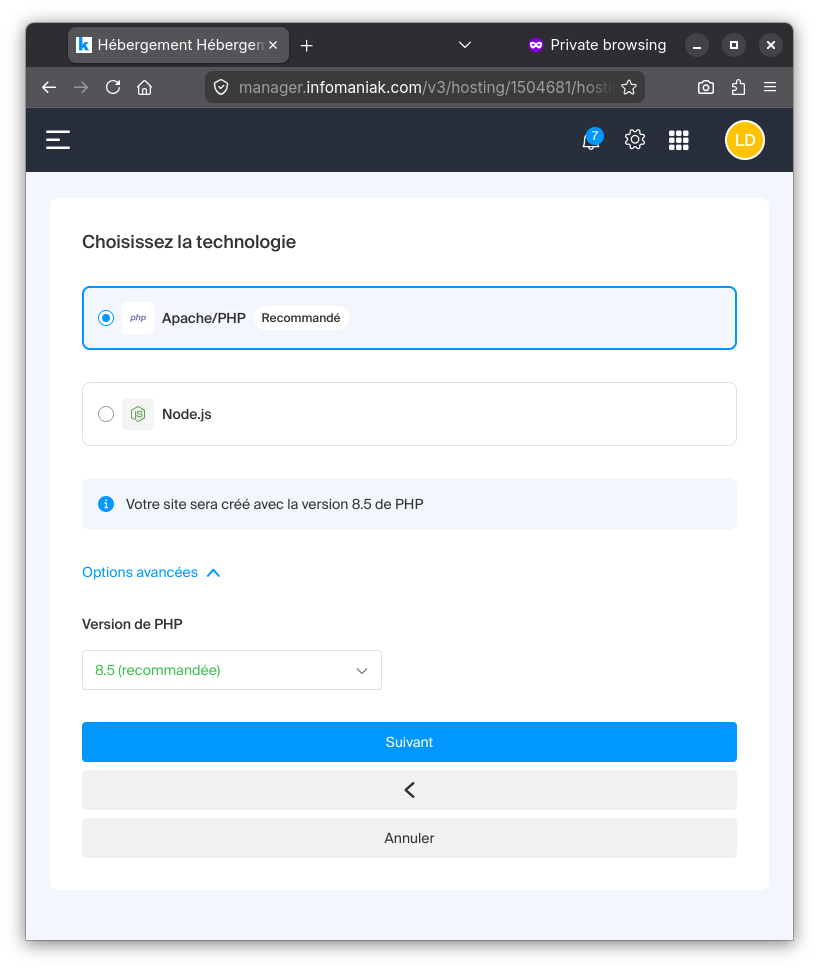

</details>

La dernière étape de la configuration du site web consiste à associer un nom de
domaine au site web.

Deux options s'offrent à vous pour cela :

1. Acheter un nouveau nom de domaine pour le site web. N'achetez un nouveau nom
   de domaine que si vous souhaitez avoir un nom de domaine différent de celui
   que vous avez déjà commandé pour votre hébergement web. Par exemple, si vous
   avez déjà commandé le nom de domaine `mondomaine.ch` pour votre hébergement
   web, vous pouvez acheter un nouveau nom de domaine `mondomaine2.ch` pour le
   nouveau site web. La HEIG-VD ne remboursera qu'un seul nom de domaine par
   étudiant.e, donc n'achetez un nouveau nom de domaine que si vous en avez
   besoin pour votre projet.
2. Associer le site web à un domaine/sous-domaine du domaine principal que vous
   avez déjà commandé pour votre hébergement web. Par exemple, si vous avez déjà
   commandé le nom de domaine `mondomaine.ch` pour votre hébergement web, vous
   pouvez associer le nouveau site web à un sous-domaine
   `projet1.mondomaine.ch`. Cette option est gratuite et vous permet d'avoir
   plusieurs sites web associés à un même nom de domaine en utilisant des
   sous-domaines différents.

> [!NOTE]
>
> Si vous n'êtes pas sûr.e de l'option à choisir, nous vous recommandons
> d'associer le site web à un sous-domaine du nom de domaine que vous avez déjà
> commandé pour votre hébergement web.
>
> C'est une option gratuite qui vous permet d'avoir plusieurs sites web associés
> à un même nom de domaine en utilisant des sous-domaines différents.

Illustrons la configuration du site web en associant le site web à un
sous-domaine du nom de domaine que vous avez déjà commandé pour votre
hébergement web.

Sélectionnez l'option **Utiliser un nom de domaine ou sous-domaine existant**
puis saisissez le sous-domaine que vous souhaitez associer au site web.

Par exemple, si vous avez déjà commandé le nom de domaine `mondomaine.ch` pour
votre hébergement web, vous pouvez saisir `progserv1` pour associer le site web
au sous-domaine `progserv1.mondomaine.ch`.

Puis, dans les options avancées, assurez-vous que la version de PHP sélectionnée
est la dernière version disponible.

<details>
<summary>Afficher la capture d'écran illustrant l'étape</summary>

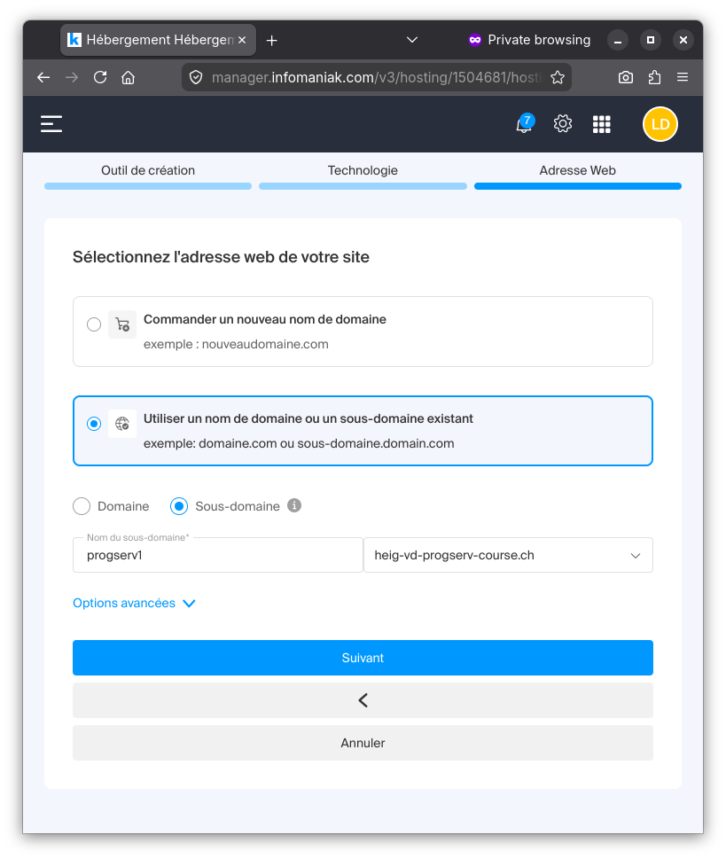

</details>

Puis, terminez la configuration du site web en sauvegardant les modifications.
La configuration du site web devrait prendre quelques minutes. Une fois la
configuration terminée, vous pourrez accéder au site web en utilisant l'adresse
du nom de domaine ou du sous-domaine que vous avez associé au site web.

<details>
<summary>Afficher les captures d'écran illustrant l'étape</summary>


</details>

Vous pouvez maintenant passer à la section
[Accéder au site web](#accéder-au-site-web) pour accéder au site web et vérifier
que tout fonctionne correctement.

### Ajouter une application web Node.js

_À venir prochainement peut-être ?_

## Accéder au site web

Tentez d'accéder au site web en utilisant votre navigateur web en vous rendant à
l'adresse du nom de domaine que vous avez choisi lors de la commande de
l'hébergement web. Vous devriez voir une page par défaut d'Infomaniak.

> [!NOTE]
>
> Il se peut que l'accès au site web ne soit pas immédiatement disponible après
> la configuration. Cela est dû à la propagation des enregistrements DNS, qui
> peut prendre jusqu'à 24 heures.
>
> De notre expérience, cela prend généralement moins de deux heures.

> [!NOTE]
>
> Si vous êtes sur le réseau Wi-Fi de la HEIG-VD, il se peut que l'accès au site
> web soit bloqué par les règles de filtrage du réseau de la HEIG-VD. En effet,
> tous les nouveaux sites web qui ont moins de 30 jours sont automatiquement
> bloqués.
>
> Cela peut expliquer pourquoi vous ne pouvez pas accéder au site web même si la
> configuration est terminée et que les enregistrements DNS ont été propagés.
>
> Vous pouvez essayer depuis un autre réseau (par exemple, en utilisant le
> partage de connexion de votre téléphone) si l'accès au site web ne fonctionne
> pas depuis le réseau Wi-Fi habituel.
>
> Si besoin, vous pouvez demander au service informatique de débloquer l'accès à
> votre site web depuis le réseau Wi-Fi de la HEIG-VD en fournissant l'adresse
> du site web et en expliquant que vous avez besoin d'accéder à votre site web
> pour à cours spécifique à la HEIG-VD.

<details>
<summary>Afficher la capture d'écran illustrant l'étape</summary>


</details>

Votre site web est maintenant accessible sur Internet. Vous pouvez passer à la
section[Configurer le site web](#configurer-le-site-web) pour configurer les
paramètres du site web.

## Configurer le site web

Accédez au tableau de bord du site que vous venez de commander en cliquant sur
celui-ci ou en utilisant le bouton des trois points.

<details>
<summary>Afficher les captures d'écran illustrant l'étape</summary>

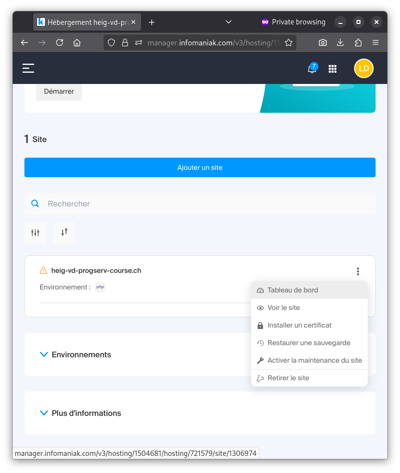


</details>

Ce tableau de bord vous permet de configurer plusieurs paramètres importants
pour le site en cours de configuration, notamment :

- La configuration de HTTPS pour sécuriser le dit site web.
- Les accès FTP/SFTP pour transférer les fichiers de votre application web.
- L'emplacement du site web sur le serveur (par exemple, le répertoire racine du
  site web).
- Et d'autres paramètres avancés.

Commencez par accéder aux paramètres avancés du site web dans la section
**Actions rapides** > **Gérer les paramètres avancés**.

Vous accédez aux paramètres avancés du site web.

<details>
<summary>Afficher les captures d'écran illustrant l'étape</summary>


</details>

Selon le type de site web que vous avez choisi lors de la configuration du site
web, les paramètres avancés disponibles peuvent être différents.

### Configurer une application web PHP

Pour les cours de _"Programmation serveur 1 (ProgServ1)"_, _"Programmation
serveur 2 (ProgServ2)"_ ou _"Programmation serveur 3 (ProgServ3)"_ /
_"Développement de produit média (DévProdMéd)"_, vous avez plusieurs options
pour configurer le site web.

#### Changer la version de PHP

Il est possible de changer la version de PHP à utiliser pour le site web dans
l'onglet **PHP | Apache**.

Nous vous recommandons d'utiliser la dernière version disponible de PHP.

> [!NOTE]
>
> Il se peut que la version de PHP utilisée par défaut pour le site web ne soit
> pas la dernière version disponible, ni même qu'elle corresponde à la capture
> d'écran ci-dessous.
>
> Nous vous recommandons d'utiliser la dernière version de PHP pour bénéficier
> des dernières fonctionnalités et améliorations de sécurité.

<details>
<summary>Afficher la capture d'écran illustrant l'étape</summary>


</details>

Terminez la configuration du site web en sauvegardant les modifications.

#### Changer le répertoire racine du site web

Il est possible de changer le répertoire racine du site web dans l'onglet
**Général**. Le répertoire racine est l'emplacement sur le serveur où Infomaniak
va chercher les fichiers de votre application web pour les servir aux
utilisateur.trices qui accèdent au site web.

Par défaut, le répertoire racine du site web est situé dans le répertoire
`/sites` avec le nom du nom de domaine que vous avez choisi (par exemple,
`/sites/mondomaine.ch`).

Nous vous recommandons de créer dans ce répertoire un sous-répertoire `public`
pour votre projet, par exemple `/sites/mondomaine.ch/public`, et de configurer
ce sous-répertoire comme répertoire racine du site web.

Cela permet de séparer les fichiers de votre application web qui doivent être
accessibles au public (dans le répertoire `public`) des fichiers qui ne doivent
pas être accessibles au public (dans le répertoire parent). C'est une bonne
pratique de sécurité pour éviter que des fichiers sensibles de votre application
web soient accessibles au public.

Terminez la configuration du site web en sauvegardant les modifications.

#### Ajouter une base de données dédiée

Il est possible d'ajouter une base de données dédiée pour le site web PHP.

Pour cela, vous pouvez créer une base de données dans le tableau de bord de
l'hébergement web.

Accédez à la page dédiée aux bases de données dans le tableau de bord de
l'hébergement web en allant dans la section **Base de données**.

<details>
<summary>Afficher la capture d'écran illustrant l'étape</summary>

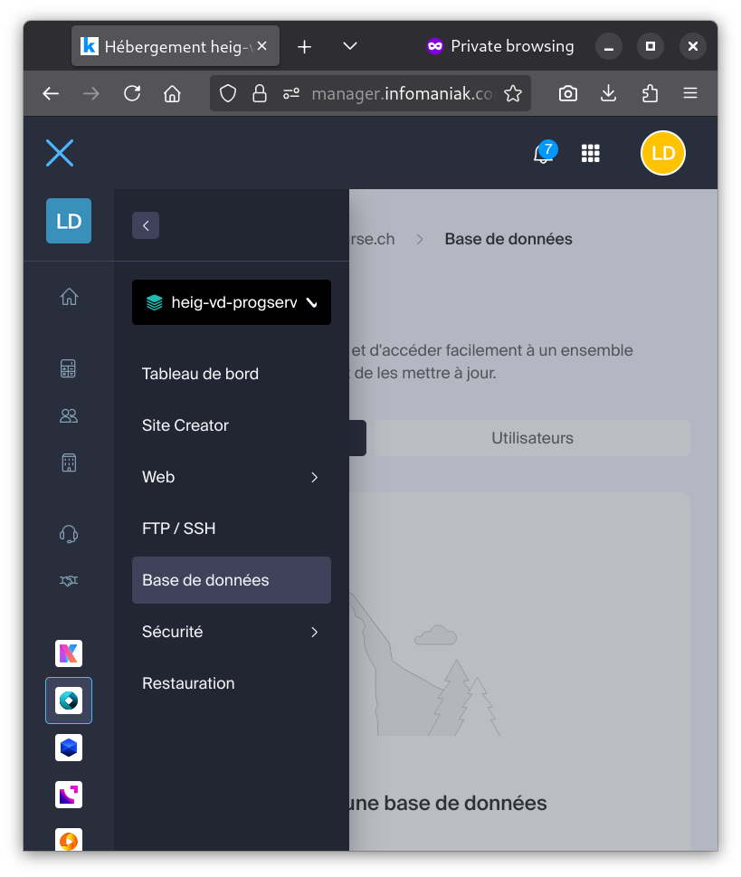

</details>

Créez une nouvelle base de données en cliquant sur le bouton **Ajouter une base
de données**.

<details>
<summary>Afficher la capture d'écran illustrant l'étape</summary>

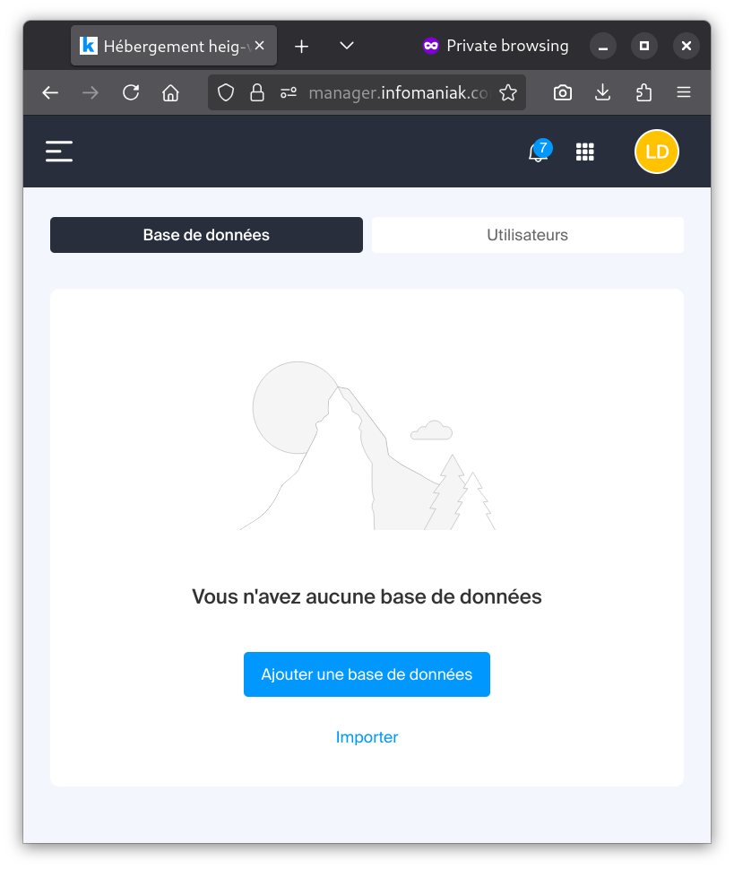

</details>

Remplissez le formulaire pour créer une nouvelle base de données. Choisissez un
nom pour la base de données.

<details>
<summary>Afficher la capture d'écran illustrant l'étape</summary>

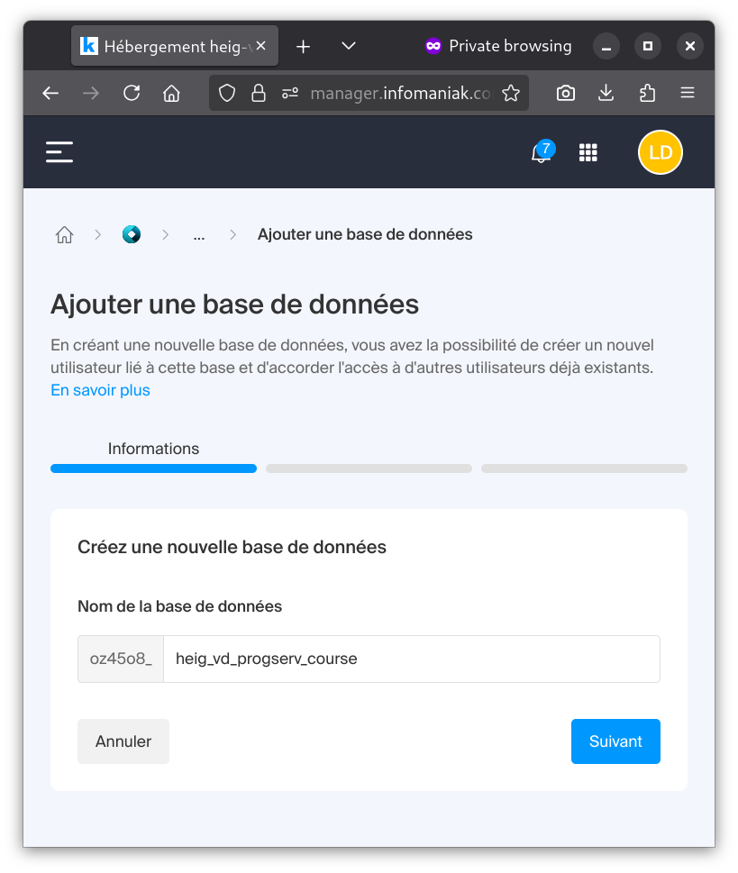

</details>

Créez également un nouvel utilisateur avec un mot de passe sécurisé. Notez ces
informations quelque part, vous en aurez besoin pour configurer votre
application PHP plus tard.

<details>
<summary>Afficher la capture d'écran illustrant l'étape</summary>

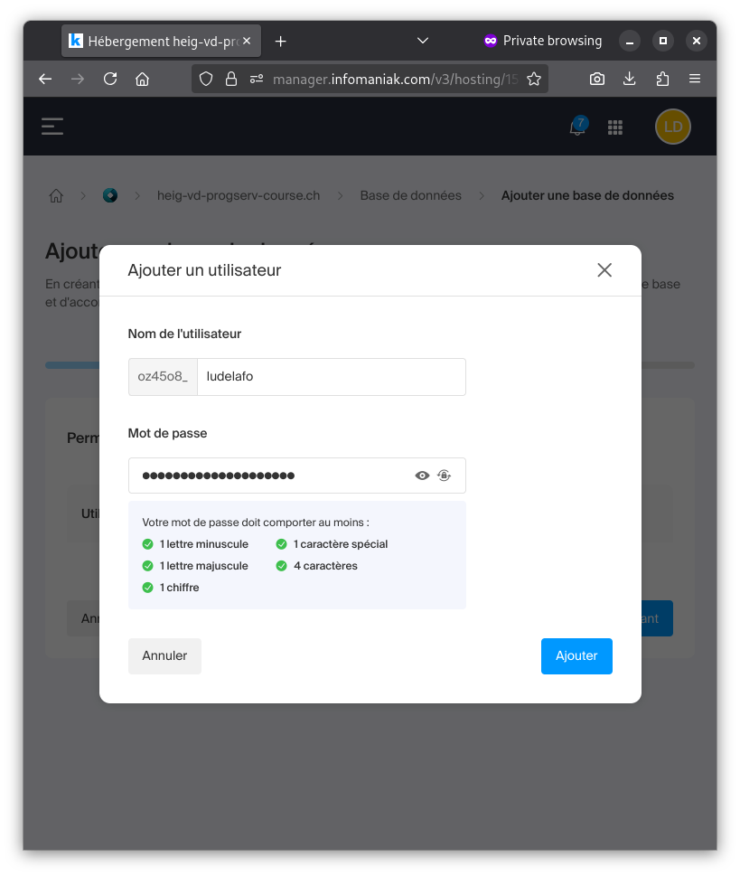

</details>

Donnez tous les droits à l'utilisateur sur la base de donnée.

<details>
<summary>Afficher la capture d'écran illustrant l'étape</summary>

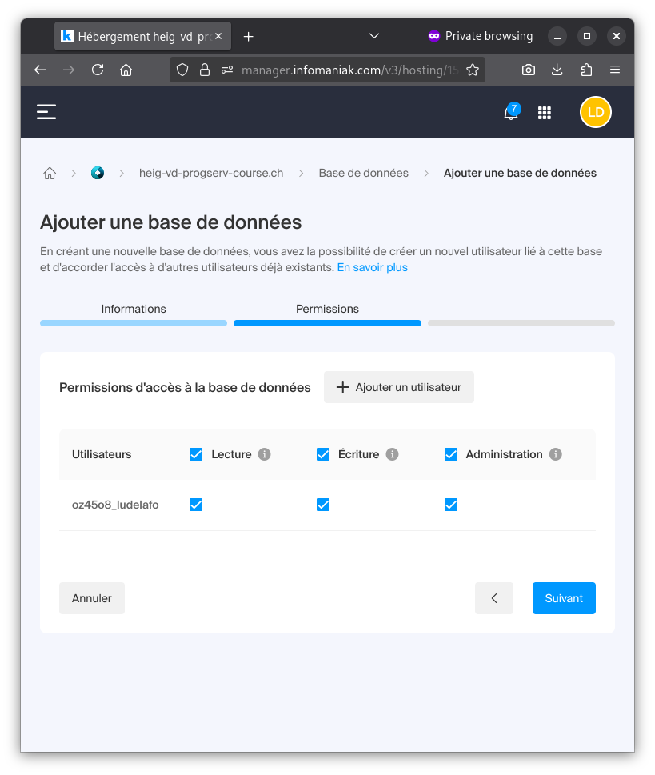

</details>

Validez la création de la base de données.

<details>
<summary>Afficher la capture d'écran illustrant l'étape</summary>

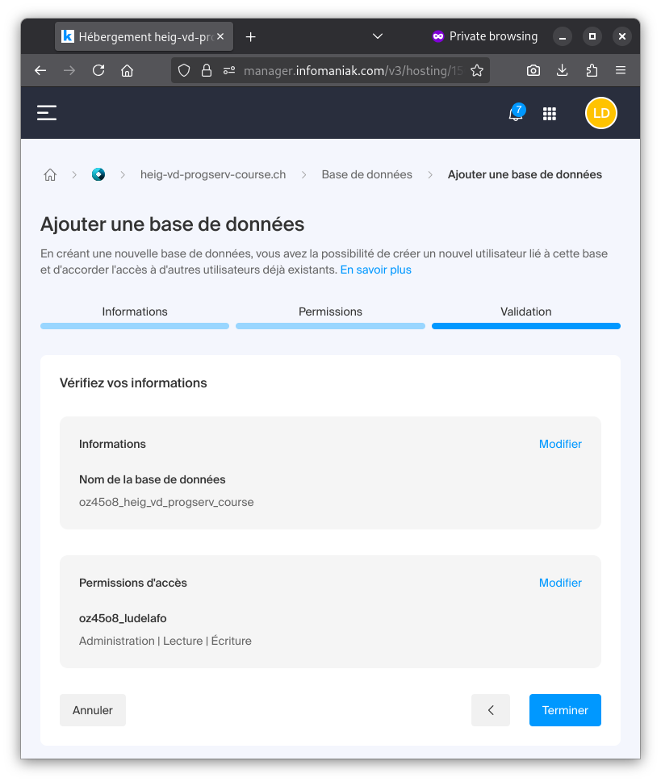

</details>

La base de données est maintenant créée. Vous pouvez voir les informations de
connexion à la base de données dans le tableau de bord de l'hébergement web.
Vous en aurez besoin pour configurer votre application PHP plus tard.

<details>
<summary>Afficher la capture d'écran illustrant l'étape</summary>

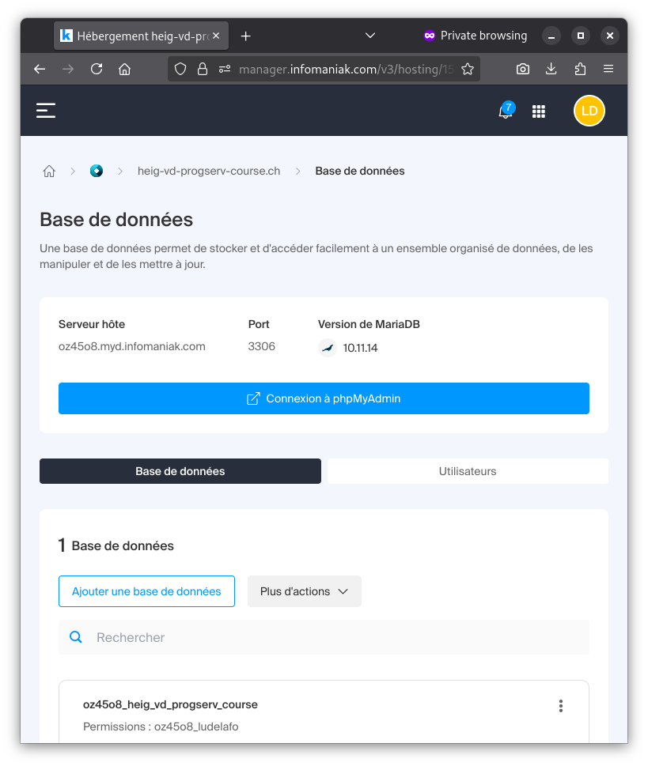

</details>

Vous pouvez vous connecter à la base de données grâce à l'outil phpMyAdmin
fourni par Infomaniak. Cliquez sur le bouton **phpMyAdmin** pour accéder à
l'outil phpMyAdmin et saisissez les informations de connexion à la base de
données que vous avez notées précédemment.

> [!NOTE]
>
> Il n'est pas possible d'accéder à la base de données d'Infomaniak en dehors de
> phpMyAdmin.

## Accéder à l'hébergement web

Dans cette section, nous allons voir comment accéder à l'hébergement web que
vous avez acquis et configuré dans la section précédente pour pouvoir transférer
les fichiers de votre application web vers l'hébergement web et les servir aux
utilisateur.trices qui accèdent au site web.

Pour cela, il existe plusieurs méthodes pour accéder à l'hébergement web,
notamment :

> [!NOTE]
>
> Avant de choisir la méthode que vous souhaitez utiliser pour accéder à
> l'hébergement web, nous vous connaissons de d'abord regarder la section
> [Déployer un site ou une application web sur Internet sur l'hébergement web](#déployer-un-site-ou-une-application-web-sur-internet-sur-lhébergement-web)
> afin d'évaluer la meilleure manière d'accéder à l'hébergement en fonction du
> type de site.

- [FTP/SFTP](#accéder-à-lhébergement-web-via-ftpsftp) : pour transférer les
  fichiers de votre application web vers l'hébergement web.
- [SSH](#accéder-à-lhébergement-web-via-ssh) : pour accéder à l'hébergement web
  en ligne de commande et exécuter des commandes sur le serveur.

### Accéder à l'hébergement web via FTP/SFTP

Afin de transférer les fichiers de votre application PHP vers l'hébergement web,
vous pouvez utiliser un client FTP/SFTP comme FileZilla (Windows/Linux) ou
Cyberduck (macOS).

Commencez par télécharger et installer un client FTP/SFTP si vous n'en avez pas
encore un :

- [FileZilla (client)](https://filezilla-project.org/download.php?show_all=1)
  (Windows/Linux).
- [Cyberduck](https://cyberduck.io/) (macOS).

Une fois le client FTP/SFTP installé, vous devez récupérer les informations de
connexion fournies par Infomaniak pour vous connecter à l'hébergement web via
FTP/SFTP.

Accédez à la page dédiée aux accès FTP/SFTP dans le tableau de bord de
l'hébergement web (**attention, nous parlons du tableau de bord de l'hébergement
web et non du tableau de bord du site spécifique au sein de l'hébergement web**)
en allant dans la section **FTP / SSH**.

<details>
<summary>Afficher la capture d'écran illustrant l'étape</summary>

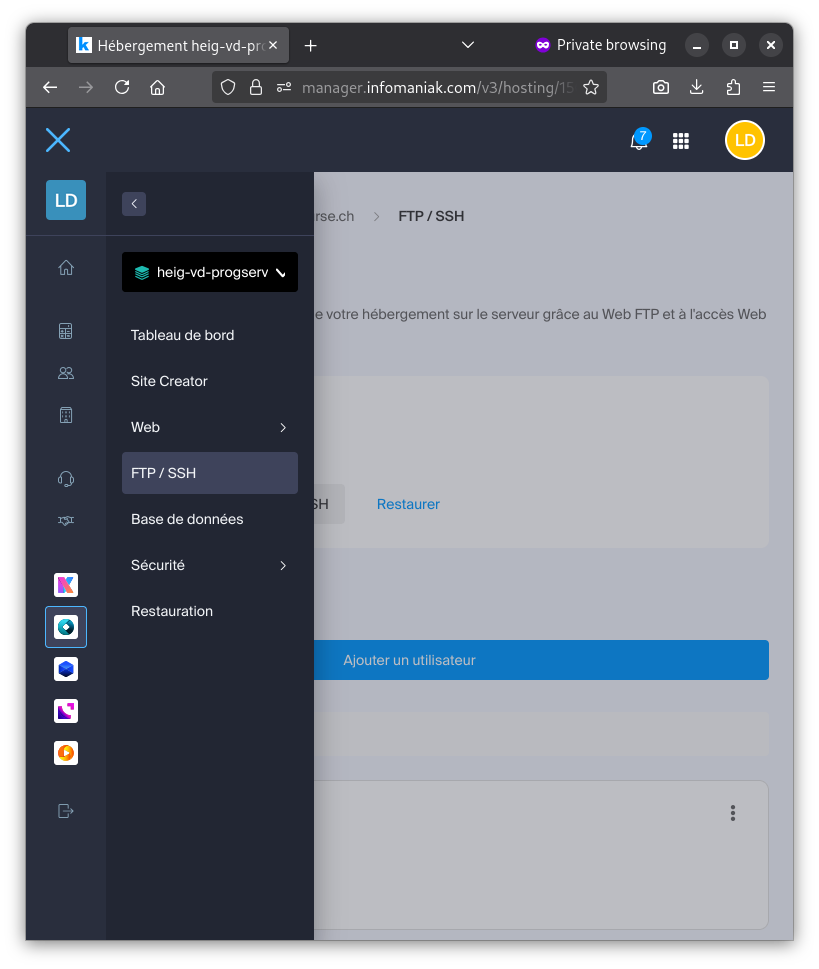

</details>

Un utilisateur par défaut est créé pour accéder à l'hébergement web. Vous pouvez
utiliser l'utilisateur par défaut en lui attribuant un mot de passe en cliquant
sur le bouton trois points à droite de l'utilisateur > **Modifier**.

<details>
<summary>Afficher la capture d'écran illustrant l'étape</summary>


</details>

Définissez un mot de passe sécurisé pour l'utilisateur FTP/SFTP. Notez-le
quelque part, vous en aurez besoin pour vous connecter à l'hébergement web plus
tard. Vous pouvez également créer un nouvel utilisateur FTP/SFTP si vous ne
souhaitez pas utiliser l'utilisateur par défaut.

<details>
<summary>Afficher la capture d'écran illustrant l'étape</summary>

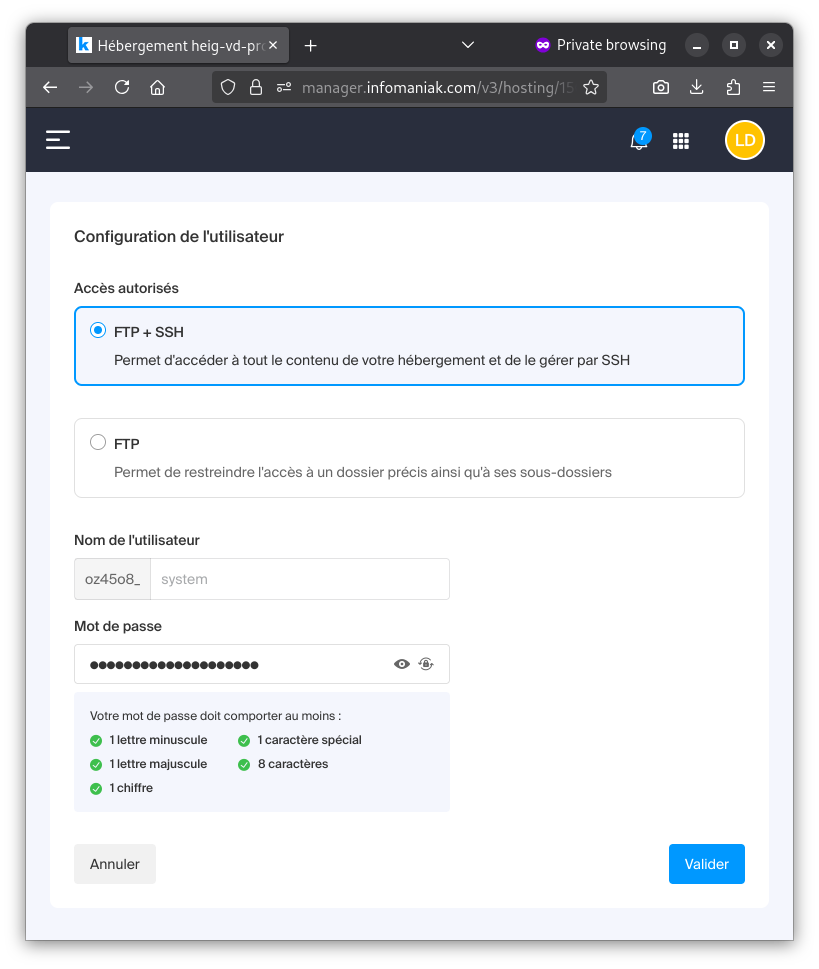

</details>

Une fois le mot de passe défini, vous pouvez utiliser les informations de
connexion fournies par Infomaniak pour vous connecter à l'hébergement web via
FTP/SFTP. Récupérez l'adresse du serveur dans le menu **FTP / SSH**.

<details>
<summary>Afficher la capture d'écran illustrant l'étape</summary>

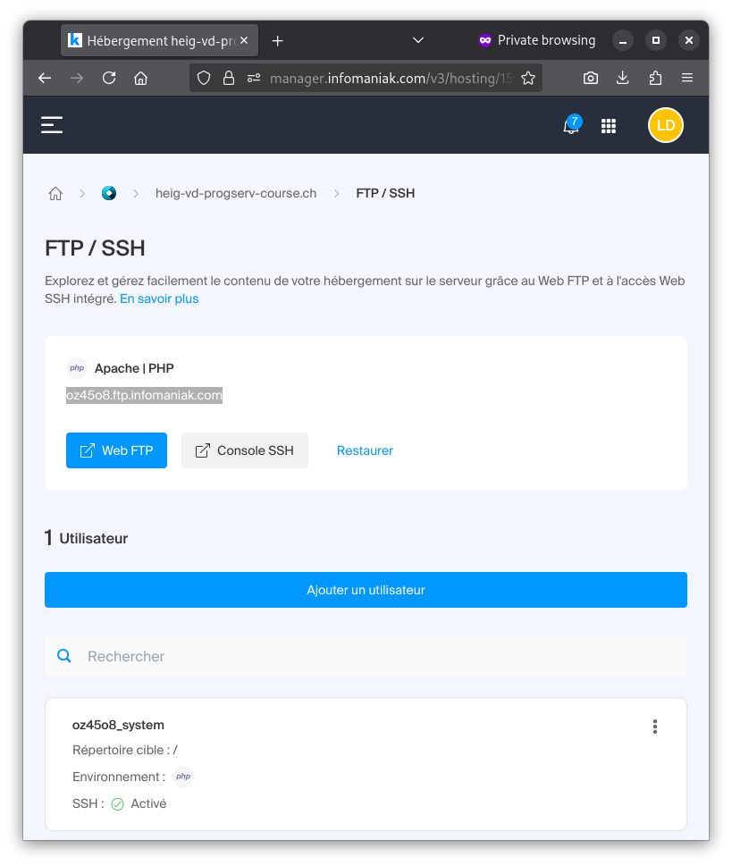

</details>

Ouvrez ensuite votre client FTP/SFTP et créez une nouvelle connexion en
utilisant les informations suivantes :

- Hôte / Serveur : l'adresse du serveur que vous avez récupérée dans le tableau
  de bord de l'hébergement web.
- Nom d'utilisateur : le nom d'utilisateur que vous avez défini ou l'utilisateur
  par défaut.
- Mot de passe : le mot de passe que vous avez défini pour l'utilisateur
  FTP/SFTP.
- Port : laissez vide pour utiliser le port par défaut (21 pour FTP, 22 pour
  SFTP - le port 22 est recommandé).

Tentez de vous connecter à l'hébergement web. Si la connexion est réussie, vous
devez voir la structure de fichiers de l'hébergement web dans votre client
FTP/SFTP :

> [!NOTE]
>
> Si vous êtes sur le réseau Wi-Fi de la HEIG-VD, il se peut que l'accès au site
> web soit bloqué par les règles de filtrage du réseau de la HEIG-VD. En effet,
> tous les nouveaux sites web qui ont moins de 30 jours sont automatiquement
> bloqués.
>
> Cela peut expliquer pourquoi vous ne pouvez pas accéder au site web même si la
> configuration est terminée et que les enregistrements DNS ont été propagés.
>
> Vous pouvez essayer depuis un autre réseau (par exemple, en utilisant le
> partage de connexion de votre téléphone) si l'accès au site web ne fonctionne
> pas depuis le réseau Wi-Fi habituel.
>
> Si besoin, vous pouvez demander au service informatique de débloquer l'accès à
> votre site web depuis le réseau Wi-Fi de la HEIG-VD en fournissant l'adresse
> du site web et en expliquant que vous avez besoin d'accéder à votre site web
> pour à cours spécifique à la HEIG-VD.

> [!NOTE]
>
> Il se peut que vous receviez un avertissement de sécurité lors de la première
> connexion via SFTP. Cela est normal, car le client FTP/SFTP ne reconnaît pas
> encore le certificat du serveur. Acceptez l'avertissement pour continuer.

<details>
<summary>Afficher la capture d'écran illustrant l'étape</summary>


</details>

L'interface de votre client FTP/SFTP peut varier en fonction du logiciel que
vous utilisez. Néanmoins, ils partagent tous une structure similaire avec deux
panneaux principaux :

- Le panneau de gauche affiche les fichiers locaux (sur votre ordinateur).
- Le panneau de droite affiche les fichiers distants (sur l'hébergement web).

Les fichiers peuvent ainsi être transférés entre les deux panneaux en les
glissant-déposant ou en utilisant les boutons de transfert. Cela permet de
transférer les fichiers vers et depuis l'hébergement web.

Par défaut, vous arrivez dans le répertoire racine de l'utilisateur FTP/SFTP.
Pour accéder aux fichiers du site web, vous devez naviguer dans le répertoire
`sites/<nom de domaine>`, où `<nom de domaine>` est le nom de domaine que vous
avez choisi lors de la commande de l'hébergement web.

<details>
<summary>Afficher la capture d'écran illustrant l'étape</summary>


</details>

Ce dossier contient les fichiers du site web spécifique associé à l'hébergement
web. C'est ici que vous devez transférer les fichiers de votre application PHP
afin de mettre à jour votre site web.

> [!WARNING]
>
> Il se peut que les fichiers cachés (fichiers et dossiers commençant par un
> point, comme `.htaccess`) ne soient pas affichés par défaut dans votre client
> FTP/SFTP. Vous devrez peut-être activer l'option pour afficher les fichiers
> cachés dans les paramètres de votre client.
>
> Sur macOS, le raccourci clavier `Cmd + Shift + .` permet d'afficher ou de
> masquer les fichiers cachés. Il est peut-être nécessaire de rafraîchir la vue
> après avoir modifié cette option.

### Accéder à l'hébergement web via SSH

En suivant les mêmes étapes que la section
[Accéder à l'hébergement web via FTP/SFTP](#accéder-à-lhébergement-web-via-ftpsftp),
créez un nouvel utilisateur pour accéder à l'hébergement via SSH.

En utilisant les informations de connexion de l'hébergement web, vous deviez
être capable de vous connecter à celui-ci avec la commande SSH suivante :

```bash
ssh <nom d'utilisateur>@<hôte de l'hébergement web>
```

Vous pourrez ensuite accepter la connexion et saisir le mot de passe pour vous
connecter.

Une fois connecté.e sur l'hébergement web, vous êtes sur un serveur Linux sur
lequel vous pouvez installer Node.js et/ou cloner des dépôts Git directement sur
l'hébergement Infomaniak.

Si votre projet GitHub est privé, vous pouvez créer un
[Personal Access Token (PAT) sur votre profil GitHub](https://docs.github.com/en/authentication/keeping-your-account-and-data-secure/managing-your-personal-access-tokens)
pour autoriser le clone du dépôt sur l'hébergement via HTTPS (pas SSH) en
utilisant votre nom d'utilisateur et le PAT créé préalablement pour cloner le
dépôt privé.

## Déployer un site ou une application web sur Internet sur l'hébergement web

Dans cette section, nous allons voir comment déployer un site ou une application
web sur Internet en utilisant l'hébergement web que nous avons acquis et
configuré dans les sections précédentes.

Pour cela, il est nécessaire de transférer les fichiers de votre site ou
application web vers l'hébergement web. Pour cela, vous pouvez utiliser un
transfert de fichiers via FTP/SFTP, que nous allons voir dans la section
suivante, ou encore utiliser un système de contrôle de version comme Git pour
déployer votre site ou application web.

### Déployer un site web statique (HTML/CSS/JS)

_À venir prochainement peut-être ?_

### Déployer une application web avec un CMS (WordPress, Joomla, etc.)

_À venir prochainement peut-être ?_

### Déployer une application web PHP

Dans cette section, nous allons voir comment déployer une application PHP simple
ou une application PHP réalisée avec Laravel :

> [!NOTE]
>
> J'ai (Ludovic) appris au travers de ces étapes qu'essayer de servir un dossier
> `icons` (dans un dossier `public/icons`) était un nom réservé pour Apache. Si
> vous souhaitez utiliser des icônes (notamment pour la photo de profil dans le
> projet Laravel du mini-réseau social), il est nécessaire d'utiliser un autre
> nom de dossier.
>
> Pour le mini-projet réalisé dans le cours DédProdMéd durant l'année 2025-2026,
> il est donc nécessaire de renommer ce dossier `public/icons` en autre chose
> (`public/images` ou `public/assets/icons`) et modifier le chemin d'accès dans
> les vues pour pouvoir utiliser l'icône correctement une fois l'application
> déployée sur Infomaniak.
>
> Je modifierai le mini-projet pour éviter ces soucis les prochaines années.

- [Déployer une application PHP simple](#déployer-une-application-php-simple).
- [Déployer une application PHP réalisée avec Laravel](#déployer-une-application-php-réalisée-avec-laravel).

#### Déployer une application PHP simple

Pour déployer une application PHP simple, nous vous conseillons d'accéder à
l'hébergement avec FTP/SFTP et transférer les fichiers de votre application dans
le dossier dédié à votre site.

> [!NOTE]
>
> L'application doit être mise dans le dossier `sites` sous le même nom que le
> domaine que vous avez obtenu (par exemple, `/sites/mondomaine.ch`).
> L'emplacement du site selon la section
> [Changer le répertoire racine du site web](#changer-le-répertoire-racine-du-site-web)
> doit correspondre au dossier `public` de l'application.

> [!NOTE]
>
> Il est possible de supprimer le dossier créé automatiquement par Infomaniak
> puis de cloner le dépôt GitHub avec la commande
> `git clone <url du dépot GitHub> <le nom du dossier sous lequel vous souhaitez cloner votre site>`.
>
> Par exemple, la commande ci-dessous clonera le dépôt de la solution du
> mini-projet du cours _"Programmation serveur 1 (ProgServ1)"_ dans le dossier
> `progserv1.heig-vd-progserv-course.ch`, le dossier initialement prévu par
> Infomaniak :
>
> ```bash
> git clone git@github.com:heig-vd-progserv-course/heig-vd-progserv1-course-mini-project-solution.git progserv1.heig-vd-progserv-course.ch
> ```

#### Déployer une application PHP réalisée avec Laravel

Pour déployer une application PHP réalisée avec Laravel, nous vous conseillons
d'accéder à l'hébergement avec SSH et configurer l'hébergement de la manière
suivante :

1. Installer Node.js sur l'hébergement Informaniak selon le site officiel :
   <https://nodejs.org/en/download/>.
2. Cloner/transférer l'application Laravel sur l'hébergement Informaniak (avec
   Git ou via FTP/SFTP) sur l'hébergement Infomaniak.

   > [!NOTE]
   >
   > L'application doit être mise dans le dossier `sites` sous le même nom que
   > le domaine que vous avez obtenu (par exemple, `/sites/mondomaine.ch`).
   > L'emplacement du site selon la section
   > [Changer le répertoire racine du site web](#changer-le-répertoire-racine-du-site-web)
   > doit correspondre au dossier `public` de l'application.

   > [!NOTE]
   >
   > Il est possible de supprimer le dossier créé automatiquement par Infomaniak
   > puis de cloner le dépôt GitHub avec la commande
   > `git clone <url du dépot GitHub> <le nom du dossier sous lequel vous souhaitez cloner votre site>`.
   >
   > Par exemple, la commande ci-dessous clonera le dépôt de la solution du
   > mini-projet du cours _"Programmation serveur 1 (ProgServ1)"_ dans le
   > dossier `progserv1.heig-vd-progserv-course.ch`, le dossier initialement
   > prévu par Infomaniak :
   >
   > ```bash
   > git clone git@github.com:heig-vd-progserv-course/heig-vd-progserv1-course-mini-project-solution.git progserv1.heig-vd-progserv-course.ch
   > ```

3. Suivre les étapes d'initialisation d'un projet Laravel comme étudié en cours
   selon le README.md du projet. En plus des autres éventuelles variables
   d'environnement que vous pourriez devoir configurer (informations de
   connexion à la base de données selon la section
   [Ajouter une base de données dédiée](#ajouter-une-base-de-données-dédiée),
   etc.), modifier le fichier `.env` pour modifier les variables d'environnement
   suivantes :

   ```text
   APP_ENV=production
   APP_DEBUG=false
   ```

   Cela permettra d'éviter d'afficher des messages d'erreurs trop explicites qui
   peuvent donner trop d'informations sur votre site et sa structure.

4. L'application Laravel devrait être accessible sur le domaine obtenu.

### Déployer une application web Node.js

_À venir prochainement peut-être ?_

## Valider le déploiement

La liste de contrôle suivante peut être utilisée pour valider le déploiement de
votre site ou application web sur Internet :

- [x] Avoir obtenu un hébergement web gratuit dans le cadre du programme
      étudiant d'Infomaniak.
- [x] Avoir renommé l'hébergement web pour lui donner un nom plus spécifique.
- [x] Avoir configuré un site web associé à l'hébergement web.
- [x] Avoir accès à l'hébergement web via FTP/SFTP ou SSH pour pouvoir
      transférer les fichiers de votre application web vers l'hébergement web.
- [x] Avoir transféré les fichiers de votre site ou application web vers
      l'hébergement web.
- [x] Avoir configuré les paramètres du site web (par exemple, la version de
      PHP, le répertoire racine du site web, etc.) pour que le site ou
      l'application web fonctionne correctement.
- [x] Avoir vérifié que le site ou l'application web est accessible sur Internet
      en utilisant l'adresse du nom de domaine ou du sous-domaine associé au
      site web.
- [x] Avoir effectué la demande de remboursement du nom de domaine auprès de la
      HEIG-VD.

Bravo ! Vous avez réussi à déployer votre site ou application web sur Internet
en utilisant l'hébergement web gratuit d'Infomaniak dans le cadre du programme
étudiant d'Infomaniak ! Votre site ou application web est maintenant accessible
à toute personne dans le monde entier via Internet.

## Effectuer les démarches administratives pour le remboursement et/ou le renouvellement de l'hébergement web

Dans cette section, nous allons voir comment effectuer la demande de
remboursement auprès de la HEIG-VD pour le nom de domaine que vous avez acheté
pour votre hébergement web, ainsi que comment renouveler ou révoquer le
programme étudiant d'Infomaniak à la fin de la première année.

### Effectuer la demande de remboursement auprès de la HEIG-VD

Afin d'obtenir le remboursement du nom de domaine que vous avez acheté pour
votre hébergement web, vous devez effectuer une demande de remboursement auprès
de la HEIG-VD. Pour cela, vous devez obtenir la facture au format PDF attestant
de l'achat du nom de domaine (voir ci-après).

Pour cela, vous pouvez vous rendre dans **Comptabilité > Commande** dans le
portail d'Infomaniak.

<details>
<summary>Afficher la capture d'écran illustrant l'étape</summary>

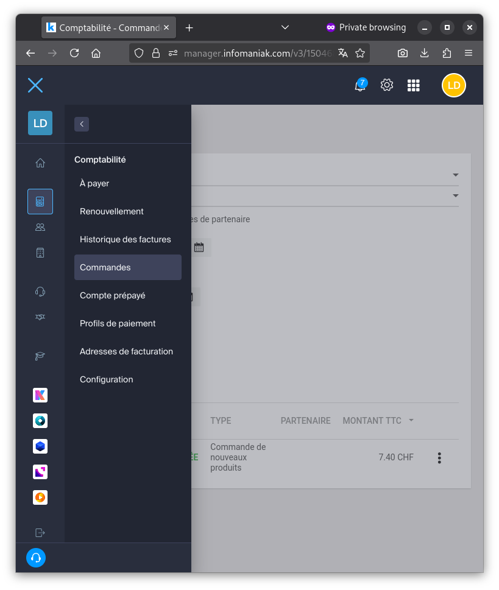

</details>

Puis cliquer sur le bouton **Facture** pour télécharger la facture au format
PDF.

<details>
<summary>Afficher la capture d'écran illustrant l'étape</summary>


</details>

Une fois la facture téléchargée, vous pouvez effectuer la demande de
remboursement auprès de la HEIG-VD en suivant ces étapes :

1. Envoyez un e-mail au secrétariat COMEM avec la facture au format PDF en
   pièce-jointe. Indiquez que l'achat a été effectué dans le cadre du programme
   étudiant d'Infomaniak pour le cours que vous suivez.
2. Attendez la validation de la demande de remboursement par le secrétariat
   COMEM.
3. Passez au secrétariat COMEM pour récupérer le remboursement en espèces ou via
   TWINT et signer le formulaire de remboursement.

Le secrétariat COMEM traitera votre demande de remboursement et vous remboursera
le montant du nom de domaine en espèce ou via TWINT.

### Renouveler/révoquer le programme étudiant d'Infomaniak

> [!CAUTION]
>
> Suivez ces étapes uniquement une fois que l'année d'hébergement web est
> terminée ! Sans cela, vous risquez de perdre l'accès à votre hébergement web
> et à votre nom de domaine avant d'avoir pu les utiliser pour déployer votre
> application web sur Internet.

Le programme étudiant d'Infomaniak est valable pour une année. Il est possible
de le renouveler pour une année supplémentaire si vous êtes toujours étudiant.e
à la HEIG-VD.

<details>
<summary>Afficher la capture d'écran illustrant l'étape</summary>


</details>

Si vous n'êtes plus étudiant.e, l'offre sera automatiquement révoquée mais il
est nécessaire de s'assurer que le renouvellement automatique du nom de domaine
et de l'hébergement web a bien été désactivé (voir section
[Désactiver le renouvellement automatique](#désactiver-le-renouvellement-automatique)).

Une fois le programme étudiant terminé, les frais supplémentaires seront à votre
charge.

> [!CAUTION]
>
> N'oubliez pas de renouveler/révoquer le nom de domaine et l'hébergement web à
> la fin de la première année pour éviter des frais dans le futur !

<!-- URLs -->

[licence]:
	https://github.com/heig-vd-progserv-course/heig-vd-progserv1-course/blob/main/LICENSE.md
