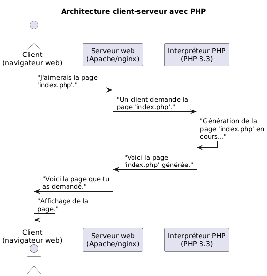

<!--
theme: custom-marp-theme
size: 16:9
paginate: true
author: L. Delafontaine, avec l'aide de GitHub Copilot
title: HEIG-VD ProgServ1 Course - Cours 01 - Modalités de l'unité d'enseignement et introduction à PHP
description: Modalités de l'unité d'enseignement pour le cours ProgServ1 à la HEIG-VD, Suisse
url: https://heig-vd-progserv1-course.github.io/heig-vd-progserv1-course/01-modalites-de-lunite-denseignement-et-introduction-a-php/01-theorie/index.html
header: "**Cours 01 - Modalités de l'unité d'enseignement et introduction à PHP**"
footer: "**HEIG-VD** - ProgServ1 Course 2024-2025 - CC BY-SA 4.0"
headingDivider: 6
-->

# Cours 01 - Modalités de l'unité d'enseignement et introduction à PHP

<!--
_class: lead
_paginate: false
-->

<https://github.com/heig-vd-progserv1-course>

[Support de cours][course-material] · [Présentation (web)][presentation-web] ·
[Présentation (PDF)][presentation-pdf]

<small>L. Delafontaine, avec l'aide de
[GitHub Copilot](https://github.com/features/copilot).</small>

<small>Ce travail est sous licence [CC BY-SA 4.0][license].</small>

![bg brightness:2 opacity:0.2][illustration-principale]

## Bienvenue à l'unité d'enseignement Programmation serveur 1 (ProgServ1) !

<!-- _class: lead -->

## Qui suis-je

<div class="center">


**Ludovic Delafontaine**  
[E-mail](mailto:ludovic.delafontaine@heig-vd.ch) ·
[GitHub](https://github.com/ludelafo)

</div>

## Mes objectifs et souhaits pour le cours

PHP va vous accompagner tout au long de vos études à la HEIG-VD (ProgServ1,
ProgServ2, DevProdMed, etc.) et aussi plus tard dans votre vie professionnelle.

Mon objectif est de vous donner des bases solides et une bonne compréhension de
ce language pour vos études et pour la suite.

Si quelque chose ne convient pas dans mon cours, n'hésitez pas à me le dire. Je
suis ouvert à toute critique pour améliorer mon enseignement.

## Comment me contacter

Selon vos préférences, vous pouvez utiliser l'un des canaux de communication
suivants pour toute question relative au cours :

- En personne, durant les sessions de cours ou en dehors
- Par e-mail
  ([ludovic.delafontaine@heig-vd.ch](mailto:ludovic.delafontaine@heig-vd.ch))
- Microsoft Teams
  - Dans le canal Teams du de l'unité d'enseignement (de préférence)
  - Message privé sur Teams (à éviter si possible)

## _Retrouvez plus de détails dans le support de cours_

<!-- _class: lead -->

_Cette présentation est un résumé du support de cours. Pour plus de détails,
consultez le [support de cours][course-material]._

## Objectifs (1/3)

- Lister les objectifs de l'unité d'enseignement
- Lister les modalités d'organisation de l'unité d'enseignement
- Lister les modalités d'évaluation
- Décrire le concept d'architecture client-serveur
- Lister les outils nécessaires pour écrire et exécuter du code PHP
  ![bg right:40%][illustration-objectifs]

## Objectifs (2/3)

- Expliquer comment PHP fonctionne dans un environnement web
- Décrire la syntaxe de base de PHP
- Décrire les variables en PHP
- Décrire les constantes en PHP
- Décrire la nature dynamique des variables et constantes en PHP
- Expliquer les opérateurs en PHP

![bg right:40%][illustration-objectifs]

## Objectifs (3/3)

- Expliquer les structures de contrôle conditionnelles en PHP
- Rédiger du code PHP simple

![bg right:40%][illustration-objectifs]

## Modalités de l'unité d'enseignement

<!-- _class: lead -->

### Objectifs de l'unité d'enseignement (1/2)

Selon la
[fiche d'unité](https://gaps.heig-vd.ch/consultation/fiches/uv/uv.php?id=7307),
à la fin de cette unité d'enseignement, vous devriez être capable de :

> - Connaître les principes de base de la programmation serveur
> - Manipuler des tableaux associatifs complexes
> - Générer des documents Web dynamiquement
> - Gérer la persistance des données applicatives dans un Système de Gestion de
>   Base de Données (SGBD)

### Objectifs de l'unité d'enseignement (2/2)

En résumé, vous devriez être capable de :

- Comprendre les bases de PHP et son rôle dans le monde web.
- Écrire un code PHP propre et organisé.
- Gérer les formulaires HTML et les données qu'ils contiennent de manière sûre.
- Persister des données dans une base de données SQLite.
- Implémenter des concepts de programmation orientée objet.
- Gérer les cookies et les sessions utilisateurs.

### Modalités d'organisation de l'unité d'enseignement

- En présentiel chaque semaine dans cette même salle
- Mélange de théorie et de pratique pour un meilleur apprentissage :
  - Théorie
  - Mini-projet à réaliser tout au long de l'unité d'enseignement
  - Exercices à faire en classe ou à la maison
- Espace de discussion pour poser des questions et obtenir de l'aide (**il n'y a
  pas de questions bêtes !**, je suis payé pour ça)

### Modalités d'évaluation

Le cours sera évalué à l'aide d'un seul examen final composé de deux parties, à
effectuer sur ordinateur :

- Partie théorique
  - 40% de la note finale
- Partie pratique
  - 60% de la note finale

![bg right:40%][illustration-modalites-devaluation]

#### Partie théorique

- Évaluation sur :
  - Les connaissances théoriques acquises tout au long de l'unité d'enseignement
  - Les exercices
- Durée d'environ 45 minutes
- Devrait utiliser la plateforme d'évaluation en ligne de la HEIG-VD
- **Aucune aide autorisée**

![bg right:40%][illustration-modalites-devaluation]

#### Partie pratique

- Évaluation sur :
  - Les exercices
  - Le mini-projet
- Durée d'environ 2h15
- Petit projet à réaliser
- Contenu du cours, notes personnelles,
  [php.net](https://www.php.net/manual/index.php) et
  [developer.mozilla.org](https://developer.mozilla.org) autorisés
- **Tout autre aide interdite**

![bg right:40%][illustration-modalites-devaluation]

### La programmation et l'anglais

Le domaine de la programmation est très largement anglophone. La majorité des
ressources que vous trouverez dans votre carrière sont en anglais.

Dans le but de vous préparer à cette réalité, les exemples de code que nous
utiliserons dans les cours seront en anglais (commentaires en français par
contre).

Le reste du cours restera néanmoins en français. Si l'anglais est une barrière
pour vous, n'hésitez pas à nous le faire savoir.

### Bibliographie et ressources utilisées

- <https://www.php.net/manual/index.php>
- <https://developer.mozilla.org>
- <https://phptherightway.com/>
- <https://www.w3schools.com/php/>
- <https://github.com/ziadoz/awesome-php>

![bg right:40%][illustration-bibliographie-et-ressources]

## Introduction à PHP

<!-- _class: lead -->

### Applications web et architecture client-serveur (1/2)

- Jusqu'ici, vous avez développé des applications Java qui s'exécutent sur une
  seule machine
- Avec PHP, plusieurs personnes vont pouvoir accéder à une application depuis
  leur navigateur web

![bg right:40%][illustration-principale]

### Applications web et architecture client-serveur (2/2)

- Architecture client-serveur :
  - Un client envoie une requête à un serveur
  - Le serveur répond à cette requête
  - Le client affiche le résultat

![bg right:40%][illustration-principale]

### Qu'est-ce que PHP

- PHP est un language de programmation datant de 1994
- Très utilisé pour le développement web
- Basé sur une architecture client-serveur
- Actuellement à la version 8.4
- Un des languages les plus utilisés pour le développement web

![bg right:40%][illustration-principale]

### Comment fonctionne PHP

- Architecture client-serveur
- Outils nécessaires pour écrire et exécuter du code PHP :
  - Un serveur web
  - PHP installé sur le serveur web
  - Un navigateur web
  - Un éditeur de code



### Comment écrire du code PHP (1/2)

```php
// Code PHP, dans un fichier `.php`
<?php
echo "Hello, World!";
?>
```

```java
// Équivalent en Java
public class Main {
    public static void main(String[] args) {
        System.out.println("Hello, World!");
    }
}
```

### Comment écrire du code PHP (2/2)

```php
<!-- Code PHP, dans un fichier `.php` avec de l'HTML -->
<!DOCTYPE html>
<html>
<head>
    <title>PHP Test</title>
</head>
<body>
    <h1><?php echo "Hello, World!"; ?></h1>
</body>
</html>
```

### Comment exécuter du code PHP

- Il faut avoir un serveur web avec PHP installé sur votre machine
- Heureusement, il existe des solutions toutes faites pour cela :
  - [WampServer](https://www.wampserver.com/)
  - [MAMP](https://www.mamp.info/)
  - [XAMPP](https://www.apachefriends.org/index.html)
    ![bg right:40%][illustration-principale]

### Syntaxe de base de PHP

- Similaire à Java, JavaScript et d'autres languages de programmation
- Comme n'importe quelle langue ou language de programmation, PHP a ses propres
  règles de syntaxe
- Il s'agit de les apprendre et de les comprendre pour lire et écrire du code
  PHP de manière efficace

![bg right:40%][illustration-principale]

#### Les commentaires

- Comme dans Java, `//` pour un commentaire sur une seule ligne
- Comme dans Java, `/* ... */` pour un commentaire sur plusieurs lignes

```php
<?php
// Ceci est un commentaire sur une seule ligne

/*
Ceci est un commentaire
sur plusieurs lignes
*/
?>
```

#### Les variables (1/2)

```php
<?php
// Déclaration d'une variable
$variable = "Hello, World!";

// Affichage de la variable
echo $variable;

// Modification de la variable
$variable = "Goodbye, World!";

// Affichage de la variable modifiée
echo $variable;
?>
```

#### Les variables (2/2)

```java
// Équivalent en Java
public static void main(String[] args) {
    // Déclaration d'une variable
    String variable = "Hello, World!";

    // Affichage de la variable
    System.out.println(variable);

    // Modification de la variable
    variable = "Goodbye, World!";

    // Affichage de la variable modifiée
    System.out.println(variable);
}
```

##### Type de données et typage dynamique (1/2)

```php
<?php
// Variable de type chaîne de caractères
$variable = "Hello, World!";

// Variable de type nombre
$variable = 42;

// Variable de type nombre flottant
$variable = 3.14;

// Variable de type booléen
$variable = true;
?>
```

##### Type de données et typage dynamique (2/2)

```java
// Équivalent en Java
public static void main(String[] args) {
    // Variable de type chaîne de caractères
    String variable1 = "Hello, World!";

    // Variable de type nombre
    int variable2 = 42;

    // Variable de type nombre flottant
    double variable3 = 3.14;

    // Variable de type booléen
    boolean variable4 = true;
}
```

##### Les chaînes de caractères (1/4)

```php
<?php
$string = "Hello, World!";

echo $string;
?>
```

##### Les chaînes de caractères (2/4)

```java
// Équivalent en Java
public static void main(String[] args) {
    String string = "Hello, World!";

    System.out.println(string);
}
```

##### Les chaînes de caractères (3/4)

```php
<?php
$first = "Hello, ";
$second = "World!";

echo $first . $second;
?>
```

##### Les chaînes de caractères (4/4)

```java
// Équivalent en Java
public static void main(String[] args) {
    String first = "Hello, ";
    String second = "World!";

    System.out.println(first + second);
}
```

##### Les nombres (1/2)

```php
<?php
// Entier
$integer = 42;

// Flottant
$float = 3.14;

// Affichage des nombres
echo $integer;
echo $float;
?>
```

##### Les nombres (2/2)

```java
// Équivalent en Java
public static void main(String[] args) {
    // Entier
    int integer = 42;

    // Flottant
    double float = 3.14;

    // Affichage des nombres
    System.out.println(integer);
    System.out.println(float);
}
```

##### Les booléens (1/2)

```php
<?php
// Vrai
$doILikeDogs = true;

// Faux
$doILikeHomework = false;

// Affichage des booléens
echo $doILikeDogs;
echo $doILikeHomework;
?>
```

##### Les booléens (2/2)

```java
// Équivalent en Java
public static void main(String[] args) {
    // Vrai
    boolean doILikeDogs = true;

    // Faux
    boolean doILikeHomework = false;

    // Affichage des booléens
    System.out.println(doILikeDogs);
    System.out.println(doILikeHomework);
}
```

##### Les tableaux (1/2)

```php
<?php
// Déclaration d'un tableau
$array = ["apple", "banana", "cherry"];

// Affichage de la première valeur du tableau
echo $array[0];

// Déclaration d'un tableau (alternative)
$array = array("apple", "banana", "cherry");
?>
```

##### Les tableaux (2/2)

```java
// Équivalent en Java
public static void main(String[] args) {
    // Déclaration d'un tableau
    String[] array = {"apple", "banana", "cherry"};

    // Affichage de la première valeur du tableau
    System.out.println(array[0]);
}
```

#### Les constantes (1/2)

```php
<?php
// Définition d'une constante
const CONSTANT = "Hello, World!";

// Affichage de la constante
echo CONSTANT;

// Tentative de modification de la constante (erreur)
CONSTANT = "Goodbye, World!";

// Définition d'une constante (alternative)
define("CONSTANT", "Hello, World!");
?>
```

#### Les constantes (2/2)

```java
// Équivalent en Java
public static void main(String[] args) {
    // Définition d'une constante
    final String CONSTANT = "Hello, World!";

    // Affichage de la constante
    System.out.println(CONSTANT);

    // Tentative de modification de la constante (erreur)
    CONSTANT = "Goodbye, World!";
}
```

#### Les opérateurs (1/3)

- Opérateurs arithmétiques : `+` (addition), `-` (soustraction), `*`
  (multiplication), `/` (division)
- Opérateurs de comparaison : `==` (égal), `!=` (différent), `>` (supérieur),
  `<` (inférieur)
- Opérateurs logiques : `&&` (et), `||` (ou), `!` (non)

![bg right:40%][illustration-principale]

#### Les opérateurs (2/3)

```php
<?php
// Opérateurs arithmétiques
$sum = 1 + 1; // `$sum` contiendra 2

$difference = 2 - 1; // `$difference` contiendra 1

$product = 2 * 2; // `$product` contiendra 4

$quotient = 4 / 2; // `$quotient` contiendra 2
?>
```

#### Les opérateurs (3/3)

```java
// Équivalent en Java
public static void main(String[] args) {
    // Opérateurs arithmétiques
    int sum = 1 + 1; // `sum` contiendra 2

    int difference = 2 - 1; // `difference` contiendra 1

    int product = 2 * 2; // `product` contiendra 4

    int quotient = 4 / 2; // `quotient` contiendra 2
}
```

#### Les structures de contrôle conditionnelles (1/10)

```php
<?php
// Déclaration de deux variables numériques
$a = 1;
$b = 2;

// Vérification si `$a` est supérieur à `$b`
if ($a > $b) {
    echo "a is greater than b";
}
?>
```

#### Les structures de contrôle conditionnelles (2/10)

```java
// Équivalent en Java
public static void main(String[] args) {
    // Déclaration de deux variables numériques
    int a = 1;
    int b = 2;

    // Vérification si `$a` est supérieur à `$b`
    if (a > b) {
        System.out.println("a is greater than b");
    }
}
```

#### Les structures de contrôle conditionnelles (3/10)

```php
<?php
if ($a > $b) {
    echo "a is greater than b";
} else {
    echo "a is less than b";
}
?>
```

#### Les structures de contrôle conditionnelles (4/10)

```java
// Équivalent en Java
public static void main(String[] args) {
    if (a > b) {
        System.out.println("a is greater than b");
    } else {
        System.out.println("a is less than b");
    }
}
```

#### Les structures de contrôle conditionnelles (5/10)

```php
<?php
if ($a > $b) {
    echo "a is greater than b";
} elseif ($a == $b) {
    echo "a is equal to b";
} else {
    echo "a is less than b";
}
?>
```

#### Les structures de contrôle conditionnelles (6/10)

```java
// Équivalent en Java
public static void main(String[] args) {
    if (a > b) {
        System.out.println("a is greater than b");
    } else if (a == b) {
        System.out.println("a is equal to b");
    } else {
        System.out.println("a is less than b");
    }
}
```

#### Les structures de contrôle conditionnelles (7/10)

```php
<?php
// Déclaration de deux variables
$age = 18;
$country = "Switzerland";

// Vérification si `$age` est supérieur ou égal à 18
// et si `$country` est égal à "Switzerland"
if ($age >= 18 && $country == "Switzerland") {
    echo "You are allowed to vote in Switzerland";
}
?>
```

#### Les structures de contrôle conditionnelles (8/10)

```java
// Équivalent en Java
public static void main(String[] args) {
    // Déclaration de deux variables
    int age = 18;
    String country = "Switzerland";

    // Vérification si `$age` est supérieur ou égal à 18
    // et si `$country` est égal à "Switzerland"
    if (age >= 18 && country.equals("Switzerland")) {
        System.out.println("You are allowed to vote in Switzerland");
    }
}
```

#### Les structures de contrôle conditionnelles (9/10)

```php
<?php
// Déclaration d'une variable
$color = "red";

// Vérification de la variable `$color`
switch ($color) {
    // Si la variable `$color` est égale à "red"
    case "red":
        echo "The color is red";
        break;
```

---

```php
    // Si la variable `$color` est égale à "blue"
    case "blue":
        echo "The color is blue";
        break;
    // Par défaut
    default:
        echo "The color is neither red nor blue";
}
?>
```

#### Les structures de contrôle conditionnelles (10/10)

```java
// Équivalent en Java
public static void main(String[] args) {
    // Déclaration d'une variable
    String color = "red";

    // Vérification de la variable `$color`
    switch (color) {
        // Si la variable `$color` est égale à "red"
        case "red":
            System.out.println("The color is red");
            break;
```

---

```java
        // Si la variable `$color` est égale à "blue"
        case "blue":
            System.out.println("The color is blue");
            break;
        // Par défaut
        default:
            System.out.println("The color is neither red nor blue");
    }
}
```

## Conclusion

- PHP est un language de programmation très utilisé pour le développement web
- PHP repose sur une architecture client-serveur
- PHP est un language de programmation simple à prendre en main (il suffit de
  modifier le code, rafraîchir la page et le tour est joué)

![bg right:40%][illustration-principale]

## Questions

<!-- _class: lead -->

Est-ce que vous avez des questions ?

## Mini-projet

<!-- _class: lead -->

### Mini-projet

![bg right:40% brightness:1.3][illustration-mini-projet]

- Application web en PHP pour gérer des animaux de compagnie :
  - Ajout
  - Visualisation
  - Modification
  - Suppression
- À réaliser tout au long de l'unité d'enseignement de façon accompagnée

## Exercices

## À vous de jouer !

- (Re)lire le [support de cours][course-material]
- Réaliser le [mini-projet][mini-project]
- Faire les [exercices][exercices]
- Poser des questions si nécessaire

N'hésitez pas à me contacter si vous avez des questions !

![bg right:40%][illustration-a-vous-de-jouer]

## Sources

- [Illustration principale][illustration-principale] par
  [Richard Jacobs](https://unsplash.com/@rj2747) sur
  [Unsplash](https://unsplash.com/photos/grayscale-photo-of-elephants-drinking-water-8oenpCXktqQ)
- [Illustration][illustration-objectifs] par
  [Aline de Nadai](https://unsplash.com/@alinedenadai) sur
  [Unsplash](https://unsplash.com/photos/j6brni7fpvs)
- [Illustration][illustration-modalites-devaluation] par
  [Nguyen Dang Hoang Nhu](https://unsplash.com/@nguyendhn) sur
  [Unsplash](https://unsplash.com/photos/person-writing-on-white-paper-qDgTQOYk6B8)
- [Illustration][illustration-bibliographie-et-ressources] par
  [Tim van Cleef](https://unsplash.com/@_timvancleef) sur
  [Unsplash](https://unsplash.com/photos/wooden-ladder-by-bookshelves-1JBOZwuW7sI)
- [Illustration][illustration-mini-projet] par
  [Alec Favale](https://unsplash.com/@alecfavale) sur
  [Unsplash](https://unsplash.com/photos/short-coated-white-and-brown-puppy-Ivzo69e18nk)
- [Illustration][illustration-a-vous-de-jouer] par
  [Nikita Kachanovsky](https://unsplash.com/@nkachanovskyyy) sur
  [Unsplash](https://unsplash.com/photos/white-sony-ps4-dualshock-controller-over-persons-palm-FJFPuE1MAOM)

<!-- URLs -->

[presentation-web]:
	https://heig-vd-mvp-course.github.io/heig-vd-mvp-course/01-cours-introduction-motivation-et-organisation-de-lunite/01-presentation/
[presentation-pdf]:
	https://heig-vd-mvp-course.github.io/heig-vd-mvp-course/01-cours-introduction-motivation-et-organisation-de-lunite/01-presentation/01-cours-introduction-motivation-et-organisation-de-lunite-presentation.pdf
[course-material]:
	https://github.com/heig-vd-mvp-course/heig-vd-mvp-course/blob/main/01-cours-introduction-motivation-et-organisation-de-lunite/02-support-de-cours/README.md
[license]:
	https://github.com/heig-vd-mvp-course/heig-vd-mvp-course/blob/main/LICENSE.md
[mini-project]:
	https://github.com/heig-vd-mvp-course/heig-vd-mvp-course/blob/main/01-cours-introduction-motivation-et-organisation-de-lunite/02-support-de-cours/README.md
[exercices]:
	https://github.com/heig-vd-mvp-course/heig-vd-mvp-course/blob/main/01-cours-introduction-motivation-et-organisation-de-lunite/03-exercices/README.md

<!-- Illustrations -->

[illustration-principale]:
	https://images.unsplash.com/photo-1517486430290-35657bdcef51?fit=crop&h=720
[illustration-objectifs]:
	https://images.unsplash.com/photo-1516389573391-5620a0263801?fit=crop&h=720
[illustration-modalites-devaluation]:
	https://images.unsplash.com/photo-1606326608606-aa0b62935f2b?fit=crop&h=720
[illustration-bibliographie-et-ressources]:
	https://images.unsplash.com/photo-1554906493-4812e307243d?fit=crop&h=720
[illustration-a-vous-de-jouer]:
	https://images.unsplash.com/photo-1509198397868-475647b2a1e5?fit=crop&h=720
[illustration-mini-projet]:
	https://images.unsplash.com/photo-1563460716037-460a3ad24ba9?fit=crop&h=720
