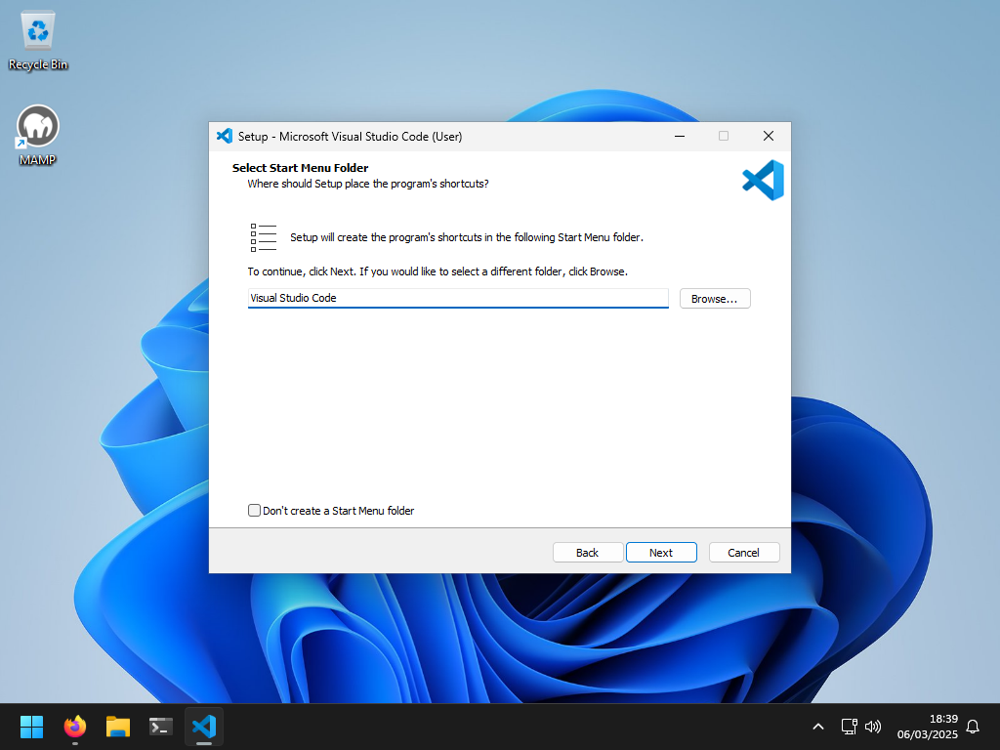
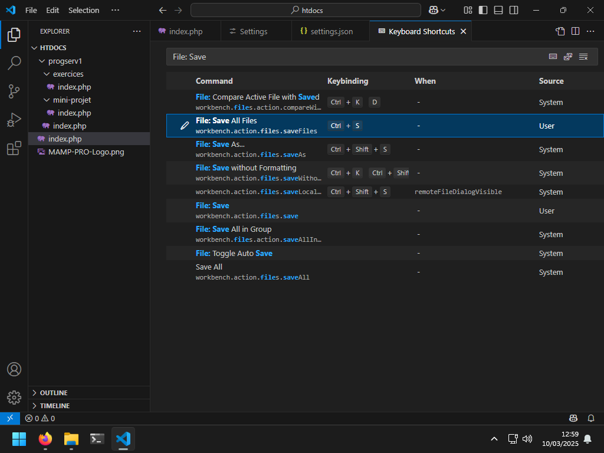
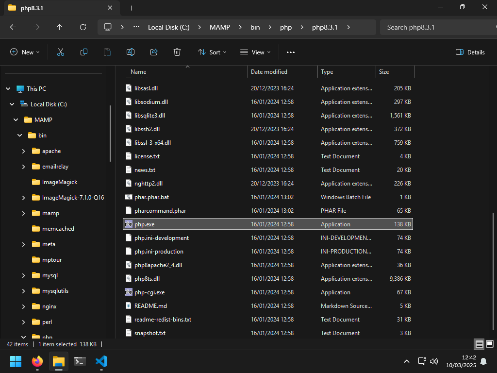
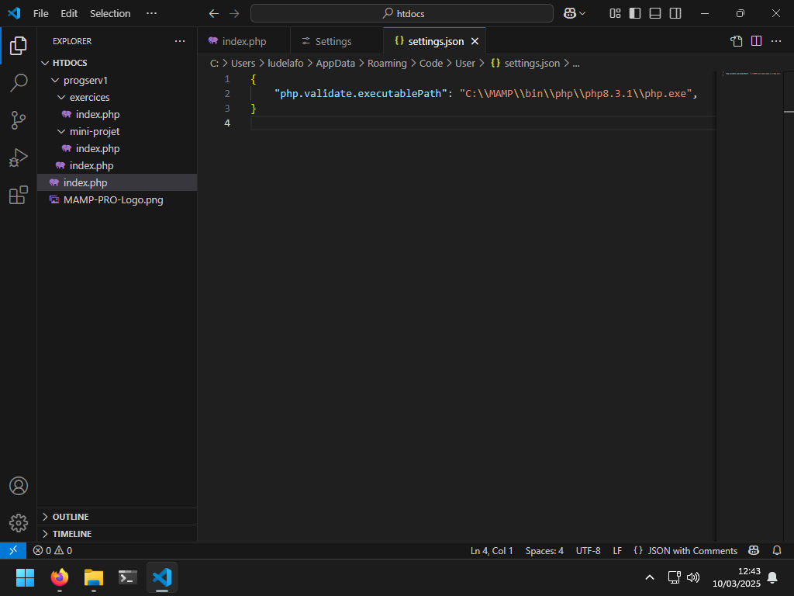

# Cours 01 - Modalités de l'unité d'enseignement et introduction à PHP - Mini-projet

Ce mini-projet est conçu pour vous permettre de mettre en pratique les concepts
théoriques vus dans le cours
_[Cours 01 - Modalités de l'unité d'enseignement et introduction à PHP](../01-theorie/README.md)_.

## Ressources

- Théorie : [Support de cours](../01-theorie/README.md) ·
  [Présentation (web)](https://heig-vd-progserv1-course.github.io/heig-vd-progserv1-course/01-modalites-de-lunite-denseignement-et-introduction-a-php/01-theorie/index.html)
  ·
  [Présentation (PDF)](https://heig-vd-progserv1-course.github.io/heig-vd-progserv1-course/01-modalites-de-lunite-denseignement-et-introduction-a-php/01-theorie/01-modalites-de-lunite-denseignement-et-introduction-a-php-presentation.pdf)
- Mini-projet : [Consignes](../02-mini-project/README.md) ·
  [Solution](../02-mini-project/solution/)
- Exercices : [Énoncés et solutions](../03-exercices/README.md)

## Table des matières

- [Ressources](#ressources)
- [Table des matières](#table-des-matières)
- [Introduction à votre première session de mini-projet](#introduction-à-votre-première-session-de-mini-projet)
- [Présentation du mini-projet](#présentation-du-mini-projet)
- [Objectifs de la session](#objectifs-de-la-session)
- [Installation de l'environnement de développement](#installation-de-lenvironnement-de-développement)
  - [Installation d'un interpréteur PHP](#installation-dun-interpréteur-php)
  - [Configuration de l'interpréteur PHP](#configuration-de-linterpréteur-php)
  - [Installation d'un éditeur de code](#installation-dun-éditeur-de-code)
  - [Configuration de l'éditeur de code](#configuration-de-léditeur-de-code)
  - [Installation des extensions PHP dans Visual Studio Code](#installation-des-extensions-php-dans-visual-studio-code)
- [Initialisation du projet PHP](#initialisation-du-projet-php)
  - [Création de la structure du projet](#création-de-la-structure-du-projet)
  - [Création des fichiers du projet](#création-des-fichiers-du-projet)
  - [Test de l'initialisation du projet](#test-de-linitialisation-du-projet)
- [Solution](#solution)
- [Conclusion](#conclusion)
- [Aller plus loin](#aller-plus-loin)

## Introduction à votre première session de mini-projet

Bienvenue dans la première session du mini-projet qui va vous accompagner durant
toute la durée de l'unité d'enseignement !

Cette session de mini-projet est conçue pour vous permettre de mettre en
pratique les concepts théoriques vus dans le cours
_[Cours 01 - Modalités de l'unité d'enseignement et introduction à PHP](../01-theorie/README.md)_.
N\'hésitez pas à vous y référer si vous avez besoin de rafraîchir votre mémoire.

En lisant les contenus préparés pour les sessions de mini-projet, vous trouverez
peut-être ce que l'on appelle des _"avertissements"_ ou des _"alertes"_.

Elles se présentent comme suit :

> [!NOTE]
>
> Hé ! Je suis une note ! Merci de m'avoir lue !

Elles sont là pour mettre en évidence des informations importantes dont vous
devez tenir compte.

Voici les différents types de remontrances que vous pourriez trouver et leur
signification :

> [!NOTE]
>
> Met en évidence les informations que vous devriez prendre en compte.

> [!TIP]
>
> Informations facultatives pour vous aider à mieux réussir avec des conseils,
> des astuces, ou encore des suggestions.

> [!IMPORTANT]
>
> Informations cruciales nécessaires à la réussite des actions que vous devriez
> effectuer.

> [!WARNING]
>
> Contenu critique exigeant votre attention immédiate en raison des risques
> potentiels.

> [!CAUTION]
>
> Conséquences négatives potentielles d'une action que vous devriez éviter.

Nous pourrions vous rediriger vers de la documentation officielle ou des
ressources externes à suivre pour configurer votre environnement ou en savoir
plus sur un sujet spécifique.

Ces ressources externes sont là pour vous aider. Nous vous redirigeons vers
elles pour éviter de répéter ce qui est déjà bien maintenu et expliqué ailleurs.

Ce que vous voyez et faites dans un chapitre actuel peut être utilisé dans un
chapitre futur.

C'est pourquoi il est important de suivre les étapes et de comprendre ce que
vous faites. Vous devez conserver le code que vous écrivez pour les sessions
futures.

Cependant, si _quoi que ce soit_ n'est pas clair, ne fonctionne pas ou nécessite
une amélioration, n'hésitez pas à poser des questions ou nous le signaler.

L'équipe pédagogique considère qu'il n'y a pas de question bête : vous êtes ici
pour apprendre et nous sommes là pour vous aider ! Travaillons en équipe pour
que vous puissiez réussir !

C'est parti !

> [!TIP]
>
> Le [support de cours](../01-theorie/README.md) est disponible pour vous aider
> à comprendre les concepts théoriques abordés dans ce mini-projet si besoin !

## Présentation du mini-projet

Le mini-projet est une application web qui permettra aux utilisateurs d'ajouter,
consulter, modifier et supprimer des animaux de compagnie.

Chaque animal de compagnie aura les attributs suivants :

- Espèce (un champ de sélection contenant, par exemple : chien, chat, lézard,
  serpent, oiseau, lapin, autre)
- Nom (un champ texte)
- Surnom (un champ texte facultatif)
- Sexe (un champ boutons radio)
- Âge (un champ numérique)
- Photo (un champ de téléversement de fichier facultatif)
- Personnalité (un champ cases à cocher facultatif)
- Taille en cm (un champ numérique facultatif)
- Notes (un champ de texte libre facultatif)

L'application web comportera les pages suivantes :

- **Page d'accueil** : une page d'accueil avec une brève introduction à
  l'application et un lien vers la liste des animaux.
- **Liste des animaux** : une page affichant tous les animaux de la base de
  données avec leur nom, espèce, âge et photo. Chaque animal doit être cliquable
  pour afficher plus de détails.
- **Détail d'un animal** : une page affichant les informations détaillées sur un
  animal spécifique, y compris tous ses attributs. L'utilisateur doit pouvoir
  modifier ou supprimer l'animal depuis cette page.
- **Ajout d'un animal** : une page permettant à l'utilisateur de créer un nouvel
  animal en remplissant un formulaire avec tous les attributs.
- **Modification d'un animal** : une page permettant à l'utilisateur de mettre à
  jour un animal existant en modifiant ses attributs dans un formulaire.
- **Suppression d'un animal** : une page permettant à l'utilisateur de supprimer
  un animal de la base de données.

De plus, les pages suivantes seront disponibles :

- **Page d'inscription** : une page permettant à l'utilisateur de s'inscrire à
  l'application avec un nom d'utilisateur et un mot de passe.
- **Page de connexion** : une page permettant à l'utilisateur de se connecter à
  l'application avec un nom d'utilisateur et un mot de passe.
- **Page de déconnexion** : une page permettant à l'utilisateur de se
  déconnecter de l'application.

L'application web utilisera un cookie pour stocker la langue préférée de
l'utilisateur (anglais ou français) et les notions de sessions pour gérer
l'authentification des utilisateurs.

Nous construirons cette application web ensemble durant la durée de l'unité
d'enseignement en plusieurs étapes. Dans cette session, nous allons mettre en
place l'environnement de développement et initialiser le projet PHP pour le
mini-projet.

## Objectifs de la session

À l'issue de cette session, les personnes qui étudient devraient avoir pu :

- Installer et configurer un environnement de développement pour PHP
- Initialiser un projet PHP pour le mini-projet

## Installation de l'environnement de développement

Un environnement de développement est un ensemble d'outils et de logiciels
nécessaires pour écrire, tester et déboguer des applications logicielles.

Pour ce mini-projet, nous aurons besoin d'un interpréteur PHP et d'un éditeur de
code.

### Installation d'un interpréteur PHP

> [!NOTE]
>
> Si vous avez déjà un interpréteur PHP installé sur votre ordinateur, vous
> pouvez passer directement à la section suivante.

Afin de pouvoir exécuter du code PHP sur votre ordinateur, vous devez installer
un interpréteur PHP. Il s'agit d'un logiciel qui lit le code PHP et le traduit
en instructions que votre ordinateur peut comprendre et l'exécuter.

Il existe plusieurs solutions pour installer cet interpréteur PHP sur votre
ordinateur (par exemple WampServer pour Windows[^wamp], MAMP pour macOS[^mamp],
LAMP pour Linux[^lamp], XAMPP pour Windows, macOS et Linux[^xampp], etc.).
Toutes ces solutions embarquent un serveur web, une base de données et un
interpréteur PHP.

Dans le contexte de ce cours, nous allons installer un interpréteur PHP en
utilisant MAMP, autant pour Windows que pour macOS, car il s'agit d'une des
solutions les plus simples et les plus efficaces à mettre en place. Cela nous
permettra également de s'assurer que tout le monde utilise la même
configuration. Les étapes suivantes vous guideront à travers le processus
d'installation de MAMP sur votre ordinateur.

> [!TIP]
>
> Dans un contexte professionnel, vous pourriez être amené.e à utiliser une
> autre solution pour installer PHP et ses outils associés (serveur web et base
> de données). Cela dépendra de l'infrastructure de votre entreprise et de vos
> besoins spécifiques.
>
> Une solution populaire pour les environnements de production est d'utiliser
> Docker[^docker] pour créer des conteneurs légers et portables qui contiennent
> tout ce dont vous avez besoin pour exécuter une application, y compris un
> serveur web, une base de données et un interpréteur PHP.
>
> Pour ce cours, une solution comme MAMP est suffisante pour nos besoins.

#### Installation sur Windows

Pour installer MAMP sur Windows, suivez les étapes suivantes :

> [!WARNING]
>
> Il se peut que vous rencontriez des erreurs lors de l'installation de MAMP sur
> Windows. Si vous rencontrez des erreurs, veuillez consulter la section
> [_Erreurs courantes de MAMP sur Windows_](#erreurs-courantes-de-mamp-sur-windows)
> pour obtenir de l'aide.

1. Rendez-vous sur le site web de MAMP à l'adresse suivante :
   <https://www.mamp.info/en/downloads/>.

   

2. Téléchargez la dernière version de MAMP pour Windows.
3. Exécutez le programme d'installation que vous venez de télécharger pour
   installer MAMP :

   1. Le programme d'installation de MAMP devrait s'ouvrir. Cliquez sur le
      bouton **Next** pour continuer.

      

   2. Décochez la case **MAMP PRO** pour ne pas installer MAMP PRO et cliquez
      sur le bouton **Next**.

      

   3. Acceptez les termes du contrat de licence et cliquez sur le bouton
      **Next**.
   4. Laissez les paramètres par défaut pour installer MAMP dans le dossier
      `C:\MAMP` et cliquez sur le bouton **Next**.

      

   5. Laissez les paramètres par défaut pour créer un dossier `MAMP` dans le
      menu de démarrage et cliquez sur le bouton **Next**.

      

   6. Choisissez si vous souhaitez avoir un raccourci sur le bureau et cliquez
      sur le bouton **Next**.

      

   7. Une fois que vous avez vérifié les paramètres d'installation, cliquez sur
      le bouton **Install** pour commencer l'installation.

      

4. Une fois l'installation terminée, lancez MAMP.
5. Si une fenêtre s'ouvre concernant le pare-feu Windows, cliquez sur le bouton
   **Autoriser** pour autoriser MAMP à communiquer avec le réseau.

Si vous ne rencontrez pas d'erreurs, vous pouvez passer à la section
[_Configuration de l'interpréteur PHP_](#configuration-de-linterpréteur-php).

Si vous rencontrez des erreurs, veuillez consulter la section
[_Erreurs courantes de MAMP sur Windows_](#erreurs-courantes-de-mamp-sur-windows)
pour obtenir de l'aide.

##### Erreurs courantes de MAMP sur Windows

###### _"You must install NET Desktop Runtime to run this application."_

Si vous rencontrez cette erreur lors de l'exécution de MAMP, vous devez
installer le moteur d'exécution
[.NET Desktop 6.0](https://dotnet.microsoft.com/en-us/download/dotnet/6.0). Pour
ce faire, suivez les étapes suivantes :

1. Rendez-vous sur le site web de Microsoft aux adresses suivantes pour
   télécharger le moteur d'exécution .NET Desktop :
   - [.NET Desktop Runtime 6.0.36 (Windows x86)](https://dotnet.microsoft.com/en-us/download/dotnet/thank-you/runtime-desktop-6.0.36-windows-x86-installer)
   - [.NET Desktop Runtime 6.0.36 (Windows x64)](https://dotnet.microsoft.com/en-us/download/dotnet/thank-you/runtime-desktop-6.0.36-windows-x64-installer)
2. Les programmes d'installation devraient commencer à se télécharger.
3. Exécutez les programmes d'installation que vous venez de télécharger pour
   installer le moteur d'exécution .NET Desktop.
4. Une fois les installations terminées, relancez MAMP.

###### _"`MSVCR110.dll`/`MSVCR120.dll`/`MSVCR140.dll`/`VCRUNTIME140.dll` is missing."_

Si vous rencontrez cette erreur lors de l'exécution de MAMP, vous devez
installer les moteurs d'exécution
[Microsoft C et C++ (MSVC)](https://learn.microsoft.com/en-us/cpp/windows/latest-supported-vc-redist).
Pour ce faire, suivez les étapes suivantes :

1. Rendez-vous sur le site web de Microsoft aux adresses suivantes pour
   télécharger les moteurs d'exécution Microsoft C et C++ (MSVC) :
   - [Visual Studio 2015, 2017, 2019, and 2022 (Windows x86)](https://aka.ms/vs/17/release/vc_redist.x86.exe)
   - [Visual Studio 2015, 2017, 2019, and 2022 (Windows x64)](https://aka.ms/vs/17/release/vc_redist.x64.exe)
   - [Visual Studio 2012 (Windows x86)](https://download.microsoft.com/download/1/6/B/16B06F60-3B20-4FF2-B699-5E9B7962F9AE/VSU_4/vcredist_x86.exe)
   - [Visual Studio 2012 (Windows x64)](https://download.microsoft.com/download/1/6/B/16B06F60-3B20-4FF2-B699-5E9B7962F9AE/VSU_4/vcredist_x64.exe)
   - [Visual Studio 2010 (Windows x86)](https://download.microsoft.com/download/1/6/5/165255E7-1014-4D0A-B094-B6A430A6BFFC/vcredist_x86.exe)
   - [Visual Studio 2010 (Windows x64)](https://download.microsoft.com/download/1/6/5/165255E7-1014-4D0A-B094-B6A430A6BFFC/vcredist_x64.exe)
2. Les programmes d'installation devraient commencer à se télécharger.
   **Attention** : tous les programmes d'installation portent le même nom, il
   est important de tous les télécharger.
3. Exécutez les programmes d'installation que vous venez de télécharger pour
   installer les moteurs d'exécution Microsoft C et C++ (MSVC).
4. Une fois les installations terminées, relancez MAMP.

###### Autres erreurs

Merci de venir nous consulter pour obtenir de l'aide pour résoudre les autres
erreurs que vous pourriez rencontrer lors de l'installation de MAMP sur Windows.

#### Installation sur macOS

Pour installer MAMP sur macOS, suivez les étapes suivantes :

> [!WARNING]
>
> Sélectionnez la bonne version de MAMP pour macOS en fonction de l'architecture
> de votre processeur (Intel ou Apple Silicon). Les personnes avec des appareils
> Apple M1, M2 ou M3 doivent télécharger la version ARM de MAMP.

1. Rendez-vous sur le site web de MAMP à l'adresse suivante :
   <https://www.mamp.info/en/downloads/>.

   

2. Téléchargez la dernière version de MAMP pour macOS adaptée à votre
   architecture de processeur.
3. Ouvrez le fichier `.dmg` que vous venez de télécharger.
4. Faites glisser l'icône de MAMP dans le dossier `Applications`.
5. Ouvrez le dossier `Applications` et double-cliquez sur l'icône de MAMP pour
   le lancer.

Si vous ne rencontrez pas d'erreurs, vous pouvez passer à la section
[_Configuration de l'interpréteur PHP_](#configuration-de-linterpréteur-php).

Si vous rencontrez des erreurs, veuillez consulter la section
[_Erreurs courantes de MAMP sur macOS_](#erreurs-courantes-de-mamp-sur-macos)
pour obtenir de l'aide.

##### Erreurs courantes de MAMP sur macOS

###### _"MAMP can't be opened because it is from an unidentified developer."_

Si vous rencontrez une erreur de permission lors de l'exécution de MAMP, vous
devez accorder les permissions nécessaires à MAMP pour qu'il fonctionne
correctement. Pour ce faire, suivez les étapes suivantes décrites dans la
documentation officielle d'Apple :
[Apple - Ouvrir une app Mac provenant d’un développeur inconnu](https://support.apple.com/fr-ch/guide/mac-help/mh40616/mac).

### Configuration de l'interpréteur PHP

Une fois que vous avez installé MAMP, vous devez le configurer pour qu'il
fonctionne correctement avec PHP.

Pour ce faire, suivez les étapes suivantes :

1. Lancez MAMP si ce n'est pas déjà fait. Vous devriez voir les icônes des
   serveurs Apache et MySQL en vert dans la barre de menu de MAMP, indiquant que
   les services sont bien en cours d'exécution.

   

2. Accédez aux paramètres de MAMP au travers du menu **MAMP > Preferences**.
3. Dans l'onglet **Start/Stop**, cochez les cases **Start Servers when starting
   MAMP** et **Stop Servers when quitting MAMP** afin de démarrer et d'arrêter
   automatiquement les serveurs web et de base de données lorsque vous lancez et
   fermez MAMP.

   

4. Dans l'onglet **Ports**, assurez-vous que les ports pour Apache et MySQL sont
   configurés sur les valeurs par défaut (Apache : `80`, MySQL : `3306`).

   

5. Dans l'onglet **PHP**, sélectionnez la version de PHP que vous souhaitez
   utiliser pour le projet. Nous vous recommandons d'utiliser la dernière
   version de PHP disponible.

   

6. Dans l'onglet **Server**, assurez-vous que le dossier racine de votre projet
   PHP est `C:\MAMP\htdocs` pour Windows ou `/Applications/MAMP/htdocs` pour
   macOS. Il s'agit de l'endroit où vous allez stocker tous les fichiers de vos
   différents projets PHP. De plus, assurez-vous que le serveur Apache est
   sélectionné.

   

7. Dans l'onglet **Cloud**, assurez-vous que les services Cloud de MAMP sont
   désactivés.

   

8. Cliquez sur le bouton **OK** pour enregistrer les paramètres de MAMP.
9. Redémarrez MAMP pour appliquer les changements.
10. Validez que MAMP a bien démarré en vérifiant que les icônes des serveurs
    Apache et MySQL sont vertes dans la barre de menu de MAMP.
11. Ouvrez votre navigateur web et accédez à l'adresse <http://localhost/>. Vous
    devriez voir la page d'accueil de MAMP.

    

Votre installation est maintenant terminée et vous êtes prêt.e à commencer à
développer des applications PHP avec MAMP !

### Installation d'un éditeur de code

Un éditeur de code est un logiciel qui vous permet d'écrire, de modifier et de
gérer du code source pour des applications logicielles. Il existe de nombreux
éditeurs de code disponibles, chacun avec ses propres fonctionnalités et
avantages.

Nous vous recommandons d'utiliser Visual Studio Code, un éditeur de code gratuit
et open-source développé par Microsoft[^visual-studio-code], mais vous pouvez
utiliser n'importe quel éditeur de code avec lequel vous êtes à l'aise pour le
reste de cette unité d'enseignement.

#### Installation sur Windows

Pour installer Visual Studio Code sur Windows, suivez les étapes suivantes :

1. Rendez-vous sur le site web de Visual Studio Code à l'adresse suivante :
   <https://code.visualstudio.com/>.

   

2. Téléchargez la dernière version de Visual Studio Code pour Windows.
3. Exécutez le programme d'installation que vous venez de télécharger pour
   installer Visual Studio Code :

   1. Le programme d'installation de Visual Studio Code devrait s'ouvrir.
      Acceptez les termes du contrat de licence et cliquez sur le bouton
      **Next**.

      

   2. Laissez les paramètres par défaut pour installer Visual Studio Code sur
      votre ordinateur et cliquez sur le bouton **Next**.

      

   3. Laissez les paramètres par défaut pour créer un dossier
      `Visual Studio Code` dans le menu de démarrage et cliquez sur le bouton
      **Next**.

      

   4. Choisissez si vous souhaitez avoir un raccourci sur le bureau et
      sélectionnez les options supplémentaires pour ajouter Visual Studio Code
      au menu contextuel de l'Explorateur Windows. Cela vous permettra de faire
      un clic droit sur n'importe quel dossier et d'ouvrir Visual Studio Code
      directement dans ce dossier. Cliquez ensuite sur le bouton **Next**.

      

   5. Une fois que vous avez vérifié les paramètres d'installation, cliquez sur
      le bouton **Install** pour commencer l'installation.

      

4. Une fois l'installation terminée, lancez Visual Studio Code.

Vous pouvez maintenant passer à la section
[_Configuration de l'éditeur de code_](#configuration-de-léditeur-de-code).

#### Installation sur macOS

Pour installer Visual Studio Code sur macOS, suivez les étapes suivantes :

> [!WARNING]
>
> Sélectionnez la bonne version de Visual Studio Code pour macOS en fonction de
> l'architecture de votre processeur (Intel ou Apple Silicon). Les personnes
> avec des appareils Apple M1, M2 ou M3 doivent télécharger la version ARM de
> Visual Studio Code.

1. Rendez-vous sur le site web de Visual Studio Code à l'adresse suivante :
   <https://code.visualstudio.com/>.

   

2. Téléchargez la dernière version de Visual Studio Code pour macOS.
3. Ouvrez le fichier `.dmg` que vous venez de télécharger.
4. Faites glisser l'icône de Visual Studio Code dans le dossier `Applications`.
5. Ouvrez le dossier `Applications` et double-cliquez sur l'icône de Visual
   Studio Code pour le lancer.

Vous pouvez maintenant passer à la section
[_Configuration de l'éditeur de code_](#configuration-de-léditeur-de-code).

#### Installation sur Linux

_Si vous utilisez Linux, veuillez nous consulter pour obtenir de l'aide pour
installer un éditeur de code sur votre ordinateur._

### Configuration de l'éditeur de code

Une fois que vous avez installé Visual Studio Code, vous devez le configurer
pour qu'il fonctionne correctement avec PHP.

#### Ouverture du dossier racine du projet

Afin de travailler sur votre projet PHP, vous devez ouvrir le dossier racine du
projet dans Visual Studio Code. Pour ce faire, suivez les étapes suivantes :

1. Lancez Visual Studio Code.

   

2. Cliquez sur le menu **File > Open Folder...**.
3. Une fenêtre de dialogue s'ouvrira pour vous permettre de sélectionner le
   dossier racine de votre projet PHP. Sélectionnez le dossier racine de votre
   projet PHP (par exemple, `C:\MAMP\htdocs` pour Windows ou
   `/Applications/MAMP/htdocs` pour macOS) et cliquez sur le bouton **Open**. Il
   s'agira de votre dossier de travail pour le reste de l'unité d'enseignement.

   

4. Visual Studio Code ouvrira le dossier racine du projet. Un avertissement de
   sécurité vous demande si vous faites confiance aux auteurs du dossier.
   Cliquez sur le bouton **Yes, I trust the authors** pour continuer.

   

5. Visual Studio Code affichera tous les fichiers et dossiers qu'il contient
   dans l'explorateur de fichiers.

   

6. Un message d'avertissement devrait s'afficher en bas à droit. Nous allons y
   revenir plus tard.

Votre projet est maintenant ouvert dans Visual Studio Code.

#### Configuration des raccourcis clavier pour la sauvegarde de tous les fichiers

Pas défaut, Visual Studio Code ne sauvegarde que le fichier courant lorsque vous
appuyez sur `Ctrl + S` (Windows/Linux) ou `Cmd + S` (macOS). Pour sauvegarder
tous les fichiers ouverts dans Visual Studio Code, vous devez configurer les
raccourcis clavier pour qu'ils sauvegardent tous les fichiers.

Pour ce faire, suivez les étapes suivantes :

1. Cliquez sur le menu **File > Preferences > Keyboard Shortcuts**.
2. Recherchez `File: Save All Files` dans la barre de recherche.
3. Assignez les touches de raccourci de votre choix pour sauvegarder tous les
   fichiers ouverts dans Visual Studio Code. Nous vous recommandons d'utiliser
   utiliser `Ctrl + S` (Windows/Linux) ou `Cmd + S` (macOS) à des fins de
   facilité.

   

#### Configuration de l'interpréteur PHP dans Visual Studio Code

Pour que Visual Studio Code puisse vous aidez lors de la rédaction de code PHP,
vous devez configurer l'interpréteur PHP dans les paramètres de l'éditeur de
code. Pour ce faire, suivez les étapes suivantes :

1. Identifier où est installé l'interpréteur PHP sur votre ordinateur. Avec
   MAMP, il est installé par défaut dans le dossier `C:\MAMP\bin\php` pour
   Windows ou `/Applications/MAMP/bin/php` pour macOS.
2. Identifier la version de PHP à utiliser. Selon votre configuration MAMP, il
   faut sélectionner la même version que celle configurée dans MAMP. Dans la
   capture suivante, la version 8.3.1 est utilisée. Vous pouvez vérifier la
   version de PHP dans MAMP en cliquant sur le bouton **Preferences** dans la
   fenêtre principale de MAMP. Vous en aurez besoin pour configurer Visual
   Studio Code par la suite.

   

3. Dans Visual Studio Code, cliquez sur le menu **File > Preferences >
   Settings** et cherchez `php.validate.executablePath`.

   

4. Cliquez sur le bouton **Edit in settings.json** pour ouvrir le fichier de
   configuration de Visual Studio Code.
5. Ajoutez la ligne suivante dans le fichier de configuration :

   ```json
   "php.validate.executablePath": "<PATH_TO_PHP_EXECUTABLE>"
   ```

   Remplacez `<PATH_TO_PHP_EXECUTABLE>` par le chemin d'accès à l'exécutable PHP
   sur votre ordinateur. Par exemple, `C:\\MAMP\\bin\\php\\php8.3.1\\php.exe`
   pour Windows ou `/Applications/MAMP/bin/php/php8.3.1/bin/php` pour macOS.

   **Attention**, assurez-vous de remplacer `<PATH_TO_PHP_EXECUTABLE>` par le
   chemin d'accès correct à l'exécutable PHP sur votre ordinateur trouvé à
   l'étape 2.

   

Cela permettra de configurer Visual Studio Code pour qu'il utilise
l'interpréteur PHP installé avec MAMP pour valider le code PHP que vous écrivez.

Votre environnement de développement est maintenant configuré pour travailler
avec PHP dans Visual Studio Code !

### Installation des extensions PHP dans Visual Studio Code

Visual Studio Code dispose d'un écosystème d'extensions qui vous permet
d'ajouter des fonctionnalités supplémentaires à l'éditeur de code.

Pour travailler avec PHP, nous vous recommandons d'installer l'extension
[PHP Intelephense](https://marketplace.visualstudio.com/items?itemName=bmewburn.vscode-intelephense-client).

Elle permettra d'ajouter des fonctionnalités d'auto-complétion et de validation
du code PHP dans Visual Studio Code, augmentant ainsi votre productivité.

Pour installer l'extension PHP Intelephense, suivez les étapes suivantes :

1. Cliquez sur l'icône des extensions dans la barre latérale de Visual Studio
   Code ou appuyez sur `Ctrl + Shift + X` (Windows/Linux) ou `Cmd + Shift + X`
   (macOS).

   

2. Recherchez `PHP Intelephense` dans la barre de recherche.

   

3. Sélectionnez l'extension `PHP Intelephense` dans les résultats de la
   recherche.

   

4. Cliquez sur le bouton **Install** pour installer l'extension. Un
   avertissement de sécurité vous demande si vous faites confiance aux auteurs
   de l'extension. Cliquez sur le bouton **Trust Publisher & Install** pour
   continuer.

   

5. Une fois l'extension installée, vous devriez voir une confirmation de
   l'installation.

## Initialisation du projet PHP

Pour valider que tout fonctionne correctement, nous allons initialiser le projet
PHP pour le mini-projet.

### Création de la structure du projet

Pour commencer, nous allons créer la structure de fichiers et de dossiers pour
le projet PHP. Cette structure nous permettra d'organiser les fichiers PHP tout
au long du mini-projet. Cette structure va évoluer au fur et à mesure que nous
ajouterons de nouvelles fonctionnalités à l'application web que nous allons
construire.

Commencez par créer les dossiers suivants dans le dossier racine du projet :

```text
progserv1/
├── exercices/
└── mini-projet/
```

Le dossier `progserv1` permettra de contenir tous les exercices et le
mini-projet de l'unité d'enseignement "Programmation serveur 1". De cette
manière, vous pourrez réutiliser la même structure de dossiers pour de futurs
unités d'enseignement, notamment "Programmation serveur 2" ou "Développement de
produits média".

Le dossier `exercices` contiendra tous les exercices réalisés durant l'unité
d'enseignement "Programmation serveur 1". Vous pourrez l'utiliser pour stocker
les exercices de chaque session et faire des tests et expérimentations.

Le dossier `mini-projet` contiendra tous les fichiers et dossiers nécessaires
pour le mini-projet de l'unité d'enseignement "Programmation serveur 1". C'est
dans ce dossier que vous allez construire l'application web pour gérer les
animaux de compagnie.

### Création des fichiers du projet

Créez maintenant les fichiers suivants dans les différents dossiers du projet :

```text
progserv1/
├── exercices/
│   └── index.php
├── mini-projet/
│   └── index.php
├── index.php
└── phpinfo.php
```

Dans le fichier `progserv1/index.php`, ajoutez le code suivant :

```php
<?php
echo "Bonjour à toutes les personnes du cours de Programmation serveur 1 !";
```

Dans le fichier `progserv1/phpinfo.php`, ajoutez le code suivant :

```php
<?php
phpinfo();
```

La fonction `phpinfo()` affiche des informations sur la configuration de PHP
installée sur votre ordinateur. Cela vous permettra de vérifier que PHP est
correctement installé et configuré.

Dans le fichier `progserv1/exercices/index.php`, ajoutez le code suivant :

```php
<?php
echo "Bienvenue dans les exercices de l'unité d'enseignement Programmation serveur 1 !";
```

Dans le fichier `progserv1/mini-projet/index.php`, ajoutez le code suivant :

```php
<?php
echo "Bienvenue dans le mini-projet de l'unité d'enseignement Programmation serveur 1 !";
```

Sauvez tous les fichiers.

### Test de l'initialisation du projet

Ouvrez votre navigateur web et accédez à l'adresse suivante :
<http://localhost/progserv1/index.php>. Vous devriez voir le message suivant :

```text
Bonjour à toutes les personnes du cours de Programmation serveur 1 !
```

Si vous accédez à l'adresse <http://localhost/progserv1/phpinfo.php>, vous
devriez voir les informations de configuration de PHP avec sa version, les
extensions installées, les paramètres du serveur, etc.

Cela signifie que l'initialisation du projet PHP pour le mini-projet a été
réussie !

Testez également les adresses suivantes pour vérifier que les fichiers des
exercices et du mini-projet fonctionnent correctement :

- Exercices : <http://localhost/progserv1/exercices/index.php>
- Mini-projet : <http://localhost/progserv1/mini-projet/index.php>

## Solution

Vous pouvez trouver la solution du mini-projet PHP à l'adresse suivante :
[`solution`](./solution/).

## Conclusion

Dans cette première session de mini-projet, vous avez installé et configuré un
environnement de développement pour PHP. Grâce à MAMP et Visual Studio Code,
vous avez mis en place un environnement de développement complet pour écrire,
tester et déboguer des applications PHP qui vous sera utile pour les sessions et
les unités d'enseignement à venir.

Vous avez également initialisé un projet PHP pour le mini-projet et testé
l'initialisation du projet. Vous êtes maintenant prêt.e à commencer à construire
l'application web pour gérer les animaux de compagnie !

## Aller plus loin

_Ceci est une section optionnelle pour les personnes qui souhaitent aller plus
loin. Vous pouvez la sauter si vous n'avez pas de temps._

- Êtes-vous capable de modifier les fichiers PHP pour y incorporer des balises
  HTML et CSS pour rendre les pages plus attrayantes ?
- Êtes-vous capable de changer les messages affichés dans les fichiers PHP pour
  quelque chose de plus personnel ?

[^docker]: Docker, [docker.com](https://www.docker.com/), 09 mars 2025
[^lamp]:
    LAMP,
    [en.wikipedia.org](<https://en.wikipedia.org/wiki/LAMP_(software_bundle)>),
    09 mars 2025

[^mamp]: MAMP, [mamp.info](https://www.mamp.info/), 09 mars 2025
[^visual-studio-code]:
    Visual Studio Code, [code.visualstudio.com](https://code.visualstudio.com/),
    10 mars 2025

[^wamp]: WampServer, [wampserver.com](https://www.wampserver.com/), 09 mars 2025
[^xampp]:
    XAMPP, [apachefriends.org](https://www.apachefriends.org/), 09 mars 2025
