# Acquérir un environnement de production sur Infomaniak

L. Delafontaine, avec l'aide de
[GitHub Copilot](https://github.com/features/copilot).

Ce travail est sous licence [CC BY-SA 4.0][licence].

## Table des matières

- [Table des matières](#table-des-matières)
- [Objectifs](#objectifs)
- [Configurer l'environnement de production en ligne](#configurer-lenvironnement-de-production-en-ligne)
  - [Accéder au programme étudiant d'Infomaniak](#accéder-au-programme-étudiant-dinfomaniak)
  - [Créer un hébergement web](#créer-un-hébergement-web)
  - [Désactiver le renouvellement automatique](#désactiver-le-renouvellement-automatique)
  - [Accéder aux hébergements web](#accéder-aux-hébergements-web)
  - [Accéder au tableau de bord de l'hébergement web spécifique](#accéder-au-tableau-de-bord-de-lhébergement-web-spécifique)
  - [Renommer l'hébergement web](#renommer-lhébergement-web)
  - [Ajouter un nouveau site (optionnel)](#ajouter-un-nouveau-site-optionnel)
  - [Configurer le site web](#configurer-le-site-web)
  - [Accéder au site web](#accéder-au-site-web)
  - [Sécuriser l'application avec HTTPS](#sécuriser-lapplication-avec-https)
  - [Effectuer la demande de remboursement auprès de la HEIG-VD](#effectuer-la-demande-de-remboursement-auprès-de-la-heig-vd)
  - [Renouveler/révoquer le programme étudiant d'Infomaniak](#renouvelerrévoquer-le-programme-étudiant-dinfomaniak)
  - [Valider la configuration de l'environnement de production en ligne](#valider-la-configuration-de-lenvironnement-de-production-en-ligne)
- [Déployer une application PHP sur l'hébergement web](#déployer-une-application-php-sur-lhébergement-web)

## Objectifs

L'objectif de ce document est de vous guider à travers le processus
d'acquisition d'un environnement de production en ligne pour votre projet de
cours sur Infomaniak, un fournisseur de services d'hébergement web suisse.

## Configurer l'environnement de production en ligne

Dans cette section, nous allons configurer l'environnement de production en
ligne. Cet environnement de production en ligne vous permettra de déployer votre
application web sur Internet et de la rendre accessible à tout le monde.

> [!NOTE]
>
> Les terminologies utilisées par Infomaniak pour désigner les différents
> services peuvent être déroutantes :
>
> - Un _"hébergement web"_ est un service qui vous permet de déployer votre
>   application web sur Internet.
> - Un _"site"_ est une application web déployée sur un hébergement web, qui
>   peut être associée à un nom de domaine ou à un sous-domaine.
> - Un _"nom de domaine"_ est l'adresse web (URL) que les utilisateur.trices
>   utiliseront pour accéder à votre application web.
>
> Un _"hébergement web"_ permet donc d'héberger plusieurs _"sites"_, chacun
> pouvant être associé à un _"nom de domaine"_ (ou sous-domaine) différent.
>
> Par exemple, vous pouvez avoir un hébergement web avec deux sites associés :
> `www.mondomaine1.ch` et `www.mondomaine2.ch`. Chaque site peut avoir son
> propre contenu et sa propre configuration, mais ils partagent les ressources
> de l'hébergement web (par exemple, l'espace de stockage, la bande passante,
> etc.).
>
> Cette section a pour objectif de vous guider à travers le processus de
> création d'un hébergement web avec Infomaniak. Un hébergement web est
> nécessaire pour déployer votre application web sur Internet et la rendre
> accessible à tout le monde.

### Accéder au programme étudiant d'Infomaniak

> [!NOTE]
>
> Il se peut que vous ayez déjà accès au programme étudiant d'Infomaniak au
> travers d'un précédent cours.
>
> Si c'est le cas, vous pouvez passer directement à la section
> [Créer un hébergement web](#créer-un-hébergement-web).

Afin d'accéder au programme étudiant d'Infomaniak, vous devez accéder à la page
dédiée au programme étudiant d'Infomaniak à l'adresse suivante :
<https://www.infomaniak.com/fr/education>.

Afficher la capture d'écran illustrant l'étape

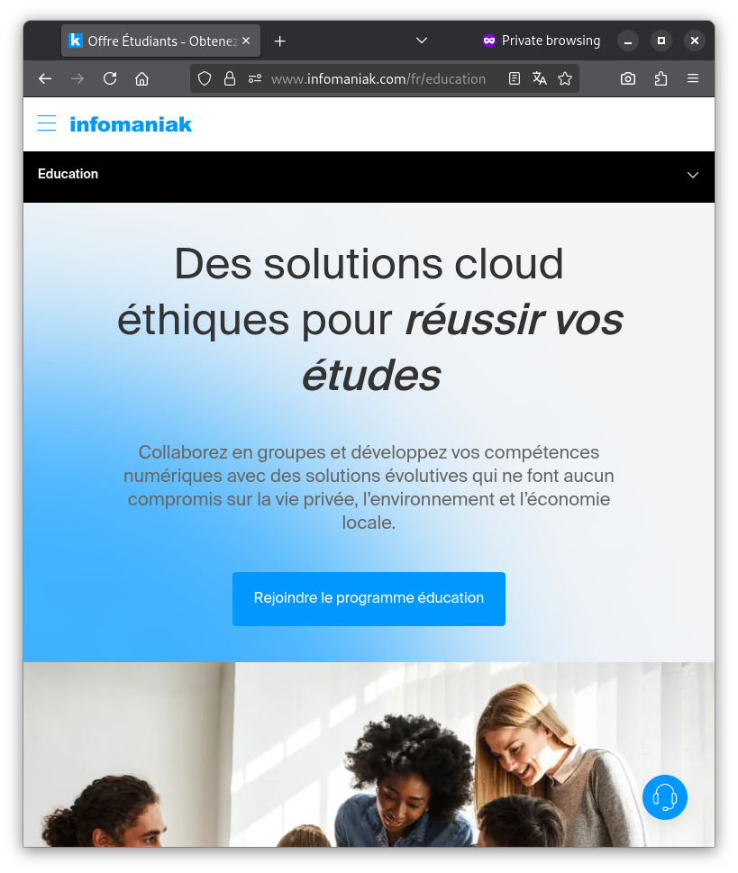

À l'aide du bouton **Rejoindre le programme étudiant**, vous pouvez créer un
compte Infomaniak en utilisant votre adresse e-mail HEIG-VD. Si vous avez déjà
un compte Infomaniak, vous pouvez l'utiliser pour accéder au programme étudiant.

Afficher la capture d'écran illustrant l'étape

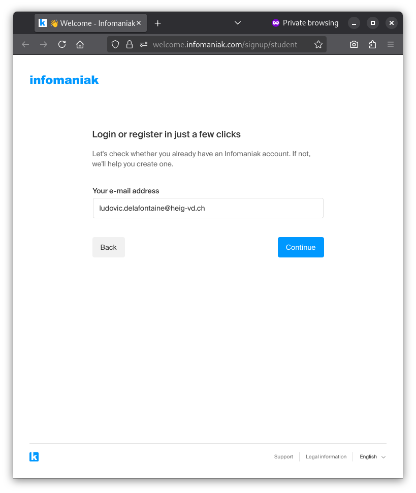

Si vous avez plusieurs organisations Infomaniak (par exemple, si vous avez créé
un compte Infomaniak pour un projet personnel), assurez-vous de choisir la bonne
organisation lors de votre inscription au programme étudiant.

Afficher la capture d'écran illustrant l'étape

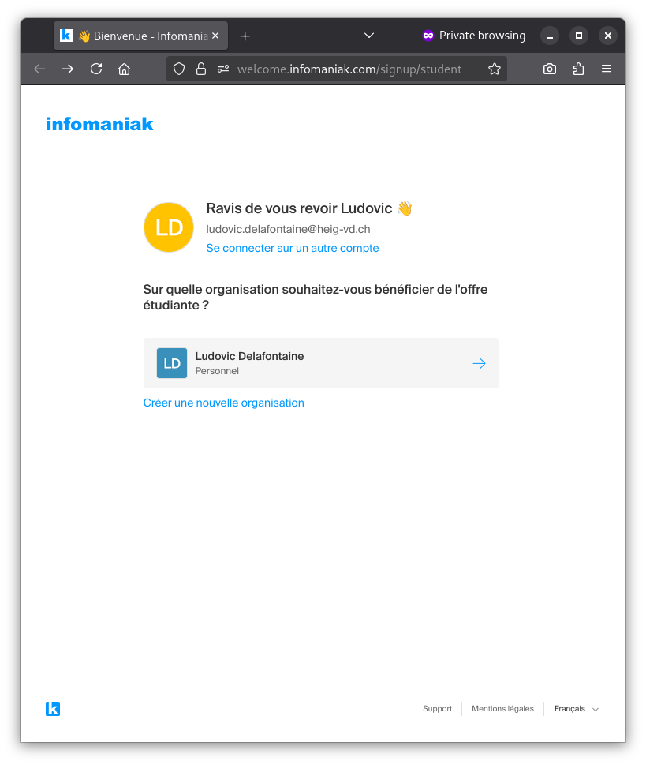

Une fois la bonne organisation sélectionnée, vous devez fournir une preuve que
vous êtes étudiant.e à la HEIG-VD. Pour cela, vous pouvez utiliser votre carte
d'étudiant.e ou votre attestation d'étude. Vous devez également fournir une
adresse e-mail HEIG-VD pour vérifier que vous êtes bien étudiant.e à la HEIG-VD.

Saisissez le nom de votre école (_"HEIG-VD"_) et votre adresse e-mail HEIG-VD
dans le formulaire.

Afficher la capture d'écran illustrant l'étape

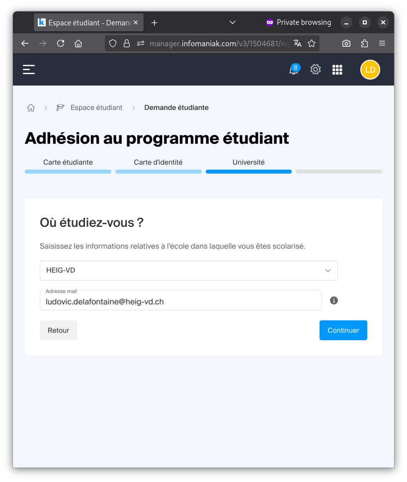

Après avoir soumis le formulaire, vous recevrez un e-mail de confirmation à
votre adresse e-mail HEIG-VD. Cliquez sur le lien dans l'e-mail pour confirmer
votre inscription au programme étudiant.

Afficher la capture d'écran illustrant l'étape

Une fois votre inscription confirmée, Infomaniak vérifiera votre statut
d'étudiant.e auprès de la HEIG-VD. Ce processus peut prendre quelques jours.
Vous pouvez vérifier le statut de votre demande dans votre compte Infomaniak.

> [!IMPORTANT]
>
> Infomaniak peut mettre plusieurs jours ouvrables pour vérifier votre statut
> d'étudiant.e. Vous recevrez un e-mail de confirmation une fois que votre
> statut sera approuvé.
>
> Si vous ne recevez pas d'e-mail de confirmation dans les 7 jours, annoncez-le
> à votre enseignant.e.
>
> Pendant que votre statut d'étudiant.e est en attente d'approbation, passez à
> la section [Initialiser les exercices](#initialiser-les-exercices).

Afficher les captures d'écran illustrant l'étape

Une fois votre statut d'étudiant.e approuvé par Infomaniak, connectez-vous à
votre compte Infomaniak et accédez à la page du programme étudiant pour vérifier
que votre statut est bien approuvé.

Afficher la capture d'écran illustrant l'étape

### Créer un hébergement web

> [!NOTE]
>
> Il se peut que vous ayez déjà un hébergement web au travers d'un précédent
> cours.
>
> Si c'est le cas, vous pouvez passer directement à la section
> [Désactiver le renouvellement automatique](#désactiver-le-renouvellement-automatique).

Afin de commander un hébergement web, vous pouvez vous rendre la page page
suivante : <https://shop.infomaniak.com/order2/domain?hosting_order=true>.

La première étape consiste à choisir un nom de domaine pour votre hébergement
web.

Le nom de domaine que vous choisirez sera utilisé également dans d'autres cours
enseignés à la HEIG-VD. Vous êtes libre de choisir le nom de domaine que vous
souhaitez, mais nous vous recommandons de choisir un nom de domaine qui vous
représente et qui est facile à retenir. Par exemple, vous pouvez choisir un nom
de domaine qui contient votre prénom, votre nom de famille ou encore votre
pseudonyme habituel sur Internet.

Il s'agit peut-être d'une occasion pour vous créer une identité numérique en
ligne avec un nom de domaine qui vous représente et qui fera office de vitrine
pour vos projets personnels et professionnels.

Le nom de domaine vous appartient et vous permet d'accéder à votre application
web en utilisant une adresse web personnalisée (par exemple,
`www.mondomaine.ch`).

Nous vous recommandons d'activer l'option de confidentialité (_"Domain
Privacy"_) du nom de domaine pour protéger vos informations personnelles.
L'option pour accélérer l'accès au site web (_"DNS Fast Anycast"_) n'est pas
nécessaire pour ce cours.

Afficher la capture d'écran illustrant l'étape

Une fois le nom de domaine choisi, vous devez saisir vos coordonnées de
facturation. Même si vous ne serez pas facturé pour l'hébergement web dans le
cadre du programme étudiant, Infomaniak exige ces informations pour créer
l'hébergement web. C'est la raison pour laquelle l'option _"Domain Privacy"_ est
recommandée pour protéger vos informations personnelles.

Afficher la capture d'écran illustrant l'étape

Sélectionnez maintenant un plan d'hébergement web. Choisissez le plan
_"Hébergement Web"_.

Afficher la capture d'écran illustrant l'étape

Sélectionnez l'option _"Je n'ai pas encore besoin d'adresse mail"_, comme nous
n'en aurons pas besoin pour le moment.

Afficher la capture d'écran illustrant l'étape

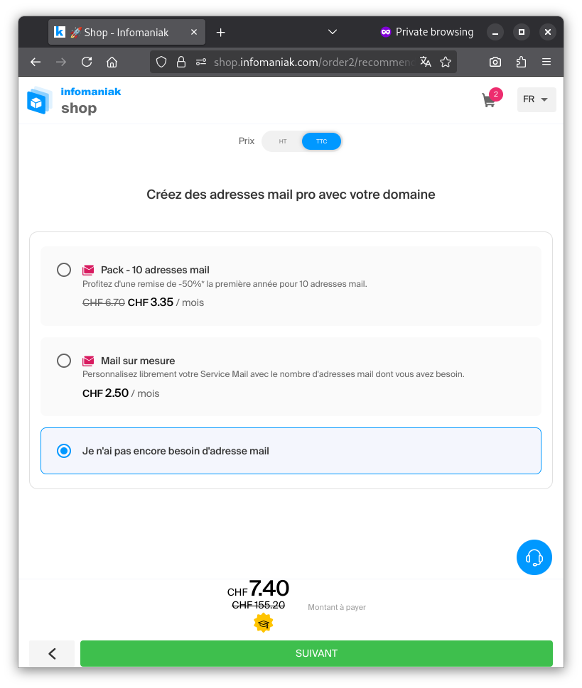

Confirmez que vous serez propriétaire du nom de domaine et de l'hébergement web.
Toutes autres options peuvent être ignorées (_"Continuer sans Renewal
Guarantee"_).

Validez votre commande.

> [!CAUTION]
>
> Assurez-vous de bénéficier du programme étudiant d'Infomaniak avant de valider
> votre commande. L'hébergement web doit être gratuit dans le cadre du programme
> étudiant d'Infomaniak. Si vous ne bénéficiez pas du programme étudiant, vous
> serez facturé pour l'hébergement web.

> [!WARNING]
>
> Vous avez droit jusqu'à 20 hébergements web gratuits dans le cadre du
> programme étudiant d'Infomaniak. Il est néanmoins obligatoire d'acquérir un
> nom de domaine pour votre projet que vous devrez payer vous-même (environ 10
> CHF pour une année). Ce montant peut être remboursé par la HEIG-VD si vous
> effectuez la demande de remboursement (voir ci-après).

Afficher la capture d'écran illustrant l'étape

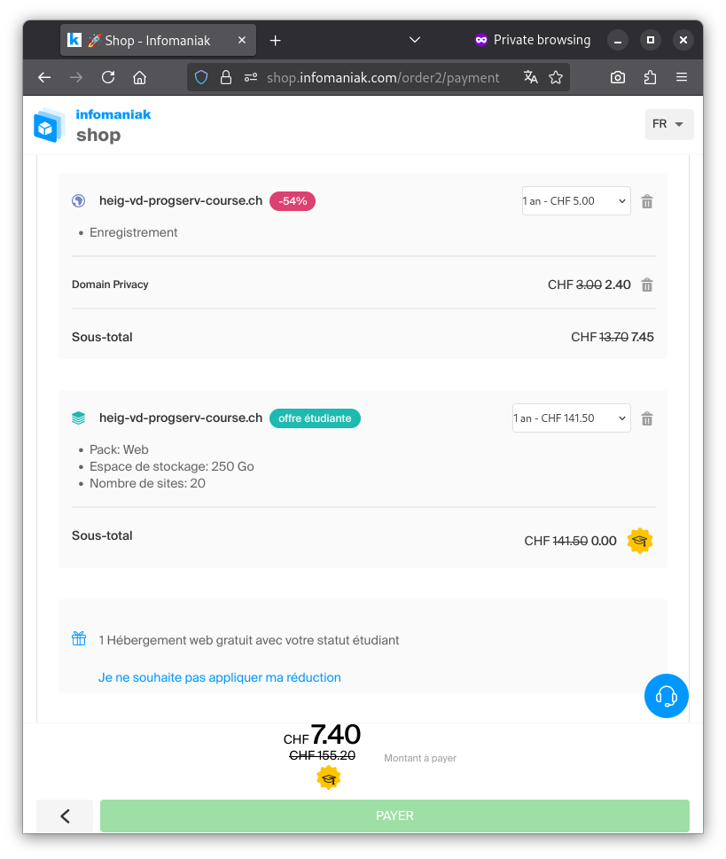

> [!TIP]
>
> Le même nom de domaine peut être utilisé pour plusieurs hébergements web (par
> exemple, pour différents projets) à l'aide de sous-domaines (par exemple,
> `projet1.mondomaine.ch`, `projet2.mondomaine.ch`, etc.).
>
> Cela peut être utile pour organiser vos différents projets sous un même nom de
> domaine, par exemple `progserv1.mondomaine.ch` pour le projet du cours
> _"Programmation serveur 1"_, `progserv2.mondomaine.ch` pour le projet du cours
> _"Programmation serveur 2"_, etc.

Une fois la commande validée et payée, vous pouvez télécharger la facture au
format PDF. Vous en aurez besoin pour effectuer la demande de remboursement
auprès de la HEIG-VD (voir ci-après).

Afficher la capture d'écran illustrant l'étape

### Désactiver le renouvellement automatique

Afin d'éviter des frais supplémentaires à la fin de la première année, vous
devez désactiver le renouvellement automatique du nom de domaine et de
l'hébergement web. Pour cela, vous pouvez vous rendre dans **Comptabilité >
Renouvellement** dans le portail d'Infomaniak.

Afficher la capture d'écran illustrant l'étape

Sélectionnez tous les éléments de la liste puis cliquez sur le bouton
**Désactiver le renouvellement automatique**.

Afficher la capture d'écran illustrant l'étape

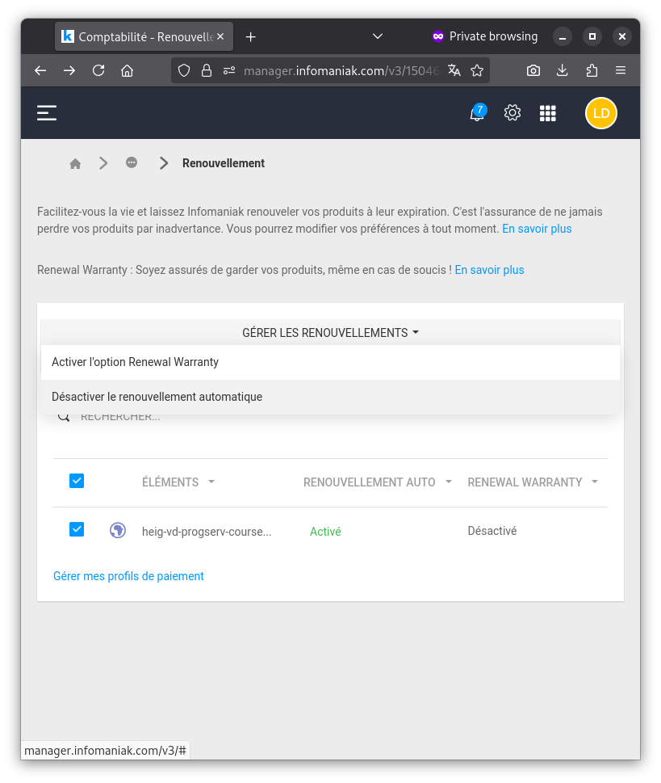

### Accéder aux hébergements web

Infomaniak permet de gérer plusieurs hébergements web. Pour accéder au menu de
gestion de tous les hébergements web, vous pouvez vous rendre dans **Web &
Domaines > Hébergement**.

Afficher la capture d'écran illustrant l'étape

Ici, deux cas de figure peuvent se présenter à vous :

1. Vous avez commandé un nouvel hébergement web avec un nom de domaine pour la
   première fois.
2. Vous aviez déjà un hébergement web avec un nom de domaine associé acquis dans
   un précédent cours.

#### Cas 1 - Nouvel hébergement web

Rien de particulier à savoir/faire, suivez la marche à suivre décrite dans la
section
[Accéder au tableau de bord de l'hébergement web spécifique](#accéder-au-tableau-de-bord-de-lhébergement-web-spécifique)
pour configurer votre hébergement web.

#### Cas 2 - Hébergement web existant

Si c'est le cas, celui-ci pourrait porter le nom d'un précédent nom de domaine
que vous avez commandé.

À nouveau, les terminologies utilisées par Infomaniak peuvent être déroutantes.
Un hébergement web peut héberger plusieurs sites web, chacun pouvant être
associé à un nom de domaine différent ou à un ou plusieurs sous-domaines, même
si l'hébergement web porte déjà le nom d'un seul nom de domaine.

Suivez la marche à suivre décrite dans la section
[Accéder au tableau de bord de l'hébergement web spécifique](#accéder-au-tableau-de-bord-de-lhébergement-web-spécifique)
pour configurer votre hébergement web, même s'il porte le nom d'un précédent nom
de domaine que vous avez commandé.

### Accéder au tableau de bord de l'hébergement web spécifique

En cliquant sur le nom de domaine ou en accédant aux paramètres de l'hébergement
web grâce au bouton des trois points, vous pouvez accéder au tableau de bord de
l'hébergement web.

Afficher la capture d'écran illustrant l'étape

Ce tableau de bord vous permet de configurer plusieurs paramètres importants
pour votre hébergement web, notamment :

- Les paramètres généraux de l'hébergement web (par exemple, le nom de
  l'hébergement web, les ressources allouées, etc.).
- Le ou les sites web associés à l'hébergement web.
- Les accès FTP/SFTP pour transférer les fichiers de votre application PHP.
- Les accès à une ou des bases de données utilisées par votre application
  (MariaDB, PostgreSQL, etc.).
- Et d'autres paramètres avancés.

### Renommer l'hébergement web

Pour éviter toute confusion entre un hébergement web et un ou plusieurs noms de
domaine, nous allons renommer l'hébergement web existant pour lui donner un nom
plus spécifique.

Pour cela, accédez aux paramètres généraux de l'hébergement web en accédant au
menu **Gérer > Modifier le nom** sous le nom actuel de l'hébergement web.

Afficher la capture d'écran illustrant l'étape

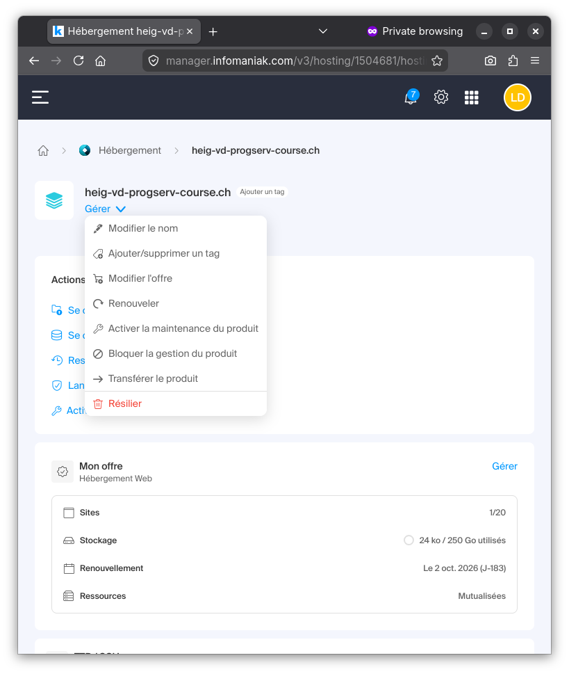

Puis renommer l'hébergement web en lui donnant un nom plus spécifique, par
exemple `Hébergement web gratuit HEIG-VD`.

Afficher la capture d'écran illustrant l'étape

Sauvegardez les modifications.

Afficher la capture d'écran illustrant l'étape

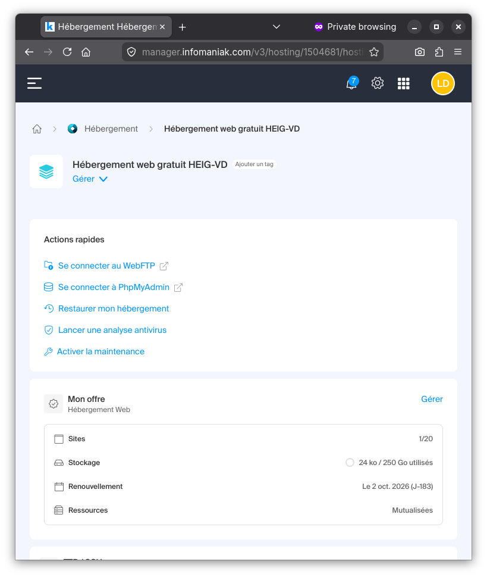

Dorénavant, vous pourrez facilement différencier votre hébergement web des
autres hébergements web ou sites que vous pourriez avoir acquis dans le cadre
d'autres cours ou pour d'autres projets.

Vous pouvez le confirmer dans la section **Mon offre** de l'hébergement web, où
vous devriez voir le nombre de sites web associés à l'hébergement web ainsi que
ceux encore disponibles dans le cadre de votre offre d'hébergement web (20 sites
web disponibles dans le cadre du programme étudiant d'Infomaniak).

Juste en dessous, vous devriez voir le ou les sites web associés à l'hébergement
web. Si vous venez de commander un hébergement web avec un nom de domaine
associé, vous devriez voir un site web associé à ce nom de domaine.

Afficher la capture d'écran illustrant l'étape

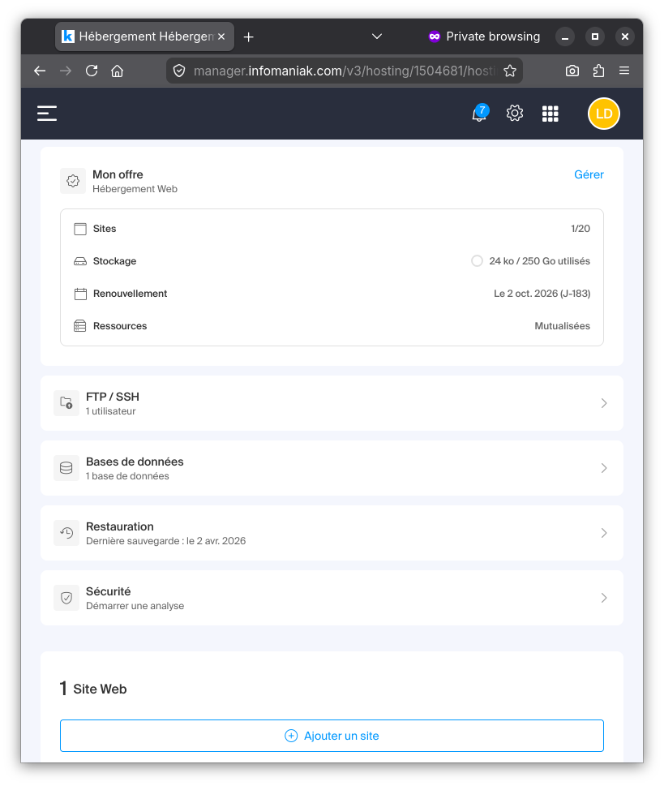

Maintenant que l'hébergement web a son propre nom distinctif, il est temps de
configurer le site web associé à l'hébergement web.

### Ajouter un nouveau site (optionnel)

> [!NOTE]
>
> Ne suivez cette section que si vous souhaitez ajouter un nouveau site web à
> l'hébergement web. Si vous avez commandé un hébergement web avec un nom de
> domaine associé, vous devriez déjà avoir un site web associé à ce nom de
> domaine et vous pouvez passer directement à la section
> [Configurer le site web](#configurer-le-site-web).

Si vous souhaitez ajouter un nouveau site web à l'hébergement web, vous pouvez
le faire en cliquant sur le bouton **Ajouter un site** dans la section **Sites
web** du tableau de bord de l'hébergement web.

Selon le type de site web que vous souhaitez ajouter ou selon les contraintes du
cours que vous suivez, vous pouvez choisir entre les différentes options
proposées par Infomaniak.

> [!NOTE]
>
> Si vous avez un doute, validez votre choix avec votre enseignant.e.

#### Programmation serveur 1 (ProgServ1)

Pour le cours de _"Programmation serveur 1 (ProgServ1)"_, vous pouvez choisir
l'option **Créez un projet vierge**.

Afficher la capture d'écran illustrant l'étape

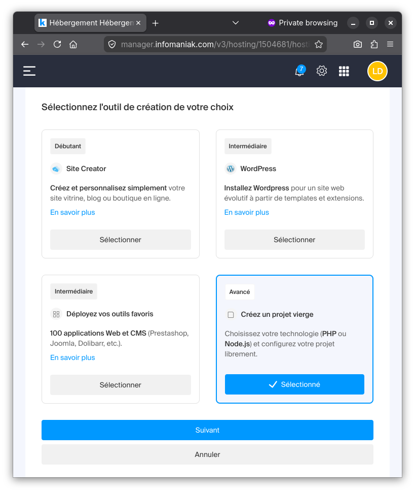

Puis configurez le site web en sélectionnant la technologie **Apache/PHP** et en
sélectionnant la dernière version de PHP disponible dans les options avancées.

> [!NOTE]
>
> Il se peut que la version de PHP utilisée par défaut pour le site web ne soit
> pas la dernière version disponible, ni même qu'elle corresponde à la capture
> d'écran ci-dessous.
>
> Nous vous recommandons d'utiliser la dernière version de PHP pour bénéficier
> des dernières fonctionnalités et améliorations de sécurité.

Afficher la capture d'écran illustrant l'étape

La dernière étape de la configuration du site web consiste à associer un nom de
domaine au site web.

Deux options s'offrent à vous pour cela :

1. Acheter un nouveau nom de domaine pour le site web. N'achetez un nouveau nom
   de domaine que si vous souhaitez avoir un nom de domaine différent de celui
   que vous avez déjà commandé pour votre hébergement web. Par exemple, si vous
   avez déjà commandé le nom de domaine `mondomaine.ch` pour votre hébergement
   web, vous pouvez acheter un nouveau nom de domaine `mondomaine2.ch` pour le
   nouveau site web. La HEIG-VD ne remboursera qu'un seul nom de domaine par
   étudiant.e, donc n'achetez un nouveau nom de domaine que si vous en avez
   besoin pour votre projet.
2. Associer le site web à un domaine/sous-domaine du domaine principal que vous
   avez déjà commandé pour votre hébergement web. Par exemple, si vous avez déjà
   commandé le nom de domaine `mondomaine.ch` pour votre hébergement web, vous
   pouvez associer le nouveau site web à un sous-domaine
   `projet1.mondomaine.ch`. Cette option est gratuite et vous permet d'avoir
   plusieurs sites web associés à un même nom de domaine en utilisant des
   sous-domaines différents.

> [!NOTE]
>
> Si vous n'êtes pas sûr.e de l'option à choisir, nous vous recommandons
> d'associer le site web à un sous-domaine du nom de domaine que vous avez déjà
> commandé pour votre hébergement web.
>
> C'est une option gratuite qui vous permet d'avoir plusieurs sites web associés
> à un même nom de domaine en utilisant des sous-domaines différents.
>
> En cas de doute, n'hésitez pas à valider votre choix avec votre enseignant.e.

Illustrons la configuration du site web en associant le site web à un
sous-domaine du nom de domaine que vous avez déjà commandé pour votre
hébergement web.

Sélectionnez l'option **Utiliser un nom de domaine ou sous-domaine existant**
puis saisissez le sous-domaine que vous souhaitez associer au site web.

Par exemple, si vous avez déjà commandé le nom de domaine `mondomaine.ch` pour
votre hébergement web, vous pouvez saisir `progserv1` pour associer le site web
au sous-domaine `progserv1.mondomaine.ch`.

Puis, dans les options avancées, assurez-vous que la version de PHP sélectionnée
est la dernière version disponible.

Afficher la capture d'écran illustrant l'étape

Puis, terminez la configuration du site web en sauvegardant les modifications.
La configuration du site web devrait prendre quelques minutes. Une fois la
configuration terminée, vous pourrez accéder au site web en utilisant l'adresse
du nom de domaine ou du sous-domaine que vous avez associé au site web.

Afficher les captures d'écran illustrant l'étape

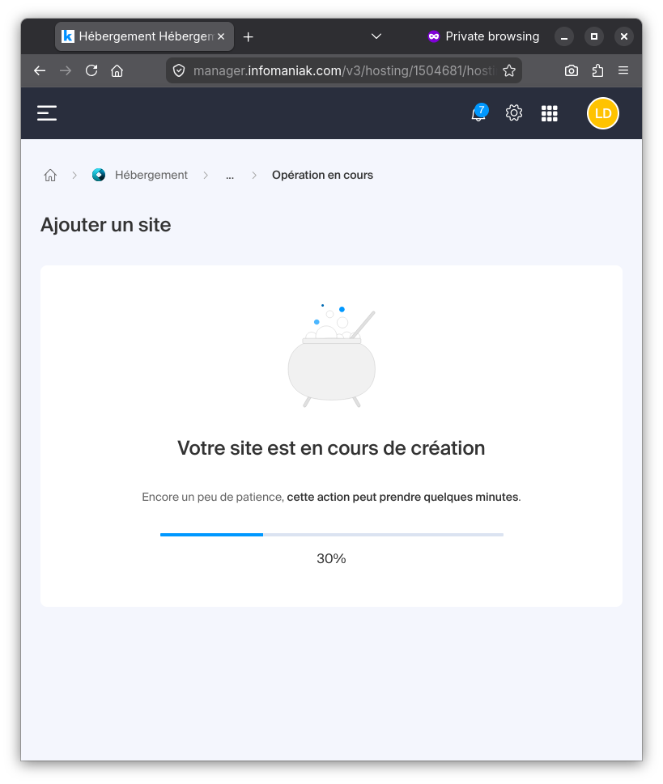

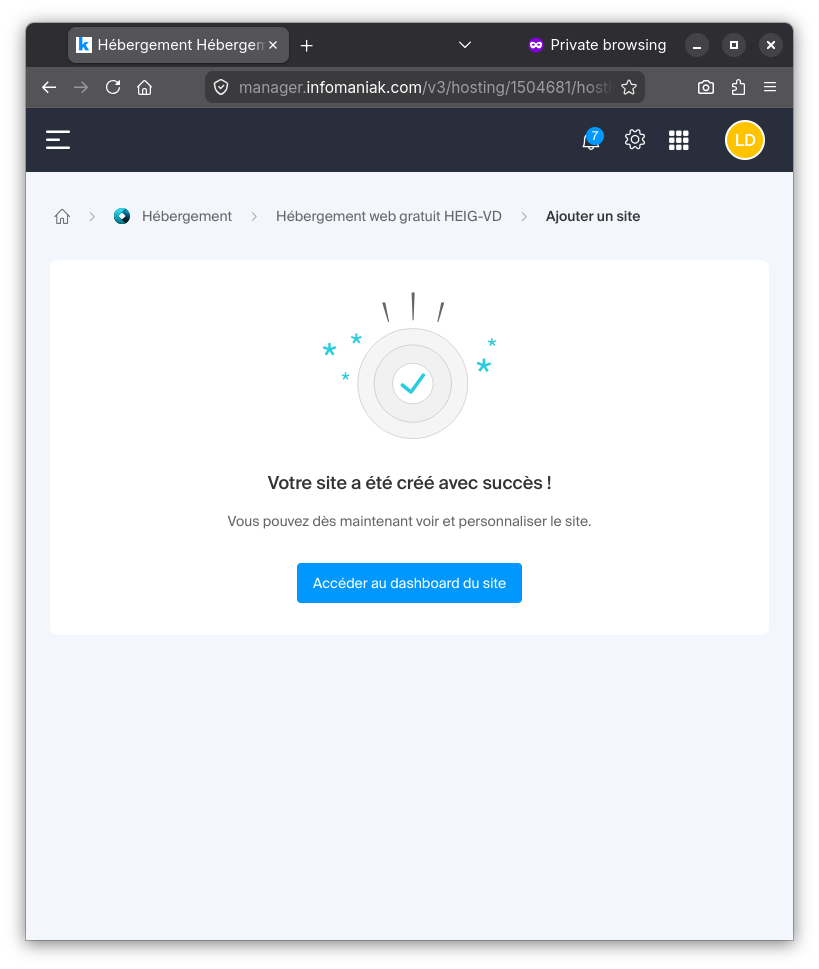

Vous pouvez maintenant passer à la section
[Accéder au site web](#accéder-au-site-web) pour accéder au site web et vérifier
que tout fonctionne correctement.

### Configurer le site web

Accédez au tableau de bord du site que vous venez de commander en cliquant sur
celui-ci ou en utilisant le bouton des trois points.

Afficher la capture d'écran illustrant l'étape

Ce tableau de bord vous permet de configurer plusieurs paramètres importants
pour le site en cours de configuration, notamment :

- La version de PHP utilisée par le dit site web.
- La configuration de HTTPS pour sécuriser le dit site web.
- Et d'autres paramètres avancés.

Afficher la capture d'écran illustrant l'étape

Commencez par accéder aux paramètres avancés du site web en cliquant sur le
bouton **Gérer** dans la section **Domaine principal**.

Vous accédez aux paramètres avancés du site web.

Afficher les captures d'écran illustrant l'étape

Puis, sélectionnez la version de PHP à utiliser pour le site web dans l'onglet
**PHP | Apache**.

Nous vous recommandons d'utiliser la dernière version disponible de PHP.

> [!NOTE]
>
> Il se peut que la version de PHP utilisée par défaut pour le site web ne soit
> pas la dernière version disponible, ni même qu'elle corresponde à la capture
> d'écran ci-dessous.
>
> Nous vous recommandons d'utiliser la dernière version de PHP pour bénéficier
> des dernières fonctionnalités et améliorations de sécurité.

Afficher la capture d'écran illustrant l'étape

Terminez la configuration du site web en sauvegardant les modifications.

### Accéder au site web

Tentez d'accéder au site web en utilisant votre navigateur web en vous rendant à
l'adresse du nom de domaine que vous avez choisi lors de la commande de
l'hébergement web. Vous devriez voir une page par défaut d'Infomaniak.

> [!NOTE]
>
> Il se peut que l'accès au site web ne soit pas immédiatement disponible après
> la configuration. Cela est dû à la propagation des DNS, qui peut prendre
> jusqu'à 24 heures.
>
> De notre expérience, cela prend généralement moins de deux heures.
>
> Vous pouvez essayer depuis un autre réseau (par exemple, en utilisant le
> partage de connexion de votre téléphone) si l'accès au site web ne fonctionne
> pas depuis le réseau Wi-Fi habituel.

Votre site web est maintenant configuré et prêt à être utilisé !

### Sécuriser l'application avec HTTPS

Afin de sécuriser le site web et les données échangées entre le serveur et les
utilisateur.trices, il est important d'activer HTTPS pour le site web. HTTPS
(HyperText Transfer Protocol Secure) est une extension sécurisée du protocole
HTTP qui utilise le chiffrement SSL/TLS pour sécuriser les communications entre
le serveur et les utilisateur.trices.

Sans HTTPS, les données échangées entre le serveur et les utilisateur.trices
sont transmises en clair, ce qui signifie que des attaquants pourraient
potentiellement intercepter et lire ces données.

Afficher la capture d'écran illustrant l'étape

Pour activer HTTPS, vous devez configurer un certificat SSL pour votre nom de
domaine. Infomaniak fournit gratuitement des certificats SSL via Let's Encrypt,
un service de certification gratuit et automatisé.

Accédez au tableau de bord du site web dans le portail d'Infomaniak. Dans la
section **Certificat SSL**, cliquez sur le bouton **Configurer**.

Afficher la capture d'écran illustrant l'étape

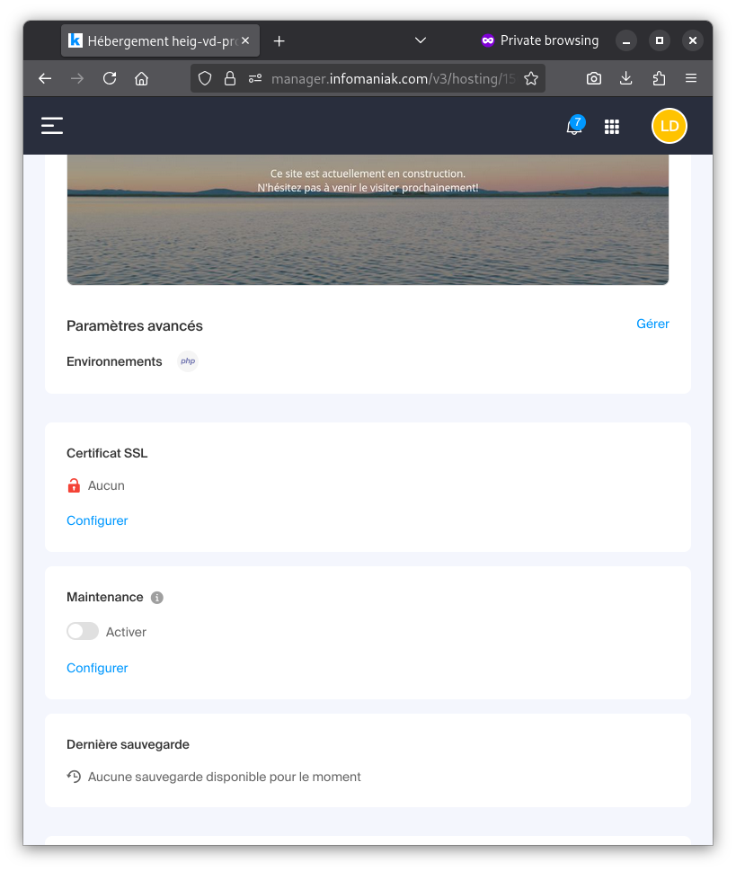

Cliquez ensuite sur le bouton **Installer un certificat** pour commencer la
configuration du certificat SSL.

Afficher la capture d'écran illustrant l'étape

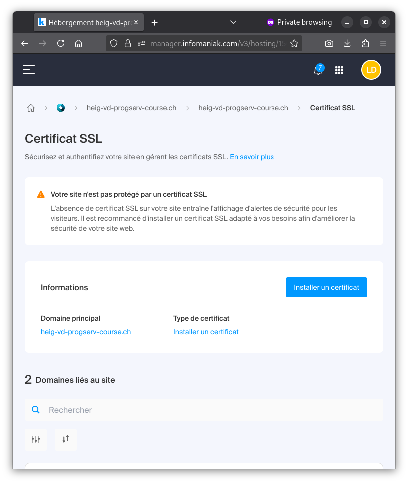

Sélectionnez l'option **Let's Encrypt** pour utiliser un certificat SSL gratuit
fourni par Let's Encrypt.

Afficher la capture d'écran illustrant l'étape

Sélectionnez les noms de domaine pour lesquels vous souhaitez activer le
certificat SSL. Assurez-vous de sélectionner le nom de domaine principal ainsi
que le sous-domaine `www`.

Afficher la capture d'écran illustrant l'étape

Validez la configuration du certificat SSL. Infomaniak va maintenant générer et
installer le certificat SSL pour votre nom de domaine. Ce processus peut prendre
quelques minutes.

> [!NOTE]
>
> Si vous avez récemment créé votre hébergement web, il se peut que le processus
> de validation du certificat SSL échoue. Attendez quelques heures avant de
> réessayer.

Afficher la capture d'écran illustrant l'étape

Rafraîchissez la page du site web dans votre navigateur web. Vous devriez
maintenant voir que l'URL commence par `https://` et que le cadenas vert indique
que la connexion est sécurisée.

Afficher la capture d'écran illustrant l'étape

Bravo ! Vous avez sécurisé votre application PHP en protégeant les fichiers
sensibles et en activant HTTPS.

Vous avez maintenant toutes les compétences nécessaires pour déployer et
sécuriser une application PHP sur un hébergement web tel que celui d'Infomaniak.

### Effectuer la demande de remboursement auprès de la HEIG-VD

Afin d'obtenir le remboursement du nom de domaine que vous avez acheté pour
votre hébergement web, vous devez effectuer une demande de remboursement auprès
de la HEIG-VD. Pour cela, vous devez obtenir la facture au format PDF attestant
de l'achat du nom de domaine (voir ci-après).

Pour cela, vous pouvez vous rendre dans **Comptabilité > Commande** dans le
portail d'Infomaniak.

Afficher la capture d'écran illustrant l'étape

Puis cliquer sur le bouton **Facture** pour télécharger la facture au format
PDF.

Afficher la capture d'écran illustrant l'étape

Une fois la facture téléchargée, vous pouvez effectuer la demande de
remboursement auprès de la HEIG-VD en suivant ces étapes :

1. Envoyez un e-mail au secrétariat COMEM avec la facture au format PDF en
   pièce-jointe. Indiquez que l'achat a été effectué dans le cadre du programme
   étudiant d'Infomaniak pour le cours de _"Programmation serveur 1
   (ProgServ1)"_.
2. Attendez la validation de la demande de remboursement par le secrétariat
   COMEM.
3. Passez au secrétariat COMEM pour récupérer le remboursement en espèces ou via
   TWINT et signer le formulaire de remboursement.

Le secrétariat COMEM traitera votre demande de remboursement et vous remboursera
le montant du nom de domaine en espèce ou via TWINT.

### Renouveler/révoquer le programme étudiant d'Infomaniak

> [!CAUTION]
>
> Suivez ces étapes uniquement une fois que l'année d'hébergement web est
> terminée !

Le programme étudiant d'Infomaniak est valable pour une année. Il est possible
de le renouveler pour une année supplémentaire si vous êtes toujours étudiant.e
à la HEIG-VD.

Afficher la capture d'écran illustrant l'étape

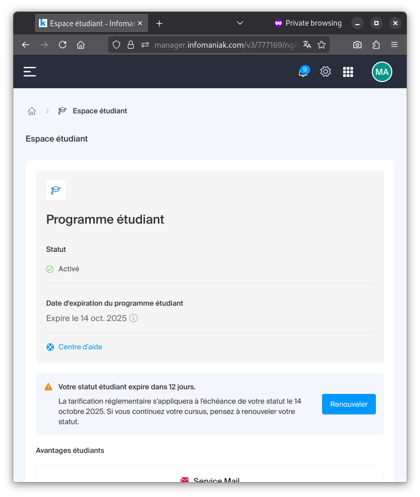

Si vous n'êtes plus étudiant.e, l'offre sera automatiquement révoquée mais il
est nécessaire de s'assurer que le renouvellement automatique du nom de domaine
et de l'hébergement web a bien été désactivé (voir section
[Désactiver le renouvellement automatique](#désactiver-le-renouvellement-automatique)).

Une fois le programme étudiant terminé, les frais supplémentaires seront à votre
charge.

> [!CAUTION]
>
> N'oubliez pas de renouveler/révoquer le nom de domaine et l'hébergement web à
> la fin de la première année pour éviter des frais dans le futur !

### Valider la configuration de l'environnement de production en ligne

- [x] Avoir obtenu un hébergement web gratuit dans le cadre du programme
      étudiant d'Infomaniak.
- [x] Avoir renommé l'hébergement web pour lui donner un nom plus spécifique.
- [x] Avoir configuré un site web associé à l'hébergement web.
- [x] Avoir sécurisé le site web en activant HTTPS.
- [x] Avoir accès au site web en utilisant l'adresse du nom de domaine ou du
      sous-domaine associé au site web.
- [x] Avoir effectué la demande de remboursement du nom de domaine auprès de la
      HEIG-VD.

## Déployer une application PHP sur l'hébergement web

_À venir..._

## Déployer le mini-projet en ligne

### Exercice 4 - Accéder à l'hébergement web via FTP/SFTP

Afin de transférer les fichiers de votre application PHP vers l'hébergement web,
vous devez utiliser un client FTP/SFTP comme FileZilla (Windows/Linux) ou
Cyberduck (macOS).

Commencez par télécharger et installer un client FTP/SFTP si vous n'en avez pas
encore un :

- [FileZilla (client)](https://filezilla-project.org/download.php?show_all=1)
  (Windows/Linux)
- [Cyberduck](https://cyberduck.io/) (macOS)

Une fois le client FTP/SFTP installé, vous devez récupérer les informations de
connexion fournies par Infomaniak pour vous connecter à l'hébergement web via
FTP/SFTP.

Accédez à la page dédiée aux accès FTP/SFTP dans le tableau de bord de
l'hébergement web (**attention, nous parlons du tableau de bord de l'hébergement
web et non du tableau de bord du site spécifique au sein de l'hébergement web**)
en allant dans la section **FTP / SSH** :

Un utilisateur par défaut est créé pour accéder à l'hébergement web. Vous pouvez
utiliser l'utilisateur par défaut en lui attribuant un mot de passe en cliquant
sur le bouton trois points à droite de l'utilisateur > **Modifier** :

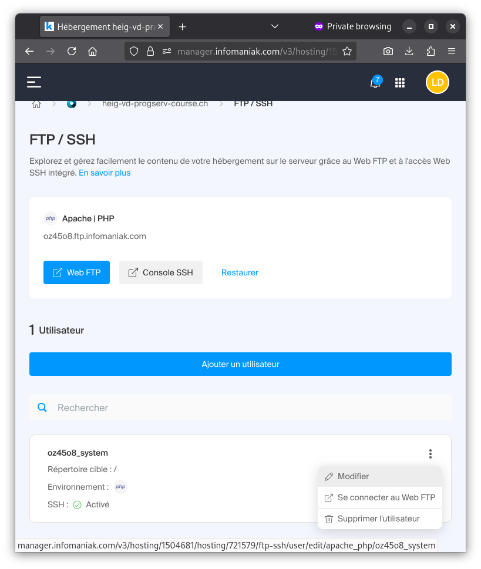

Définissez un mot de passe sécurisé pour l'utilisateur FTP/SFTP. Notez-le
quelque part, vous en aurez besoin pour vous connecter à l'hébergement web plus
tard :

Une fois le mot de passe défini, vous pouvez utiliser les informations de
connexion fournies par Infomaniak pour vous connecter à l'hébergement web via
FTP/SFTP. Récupérez l'adresse du serveur dans le menu **FTP / SSH** :

Ouvrez ensuite votre client FTP/SFTP et créez une nouvelle connexion en
utilisant les informations suivantes :

- Hôte / Serveur : l'adresse du serveur que vous avez récupérée dans le tableau
  de bord de l'hébergement web.
- Nom d'utilisateur : le nom d'utilisateur que vous avez défini ou l'utilisateur
  par défaut.
- Mot de passe : le mot de passe que vous avez défini pour l'utilisateur
  FTP/SFTP.
- Port : laissez vide pour utiliser le port par défaut (21 pour FTP, 22 pour
  SFTP - le port 22 est recommandé).

Tentez de vous connecter à l'hébergement web. Si la connexion est réussie, vous
devez voir la structure de fichiers de l'hébergement web dans votre client
FTP/SFTP :

> [!NOTE]
>
> Il se peut que l'accès FTP ne soit pas immédiatement disponible après la
> configuration. Cela est dû à la propagation des DNS, qui peut prendre jusqu'à
> 24 heures.
>
> De notre expérience, cela prend généralement moins de deux heures.
>
> Vous pouvez essayer depuis un autre réseau (par exemple, en utilisant le
> partage de connexion de votre téléphone) si l'accès FTP ne fonctionne pas
> depuis le réseau Wi-Fi habituel.

> [!NOTE]
>
> Il se peut que vous receviez un avertissement de sécurité lors de la première
> connexion via SFTP. Cela est normal, car le client FTP/SFTP ne reconnaît pas
> encore le certificat du serveur. Acceptez l'avertissement pour continuer.

L'interface de votre client FTP/SFTP peut varier en fonction du logiciel que
vous utilisez. Néanmoins, ils partagent tous une structure similaire avec deux
panneaux principaux :

- Le panneau de gauche affiche les fichiers locaux (sur votre ordinateur)
- Le panneau de droite affiche les fichiers distants (sur l'hébergement web).

Les fichiers peuvent ainsi être transférés entre les deux panneaux en les
glissant-déposant ou en utilisant les boutons de transfert. Cela permet de
transférer les fichiers vers et depuis l'hébergement web.

Par défaut, vous arrivez dans le répertoire racine de l'utilisateur FTP/SFTP.
Pour accéder aux fichiers du site web, vous devez naviguer dans le répertoire
`sites/<nom de domaine>`, où `<nom de domaine>` est le nom de domaine que vous
avez choisi lors de la commande de l'hébergement web :

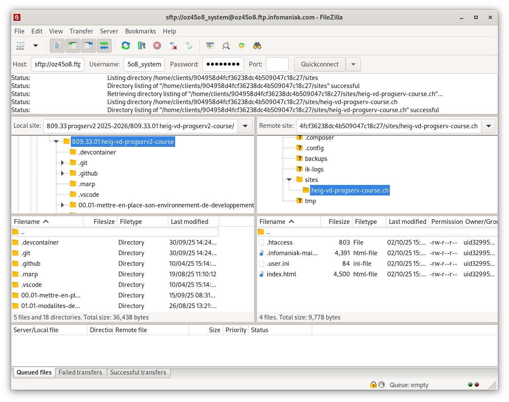

Ce dossier contient les fichiers du site web spécifique associé à l'hébergement
web. C'est ici que vous devez transférer les fichiers de votre application PHP
afin de mettre à jour votre site web.

> [!WARNING]
>
> Il se peut que les fichiers cachés (fichiers et dossiers commençant par un
> point, comme `.htaccess`) ne soient pas affichés par défaut dans votre client
> FTP/SFTP. Vous devrez peut-être activer l'option pour afficher les fichiers
> cachés dans les paramètres de votre client.
>
> Sur macOS, le raccourci clavier `Cmd + Shift + .` permet d'afficher ou de
> masquer les fichiers cachés. Il est peut-être nécessaire de rafraîchir la vue
> après avoir modifié cette option.

Créez un dossier `backup` dans le répertoire du site web (à l'aide du clic-droit
dans FileZilla ou Cyberduck, puis en sélectionnant l'option pour créer un
nouveau dossier). Ensuite, déplacez tous les fichiers et dossiers existants dans
ce dossier `backup`. Cela vous permettra de conserver une copie de sauvegarde
des fichiers par défaut d'Infomaniak au cas où vous en auriez besoin plus tard.

<!-- URLs -->

[licence]:
	https://github.com/heig-vd-devprodmed-course/heig-vd-devprodmed-course/blob/main/LICENSE.md
